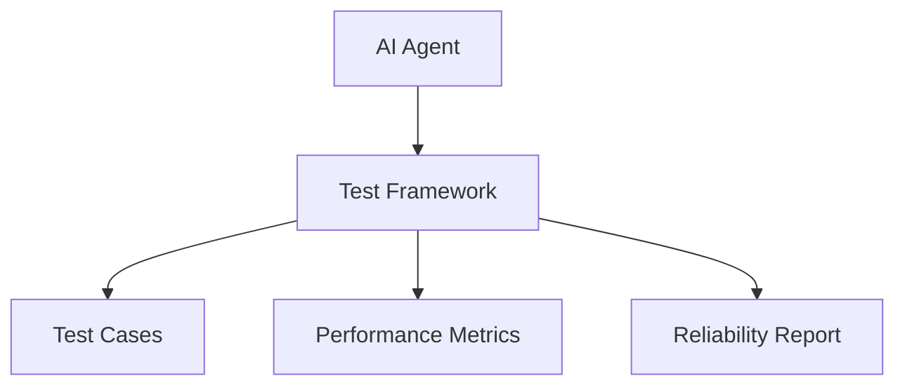
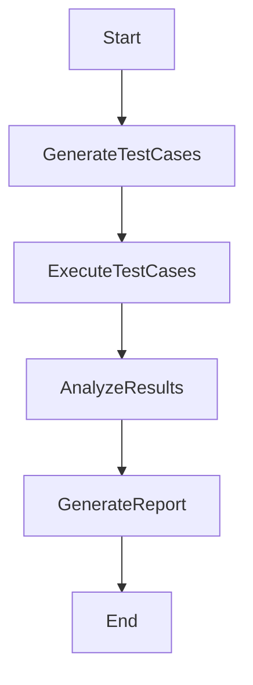
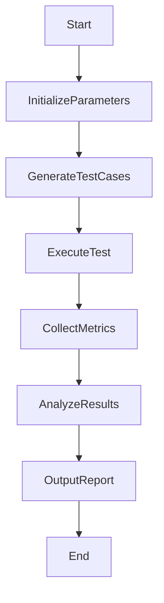
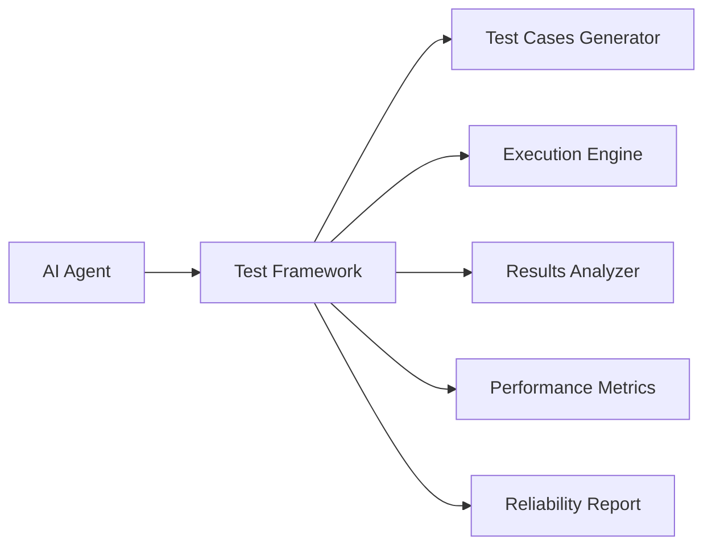
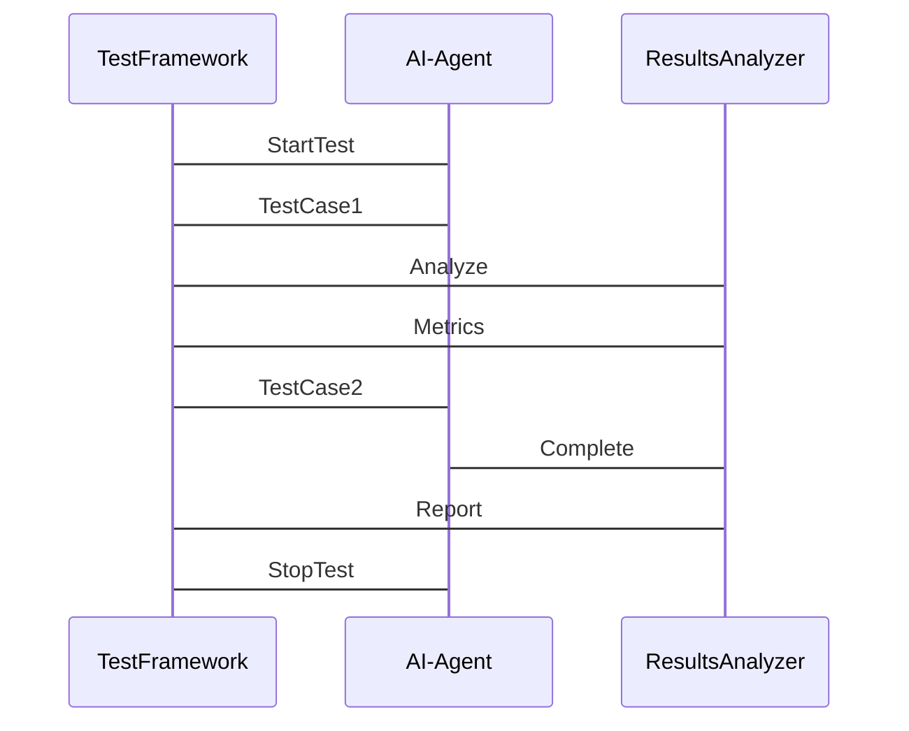
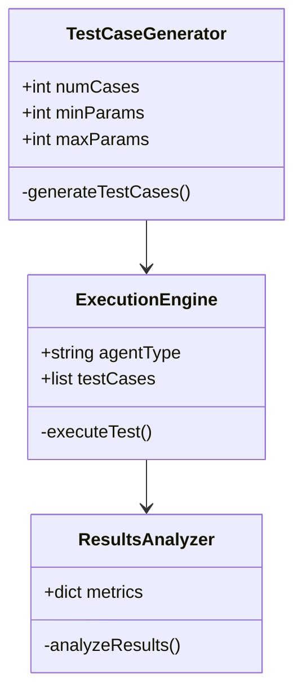
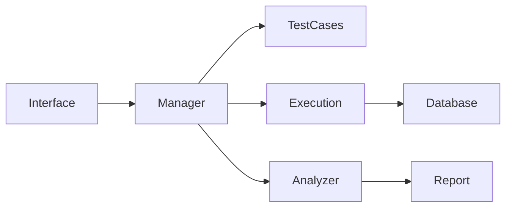
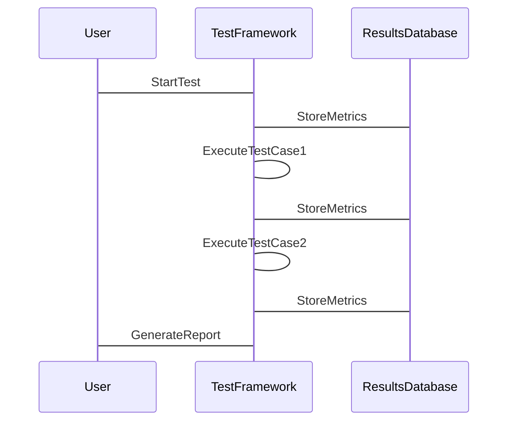

                 


# 构建AI Agent的测试框架：确保性能和可靠性

---

## 关键词：
AI Agent，测试框架，性能测试，可靠性测试，测试算法，系统架构，项目实战

---

## 摘要：
构建一个高效可靠的AI Agent测试框架是确保AI系统性能和稳定性的关键。本文从AI Agent的基本概念出发，详细阐述了测试框架的设计原理、核心算法、系统架构，并通过实际项目案例展示了如何实现和应用这些框架。通过对比分析和流程图，帮助读者理解测试框架的核心概念与工作流程。同时，本文还提供了详细的代码实现和系统设计，帮助读者掌握从理论到实践的全过程。

---

## 第一部分：AI Agent测试框架的背景与核心概念

### 第1章：AI Agent测试框架的背景与问题背景

#### 1.1 AI Agent的基本概念与问题背景

##### 1.1.1 AI Agent的定义与核心特征
AI Agent（人工智能代理）是指能够感知环境、自主决策并执行任务的智能实体。其核心特征包括：
- **自主性**：无需外部干预，自主完成任务。
- **反应性**：能够实时感知环境变化并做出响应。
- **目标导向性**：基于目标驱动行为。
- **学习能力**：通过数据和经验优化自身性能。

##### 1.1.2 AI Agent在实际应用中的问题背景
在实际应用中，AI Agent面临以下问题：
- **性能瓶颈**：复杂的任务可能导致计算延迟。
- **可靠性不足**：在异常情况下可能失效。
- **测试难度**：传统测试方法难以覆盖复杂场景。

##### 1.1.3 AI Agent测试框架的必要性
测试框架是确保AI Agent性能和可靠性的重要工具，其必要性体现在：
- **提高测试效率**：自动化测试流程，减少人工干预。
- **确保系统稳定性**：通过全面测试发现潜在问题。
- **支持快速迭代**：适应AI Agent的快速更新需求。

#### 1.2 AI Agent测试框架的定义与目标

##### 1.2.1 AI Agent测试框架的定义
AI Agent测试框架是一组用于评估AI Agent性能和可靠性的工具和方法，包括测试用例生成、执行、结果分析等功能。

##### 1.2.2 测试框架的目标与核心功能
测试框架的目标是：
- **评估性能**：测量AI Agent在不同场景下的响应时间和资源消耗。
- **验证可靠性**：确保AI Agent在异常情况下的稳定性和容错能力。
- **支持开发**：通过测试反馈优化AI Agent的设计和实现。

核心功能包括：
- **测试用例生成**：自动生成多样化的测试场景。
- **执行引擎**：驱动测试用例的执行并收集数据。
- **结果分析**：分析测试结果，生成报告并提出改进建议。

##### 1.2.3 AI Agent测试框架的边界与外延
测试框架的边界包括：
- **输入范围**：定义测试用例的生成规则和参数。
- **输出范围**：包括性能指标和可靠性报告。
- **功能范围**：限定在测试与优化领域，不涉及AI Agent的开发部分。

外延包括：
- **扩展功能**：支持多种AI Agent类型和应用场景。
- **集成能力**：与其他测试工具和CI/CD流程无缝对接。

#### 1.3 AI Agent测试框架的核心概念与联系

##### 1.3.1 核心概念
- **测试用例**：定义测试场景和预期结果。
- **性能指标**：如响应时间、资源利用率。
- **可靠性测试**：评估系统在异常情况下的表现。

##### 1.3.2 核心概念的属性特征对比
以下为核心概念的属性特征对比表：

| 概念       | 属性                     | 特征对比                   |
|------------|--------------------------|---------------------------|
| 测试用例    | 输入条件、执行步骤、预期结果 | 输入条件多样，预期结果明确 |
| 性能指标    | 响应时间、资源消耗、吞吐量 | 数值化、可量化             |
| 可靠性测试  | 故障注入、容错能力、恢复时间 | 强调异常场景下的表现     |

##### 1.3.3 ER实体关系图（Mermaid流程图）



---

## 第二部分：AI Agent测试框架的核心概念与原理

### 第2章：AI Agent测试框架的核心概念与原理

#### 2.1 AI Agent测试框架的原理与工作流程

##### 2.1.1 测试框架的原理
测试框架通过以下步骤实现对AI Agent的全面测试：
1. **测试用例生成**：基于需求和场景生成多样化的测试用例。
2. **测试执行**：驱动AI Agent执行测试用例，收集执行结果。
3. **结果分析**：分析测试结果，生成性能和可靠性报告。

##### 2.1.2 测试框架的工作流程
以下是测试框架的工作流程图（Mermaid流程图）：



#### 2.2 AI Agent测试框架的算法原理

##### 2.2.1 算法原理的数学模型
测试框架的性能评估模型如下：

$$
\text{性能指标} = \frac{\text{响应时间}}{\text{资源利用率}} \times \text{吞吐量}
$$

其中：
- **响应时间**：AI Agent对请求的响应所需的时间。
- **资源利用率**：计算资源（如CPU、内存）的使用情况。
- **吞吐量**：单位时间内处理的请求数量。

##### 2.2.2 测试框架的核心算法与流程
以下是测试框架的核心算法流程图（Mermaid流程图）：



##### 2.2.3 测试用例生成算法
以下是测试用例生成的Python代码实现：

```python
import random

def generate_test_cases(num_cases, min_params, max_params):
    test_cases = []
    for _ in range(num_cases):
        params = {
            'input': random.randint(min_params, max_params),
            'expected_output': random.randint(min_params, max_params)
        }
        test_cases.append(params)
    return test_cases

test_cases = generate_test_cases(10, 1, 100)
print(test_cases)
```

#### 2.3 AI Agent测试框架的系统架构设计

##### 2.3.1 系统功能模块
系统功能模块包括：
- **测试用例生成模块**：生成多样化的测试场景。
- **执行引擎模块**：驱动AI Agent执行测试用例。
- **结果分析模块**：分析测试结果并生成报告。

##### 2.3.2 系统架构设计
以下是系统架构设计图（Mermaid架构图）：



#### 2.4 AI Agent测试框架的接口设计

##### 2.4.1 系统接口
- **输入接口**：接收测试用例和参数配置。
- **输出接口**：输出性能指标和可靠性报告。

##### 2.4.2 系统交互
以下是系统交互流程图（Mermaid序列图）：



---

## 第三部分：AI Agent测试框架的系统分析与架构设计

### 第3章：AI Agent测试框架的系统分析与架构设计

#### 3.1 项目介绍
本项目旨在构建一个高效的AI Agent测试框架，支持多种应用场景，包括自然语言处理、计算机视觉等。

#### 3.2 系统功能设计
以下是系统功能设计类图（Mermaid类图）：



#### 3.3 系统架构设计
以下是系统架构设计图（Mermaid架构图）：



#### 3.4 系统接口设计
系统接口设计包括：
- **输入接口**：接收测试用例和参数配置。
- **输出接口**：输出性能指标和可靠性报告。

#### 3.5 系统交互
以下是系统交互流程图（Mermaid序列图）：



---

## 第四部分：AI Agent测试框架的项目实战

### 第4章：AI Agent测试框架的项目实战

#### 4.1 环境安装
以下是项目环境安装步骤：
1. **安装Python**：确保安装Python 3.8及以上版本。
2. **安装依赖库**：使用以下命令安装依赖：
   ```bash
   pip install pytest pytest-cov
   ```

#### 4.2 系统核心实现

##### 4.2.1 测试用例生成模块
以下是测试用例生成模块的Python代码实现：

```python
def generate_test_cases(num_cases, min_params, max_params):
    return [{'input': random.randint(min_params, max_params),
             'expected_output': random.randint(min_params, max_params)}
            for _ in range(num_cases)]

test_cases = generate_test_cases(10, 1, 100)
print(test_cases)
```

##### 4.2.2 执行引擎模块
以下是执行引擎模块的Python代码实现：

```python
def execute_test(agent, test_cases):
    results = []
    for case in test_cases:
        result = agent.execute(case['input'])
        results.append({'input': case['input'], 'output': result})
    return results

results = execute_test(agent, test_cases)
print(results)
```

##### 4.2.3 结果分析模块
以下是结果分析模块的Python代码实现：

```python
def analyze_results(expected, actual):
    accuracy = sum(1 for e, a in zip(expected, actual) if e == a) / len(expected)
    return accuracy

accuracy = analyze_results(test_cases, results)
print(f"Accuracy: {accuracy}%")
```

#### 4.3 项目小结
通过以上实现，我们可以看到测试框架的核心模块包括测试用例生成、执行引擎和结果分析。每个模块都通过简单的Python代码实现，能够快速集成到AI Agent的开发流程中。

---

## 第五部分：AI Agent测试框架的最佳实践

### 第5章：AI Agent测试框架的最佳实践

#### 5.1 小结
- **测试框架的核心作用**：提高测试效率，确保系统性能和可靠性。
- **模块化设计**：便于扩展和维护。

#### 5.2 注意事项
- **选择合适的测试场景**：确保测试用例覆盖关键路径。
- **监控系统性能**：实时监控资源利用率，及时发现瓶颈。
- **持续优化**：根据测试结果不断优化AI Agent的性能和可靠性。

#### 5.3 拓展阅读
- **相关技术书籍**：《Software Testing: A Practical Approach》
- **开源测试框架**：如JMeter、Selenium等。

---

## 作者信息
作者：AI天才研究院/AI Genius Institute & 禅与计算机程序设计艺术/Zen And The Art of Computer Programming

--- 

**本文由AI天才研究院与禅与计算机程序设计艺术联合出品，转载请注明出处。**

