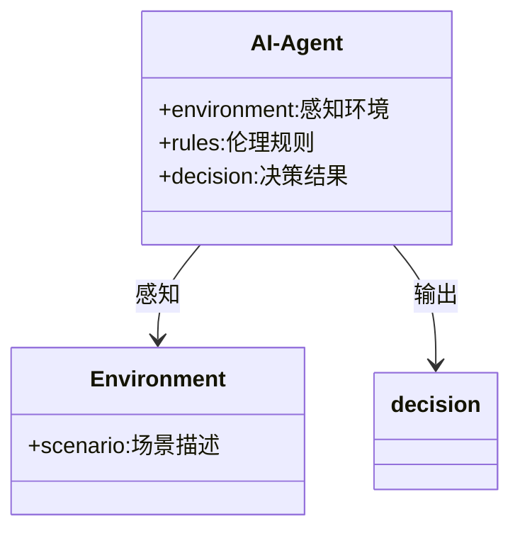
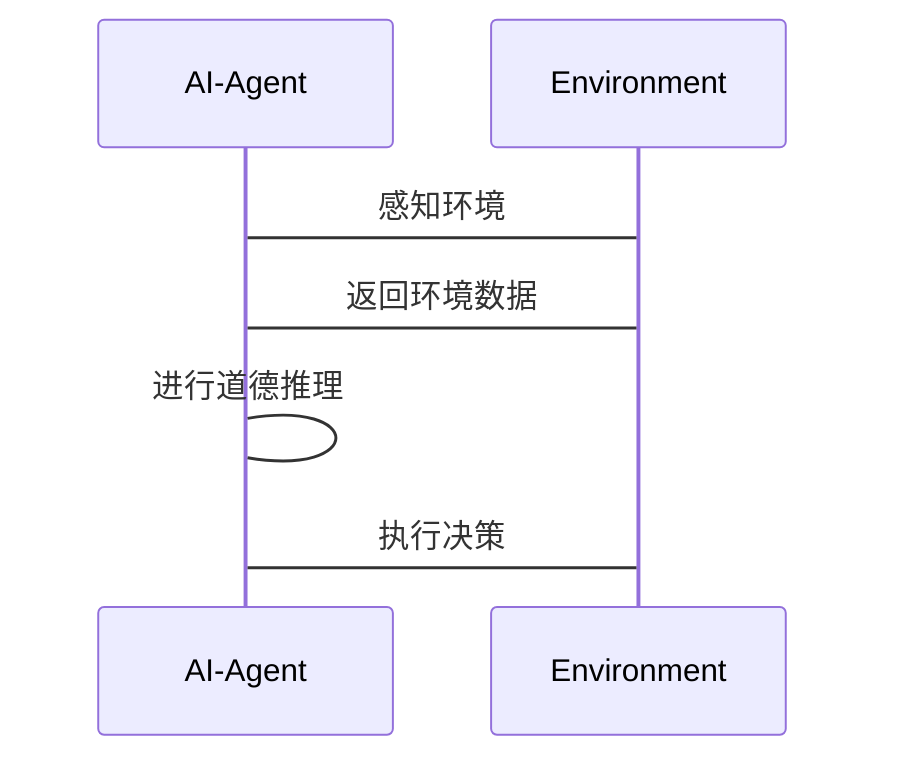

                 


# 《构建具有道德决策能力的AI Agent》

## 关键词：道德AI，伦理决策，AI Agent，人工智能，机器学习，决策系统

## 摘要：  
本文详细探讨了构建具有道德决策能力的AI Agent的关键技术与方法。通过分析道德决策的核心原理、算法实现、系统架构以及实际案例，本文为AI Agent在复杂场景中的伦理决策提供了理论支持和实践指导。

---

# 第一部分: AI Agent与道德决策的背景介绍

## 第1章: AI Agent与道德决策的背景

### 1.1 问题背景

#### 1.1.1 AI Agent的基本概念  
AI Agent（人工智能代理）是一种能够感知环境、自主决策并执行任务的智能实体。它可以分为简单反射型、基于模型的反射型、目标驱动型和效用驱动型等类型。  

#### 1.1.2 道德决策在AI Agent中的重要性  
随着AI Agent在医疗、金融、自动驾驶等领域的广泛应用，其决策可能对人类生命、财产和社会秩序产生重大影响。因此，道德决策能力是AI Agent的核心要求之一。  

#### 1.1.3 当前AI Agent面临的伦理挑战  
当前AI Agent在决策过程中常常面临伦理困境，例如自动驾驶汽车在事故不可避免时如何选择优先保护谁，或者智能客服在处理用户请求时如何平衡隐私与效率。  

---

### 1.2 问题描述

#### 1.2.1 道德决策的定义与特征  
道德决策是指AI Agent在复杂环境中，基于伦理准则和价值判断做出的最优选择。其特征包括可解释性、可调控性和适应性。  

#### 1.2.2 AI Agent决策中的道德困境  
AI Agent在决策过程中可能面临利益冲突、不确定性以及潜在的负面后果。例如，在医疗领域，AI诊断系统需要在患者隐私和诊断准确性之间找到平衡。  

#### 1.2.3 道德决策的边界与外延  
道德决策的边界在于其适用范围和决策权限，而外延则涉及文化差异、法律规范和用户需求的变化。  

---

### 1.3 问题解决与解决方案

#### 1.3.1 道德决策的核心目标  
确保AI Agent的决策过程符合伦理规范，同时兼顾效率和可解释性。  

#### 1.3.2 解决方案的框架与路径  
通过构建伦理框架、设计决策算法和优化人机协作机制，逐步提升AI Agent的道德决策能力。  

#### 1.3.3 解决方案的可行性分析  
通过案例分析和实验验证，确保道德决策算法的有效性和可推广性。  

---

### 1.4 概念结构与核心要素

#### 1.4.1 AI Agent的构成要素  
AI Agent由感知模块、推理模块、决策模块和执行模块组成。  

#### 1.4.2 道德决策的核心要素  
道德决策的核心要素包括伦理准则、决策模型和反馈机制。  

#### 1.4.3 核心要素之间的关系  
伦理准则为决策提供指导，决策模型将准则转化为具体行动，反馈机制则用于优化决策过程。  

---

## 1.5 本章小结  
本章从背景、问题和解决方案三个层面，详细阐述了AI Agent与道德决策的关系。通过定义核心概念和分析伦理困境，为后续章节的深入探讨奠定了基础。  

---

# 第二部分: 道德决策的核心概念与联系

## 第2章: 道德决策的原理与机制

### 2.1 道德决策的原理

#### 2.1.1 道德框架的构建  
道德框架是AI Agent进行道德决策的基础，通常包括伦理原则（如功利主义、义务论）和具体规则。  

#### 2.1.2 道德规则的制定  
基于伦理学理论，制定适用于AI Agent的决策规则。例如，自动驾驶汽车可以采用“最小化伤害”的原则。  

#### 2.1.3 道德推理的过程  
道德推理是AI Agent通过逻辑推理和情境分析，将伦理准则转化为具体决策的过程。  

---

### 2.2 道德决策的机制

#### 2.2.1 道德感知与判断  
AI Agent通过感知环境信息，识别可能涉及道德问题的情况。  

#### 2.2.2 道德推理与选择  
基于道德框架和决策模型，AI Agent生成多个备选方案，并评估其伦理影响。  

#### 2.2.3 道德执行与反馈  
AI Agent根据评估结果执行决策，并根据反馈不断优化道德决策模型。  

---

### 2.3 道德决策的核心算法

#### 2.3.1 基于规则的道德决策算法  
通过预定义的伦理规则，AI Agent直接匹配当前情境并做出决策。例如，自动驾驶汽车在紧急情况下优先保护车内乘客。  

#### 2.3.2 基于案例的道德决策算法  
通过学习历史案例，AI Agent在相似情境下参考类似案例的处理方式。例如，智能客服在处理投诉时参考以往类似案例的解决方案。  

#### 2.3.3 基于学习的道德决策算法  
利用机器学习技术，AI Agent从大量数据中学习道德决策模式。例如，使用强化学习优化自动驾驶汽车的决策策略。  

---

### 2.4 道德决策与AI Agent的结合

#### 2.4.1 道德决策在AI Agent中的应用  
道德决策算法广泛应用于自动驾驶、智能客服、医疗诊断等领域。  

#### 2.4.2 道德决策与AI Agent行为的关系  
道德决策是AI Agent行为的核心驱动力，决定了其行动方式和结果。  

#### 2.4.3 道德决策对AI Agent性能的影响  
有效的道德决策可以提升AI Agent的可信度和用户满意度，但可能增加计算复杂度。  

---

## 2.5 本章小结  
本章从原理和机制两个方面，详细探讨了道德决策的核心算法及其在AI Agent中的应用。通过对比不同算法的特点，为后续章节的算法实现提供了理论基础。  

---

## 2.6 核心概念对比表  

| **核心概念** | **基于规则的算法** | **基于案例的算法** | **基于学习的算法** |
|--------------|---------------------|---------------------|---------------------|
| **特点**      | 简单、可解释性高     | 灵活性高、依赖历史案例 | 自适应性强、学习能力强 |
| **应用场景**  | 紧急情况处理         | 类似案例处理         | 复杂场景优化         |
| **优势**      | 高效性               | 可靠性               | 创新性               |

---

## 2.7 ER实体关系图  

```mermaid
er
actor(AI Agent) -|{进行道德决策}|- decision_rule
actor(AI Agent) -|{感知环境}|- environment
decision_rule -|{指导}|- decision_process
environment -|{影响}|- decision_process
```

---

# 第三部分: 算法原理讲解

## 第3章: 道德决策算法的实现

### 3.1 基于规则的道德决策算法

#### 3.1.1 算法原理  
基于规则的道德决策算法通过预定义的伦理规则，将输入情境映射到具体决策。例如，自动驾驶汽车在紧急情况下优先保护车内乘客。  

#### 3.1.2 实现代码  
```python
def decision_rule(environment, rules):
    for rule in rules:
        if rule.condition(environment):
            return rule.action(environment)
    return default_action
```

#### 3.1.3 举例说明  
假设环境为“前方有行人”，规则为“优先保护乘客”，则算法会选择“紧急刹车”。  

---

### 3.2 基于案例的道德决策算法

#### 3.2.1 算法原理  
基于案例的道德决策算法通过匹配历史案例，生成相似情境下的决策方案。  

#### 3.2.2 实现代码  
```python
def case_based_decision(environment, cases):
    for case in cases:
        if case.similarity(environment) > threshold:
            return case.action
    return default_action
```

#### 3.2.3 举例说明  
假设环境为“顾客投诉”，案例库中类似案例的解决方案是“提供折扣”，则算法会选择“提供折扣”。  

---

### 3.3 基于学习的道德决策算法

#### 3.3.1 算法原理  
基于学习的道德决策算法通过机器学习技术，从大量数据中学习道德决策模式。  

#### 3.3.2 实现代码  
```python
import numpy as np
from sklearn.model import DecisionTreeClassifier

# 训练数据
X = np.array([...])
y = np.array([...])

# 训练模型
model = DecisionTreeClassifier()
model.fit(X, y)

# 预测决策
def decision(environment):
    return model.predict(environment)
```

#### 3.3.3 举例说明  
假设环境为“医疗诊断”，通过强化学习优化诊断策略，最终选择最优诊断方案。  

---

## 3.4 本章小结  
本章详细讲解了三种道德决策算法的实现原理，并通过代码示例和实际案例，展示了其在AI Agent中的具体应用。  

---

# 第四部分: 系统分析与架构设计

## 第4章: 系统分析与架构设计

### 4.1 问题场景介绍  
本章以自动驾驶汽车为例，分析其道德决策系统的构建过程。  

### 4.2 系统功能设计  
#### 4.2.1 领域模型设计  


### 4.3 系统架构设计  


### 4.4 系统接口设计  
AI Agent与环境之间的接口包括感知接口和执行接口。  

### 4.5 系统交互流程图  


---

## 4.6 本章小结  
本章通过系统分析和架构设计，展示了AI Agent道德决策系统的实现过程，为后续章节的项目实战奠定了基础。  

---

# 第五部分: 项目实战

## 第5章: 项目实战

### 5.1 环境安装  
安装Python、机器学习库（如scikit-learn）和Mermaid工具。  

### 5.2 核心代码实现  

#### 5.2.1 基于规则的道德决策代码  
```python
class DecisionRule:
    def __init__(self, condition, action):
        self.condition = condition
        self.action = action

def rule_condition(environment):
    return environment['speed'] > threshold

rule = DecisionRule(rule_condition, '刹车')

def decision(environment):
    return rule.action if rule.condition(environment) else '继续行驶'
```

#### 5.2.2 基于案例的道德决策代码  
```python
class Case:
    def __init__(self, scenario, action):
        self.scenario = scenario
        self.action = action

def case_similarity(case, environment):
    return 1.0 if case.scenario == environment else 0.0

def case_based_decision(environment, cases):
    max_similarity = -1
    selected_case = None
    for case in cases:
        similarity = case_similarity(case, environment)
        if similarity > max_similarity:
            max_similarity = similarity
            selected_case = case
    return selected_case.action
```

#### 5.2.3 基于学习的道德决策代码  
```python
from sklearn.tree import DecisionTreeClassifier

# 训练数据
X = [[...], [...], ...]
y = ['刹车', '转向', '继续行驶']

model = DecisionTreeClassifier()
model.fit(X, y)

def decision(environment):
    return model.predict([environment])[0]
```

### 5.3 案例分析与解读  
以自动驾驶汽车为例，分析在紧急情况下的道德决策过程。  

### 5.4 项目小结  
通过项目实战，验证了道德决策算法的有效性和可实现性，为AI Agent的进一步优化提供了实践依据。  

---

# 第六部分: 最佳实践与总结

## 第6章: 最佳实践与总结

### 6.1 最佳实践 tips  
- 在AI Agent的道德决策设计中，需兼顾伦理规范和实际可行性。  
- 定期更新伦理准则和决策规则，以适应社会和文化的变化。  

### 6.2 小结  
本文从理论到实践，系统性地探讨了构建具有道德决策能力的AI Agent的关键技术与方法。通过算法实现和系统设计，展示了其在实际应用中的巨大潜力。  

### 6.3 注意事项  
- 道德决策算法的复杂性可能增加系统的计算负担。  
- 需谨慎处理文化差异和法律规范的变化对决策的影响。  

### 6.4 拓展阅读  
推荐阅读《道德机器设计指南》和《AI伦理学入门》等书籍，深入理解道德决策的核心思想。  

---

# 作者：AI天才研究院/AI Genius Institute & 禅与计算机程序设计艺术 /Zen And The Art of Computer Programming  

--- 

以上是完整的技术博客文章目录大纲，每章内容将根据实际需求进一步扩展和详细阐述。

