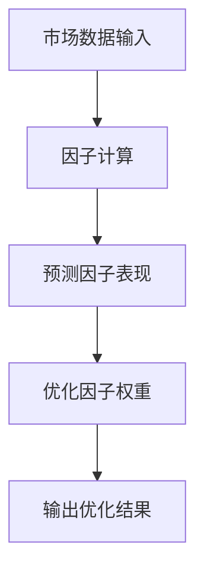
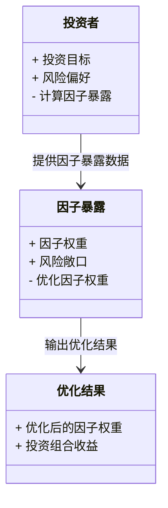
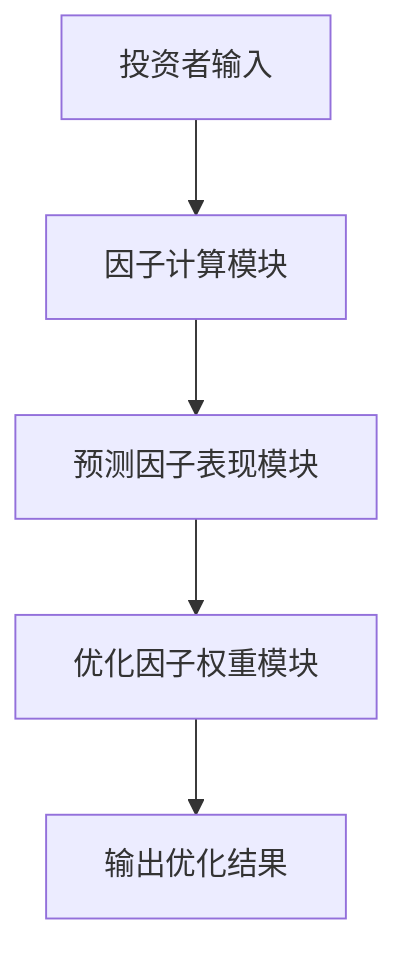
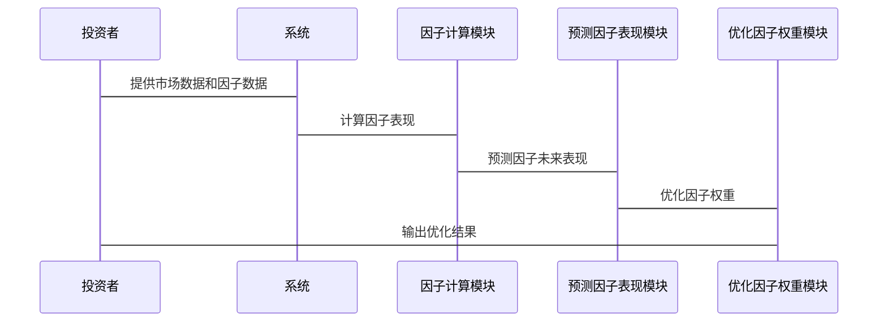

                 


# 构建智能化的个人投资风格因子暴露动态优化系统

> 关键词：智能化投资、因子暴露、动态优化、AI算法、投资组合管理

> 摘要：本文深入探讨了如何利用人工智能技术构建智能化的个人投资风格因子暴露动态优化系统。通过分析投资风格的定义与分类、因子暴露的动态优化需求，结合AI算法和系统架构设计，提出了一套完整的解决方案。文章详细讲解了动态优化算法的原理、实现步骤，并通过实际案例展示了系统的应用效果。最终，本文为投资者提供了一套高效、智能的投资优化工具，帮助其在复杂多变的市场环境中实现最优投资收益。

---

# 第一部分：构建智能化的个人投资风格因子暴露动态优化系统概述

## 第1章：个人投资风格与因子暴露概述

### 1.1 个人投资风格的定义与分类

#### 1.1.1 投资风格的定义
投资风格是指投资者在选择和管理投资组合时所采用的方法和策略。不同投资者可能有不同的投资风格，例如价值投资、成长投资、趋势投资等。

#### 1.1.2 主要投资风格类型
- **价值投资**：寻找被市场低估的资产，长期持有。
- **成长投资**：投资于具有高增长潜力的公司。
- **趋势投资**：根据市场趋势进行买卖操作。
- **指数投资**：通过跟踪市场指数来分散风险。

#### 1.1.3 投资风格与收益的关系
投资风格直接影响投资组合的收益和风险。例如，价值投资者可能在市场低迷时表现不佳，但在长期可能获得超额收益。

---

### 1.2 因子暴露的定义与作用

#### 1.2.1 因子暴露的定义
因子暴露是指投资组合中各个因子（如市值、价值、动量等）的权重或风险敞口。因子暴露反映了投资组合对不同因子的敏感程度。

#### 1.2.2 因子暴露在投资中的作用
- **风险控制**：通过调整因子暴露，投资者可以降低特定因子带来的风险。
- **收益优化**：通过动态调整因子暴露，投资者可以在不同市场环境下优化收益。

#### 1.2.3 因子暴露与投资风险的关系
因子暴露是投资组合风险的重要组成部分。高因子暴露意味着更高的风险和潜在收益。

---

### 1.3 动态优化的必要性

#### 1.3.1 投资环境的动态变化
市场环境不断变化，因子的有效性和影响力也会随之变化。因此，投资组合需要动态调整因子暴露。

#### 1.3.2 因子暴露的动态调整需求
- 市场波动：不同因子在不同市场环境下的表现不同。
- 经济周期：经济周期的变化会影响因子的有效性。

#### 1.3.3 动态优化对投资收益的提升作用
通过动态优化，投资者可以在不同市场环境下优化因子暴露，从而提升投资收益并降低风险。

---

### 1.4 智能化投资的核心要素

#### 1.4.1 AI在投资中的应用
- **预测模型**：利用机器学习算法预测市场走势。
- **因子筛选**：通过AI筛选出具有超额收益的因子。

#### 1.4.2 数据驱动的投资决策
- **大数据分析**：利用海量数据进行投资决策。
- **实时监控**：实时监控市场变化，动态调整投资策略。

#### 1.4.3 智能化投资的优势与挑战
- **优势**：提高投资效率，降低人为错误。
- **挑战**：数据质量、模型过拟合、计算复杂度。

---

## 第2章：因子暴露动态优化的背景与问题分析

### 2.1 投资组合管理的现状

#### 2.1.1 传统投资组合管理方法
- **固定权重法**：将资产按固定比例分配到不同因子。
- **静态优化法**：定期调整投资组合，但忽略了市场的动态变化。

#### 2.1.2 传统方法的局限性
- **缺乏动态性**：无法及时适应市场变化。
- **计算复杂度高**：手动调整投资组合耗时且复杂。

#### 2.1.3 新的投资管理需求
- **智能化**：利用AI技术优化投资组合。
- **实时性**：实时监控并调整投资组合。

---

### 2.2 因子暴露动态优化的背景

#### 2.2.1 因子投资的兴起
- **学术研究**：因子投资理论的发展。
- **实践应用**：越来越多的投资者采用因子投资策略。

#### 2.2.2 动态优化的必要性
- **市场变化**：因子的有效性随市场变化而变化。
- **投资者需求**：投资者需要个性化、动态的投资组合管理。

#### 2.2.3 智能化优化的优势
- **高效性**：利用AI技术快速优化投资组合。
- **准确性**：通过大数据分析提高优化效果。

---

### 2.3 问题背景与目标

#### 2.3.1 问题背景分析
- **市场波动**：因子在不同市场环境下的表现不同。
- **投资者需求**：投资者需要个性化的投资组合管理。

#### 2.3.2 问题目标的设定
- **目标1**：构建智能化的因子暴露动态优化系统。
- **目标2**：实现投资组合的实时优化。

#### 2.3.3 边界与外延
- **边界**：仅考虑主要因子，如市值、价值、动量等。
- **外延**：未来可以扩展到更多因子和市场环境。

---

### 2.4 核心概念与联系

#### 2.4.1 核心概念原理
- **因子暴露**：投资组合中各因子的权重。
- **动态优化**：根据市场变化实时调整因子暴露。

#### 2.4.2 概念属性特征对比表格

| 概念       | 定义                                   | 特性                     |
|------------|--------------------------------------|--------------------------|
| 因子暴露   | 投资组合中各因子的权重               | 可变、受市场影响         |
| 动态优化   | 根据市场变化调整因子暴露             | 实时性、适应性           |

#### 2.4.3 ER实体关系图架构

```mermaid
erDiagram
    actor 投资者 {
        <属性> 投资目标
        <属性> 风险偏好
    }
    actor 市场环境 {
        <属性> 市场指数
        <属性> 经济指标
    }
    entity 因子暴露 {
        <属性> 因子权重
        <属性> 风险敞口
    }
    entity 优化结果 {
        <属性> 优化后的因子权重
        <属性> 投资组合收益
    }
    投资者 --> 因子暴露 : 提供因子暴露数据
    市场环境 --> 因子暴露 : 影响因子权重
    因子暴露 --> 优化结果 : 优化因子暴露
```

---

## 第3章：因子暴露动态优化的核心算法原理

### 3.1 动态优化算法概述

#### 3.1.1 动态优化算法的定义
动态优化算法是指根据市场环境的变化，实时调整投资组合中各因子的权重，以实现收益最大化和风险最小化。

#### 3.1.2 常见动态优化算法分类
- **基于规则的算法**：根据预设规则调整因子权重。
- **基于机器学习的算法**：利用机器学习模型预测市场变化并调整因子权重。
- **基于遗传算法的算法**：通过模拟进化过程优化因子权重。

#### 3.1.3 选择算法的原则
- **计算效率**：算法应具有较高的计算效率。
- **适应性**：算法应能适应市场环境的变化。
- **准确性**：算法应能准确预测市场变化。

---

### 3.2 基于AI的动态优化算法

#### 3.2.1 机器学习在动态优化中的应用
- **回归分析**：预测因子的未来表现。
- **聚类分析**：识别市场环境的变化。

#### 3.2.2 深度学习在动态优化中的应用
- **神经网络**：预测市场走势。
- **强化学习**：通过试错优化因子权重。

#### 3.2.3 神经网络在动态优化中的应用
- **神经网络结构**：输入市场数据，输出优化后的因子权重。
- **训练数据**：历史市场数据和因子表现。

---

### 3.3 算法原理详细讲解

#### 3.3.1 算法流程图



#### 3.3.2 算法数学模型

目标函数：
$$ \text{maximize} \quad f(x) = \sum_{i=1}^{n} w_i \cdot r_i $$
约束条件：
$$ \sum_{i=1}^{n} w_i = 1 $$
$$ w_i \geq 0 $$

其中，$w_i$ 表示第 $i$ 个因子的权重，$r_i$ 表示第 $i$ 个因子的预期收益。

#### 3.3.3 算法实现步骤
1. 收集市场数据。
2. 计算各因子的表现。
3. 预测因子的未来表现。
4. 优化因子权重。
5. 输出优化结果。

---

### 3.4 代码实现与案例分析

#### 3.4.1 环境安装与配置
- **Python版本**：3.8及以上。
- **依赖库**：numpy, pandas, scikit-learn。

#### 3.4.2 核心代码实现

```python
import numpy as np
import pandas as pd
from sklearn.linear_model import LinearRegression

def optimize_factor_exposure(factor_returns, market_returns):
    # 计算因子与市场的相关性
    corr = np.corrcoef(factor_returns, market_returns)[0, 1]
    # 计算因子权重
    factor_weights = np.abs(corr) * factor_returns.mean()
    return factor_weights

# 示例数据
factor_returns = pd.Series([0.1, 0.2, -0.1, 0.05], index=['因子1', '因子2', '因子3', '因子4'])
market_returns = pd.Series([0.05, 0.03, -0.02, 0.04])

# 优化因子权重
optimized_weights = optimize_factor_exposure(factor_returns, market_returns)
print("优化后的因子权重：")
print(optimized_weights)
```

---

### 3.5 本章小结

通过本章的讲解，我们了解了因子暴露动态优化的核心算法原理，包括机器学习、深度学习和遗传算法的应用。同时，我们还详细讲解了算法的数学模型和实现步骤，并通过代码示例展示了如何实现因子权重的优化。

---

# 第四部分：系统架构与项目实战

## 第4章：系统架构与实现方案

### 4.1 系统功能设计

#### 4.1.1 领域模型类图



---

### 4.2 系统架构设计

#### 4.2.1 系统架构图



---

### 4.3 系统接口设计

#### 4.3.1 输入接口
- **输入数据**：市场数据、因子数据、投资者需求。
- **接口描述**：投资者提供市场数据和因子数据，系统计算因子暴露。

#### 4.3.2 输出接口
- **输出数据**：优化后的因子权重、投资组合收益。
- **接口描述**：系统输出优化后的因子权重和投资组合收益。

---

### 4.4 系统交互流程



---

## 第5章：项目实战与案例分析

### 5.1 项目环境安装

#### 5.1.1 环境配置
- **操作系统**：Windows 10或更高版本。
- **开发工具**：Python IDE（如PyCharm）。
- **依赖库**：numpy, pandas, scikit-learn。

---

### 5.2 核心代码实现

#### 5.2.1 数据加载与预处理

```python
import pandas as pd
import numpy as np

# 加载市场数据
market_data = pd.read_csv('market_data.csv')
# 加载因子数据
factor_data = pd.read_csv('factor_data.csv')
```

---

### 5.3 代码应用解读与分析

#### 5.3.1 代码实现步骤
1. 数据加载与预处理。
2. 计算因子表现。
3. 预测因子未来表现。
4. 优化因子权重。
5. 输出优化结果。

---

### 5.4 案例分析与详细讲解

#### 5.4.1 案例背景
假设我们有一个包含4个因子的投资组合，市场数据和因子数据已知。

#### 5.4.2 案例分析
1. 计算因子表现。
2. 预测因子未来表现。
3. 优化因子权重。
4. 输出优化结果。

---

### 5.5 项目小结

通过本章的项目实战，我们了解了如何将理论知识应用于实际投资组合管理中。通过代码实现和案例分析，我们掌握了因子暴露动态优化系统的实现方法。

---

# 第六部分：最佳实践与总结

## 第6章：最佳实践与总结

### 6.1 最佳实践

#### 6.1.1 数据质量
- 确保数据的完整性和准确性。
- 数据清洗与预处理。

#### 6.1.2 模型选择
- 根据实际情况选择合适的算法。
- 定期更新模型。

#### 6.1.3 系统维护
- 定期监控系统运行状态。
- 根据市场变化调整系统参数。

---

### 6.2 小结

本文详细讲解了如何构建智能化的个人投资风格因子暴露动态优化系统，包括投资风格与因子暴露的定义、动态优化的必要性、核心算法的实现、系统架构设计和项目实战。通过本文的讲解，读者可以掌握如何利用AI技术优化投资组合。

---

### 6.3 注意事项

- **数据隐私**：确保数据的安全性和隐私性。
- **模型鲁棒性**：避免模型过拟合。
- **计算效率**：优化算法计算效率。

---

### 6.4 拓展阅读

- **相关书籍**：《投资学》、《机器学习在金融中的应用》。
- **学术论文**：查找相关领域的最新研究成果。

---

# 作者：AI天才研究院 & 禅与计算机程序设计艺术

