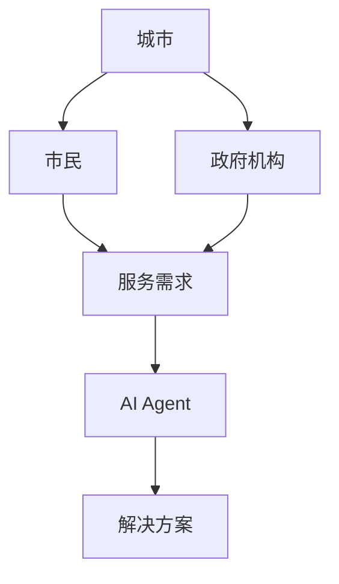
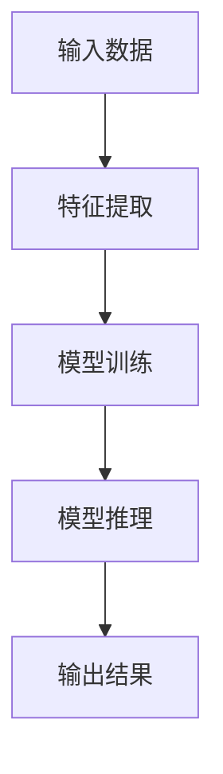
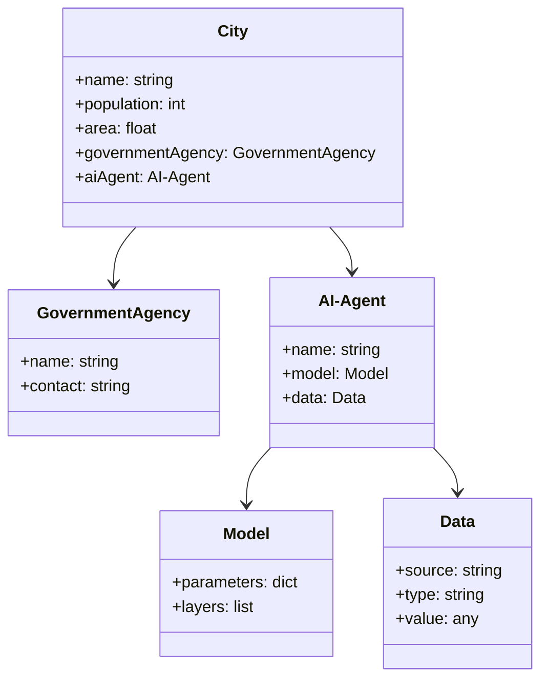
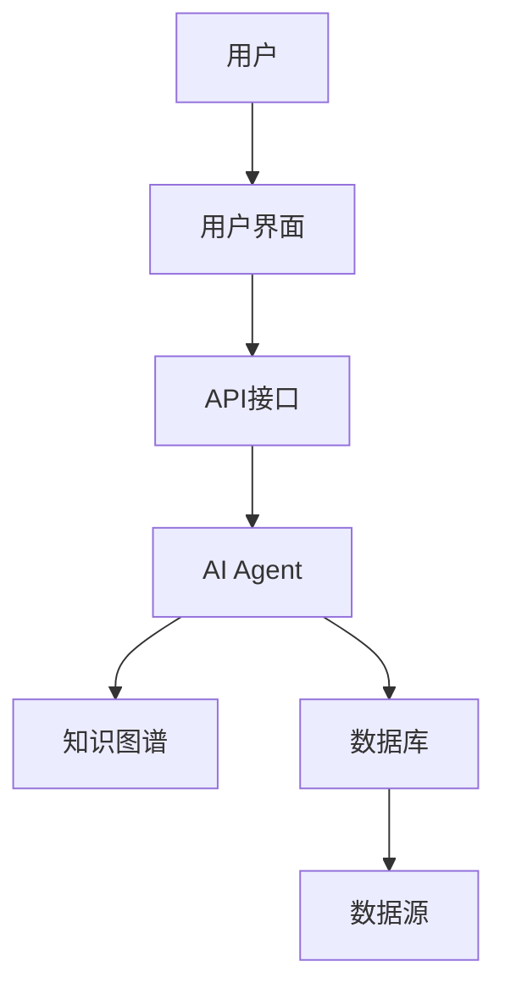
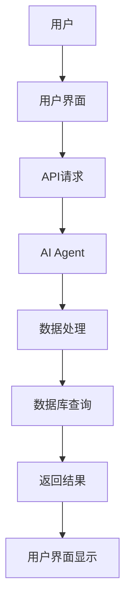

                 


# 《构建智能城市管理AI Agent系统》

**关键词：** 智慧城市，AI Agent，人工智能，城市管理系统，大模型技术

**摘要：**  
本文详细探讨了智能城市管理AI Agent系统的构建过程，从概念解析、系统设计到算法实现，结合实际案例，全面解析了AI Agent在智慧城市管理中的应用。文章内容涵盖了系统背景、核心概念、算法原理、系统架构设计、项目实战以及最佳实践等多方面，旨在为技术开发者和城市规划者提供理论与实践相结合的指导。

---

# 第一部分：智慧城市AI Agent系统概述

# 第1章：智慧城市AI Agent系统背景与概念

## 1.1 智慧城市的发展背景
### 1.1.1 城市化进程与城市问题的加剧  
随着城市化进程的加快，城市人口密度增加，资源分配不均、环境污染、交通拥堵等问题日益突出。这些问题的传统解决方式已经难以应对复杂的城市管理需求。

### 1.1.2 智慧城市的概念与目标  
智慧城市通过物联网、大数据、人工智能等技术手段，实现城市资源的优化配置和高效管理。其核心目标是提高城市运行效率、改善居民生活质量，并促进可持续发展。

### 1.1.3 AI Agent在智慧城市中的应用前景  
AI Agent（智能体）是一种能够感知环境、自主决策并执行任务的智能系统。它在智慧城市中的应用，可以显著提升城市管理的智能化水平。

## 1.2 AI Agent在智慧城市中的作用
### 1.2.1 AI Agent的基本概念  
AI Agent是一种具备感知、推理、规划和执行能力的智能系统，能够根据环境信息做出决策并执行任务。

### 1.2.2 AI Agent在城市管理中的核心价值  
AI Agent能够实时感知城市运行状态，分析问题并提出解决方案，从而实现城市管理的智能化和自动化。

### 1.2.3 智慧城市AI Agent系统的边界与外延  
智慧城市AI Agent系统的边界包括城市管理的各个领域，如交通、环境、公共安全等。其外延则涵盖了AI Agent与其他城市系统（如物联网、大数据平台）的协同工作。

## 1.3 智慧城市AI Agent系统的组成与结构
### 1.3.1 系统组成要素分析  
智慧城市AI Agent系统通常包括感知层、决策层、执行层和用户层。感知层负责数据采集，决策层进行分析和推理，执行层负责任务执行，用户层提供人机交互界面。

### 1.3.2 系统功能模块划分  
系统功能模块包括数据采集模块、数据处理模块、决策推理模块、任务执行模块和用户交互模块。

### 1.3.3 系统架构的初步探讨  
初步架构设计包括感知层、数据层、计算层和应用层。各层之间通过接口进行数据交互和功能调用。

## 1.4 本章小结  
本章从智慧城市的背景出发，详细介绍了AI Agent的概念、作用和系统组成，为后续章节的深入分析奠定了基础。

---

# 第二部分：AI Agent系统的核心概念与联系

# 第2章：AI Agent系统的核心概念与联系

## 2.1 AI Agent的基本原理
### 2.1.1 基于大模型的自然语言处理  
AI Agent可以通过大模型进行自然语言处理，理解用户需求并生成响应。

### 2.1.2 知识图谱构建与推理  
通过知识图谱构建，AI Agent能够进行语义理解和推理，从而做出更智能的决策。

### 2.1.3 多模态数据融合与分析  
AI Agent可以整合多种数据源（如图像、文本、传感器数据）进行分析，提升决策的准确性和全面性。

## 2.2 核心概念对比分析
### 2.2.1 AI Agent与传统AI的区别  
AI Agent具有自主性和主动性，能够根据环境动态调整行为，而传统AI通常是在静态环境中执行预定义任务。

### 2.2.2 AI Agent与智能体的对比  
AI Agent是一种智能体，但智能体的概念更广泛，包括机器人、自动驾驶等。

### 2.2.3 基于大模型的Agent与传统规则引擎的对比  
基于大模型的Agent具备更强的自适应能力和学习能力，而传统规则引擎依赖于预先定义的规则。

## 2.3 实体关系架构分析
### 2.3.1 ER实体关系图  
以下是城市管理系统中的实体关系图：



## 2.4 本章小结  
本章详细分析了AI Agent的核心概念和其在智慧城市中的应用，通过对比分析和实体关系图，进一步明确了系统的设计方向。

---

# 第三部分：AI Agent系统的算法原理与数学模型

# 第3章：AI Agent系统的算法原理

## 3.1 基于大模型的自然语言处理算法
### 3.1.1 Transformer模型原理  
Transformer模型通过自注意力机制实现高效的文本理解和生成。

### 3.1.2 注意力机制的数学表达  
自注意力机制的计算公式如下：

$$
\text{Attention}(Q, K, V) = \text{softmax}\left(\frac{QK^T}{\sqrt{d_k}}\right)V
$$

### 3.1.3 多层感知机的实现  
多层感知机（MLP）用于对特征进行非线性变换，通常由多个全连接层组成。

## 3.2 知识图谱构建与推理算法
### 3.2.1 知识抽取与表示  
知识抽取包括实体识别和关系抽取，常用的方法有基于规则和基于深度学习的方法。

### 3.2.2 知识融合与推理  
知识融合通过实体对齐和关系合并，构建统一的知识图谱。推理算法包括基于规则的推理和基于学习的推理。

### 3.2.3 基于图的最短路径算法  
最短路径算法用于在知识图谱中找到最优路径，公式如下：

$$
\text{距离}(u, v) = \min_{p} \sum_{(a, b) \in p} \text{权重}(a, b))
$$

## 3.3 多模态数据融合算法
### 3.3.1 图像识别与文本理解的融合  
通过多模态模型将图像特征和文本特征进行融合，提升系统的理解能力。

### 3.3.2 基于深度学习的多模态融合模型  
深度学习模型（如Transformer）可以同时处理多种模态的数据，实现跨模态的信息交互。

### 3.3.3 跨模态注意力机制  
跨模态注意力机制用于在不同模态之间分配注意力权重，公式如下：

$$
\alpha_i = \text{softmax}(W_i^T h)
$$

## 3.4 算法流程图
以下是AI Agent系统的算法流程图：



## 3.5 算法实现代码示例
以下是基于Transformer模型的AI Agent算法实现示例：

```python
import torch
import torch.nn as nn
import torch.nn.functional as F

class TransformerModel(nn.Module):
    def __init__(self, d_model, nhead, dropout=0.1):
        super(TransformerModel, self).__init__()
        self.encoder = nn.TransformerEncoder(
            nn.TransformerEncoderLayer(d_model=d_model, nhead=nhead, dropout=dropout),
            num_layers=6
        )
        self.decoder = nn.Linear(d_model, 1)
        
    def forward(self, x):
        x = self.encoder(x)
        x = self.decoder(x)
        return x
```

## 3.6 本章小结  
本章详细讲解了AI Agent系统的算法原理，包括大模型的自然语言处理、知识图谱构建与推理以及多模态数据融合算法，并通过流程图和代码示例进行了直观展示。

---

# 第四部分：系统分析与架构设计方案

# 第4章：系统分析与架构设计方案

## 4.1 项目场景介绍
### 4.1.1 项目背景  
本项目旨在构建一个智能化的城市管理AI Agent系统，实现城市资源的优化配置和高效管理。

### 4.1.2 项目目标  
通过AI Agent技术，实现城市管理的智能化、自动化和高效化。

## 4.2 系统功能设计
### 4.2.1 功能模块划分  
系统功能模块包括数据采集、数据处理、决策推理、任务执行和用户交互。

### 4.2.2 领域模型类图  
以下是系统领域的类图：



## 4.3 系统架构设计
### 4.3.1 整体架构图  
以下是系统的整体架构图：



## 4.4 系统接口设计
### 4.4.1 接口描述  
系统接口包括用户界面接口、API接口和数据库接口。

### 4.4.2 接口交互流程图  
以下是接口交互流程图：



## 4.5 本章小结  
本章从项目背景出发，详细设计了系统功能、架构和接口，为后续的实现提供了清晰的指导。

---

# 第五部分：项目实战

# 第5章：项目实战

## 5.1 环境安装与配置
### 5.1.1 开发环境选择  
推荐使用Python 3.8及以上版本，安装必要的库（如TensorFlow、PyTorch等）。

### 5.1.2 项目初始化  
创建项目目录，安装依赖库，初始化代码结构。

## 5.2 系统核心实现
### 5.2.1 数据采集模块  
编写代码实现数据采集功能，包括传感器数据和用户输入数据的采集。

### 5.2.2 数据处理模块  
实现数据清洗、特征提取和数据转换功能。

### 5.2.3 决策推理模块  
基于大模型进行推理，生成决策方案。

### 5.2.4 任务执行模块  
根据决策方案执行任务，如发送通知或调整设备参数。

### 5.2.5 用户交互模块  
实现用户与AI Agent之间的交互界面。

## 5.3 代码实现示例
以下是数据处理模块的代码示例：

```python
import pandas as pd
import numpy as np

def process_data(data):
    # 数据清洗
    data = data.dropna()
    # 特征提取
    features = data[['temperature', 'humidity']]
    # 数据标准化
    features = (features - features.mean()) / features.std()
    return features
```

## 5.4 案例分析与详细解读
### 5.4.1 案例背景  
以智能交通管理为例，AI Agent系统能够实时监控交通流量，优化信号灯配时。

### 5.4.2 数据分析与处理  
通过对交通流量数据的分析，AI Agent能够预测交通拥堵点并提出优化方案。

### 5.4.3 系统实现与效果展示  
展示系统的实现过程和实际效果，如减少交通拥堵时间、提高交通效率。

## 5.5 本章小结  
本章通过实际案例展示了AI Agent系统的实现过程和应用效果，为读者提供了实践指导。

---

# 第六部分：总结与最佳实践

# 第6章：总结与最佳实践

## 6.1 本章总结
### 6.1.1 核心内容回顾  
本文详细探讨了智能城市管理AI Agent系统的构建过程，从概念到实现，全面解析了系统的各个组成部分。

### 6.1.2 项目成果展示  
通过实际案例展示了AI Agent系统在城市管理中的应用效果。

## 6.2 最佳实践Tips
### 6.2.1 系统设计建议  
在系统设计中，应注重模块化设计和接口标准化，便于系统的扩展和维护。

### 6.2.2 开发实践建议  
在开发过程中，应注重代码的可读性和可维护性，遵循软件工程的最佳实践。

### 6.2.3 系统优化建议  
通过模型优化和数据优化，提升系统的运行效率和决策准确度。

## 6.3 未来展望
### 6.3.1 技术发展趋势  
AI Agent技术在智慧城市中的应用前景广阔，未来将更加智能化和人性化。

### 6.3.2 研究方向建议  
建议进一步研究AI Agent在多模态数据融合、自适应学习等方面的技术创新。

## 6.4 本章小结  
本章总结了全文的核心内容，并提出了系统的优化建议和未来的研究方向。

---

# 作者：AI天才研究院/AI Genius Institute & 禅与计算机程序设计艺术 /Zen And The Art of Computer Programming

