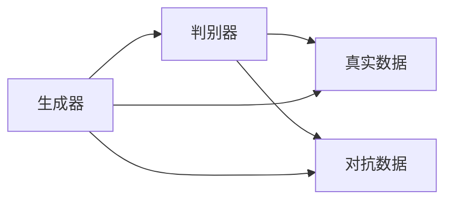
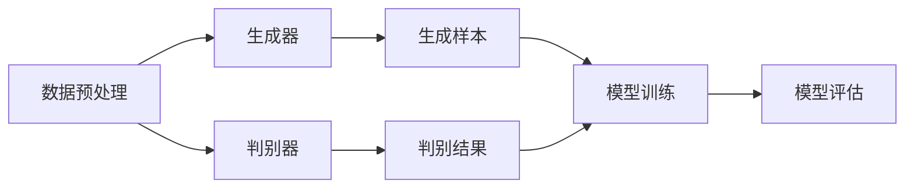
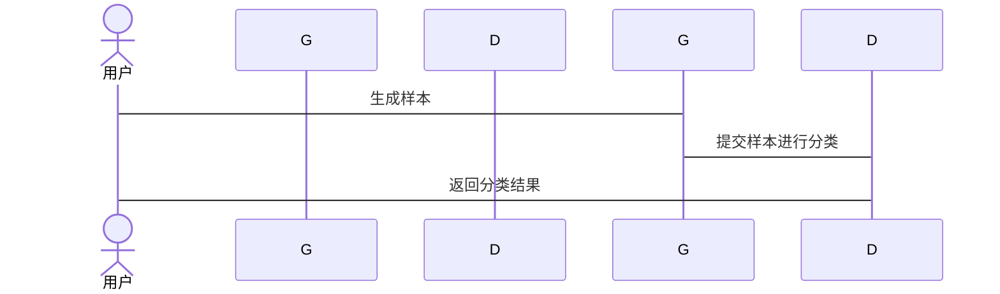

                 


# 《金融领域对抗学习在模型鲁棒性增强中的应用》

## 关键词：对抗学习，金融模型，模型鲁棒性，深度学习，金融风控

## 摘要：  
本文探讨了对抗学习在金融领域的应用，特别是如何通过对抗训练增强模型的鲁棒性。文章从对抗学习的基本概念出发，分析其在金融模型中的具体应用场景，详细阐述了对抗学习的算法原理和数学模型，并结合实际案例，展示了对抗学习在金融风控、欺诈检测等领域的应用效果。通过对比分析和系统设计，本文提出了一种基于对抗学习的金融模型鲁棒性增强方法，并提供了完整的系统架构和实现方案。

---

## 第一部分: 对抗学习与金融领域概述

### 第1章: 对抗学习的基本概念与背景

#### 1.1 对抗学习的定义与核心思想  
对抗学习是一种通过两个或多个学习模型相互竞争来提升性能的机器学习方法。其核心思想是通过“对抗”过程，使得生成器（Generator）和判别器（Discriminator）不断优化，最终达到一种动态平衡。生成器的目标是生成与真实数据相似的样本，而判别器的目标是区分真实数据和生成数据。通过交替训练生成器和判别器，对抗学习能够生成高质量的数据，并提升模型的泛化能力。

#### 1.2 金融领域的挑战与鲁棒性需求  
金融领域是一个高度复杂和动态变化的领域，金融模型需要面对数据噪声、市场波动、欺诈行为等多种挑战。传统的机器学习模型在面对这些复杂场景时，往往表现出脆弱性，容易受到攻击或干扰。因此，提升金融模型的鲁棒性成为一个重要研究方向。对抗学习作为一种强大的工具，能够有效增强模型的鲁棒性，使其在面对异常输入或对抗性攻击时仍能保持稳定性能。

#### 1.3 对抗学习与模型鲁棒性增强的关系  
对抗学习通过生成器和判别器的对抗过程，能够生成多样化的数据样本，从而增强模型的泛化能力。在金融领域，对抗学习可以用于增强模型对异常数据的鲁棒性，例如在欺诈检测中，对抗学习可以帮助模型更好地识别异常交易模式。此外，对抗学习还可以通过生成对抗样本的方式，对模型进行压力测试，从而发现和修复模型的潜在漏洞。

---

## 第二部分: 对抗学习的核心概念与原理

### 第2章: 对抗学习的核心概念与原理

#### 2.1 对抗学习的核心概念  
- **生成器（Generator）**：生成器的目标是生成与真实数据分布相似的样本。通过对抗训练，生成器能够学习到数据的潜在分布，并生成高质量的虚拟数据。  
- **判别器（Discriminator）**：判别器的目标是区分真实数据和生成数据。判别器通过不断优化自身，能够更准确地区分真实数据和生成数据。  
- **对抗过程**：生成器和判别器通过交替训练不断优化。生成器试图生成更逼真的数据以欺骗判别器，而判别器则试图更准确地区分真实数据和生成数据。这一过程形成了一个动态平衡，最终使得生成器生成的样本质量不断提升。

#### 2.2 对抗学习的核心原理  
- **损失函数**：对抗学习的损失函数通常由生成器和判别器的损失函数组成。生成器的损失函数是其生成样本被判别器误判的概率，而判别器的损失函数是其区分真实样本和生成样本的准确率。  
- **优化目标**：对抗学习的优化目标是通过交替优化生成器和判别器的参数，使得生成器生成的样本尽可能接近真实数据分布，同时判别器尽可能准确地区分真实数据和生成数据。  
- **数学模型**：对抗学习的数学模型通常涉及两个优化问题，生成器和判别器的目标函数可以表示为：  
  $$\min_{G} \max_{D} \mathcal{L}$$  
  其中，$\mathcal{L}$ 是生成器和判别器的联合损失函数。

#### 2.3 对抗学习的属性特征对比  
| 对比项                | 传统机器学习 | 对抗学习                |
|-----------------------|--------------|-------------------------|
| 数据需求             | 需要大量标注数据 | 生成数据，减少对标注数据依赖 |
| 模型泛化能力           | 泛化能力有限   | 泛化能力强               |
| 应用场景               | 适合监督学习   | 适合无监督和半监督学习     |

#### 2.4 对抗学习的ER实体关系图  


---

## 第三部分: 对抗学习的算法原理与数学模型

### 第3章: 对抗学习的算法原理

#### 3.1 对抗学习的算法流程  
- 初始化生成器和判别器的参数。  
- 进行对抗训练：  
  1. 训练生成器，目标是生成更接近真实数据分布的样本。  
  2. 训练判别器，目标是区分真实数据和生成数据。  
- 重复上述过程，直到生成器和判别器达到收敛。

#### 3.2 对抗学习的数学模型  
对抗学习的核心是生成器和判别器的损失函数。生成器的损失函数可以表示为：  
$$\mathcal{L}_G = -\log(P(D(G(x)=1)))$$  
判别器的损失函数可以表示为：  
$$\mathcal{L}_D = -\log(P(D(x=1))) - \log(1 - P(D(G(x)=1)))$$  
其中，$P(D(x=1))$ 表示判别器将真实数据分类为真实样本的概率，$P(D(G(x)=1))$ 表示判别器将生成样本分类为真实样本的概率。

#### 3.3 对抗学习的算法实现  
以下是一个简单的生成器和判别器的实现示例：  
```python
import torch
import torch.nn as nn

# 定义生成器
class Generator(nn.Module):
    def __init__(self, latent_dim, hidden_dim):
        super(Generator, self).__init__()
        self.latent_dim = latent_dim
        self.hidden_dim = hidden_dim
        self.fc1 = nn.Linear(latent_dim, hidden_dim)
        self.fc2 = nn.Linear(hidden_dim, 1)  # 输出一个样本的标签

    def forward(self, x):
        x = torch.relu(self.fc1(x))
        x = torch.sigmoid(self.fc2(x))
        return x

# 定义判别器
class Discriminator(nn.Module):
    def __init__(self, input_dim, hidden_dim):
        super(Discriminator, self).__init__()
        self.input_dim = input_dim
        self.hidden_dim = hidden_dim
        self.fc1 = nn.Linear(input_dim, hidden_dim)
        self.fc2 = nn.Linear(hidden_dim, 1)

    def forward(self, x):
        x = torch.relu(self.fc1(x))
        x = torch.sigmoid(self.fc2(x))
        return x

# 初始化生成器和判别器
latent_dim = 100
hidden_dim = 128
G = Generator(latent_dim, hidden_dim)
D = Discriminator(1, hidden_dim)
```

---

## 第四部分: 对抗学习的系统分析与架构设计

### 第4章: 金融系统的对抗学习应用分析

#### 4.1 金融系统的典型场景  
金融系统中，对抗学习可以应用于金融风控、欺诈检测、信用评估等多个领域。例如，在欺诈检测中，对抗学习可以通过生成对抗样本，帮助模型更好地识别异常交易。

#### 4.2 对抗学习在金融系统中的应用设计  
- **数据预处理**：对金融数据进行清洗、归一化等预处理，确保数据质量。  
- **模型训练**：使用生成器和判别器进行对抗训练，生成高质量的金融数据样本。  
- **结果分析**：通过分析生成样本的分布，评估模型的鲁棒性和泛化能力。

#### 4.3 系统架构设计  


#### 4.4 系统交互设计  


---

## 第五部分: 对抗学习的项目实战

### 第5章: 项目实战

#### 5.1 环境搭建  
- 安装必要的库：`torch`, `numpy`, `pandas` 等。  
- 配置开发环境，例如PyCharm或Jupyter Notebook。

#### 5.2 核心代码实现  
```python
import torch
import torch.nn as nn
import torch.optim as optim
import numpy as np

# 定义生成器和判别器
class Generator(nn.Module):
    def __init__(self, latent_dim, hidden_dim):
        super(Generator, self).__init__()
        self.latent_dim = latent_dim
        self.hidden_dim = hidden_dim
        self.fc1 = nn.Linear(latent_dim, hidden_dim)
        self.fc2 = nn.Linear(hidden_dim, 1)

    def forward(self, x):
        x = torch.relu(self.fc1(x))
        x = torch.sigmoid(self.fc2(x))
        return x

class Discriminator(nn.Module):
    def __init__(self, input_dim, hidden_dim):
        super(Discriminator, self).__init__()
        self.input_dim = input_dim
        self.hidden_dim = hidden_dim
        self.fc1 = nn.Linear(input_dim, hidden_dim)
        self.fc2 = nn.Linear(hidden_dim, 1)

    def forward(self, x):
        x = torch.relu(self.fc1(x))
        x = torch.sigmoid(self.fc2(x))
        return x

# 初始化生成器和判别器
latent_dim = 100
hidden_dim = 128
G = Generator(latent_dim, hidden_dim)
D = Discriminator(1, hidden_dim)

# 定义优化器
criterion = nn.BCELoss()
G_opt = optim.Adam(G.parameters(), lr=0.0002)
D_opt = optim.Adam(D.parameters(), lr=0.0002)

# 训练过程
for epoch in range(100):
    for _ in range(2):
        # 训练判别器
        D.zero_grad()
        real_data = torch.randn(1, 1).requires_grad_(False)
        fake_data = G(torch.randn(1, latent_dim))
        real_label = torch.ones(1, 1)
        fake_label = torch.zeros(1, 1)
        D_real_output = D(real_data)
        D_fake_output = D(fake_data)
        D_loss = criterion(D_real_output, real_label) + criterion(D_fake_output, fake_label)
        D_loss.backward()
        D_opt.step()

        # 训练生成器
        G.zero_grad()
        fake_data = G(torch.randn(1, latent_dim))
        G_loss = criterion(D(fake_data), torch.ones(1, 1))
        G_loss.backward()
        G_opt.step()
```

#### 5.3 实际案例分析  
通过上述代码实现一个简单的对抗学习模型，并将其应用于金融数据的生成和分析。通过对比生成样本和真实样本的分布，可以评估模型的生成能力。进一步，可以将生成样本用于金融模型的训练，以增强模型的鲁棒性。

---

## 第六部分: 对抗学习的最佳实践

### 第6章: 最佳实践

#### 6.1 对抗学习的总结与展望  
对抗学习是一种强大的工具，能够有效增强模型的鲁棒性和泛化能力。在金融领域，对抗学习可以应用于金融风控、欺诈检测等多个场景。未来，随着对抗学习的不断发展，其在金融领域的应用前景将更加广阔。

#### 6.2 对抗学习的注意事项  
- **数据质量问题**：对抗学习依赖于高质量的数据，数据质量直接影响模型的性能。  
- **模型收敛性**：对抗学习的训练过程可能存在不稳定，需要注意模型的收敛性和训练策略。  
- **计算资源需求**：对抗学习通常需要大量的计算资源，尤其是在生成高维数据时。

#### 6.3 拓展阅读  
- 《Generative Adversarial Nets》（GAN论文）  
- 《Deep Learning for Finance: Theory and Application》  
- 《对抗学习在金融领域的应用研究》

---

## 作者：AI天才研究院/AI Genius Institute & 禅与计算机程序设计艺术/Zen And The Art of Computer Programming

