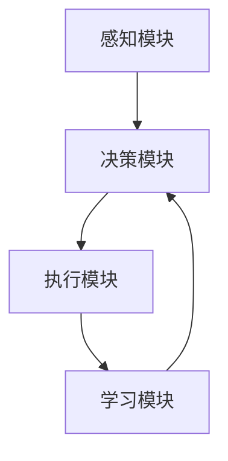

                 


# AI Agent中的强化学习与模仿学习结合

**关键词**：AI Agent, 强化学习, 模仿学习, 结合, 算法, 应用, 优化

**摘要**：本文探讨了AI Agent中强化学习与模仿学习的结合，分析了两种学习方法的优势与不足，并提出了一种结合两者的新型学习框架。通过详细讲解强化学习与模仿学习的算法原理、实现细节以及应用场景，本文为AI Agent的设计与优化提供了新的思路。同时，本文还结合实际案例，展示了如何将强化学习与模仿学习结合应用于复杂任务中。

---

# 第1章: AI Agent基础与背景

## 1.1 AI Agent的基本概念

### 1.1.1 AI Agent的定义与特点

AI Agent（智能体）是指能够感知环境、做出决策并执行动作的智能系统。AI Agent的核心特点包括：

- **自主性**：能够在没有外部干预的情况下自主运行。
- **反应性**：能够实时感知环境并做出反应。
- **目标导向**：具备明确的目标，并通过行为实现目标。
- **学习能力**：能够通过与环境的交互不断优化自身的行为策略。

### 1.1.2 AI Agent的分类与应用场景

AI Agent可以根据智能水平分为以下几类：

1. **反应式AI Agent**：基于当前感知做出反应，适用于简单任务。
2. **认知式AI Agent**：具备复杂推理和规划能力，适用于复杂任务。
3. **学习型AI Agent**：能够通过学习优化自身行为策略。

AI Agent的应用场景包括：

- **游戏AI**：如自动驾驶、游戏AI等。
- **机器人控制**：如工业机器人、服务机器人。
- **推荐系统**：如个性化推荐、智能客服。
- **智能控制**：如智能家居、智能交通系统。

### 1.1.3 强化学习与模仿学习在AI Agent中的作用

强化学习（Reinforcement Learning, RL）通过试错机制优化AI Agent的行为策略，适用于动态和不确定性环境。模仿学习（Imitation Learning, IL）通过模仿专家行为快速学习，适用于需要快速适应的任务。

---

## 1.2 强化学习与模仿学习的背景

### 1.2.1 强化学习的历史与发展

强化学习起源于20世纪50年代的马尔可夫决策过程（MDP）理论。近年来，深度强化学习（Deep RL）的快速发展，如DQN、Actor-Critic等算法，推动了强化学习在复杂任务中的应用。

### 1.2.2 模仿学习的起源与现状

模仿学习的起源可以追溯到行为主义心理学。近年来，基于生成对抗网络（GAN）的模仿学习方法（如GAIL）得到了广泛关注。

### 1.2.3 强化学习与模仿学习的联系与区别

| **方面**       | **强化学习**                              | **模仿学习**                              |
|----------------|------------------------------------------|------------------------------------------|
| 学习目标       | 最大化累计奖励                            | 模仿专家行为                               |
| 学习环境       | 未知或部分未知                            | 已知或有专家演示                            |
| 学习效率       | 通常较慢，依赖试错                        | 较快，依赖专家经验                          |

---

## 1.3 AI Agent中的强化学习与模仿学习结合的必要性

### 1.3.1 强化学习在AI Agent中的优势与不足

- **优势**：适用于动态和不确定性环境，能够通过试错优化策略。
- **不足**：学习效率低，需要大量试错，收敛速度慢。

### 1.3.2 模仿学习在AI Agent中的优势与不足

- **优势**：学习效率高，能够快速模仿专家行为。
- **不足**：适用于静态环境，难以应对动态变化。

### 1.3.3 结合强化学习与模仿学习的动机与目标

结合强化学习与模仿学习，可以充分发挥两者的优点，弥补各自的不足，提升AI Agent在复杂任务中的表现。

---

## 1.4 本章小结

本章介绍了AI Agent的基本概念、分类与应用场景，分析了强化学习与模仿学习的背景及其在AI Agent中的作用，最后阐述了结合两者的重要性和目标。

---

# 第2章: 强化学习算法原理与实现

## 2.1 强化学习的基本原理

### 2.1.1 强化学习的核心概念

- **状态（State）**：环境的当前情况。
- **动作（Action）**：AI Agent的行为选择。
- **奖励（Reward）**：环境对AI Agent行为的反馈。

### 2.1.2 状态、动作、奖励的定义与关系

状态和动作构成了环境的状态空间和动作空间，奖励则是对AI Agent行为的评价。

### 2.1.3 强化学习的数学模型与公式

强化学习的目标是通过最大化累计奖励来优化策略。数学上，策略 $\pi$ 是从状态到动作的映射，目标函数为：

$$
V^\pi(s) = \max_{a} \left[ r(s, a) + \gamma V^\pi(s') \right]
$$

其中，$\gamma$ 是折扣因子，$s'$ 是下一个状态。

---

## 2.2 主流强化学习算法

### 2.2.1 Q-Learning算法

Q-Learning是一种经典的值迭代算法，其更新公式为：

$$
Q(s, a) = (1-\alpha) Q(s, a) + \alpha \left( r + \gamma \max_{a'} Q(s', a') \right)
$$

其中，$\alpha$ 是学习率。

### 2.2.2 Deep Q-Networks (DQN)算法

DQN通过神经网络近似Q值函数，避免了Q-Learning的离散化问题。

### 2.2.3 Policy Gradient方法

Policy Gradient通过优化策略的对数概率来最大化累计奖励：

$$
\nabla \theta \leftarrow \frac{1}{N} \sum_{i=1}^{N} \nabla \log \pi_\theta(s_i) Q(s_i, a_i)
$$

### 2.2.4 Actor-Critic架构

Actor-Critic结合了策略梯度和值函数，通过两个网络分别优化策略和值函数。

---

## 2.3 强化学习算法的实现细节

### 2.3.1 状态空间与动作空间的处理

状态空间和动作空间的大小决定了强化学习算法的复杂度。

### 2.3.2 奖励函数的设计与优化

奖励函数的设计直接影响学习效果，需根据任务目标进行调整。

### 2.3.3 探索与利用的平衡策略

平衡探索（尝试新动作）与利用（执行已知好动作）是强化学习的关键。

---

## 2.4 强化学习的优缺点与适用场景

### 2.4.1 强化学习的优点

- 灵活性高，适用于复杂环境。
- 无需明确任务规则，通过试错优化。

### 2.4.2 强化学习的缺点

- 学习效率低，收敛速度慢。
- 易受环境噪声影响。

### 2.4.3 强化学习的适用场景

- 游戏AI
- 机器人控制
- 自动驾驶

---

## 2.5 本章小结

本章详细介绍了强化学习的基本原理、主流算法及其实现细节，并分析了强化学习的优缺点与适用场景。

---

# 第3章: 模仿学习算法原理与实现

## 3.1 模仿学习的基本原理

### 3.1.1 模仿学习的核心概念

- **演示数据**：专家行为的记录。
- **模仿策略**：基于演示数据学习的策略。

### 3.1.2 模仿学习的数学模型与公式

模仿学习的目标是通过最大化演示数据的概率来优化策略：

$$
\max_{\theta} \sum_{i=1}^{N} \log \pi_\theta(a_i|s_i)
$$

---

## 3.2 主流模仿学习算法

### 3.2.1 Behavior Cloning算法

Behavior Cloning通过监督学习直接模仿专家行为。

### 3.2.2 Generative Adversarial Imitation Learning (GAIL)

GAIL通过生成对抗网络学习专家行为分布。

### 3.2.3 Imitation Learning via Inverse Reinforcement Learning (ILIRL)

ILIRL通过逆向强化学习从专家行为中学习奖励函数。

---

## 3.3 模仿学习算法的实现细节

### 3.3.1 演示数据的采集与处理

演示数据的质量直接影响模仿学习的效果。

### 3.3.2 模仿策略的训练与优化

通过神经网络训练模仿策略，优化目标函数。

---

## 3.4 模仿学习的优缺点与适用场景

### 3.4.1 模仿学习的优点

- 学习效率高，无需试错。
- 适用于静态环境。

### 3.4.2 模仿学习的缺点

- 依赖专家演示。
- 适应性差。

### 3.4.3 模仿学习的适用场景

- 机器人控制
- 游戏AI
- 智能客服

---

## 3.5 本章小结

本章详细介绍了模仿学习的基本原理、主流算法及其实现细节，并分析了模仿学习的优缺点与适用场景。

---

# 第4章: 强化学习与模仿学习的结合

## 4.1 强化学习与模仿学习结合的动机

### 4.1.1 强化学习的效率问题

通过模仿学习快速初始化，加速强化学习的收敛。

### 4.1.2 模仿学习的适应性问题

通过强化学习动态调整策略，提升模仿学习的适应性。

---

## 4.2 结合强化学习与模仿学习的方法

### 4.2.1 初始策略通过模仿学习获得

通过模仿学习初始化策略，减少强化学习的试错成本。

### 4.2.2 强化学习优化模仿策略

在模仿学习的基础上，通过强化学习进一步优化策略。

### 4.2.3 融合两种学习的混合方法

结合强化学习和模仿学习的优势，设计混合学习框架。

---

## 4.3 结合强化学习与模仿学习的案例

### 4.3.1 游戏AI案例

通过模仿学习初始化策略，再通过强化学习优化策略。

### 4.3.2 机器人控制案例

结合强化学习与模仿学习，提升机器人在复杂环境中的适应性。

---

## 4.4 本章小结

本章探讨了强化学习与模仿学习结合的动机与方法，并通过具体案例展示了结合两种学习的优势。

---

# 第5章: 系统架构与实现

## 5.1 系统架构设计

### 5.1.1 系统组成

- **感知模块**：感知环境状态。
- **决策模块**：基于策略做出决策。
- **执行模块**：执行决策动作。
- **学习模块**：结合强化学习与模仿学习优化策略。

### 5.1.2 系统架构图



---

## 5.2 算法实现细节

### 5.2.1 算法流程

1. 初始化策略通过模仿学习。
2. 通过强化学习优化策略。
3. 结合两种学习方法，动态调整策略。

### 5.2.2 系统接口设计

- **输入接口**：接收环境状态和专家演示。
- **输出接口**：输出决策动作。
- **学习接口**：更新策略参数。

---

## 5.3 本章小结

本章详细设计了结合强化学习与模仿学习的系统架构，并展示了实现细节。

---

# 第6章: 项目实战

## 6.1 项目背景

设计一个结合强化学习与模仿学习的AI Agent，应用于复杂任务。

## 6.2 项目实现

### 6.2.1 环境配置

安装必要的依赖库，如TensorFlow、OpenAI Gym等。

### 6.2.2 核心代码实现

以下是结合强化学习与模仿学习的Python代码示例：

```python
import numpy as np
import tensorflow as tf

# 初始化策略通过模仿学习
def initialize_policy(expert_demonstrations):
    # 假设expert_demonstrations是专家行为的数据
    # 使用神经网络训练策略
    pass

# 通过强化学习优化策略
def reinforce_policy(environment, policy):
    # 使用强化学习算法优化策略
    pass

# 结合两种学习的混合方法
def hybrid_learning(environment, expert_demonstrations):
    policy = initialize_policy(expert_demonstrations)
    reinforce_policy(environment, policy)
    return policy

# 主函数
def main():
    environment = ...
    expert_demonstrations = ...
    policy = hybrid_learning(environment, expert_demonstrations)
    return policy

if __name__ == "__main__":
    main()
```

### 6.2.3 代码应用解读与分析

代码通过初始化策略并优化策略，展示了结合强化学习与模仿学习的实现。

---

## 6.3 本章小结

本章通过具体项目展示了结合强化学习与模仿学习的实现，提供了代码实现和应用解读。

---

# 第7章: 总结与展望

## 7.1 本文总结

本文探讨了AI Agent中强化学习与模仿学习的结合，分析了两种学习方法的优势与不足，并提出了一种结合两者的新型学习框架。

## 7.2 未来展望

未来研究可以进一步探索结合强化学习与模仿学习的优化方法，提升AI Agent在复杂任务中的表现。

## 7.3 最佳实践 Tips

- 在实际应用中，需根据任务特点选择合适的学习方法。
- 结合强化学习与模仿学习时，需平衡两者的优缺点。
- 定期优化策略，适应环境变化。

---

# 作者

**作者：AI天才研究院/AI Genius Institute & 禅与计算机程序设计艺术 /Zen And The Art of Computer Programming**

---

**本文内容遵循CC Attribution-NonCommercial 4.0 International License，禁止用于商业用途。**

