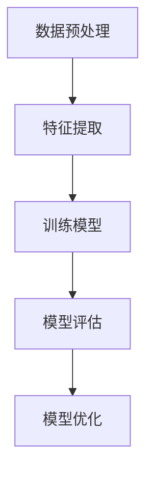
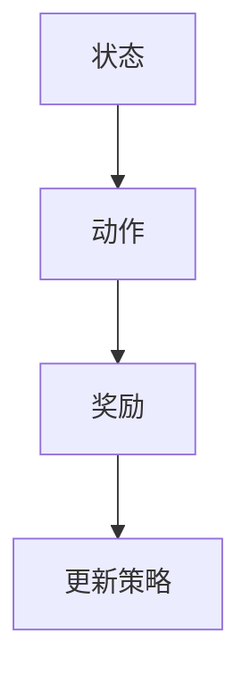
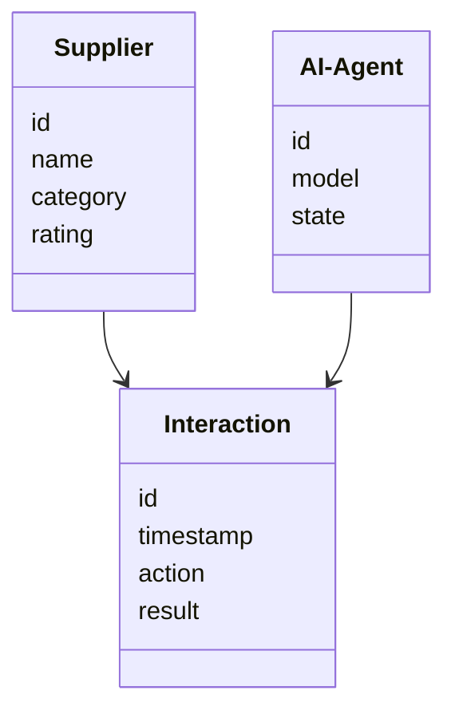

                 


# AI Agent 在企业供应商管理与评估中的应用

## 关键词
- AI Agent
- 企业供应商管理
- 供应商评估系统
- 机器学习
- 自然语言处理
- 供应商关系管理
- 智能决策系统

## 摘要
本文详细探讨了AI Agent在企业供应商管理与评估中的应用。通过分析传统供应商管理的挑战，介绍了AI Agent的核心概念和分类，详细讲解了基于监督学习和强化学习的算法原理，并提供了系统设计与架构、项目实战及最佳实践等多方面的内容。文章旨在帮助读者全面理解AI Agent如何优化企业供应商管理流程，提升决策效率和准确性。

---

## 正文

### 第一部分: AI Agent 在企业供应商管理与评估中的应用概述

#### 第1章: 问题背景与核心概念

##### 1.1 问题背景
###### 1.1.1 企业供应商管理的现状与挑战
企业供应商管理是企业运营中的核心环节，涉及供应商选择、评估、监控和关系维护等多个方面。传统供应商管理面临以下挑战：
- **数据复杂性**：供应商数据量大、维度多，难以高效处理。
- **实时性需求**：市场变化快，需要实时监控供应商表现。
- **决策优化**：供应商评估需要综合考虑质量、成本、交付等多个因素，传统方法难以实现全局优化。

###### 1.1.2 传统供应商管理的局限性
传统供应商管理依赖人工经验和报表分析，存在以下问题：
- 数据分散，难以整合和分析。
- 评估周期长，难以实时反馈。
- 缺乏智能化支持，决策依赖主观判断。

###### 1.1.3 AI Agent 的引入与应用价值
AI Agent（智能体）是一种能够感知环境并采取行动以实现目标的智能系统。引入AI Agent可以显著提升供应商管理的效率和准确性，具体价值体现在：
- **数据处理能力**：AI Agent能够快速处理大量供应商数据，提供实时反馈。
- **智能化决策**：通过机器学习和自然语言处理，AI Agent可以辅助制定最优供应商策略。
- **持续优化**：AI Agent能够根据反馈不断优化决策模型，提升管理效果。

##### 1.2 问题描述
###### 1.2.1 供应商管理的核心问题
供应商管理的核心问题包括：
- 如何高效筛选和评估供应商。
- 如何实时监控供应商表现。
- 如何优化供应商关系以降低风险。

###### 1.2.2 供应商评估的关键指标与挑战
供应商评估的关键指标包括质量、成本、交付、合规性和合作关系。挑战在于如何综合这些指标进行动态评估。

###### 1.2.3 AI Agent 在供应商管理中的应用场景
AI Agent在供应商管理中的应用场景包括：
- 自动筛选潜在供应商。
- 实时监控供应商表现。
- 提供决策支持，优化供应商组合。

##### 1.3 问题解决与边界
###### 1.3.1 AI Agent 在供应商管理中的解决方案
AI Agent通过以下方式优化供应商管理：
- 利用机器学习模型预测供应商风险。
- 使用自然语言处理分析供应商文档。
- 实现实时监控和反馈机制。

###### 1.3.2 AI Agent 的边界与适用范围
AI Agent的应用边界包括：
- 数据隐私和合规性问题。
- 模型的可解释性。
- 实际业务中的不可预测因素。

##### 1.4 概念结构与核心要素组成
- **核心概念**：AI Agent、供应商管理、机器学习、自然语言处理。
- **核心要素**：数据输入、模型训练、决策输出、反馈优化。

#### 1.5 核心概念与联系
##### 1.5.1 AI Agent 的核心概念
AI Agent的定义和分类：
- **定义**：AI Agent是一种能够感知环境并采取行动以实现目标的智能系统。
- **分类**：
  - 基于规则的AI Agent。
  - 基于知识的AI Agent。
  - 基于学习的AI Agent。

##### 1.5.2 AI Agent 的属性特征对比
| 特性          | 基于规则的AI Agent | 基于知识的AI Agent | 基于学习的AI Agent |
|---------------|---------------------|--------------------|---------------------|
| 决策方式      | 预定义规则         | 知识库推理         | 数据驱动学习       |
| 适应性        | 低                 | 中                 | 高                 |
| 维护成本       | 低                 | 高                 | 中                 |
| 适用场景       | 简单任务           | 中等复杂任务       | 复杂动态任务       |

##### 1.5.3 ER实体关系图
```mermaid
erDiagram
    supplier {
        id
        name
        category
        rating
    }
    ai_agent {
        id
        name
        type
        model_version
    }
    interaction {
        id
        timestamp
        action
        result
    }
    supplier ~{o--} interaction
    ai_agent ~{o--} interaction
```

---

### 第二部分: 算法原理

#### 第2章: 算法原理讲解

##### 2.1 算法原理概述
AI Agent在供应商管理中的算法主要基于监督学习和强化学习。

##### 2.2 监督学习算法
###### 2.2.1 算法流程


###### 2.2.2 算法实现代码
```python
import pandas as pd
from sklearn.model_selection import train_test_split
from sklearn.ensemble import RandomForestClassifier
from sklearn.metrics import accuracy_score

# 数据加载
data = pd.read_csv('suppliers.csv')
X = data.drop('rating', axis=1)
y = data['rating']

# 数据分割
X_train, X_test, y_train, y_test = train_test_split(X, y, test_size=0.2)

# 模型训练
model = RandomForestClassifier()
model.fit(X_train, y_train)

# 模型预测
y_pred = model.predict(X_test)

# 模型评估
print("Accuracy:", accuracy_score(y_test, y_pred))
```

##### 2.3 强化学习算法
###### 2.3.1 算法流程


###### 2.3.2 算法实现代码
```python
import numpy as np
import gym

class QLearning:
    def __init__(self, state_space, action_space):
        self.state_space = state_space
        self.action_space = action_space
        self.Q = np.zeros((state_space, action_space))
    
    def choose_action(self, state, epsilon=0.1):
        if np.random.random() < epsilon:
            return np.random.randint(self.action_space)
        return np.argmax(self.Q[state, :])
    
    def update(self, state, action, reward, next_state, alpha=0.1, gamma=0.9):
        self.Q[state, action] = self.Q[state, action] + alpha * (reward + gamma * np.max(self.Q[next_state, :]) - self.Q[state, action])

# 示例环境
env = gym.make('CustomSupplierEnv')
agent = QLearning(env.observation_space, env.action_space)
for episode in range(100):
    state = env.reset()
    while not env.done:
        action = agent.choose_action(state)
        reward, next_state = env.step(action)
        agent.update(state, action, reward, next_state)
```

---

### 第三部分: 系统分析与架构设计

#### 第3章: 系统分析与架构设计方案

##### 3.1 问题场景介绍
供应商管理系统的场景包括供应商注册、评估、监控和关系维护。

##### 3.2 系统功能设计
###### 3.2.1 功能模块
- 供应商信息管理模块。
- 供应商评估指标设置模块。
- AI Agent交互模块。

##### 3.3 领域模型（Mermaid 类图）


##### 3.4 系统架构设计
###### 3.4.1 分层架构
```mermaid
structureDiagram
    subsystem DataLayer {
        SupplierDatabase
        InteractionDatabase
    }
    subsystem BusinessLogic {
        AI-Agent
        InteractionHandler
    }
    subsystem UI {
        SupplierInterface
    }
    DataLayer --> BusinessLogic
    BusinessLogic --> UI
```

##### 3.5 系统接口设计
###### 3.5.1 接口定义
- `/api/register-supplier`：供应商注册接口。
- `/api/evaluate-supplier`：供应商评估接口。
- `/api/monitor-supplier`：供应商监控接口。

##### 3.6 系统交互流程（Mermaid 序列图）
```mermaid
sequenceDiagram
    supplier ->+ ai_agent: 请求评估
    ai_agent ->> interaction: 获取数据
    interaction ->> supplier: 返回结果
    supplier ->- ai_agent: 更新模型
```

---

### 第四部分: 项目实战

#### 第4章: 项目实战

##### 4.1 环境安装
安装Python和相关库：
```bash
pip install pandas scikit-learn gym
```

##### 4.2 核心代码实现
###### 4.2.1 数据预处理
```python
import pandas as pd

def preprocess_data(data):
    # 数据清洗和特征工程
    data = data.dropna()
    data = pd.get_dummies(data, columns=['category'])
    return data
```

###### 4.2.2 模型训练
```python
from sklearn.ensemble import RandomForestClassifier

def train_model(X_train, y_train):
    model = RandomForestClassifier()
    model.fit(X_train, y_train)
    return model
```

###### 4.2.3 模型评估
```python
from sklearn.metrics import classification_report

def evaluate_model(model, X_test, y_test):
    y_pred = model.predict(X_test)
    print(classification_report(y_test, y_pred))
```

##### 4.3 案例分析与代码解读
分析供应商评分案例，展示AI Agent如何优化供应商评估过程。

##### 4.4 项目小结
总结项目实现的关键点和经验教训。

---

### 第五部分: 最佳实践

#### 第5章: 最佳实践

##### 5.1 小结
回顾文章主要内容，强调AI Agent在供应商管理中的价值。

##### 5.2 注意事项
- 数据隐私和合规性。
- 模型的可解释性和透明度。
- 持续学习和优化。

##### 5.3 拓展阅读
推荐相关书籍和论文，供读者深入学习。

---

### 结语

AI Agent在企业供应商管理中的应用前景广阔，通过智能化手段提升管理效率和决策准确性是未来趋势。本文详细介绍了AI Agent的核心概念、算法原理、系统设计和实际应用，为读者提供了全面的指导。

---

### 作者
作者：AI天才研究院/AI Genius Institute  
及 禅与计算机程序设计艺术/Zen And The Art of Computer Programming

