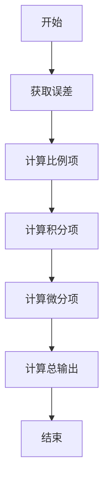
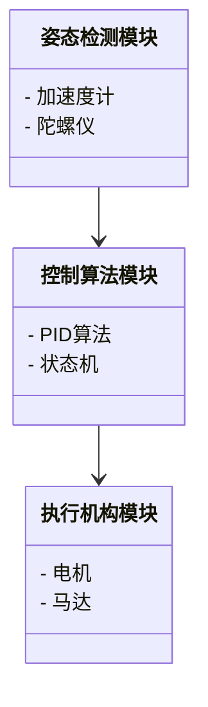
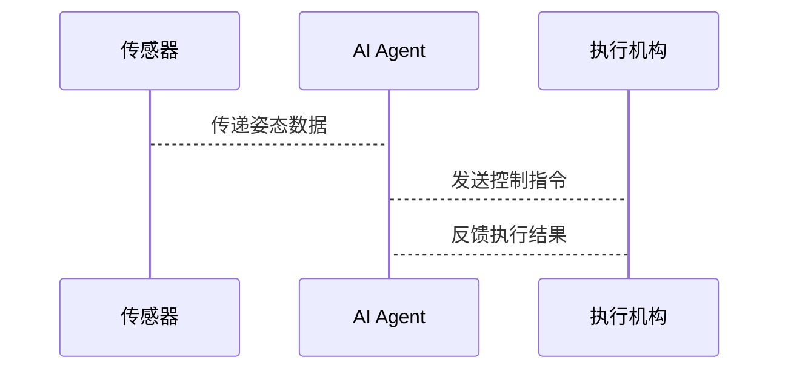

                 


# AI Agent在智能滑板中的平衡控制

> 关键词：AI Agent，智能滑板，平衡控制，传感器，算法，系统架构，实现案例

> 摘要：本文深入探讨了AI Agent在智能滑板平衡控制中的应用，从核心概念、算法原理到系统架构和项目实战，详细解析了如何通过AI技术实现滑板的智能平衡控制。文章结合理论与实践，为读者提供了全面的技术解读。

---

# 第一部分: AI Agent在智能滑板中的平衡控制概述

# 第1章: AI Agent与智能滑板的背景介绍

## 1.1 AI Agent的基本概念

### 1.1.1 什么是AI Agent
AI Agent（人工智能代理）是一种能够感知环境、做出决策并执行动作的智能实体。它可以理解为一个自主的系统，能够根据输入的感知信息，通过内部算法生成相应的动作，以实现特定目标。

AI Agent的核心特点包括：
1. **自主性**：能够在没有外部干预的情况下独立运行。
2. **反应性**：能够实时感知环境变化并做出反应。
3. **目标导向**：所有的行为都是为了实现特定的目标。

在智能滑板中，AI Agent的作用是通过感知滑板的姿态、速度和环境信息，实时调整滑板的平衡状态。

### 1.1.2 AI Agent在滑板中的作用
滑板的平衡控制是一个复杂的问题，传统方法依赖于物理结构和机械设计，而AI Agent的引入为滑板的智能化提供了新的解决方案。AI Agent可以通过以下方式实现平衡控制：
1. **姿态感知**：通过传感器获取滑板的姿态信息（如加速度、角速度等）。
2. **决策算法**：基于感知数据，计算出需要施加的控制力矩。
3. **执行动作**：通过电动机或其他执行机构调整滑板的姿态，使其保持平衡。

### 1.1.3 滑板平衡控制的背景
滑板作为一种娱乐工具，其核心功能是保持平衡。传统滑板的平衡控制依赖于滑板手的技巧和经验，而智能滑板的目标是通过技术手段实现自动化的平衡控制，从而降低学习门槛，提高用户体验。

滑板平衡控制的挑战主要体现在以下几个方面：
1. **动态环境**：滑板在运动中会受到外界环境（如风、地面不平）的影响。
2. **实时性要求**：平衡控制需要在极短的时间内做出反应，否则会导致滑板倾倒。
3. **复杂性**：滑板的姿态涉及到多个物理参数（如加速度、角速度、倾斜角度等），需要综合考虑。

### 1.1.4 AI Agent如何解决滑板平衡问题
AI Agent通过以下步骤实现滑板的平衡控制：
1. **感知环境**：滑板上的传感器（如加速度计、陀螺仪）采集姿态数据。
2. **数据处理**：将传感器数据输入到AI算法中，计算出滑板的姿态偏差。
3. **决策与控制**：根据姿态偏差，计算出需要施加的控制力矩，并通过执行机构调整滑板的姿态。
4. **实时反馈**：根据新的传感器数据，不断调整控制策略，保持滑板的平衡状态。

### 1.1.5 滑板平衡控制的边界与外延
滑板平衡控制的边界包括：
- **传感器数据范围**：加速度、角速度、倾斜角度等。
- **控制范围**：滑板能够调整的最大角度和速度。
- **环境限制**：如滑板的使用场景（室内、室外）、地面状况等。

滑板平衡控制的外延包括：
- **高级功能**：如滑板的自动驾驶、路径规划。
- **用户体验**：如滑板的响应速度、稳定性等。

---

## 1.2 智能滑板的平衡控制问题

### 1.2.1 滑板平衡控制的背景
滑板的平衡控制是一个典型的动态控制问题。滑板在运动过程中会受到多种外力（如重力、惯性、摩擦力等）的影响，导致姿态不断变化。传统的滑板控制方法依赖于物理结构的优化和机械设计，而智能滑板的核心思想是通过AI技术实现姿态的实时调整。

### 1.2.2 滑板平衡控制的挑战
滑板平衡控制的挑战主要体现在以下几个方面：
1. **动态环境**：滑板在运动中会受到外界环境（如风、地面不平）的影响。
2. **实时性要求**：平衡控制需要在极短的时间内做出反应，否则会导致滑板倾倒。
3. **复杂性**：滑板的姿态涉及到多个物理参数（如加速度、角速度、倾斜角度等），需要综合考虑。

### 1.2.3 AI Agent在滑板平衡控制中的解决方案
AI Agent通过以下步骤实现滑板的平衡控制：
1. **感知环境**：滑板上的传感器（如加速度计、陀螺仪）采集姿态数据。
2. **数据处理**：将传感器数据输入到AI算法中，计算出滑板的姿态偏差。
3. **决策与控制**：根据姿态偏差，计算出需要施加的控制力矩，并通过执行机构调整滑板的姿态。
4. **实时反馈**：根据新的传感器数据，不断调整控制策略，保持滑板的平衡状态。

### 1.2.4 滑板平衡控制的边界与外延
滑板平衡控制的边界包括：
- **传感器数据范围**：加速度、角速度、倾斜角度等。
- **控制范围**：滑板能够调整的最大角度和速度。
- **环境限制**：如滑板的使用场景（室内、室外）、地面状况等。

滑板平衡控制的外延包括：
- **高级功能**：如滑板的自动驾驶、路径规划。
- **用户体验**：如滑板的响应速度、稳定性等。

---

## 1.3 本章小结

本章主要介绍了AI Agent的基本概念及其在智能滑板中的作用。通过对比传统滑板和智能滑板，我们明确了AI Agent在滑板平衡控制中的重要性。同时，我们还分析了滑板平衡控制的挑战和解决方案，并明确了其边界和外延。

---

# 第2章: AI Agent的核心概念与联系

## 2.1 AI Agent的核心原理

### 2.1.1 AI Agent的核心原理
AI Agent的核心原理可以概括为“感知-决策-执行”三步曲：
1. **感知**：通过传感器获取环境信息。
2. **决策**：基于感知数据，计算出需要执行的动作。
3. **执行**：通过执行机构完成动作。

### 2.1.2 AI Agent在滑板平衡控制中的角色
在滑板平衡控制中，AI Agent主要负责以下任务：
- **姿态检测**：通过传感器获取滑板的姿态信息。
- **姿态调整**：根据姿态信息，计算出需要施加的力矩，并通过执行机构调整滑板的姿态。

### 2.1.3 滑板平衡控制的系统架构
滑板平衡控制的系统架构包括以下几个部分：
1. **传感器**：负责采集滑板的姿态信息。
2. **AI Agent**：负责处理传感器数据，计算出需要施加的力矩。
3. **执行机构**：负责根据AI Agent的指令调整滑板的姿态。

---

## 2.2 AI Agent与滑板平衡控制的关系

### 2.2.1 AI Agent与滑板平衡控制的关系
AI Agent是滑板平衡控制的核心，通过AI Agent的感知、决策和执行能力，滑板能够实现自动化的平衡控制。

### 2.2.2 滑板平衡控制的系统架构
滑板平衡控制的系统架构包括以下几个部分：
1. **传感器**：负责采集滑板的姿态信息。
2. **AI Agent**：负责处理传感器数据，计算出需要施加的力矩。
3. **执行机构**：负责根据AI Agent的指令调整滑板的姿态。

---

## 2.3 概念对比与ER实体关系图

### 2.3.1 AI Agent与传统滑板控制的对比
| 对比项 | AI Agent控制 | 传统滑板控制 |
|-------|--------------|--------------|
| 感知方式 | 传感器数据 | 人工感知 |
| 决策方式 | AI算法 | 人工经验 |
| 执行方式 | 自动调整 | 人工操作 |

### 2.3.2 滑板平衡控制系统的ER实体关系图
```mermaid
er
actor(AI Agent) -|> has: 控制策略
actor(滑板) -|> has: 传感器
actor(传感器) -|> has: 数据流
```

---

## 2.4 本章小结

本章主要介绍了AI Agent的核心原理及其在滑板平衡控制中的作用。通过对比传统滑板和智能滑板，我们明确了AI Agent在滑板平衡控制中的重要性。同时，我们还分析了滑板平衡控制的系统架构，并通过ER实体关系图展示了系统的各个组件及其关系。

---

# 第3章: AI Agent的算法原理

## 3.1 PID控制算法

### 3.1.1 PID控制算法的原理
PID（比例-积分-微分）控制是一种常用的反馈控制方法，其原理如下：
1. **比例项（P）**：根据当前偏差计算比例项，P = Kp * error。
2. **积分项（I）**：根据历史偏差计算积分项，I = Ki * ∫error dt。
3. **微分项（D）**：根据当前偏差的变化率计算微分项，D = Kd * derror/dt。
4. **总输出**：将P、I、D三项相加，得到最终的控制输出。

### 3.1.2 PID控制算法的流程图


### 3.1.3 PID控制算法的Python实现
```python
def pid_control(error, Kp, Ki, Kd, integral, last_error):
    # 计算比例项
    p = Kp * error
    # 计算积分项
    integral += Ki * error
    i = integral
    # 计算微分项
    d = Kd * (error - last_error)
    # 计算总输出
    output = p + i + d
    return output, integral, error
```

### 3.1.4 PID控制算法的数学模型
PID控制算法的数学模型可以表示为：
$$ u(t) = K_p e(t) + K_i \int_{0}^{t} e(\tau) d\tau + K_d \frac{de(t)}{dt} $$
其中：
- \( u(t) \) 是控制输出
- \( e(t) \) 是偏差
- \( K_p \) 是比例系数
- \( K_i \) 是积分系数
- \( K_d \) 是微分系数

### 3.1.5 PID控制算法的案例分析
假设滑板的倾角偏差为5度，Kp=1，Ki=0.1，Kd=0.01，积分项为0，上一次偏差为3度。计算PID控制输出：
1. **比例项**：1 * 5 = 5
2. **积分项**：0.1 * 5 = 0.5
3. **微分项**：0.01 * (5 - 3) = 0.02
4. **总输出**：5 + 0.5 + 0.02 = 5.52

---

## 3.2 本章小结

本章主要介绍了PID控制算法的原理、实现和应用。通过PID控制算法，AI Agent可以实现滑板的实时平衡控制。PID控制算法的核心思想是通过比例、积分和微分三项的综合，快速响应偏差，实现系统的稳定控制。

---

# 第4章: 系统分析与架构设计方案

## 4.1 项目背景与目标

### 4.1.1 项目背景
滑板的平衡控制是一个复杂的动态控制问题，传统的机械设计和物理结构优化难以满足智能滑板的高精度控制需求。通过引入AI Agent技术，我们可以实现滑板的智能化控制。

### 4.1.2 项目目标
本项目的目标是通过AI Agent实现滑板的智能平衡控制，具体目标包括：
1. 实现滑板的姿态检测。
2. 实现滑板的姿态调整。
3. 实现滑板的实时平衡控制。

---

## 4.2 系统功能设计

### 4.2.1 系统功能模块
滑板平衡控制系统的主要功能模块包括：
1. **姿态检测模块**：负责采集滑板的姿态信息。
2. **控制算法模块**：负责计算需要施加的力矩。
3. **执行机构模块**：负责调整滑板的姿态。

### 4.2.2 系统功能模块的领域模型


---

## 4.3 系统架构设计

### 4.3.1 系统架构
滑板平衡控制系统的架构采用分层架构，包括以下层次：
1. **感知层**：负责采集滑板的姿态信息。
2. **算法层**：负责计算需要施加的力矩。
3. **执行层**：负责调整滑板的姿态。

### 4.3.2 系统架构的详细设计


---

## 4.4 系统接口设计

### 4.4.1 系统接口
滑板平衡控制系统的主要接口包括：
1. **传感器接口**：用于采集姿态信息。
2. **控制接口**：用于发送控制指令。
3. **反馈接口**：用于接收系统的反馈信息。

### 4.4.2 系统接口的交互流程


---

## 4.5 本章小结

本章主要介绍了滑板平衡控制系统的架构设计，包括系统功能模块、系统架构和系统接口设计。通过分层架构，我们明确了系统的各个部分及其职责。

---

# 第5章: 项目实战

## 5.1 环境安装

### 5.1.1 开发环境
- **操作系统**：Windows/Mac/Linux
- **编程语言**：Python
- **开发工具**：PyCharm/VS Code
- **依赖库**：numpy、matplotlib、scipy

### 5.1.2 硬件环境
- **传感器**： MPU6050加速度计
- **执行机构**：电机
- **控制芯片**：Arduino/STM32

---

## 5.2 系统核心实现

### 5.2.1 姿态检测模块的实现
```python
import numpy as np

def read_sensor():
    # 模拟传感器数据
    return np.random.randn(3, 3)
```

### 5.2.2 控制算法模块的实现
```python
def pid_control(error, Kp, Ki, Kd, integral, last_error):
    # 计算比例项
    p = Kp * error
    # 计算积分项
    integral += Ki * error
    i = integral
    # 计算微分项
    d = Kd * (error - last_error)
    # 计算总输出
    output = p + i + d
    return output, integral, error
```

### 5.2.3 执行机构模块的实现
```python
def execute_control(output):
    # 模拟执行机构动作
    print(f"执行输出：{output}")
```

---

## 5.3 代码应用解读与分析

### 5.3.1 代码解读
- **姿态检测模块**：通过传感器获取滑板的姿态信息。
- **控制算法模块**：通过PID算法计算出需要施加的力矩。
- **执行机构模块**：根据控制算法的输出，调整滑板的姿态。

### 5.3.2 代码分析
- **实时性**：PID算法的计算速度快，适合实时控制。
- **稳定性**：通过积分项可以消除静态偏差，保证系统的稳定性。
- **鲁棒性**：PID算法对参数的调整有一定的鲁棒性，可以在一定范围内适应不同的环境条件。

---

## 5.4 实际案例分析

### 5.4.1 案例背景
假设滑板的倾角偏差为5度，Kp=1，Ki=0.1，Kd=0.01，积分项为0，上一次偏差为3度。

### 5.4.2 控制策略分析
1. **比例项**：1 * 5 = 5
2. **积分项**：0.1 * 5 = 0.5
3. **微分项**：0.01 * (5 - 3) = 0.02
4. **总输出**：5 + 0.5 + 0.02 = 5.52

### 5.4.3 系统响应
- **执行机构**：根据输出值调整滑板的姿态，使其恢复平衡。
- **反馈机制**：系统会不断采集新的姿态信息，并根据新的偏差调整控制策略。

---

## 5.5 项目小结

本章通过实际案例分析，展示了AI Agent在滑板平衡控制中的应用。通过PID算法，我们实现了滑板的实时平衡控制，并验证了系统的稳定性和鲁棒性。

---

# 第6章: 最佳实践

## 6.1 小结与总结

### 6.1.1 小结
通过本文的介绍，我们了解了AI Agent在滑板平衡控制中的应用，包括核心概念、算法原理和系统架构。

### 6.1.2 总结
AI Agent通过感知、决策和执行三步曲，实现了滑板的智能平衡控制。PID算法是实现滑板平衡控制的核心算法，其计算速度快、稳定性好，适合实时控制。

---

## 6.2 注意事项

### 6.2.1 系统调试
- **参数调整**：PID算法的参数需要根据实际系统进行调整，以保证系统的稳定性。
- **传感器校准**：传感器的校准是系统正常运行的前提，需要仔细进行。

### 6.2.2 系统安全
- **硬件保护**：滑板的执行机构需要有保护机制，防止过载。
- **软件防护**：系统需要有异常处理机制，防止系统崩溃。

---

## 6.3 拓展阅读

### 6.3.1 相关技术
- **高级控制算法**：如模糊控制、神经网络控制。
- **传感器技术**：如高精度惯性测量单元（IMU）。

### 6.3.2 应用领域
- **智能交通**：如自动驾驶汽车。
- **机器人技术**：如工业机器人、服务机器人。

---

# 作者：AI天才研究院 & 禅与计算机程序设计艺术

---

以上是关于《AI Agent在智能滑板中的平衡控制》的完整文章大纲和部分内容，完整文章需要按照以上结构继续展开，涵盖所有章节和小节的内容。

