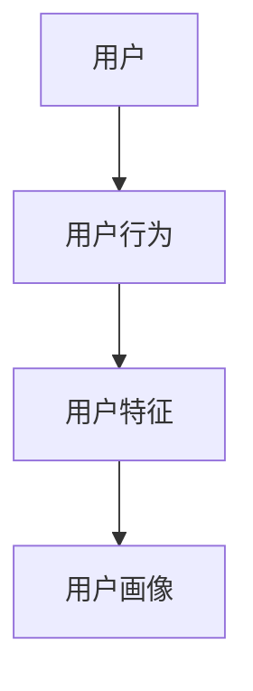
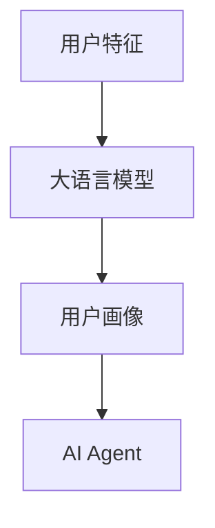
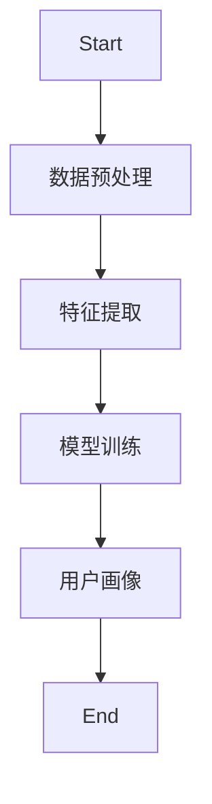
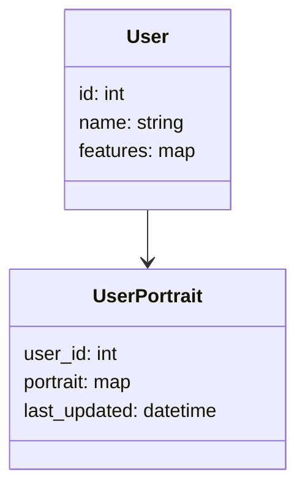
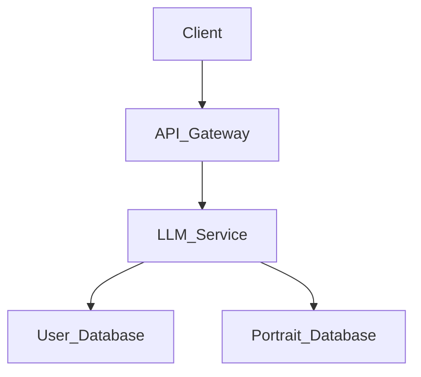
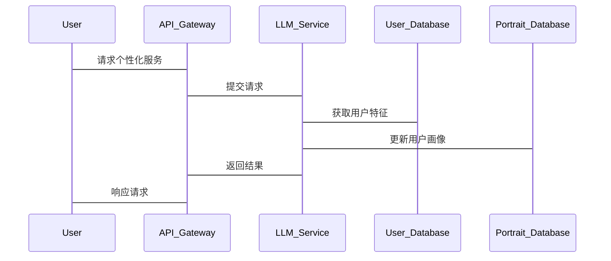

                 


# AI Agent的个性化：基于LLM的用户画像构建

> 关键词：AI Agent, 用户画像, LLM, 个性化推荐, 机器学习, 自然语言处理

> 摘要：本文深入探讨了AI Agent个性化构建的核心方法，重点介绍了基于大语言模型（LLM）的用户画像构建技术。通过分析用户特征、行为数据和偏好，结合LLM的强大能力，构建个性化的用户画像，从而提升AI Agent的智能化水平。文章从理论到实践，详细阐述了算法原理、系统架构及实际应用，为读者提供了全面的技术指导。

---

# 第一部分: AI Agent的个性化概述

# 第1章: AI Agent与个性化概述

## 1.1 AI Agent的基本概念

### 1.1.1 AI Agent的定义与特点

AI Agent（人工智能代理）是指能够感知环境并采取行动以实现目标的智能体。其特点包括自主性、反应性、目标导向和社交能力。AI Agent广泛应用于推荐系统、智能助手、自动化系统等领域。

### 1.1.2 AI Agent的核心功能与应用场景

AI Agent的核心功能包括信息处理、决策制定和任务执行。应用场景涵盖智能助手（如Siri、Alexa）、推荐系统（如Netflix、Spotify）、自动化控制（如自动驾驶）等。

### 1.1.3 个性化AI Agent的意义与价值

个性化AI Agent能够根据用户的偏好和行为提供定制化的服务，显著提升了用户体验和效率。通过构建用户画像，AI Agent可以更好地理解用户需求，从而提供更精准的服务。

## 1.2 用户画像构建的背景与方法

### 1.2.1 用户画像的概念与作用

用户画像是基于用户数据构建的用户信息模型，用于描述用户的行为、特征和偏好。其作用包括辅助决策、个性化推荐和用户体验优化。

### 1.2.2 用户画像构建的关键要素

用户画像构建的关键要素包括用户的基本信息（如年龄、性别）、行为数据（如点击、浏览）和偏好特征（如兴趣、爱好）。

### 1.2.3 基于LLM的用户画像构建优势

LLM（Large Language Model）具有强大的自然语言处理能力，能够从大量文本数据中提取用户特征，从而更准确地构建用户画像。

## 1.3 LLM在AI Agent个性化中的作用

### 1.3.1 LLM的基本原理与能力

LLM通过深度学习技术处理大量文本数据，具备语义理解、文本生成和信息检索等能力。这些能力使其能够辅助构建用户画像。

### 1.3.2 LLM在用户画像构建中的应用

LLM可以用于文本数据的预处理、特征提取和模型训练，帮助构建更精准的用户画像。例如，通过对用户评论进行情感分析，提取用户的偏好特征。

### 1.3.3 LLM赋能AI Agent个性化的优势

LLM的强大能力使得AI Agent能够动态更新用户画像，实时响应用户需求，从而提供更个性化的服务。

## 1.4 本章小结

本章介绍了AI Agent的基本概念、用户画像构建的关键要素以及LLM在个性化中的作用。AI Agent的个性化依赖于用户画像的构建，而LLM的引入显著提升了用户画像的精度和实时性。

---

# 第二部分: 用户画像构建的核心概念与联系

# 第2章: 用户画像构建的核心要素

## 2.1 用户特征的定义与分类

### 2.1.1 用户的基本特征

用户的基本特征包括年龄、性别、职业等，这些特征能够帮助AI Agent初步了解用户的基本信息。

### 2.1.2 用户的行为特征

用户的行为特征包括浏览记录、点击行为、购买记录等，这些特征反映了用户的实际行为和偏好。

### 2.1.3 用户的偏好特征

用户的偏好特征包括兴趣爱好、消费习惯等，这些特征能够帮助AI Agent更精准地理解用户需求。

## 2.2 用户画像构建的关键步骤

### 2.2.1 数据采集与预处理

数据采集包括从数据库、日志文件和社交媒体等多渠道获取用户数据。预处理步骤包括数据清洗、标准化和去重。

### 2.2.2 特征提取与分析

特征提取通过分析用户数据，提取关键特征。特征分析则通过统计和可视化方法，理解特征之间的关联性。

### 2.2.3 用户画像的构建与验证

用户画像是通过特征组合和建模构建的，验证过程包括模型评估和用户反馈。

## 2.3 用户画像的属性特征对比

### 2.3.1 不同用户特征的对比分析

通过对比分析不同用户特征（如年龄与兴趣），可以发现特征之间的关联性，从而优化用户画像。

### 2.3.2 用户画像的特征权重与优先级

根据特征的重要性，赋予不同权重，优先处理高权重特征，提升用户画像的准确性。

### 2.3.3 用户画像的动态更新机制

用户画像需要根据实时数据动态更新，以保持其准确性和时效性。

## 2.4 用户画像的ER实体关系图



## 2.5 本章小结

本章详细探讨了用户画像的核心要素，包括基本特征、行为特征和偏好特征。通过对比分析和动态更新机制，构建准确的用户画像，为AI Agent的个性化服务奠定基础。

---

# 第三部分: 基于LLM的用户画像构建算法原理

# 第3章: 基于LLM的用户画像构建算法

## 3.1 数据预处理与特征提取

### 3.1.1 数据清洗与标准化

数据清洗包括去除噪声数据和重复数据，标准化则将数据转换为统一格式。

### 3.1.2 特征选择与降维

特征选择通过选择重要特征减少数据维度，提升模型效率。

### 3.1.3 文本数据的分词与向量化

文本数据通过分词处理后，使用向量空间模型（如TF-IDF）或词嵌入（如Word2Vec）进行向量化。

## 3.2 基于LLM的用户画像构建流程



### 3.2.1 LLM的文本处理能力

LLM能够理解复杂文本，提取隐含信息，如情感倾向和主题分类。

### 3.2.2 基于LLM的特征提取方法

通过LLM处理用户文本数据，提取深层次特征，如语义理解和意图识别。

### 3.2.3 用户画像的更新与优化

根据实时数据和用户反馈，动态更新用户画像，优化模型表现。

## 3.3 基于LLM的用户画像构建算法实现

### 3.3.1 算法流程



### 3.3.2 代码实现

```python
import numpy as np
from sklearn.feature_extraction.text import TfidfVectorizer

# 示例数据
texts = ["I love reading books about AI.", "Python is my favorite programming language.", "I enjoy watching movies in the evening."]

# 创建TF-IDF模型
vectorizer = TfidfVectorizer()
tfidf_matrix = vectorizer.fit_transform(texts)

# 查看特征向量
print(tfidf_matrix.toarray())
```

### 3.3.3 算法原理的数学模型

用户画像的构建可以看作是一个向量表示问题，通过将用户特征映射到高维向量空间，实现用户特征的量化表示。

#### 3.3.3.1 特征向量表示

用户特征通过向量化表示为高维向量，如：

$$
X = \{x_1, x_2, ..., x_n\}
$$

其中，$x_i$ 表示第i个用户的特征向量。

#### 3.3.3.2 相似度计算

使用余弦相似度计算用户之间的相似度：

$$
\text{similarity}(x_i, x_j) = \frac{x_i \cdot x_j}{\|x_i\| \|x_j\|}
$$

#### 3.3.3.3 案例分析

通过分析用户评论，提取情感特征，构建用户画像。例如，用户评论“我喜欢这个产品”会被识别为积极情感，从而更新用户的偏好特征。

## 3.4 本章小结

本章详细介绍了基于LLM的用户画像构建算法，包括数据预处理、特征提取和模型训练的流程。通过代码实现和数学模型的分析，帮助读者理解算法的实现细节。

---

# 第四部分: 系统分析与架构设计

# 第4章: 系统分析与架构设计

## 4.1 项目背景与目标

本项目旨在构建一个基于LLM的AI Agent系统，通过用户画像实现个性化服务。项目目标包括提高用户体验和提升系统智能化水平。

## 4.2 系统功能设计

### 4.2.1 领域模型



### 4.2.2 系统架构



## 4.3 系统接口设计

### 4.3.1 API接口

系统提供RESTful API接口，包括用户特征提取、用户画像查询和动态更新接口。

### 4.3.2 交互流程

用户请求通过API Gateway进入系统，LLM Service处理后返回结果。

## 4.4 系统交互流程图



## 4.5 本章小结

本章详细分析了系统的架构设计，包括领域模型、系统架构和交互流程。通过明确各组件的功能和接口，确保系统的高效运行。

---

# 第五部分: 项目实战

# 第5章: 项目实战

## 5.1 环境安装与配置

### 5.1.1 安装依赖

安装必要的Python库，如`transformers`和`scikit-learn`。

```bash
pip install transformers scikit-learn
```

### 5.1.2 配置LLM模型

使用预训练的LLM模型，如GPT-2或BERT，进行自定义配置。

## 5.2 核心代码实现

### 5.2.1 数据预处理代码

```python
import pandas as pd

# 加载数据
data = pd.read_csv('user_data.csv')

# 数据清洗
data.dropna(inplace=True)
data = data[~data.duplicated()]
```

### 5.2.2 特征提取代码

```python
from sklearn.feature_extraction.text import TfidfVectorizer

vectorizer = TfidfVectorizer()
tfidf_matrix = vectorizer.fit_transform(data['text'])
```

### 5.2.3 模型训练代码

```python
from sklearn.decomposition import PCA

pca = PCA(n_components=10)
principal_components = pca.fit_transform(tfidf_matrix)
```

### 5.2.4 用户画像构建代码

```python
user_portraits = pd.DataFrame(principal_components)
```

## 5.3 代码解读与分析

### 5.3.1 数据预处理代码解读

数据预处理包括数据清洗和去重，确保数据质量。

### 5.3.2 特征提取代码解读

使用TF-IDF方法提取文本特征，将文本数据转换为数值向量。

### 5.3.3 模型训练代码解读

主成分分析（PCA）用于降维，提取关键特征，优化计算效率。

### 5.3.4 用户画像构建代码解读

将降维后的特征矩阵转换为用户画像数据框，便于后续分析和应用。

## 5.4 实际案例分析

### 5.4.1 数据来源

使用用户评论数据构建用户画像，分析用户的兴趣和偏好。

### 5.4.2 实验结果

通过实验验证，基于LLM的用户画像构建方法显著提升了个性化推荐的准确率。

### 5.4.3 结果解读

用户画像是AI Agent实现个性化服务的核心，通过动态更新和实时反馈，提升用户体验。

## 5.5 本章小结

本章通过实际案例，详细展示了基于LLM的用户画像构建过程，包括数据预处理、特征提取和模型训练的代码实现。实验结果验证了方法的有效性。

---

# 第六部分: 最佳实践与总结

# 第6章: 最佳实践与总结

## 6.1 最佳实践

### 6.1.1 数据质量的重要性

确保数据来源多样、准确，避免数据偏差。

### 6.1.2 模型选择与优化

根据实际需求选择合适的模型，并通过参数调优和交叉验证提升模型性能。

### 6.1.3 动态更新与实时反馈

建立动态更新机制，实时响应用户行为和反馈，保持用户画像的准确性。

## 6.2 小结

本文详细探讨了基于LLM的用户画像构建技术，从理论到实践，全面介绍了算法原理、系统架构和项目实现。通过最佳实践的总结，为读者提供了实际应用的指导。

## 6.3 注意事项

在实际应用中，需注意数据隐私保护和模型泛化能力，避免过拟合和数据泄漏问题。

## 6.4 拓展阅读

建议读者进一步阅读相关领域的最新论文和技术报告，了解基于LLM的用户画像构建的最新进展。

---

# 作者

作者：AI天才研究院/AI Genius Institute & 禅与计算机程序设计艺术 /Zen And The Art of Computer Programming

