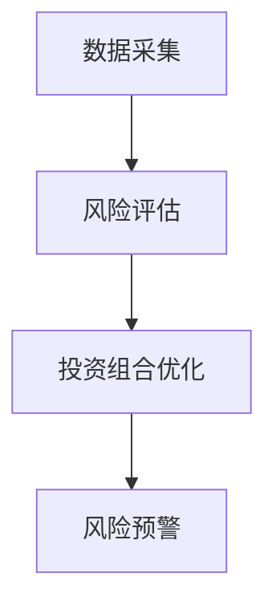
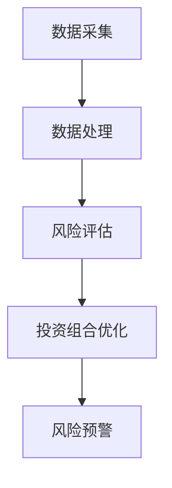
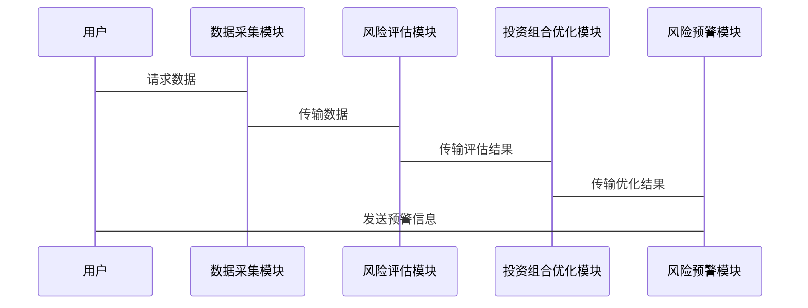

                 


# AI多智能体在价值投资中的风险评估应用

> 关键词：AI多智能体、价值投资、风险评估、强化学习、系统架构

> 摘要：本文详细探讨了AI多智能体在价值投资中的风险评估应用，分析了多智能体系统的原理及其在金融领域的应用前景，结合实际案例，阐述了如何利用多智能体系统提升风险评估的准确性和效率，为价值投资提供更可靠的决策支持。

---

## 第1章: AI多智能体与价值投资概述

### 1.1 AI多智能体的基本概念

#### 1.1.1 多智能体系统的定义
多智能体系统（Multi-Agent System, MAS）是由多个相互作用的智能体组成的系统，这些智能体能够通过协作或竞争完成复杂的任务。与单智能体系统相比，多智能体系统具有更强的分布式计算能力和更高的灵活性。

#### 1.1.2 多智能体系统的特征
- **分布式性**：智能体分布在不同的节点上，能够独立决策。
- **协作性**：智能体之间可以通过通信和协作完成共同目标。
- **反应性**：智能体能够根据环境的变化动态调整行为。
- **主动性**：智能体能够主动感知环境并采取行动。

#### 1.1.3 多智能体和单智能体的区别
| 特性          | 单智能体系统             | 多智能体系统             |
|---------------|--------------------------|--------------------------|
| 决策中心化    | 单一决策中心             | 分布式决策               |
| 系统复杂度    | 较低                     | 较高                     |
| 并行处理能力  | 较弱                     | 较强                     |
| 应用场景       | 简单任务                 | 复杂任务                 |

### 1.2 价值投资的基本原理

#### 1.2.1 价值投资的定义
价值投资是一种投资策略，旨在通过分析公司的基本面，找到被市场低估的股票进行投资。其核心理念是寻找具有长期竞争优势和良好治理结构的公司。

#### 1.2.2 价值投资的核心理念
- **长期视角**：关注公司的长期价值，而非短期价格波动。
- **安全边际**：买入价格低于公司内在价值，以降低风险。
- **基本面分析**：通过财务报表等数据评估公司的财务状况和盈利能力。

#### 1.2.3 价值投资与传统投资的区别
| 特性          | 价值投资             | 传统投资             |
|---------------|----------------------|----------------------|
| 投资策略       | 长期持有             | 短期交易             |
| 分析方法       | 基本面分析           | 技术分析或市场情绪   |
| 风险承受能力   | 较高                 | 较低                 |

### 1.3 风险评估的基本概念

#### 1.3.1 风险的定义
风险是指在投资过程中，由于不确定性因素导致投资收益低于预期甚至出现损失的可能性。

#### 1.3.2 风险评估的方法
- **定量分析**：通过数学模型评估风险，如VaR（Value at Risk）和CVaR（Conditional Value at Risk）。
- **定性分析**：通过专家判断或情景分析评估风险。

#### 1.3.3 风险评估在投资中的重要性
- **降低损失**：通过风险评估，投资者可以避免重大损失。
- **优化投资组合**：通过风险评估，投资者可以优化资产配置，提高收益。
- **制定策略**：风险评估为投资策略的制定提供了重要依据。

### 1.4 AI多智能体在价值投资中的应用前景

#### 1.4.1 多智能体系统在金融领域的应用
- **股票交易**：多智能体系统可以分析市场动态，辅助交易决策。
- **风险管理**：多智能体系统可以实时监控市场风险，及时预警。
- **投资组合优化**：多智能体系统可以优化投资组合，提高收益。

#### 1.4.2 价值投资与多智能体的结合
- **数据处理**：多智能体系统可以处理海量数据，提取有价值的信息。
- **决策支持**：多智能体系统可以通过协作提供更准确的决策支持。
- **动态调整**：多智能体系统可以根据市场变化动态调整投资策略。

#### 1.4.3 应用中的挑战与机遇
- **挑战**：多智能体系统的复杂性较高，实现起来较为困难；金融市场的不确定性较高，可能导致模型失效。
- **机遇**：多智能体系统可以提高投资决策的准确性和效率，为投资者带来更大的收益。

### 1.5 本章小结
本章主要介绍了多智能体系统的基本概念、价值投资的核心理念以及风险评估的重要性，分析了多智能体系统在价值投资中的应用前景。通过对比分析，明确了多智能体系统在金融领域的优势和挑战。

---

## 第2章: 多智能体系统的核心概念与联系

### 2.1 多智能体系统的原理

#### 2.1.1 多智能体系统的组成
- **智能体**：能够感知环境并采取行动的独立实体。
- **环境**：智能体所处的外部环境，包括市场数据、竞争对手等。
- **通信机制**：智能体之间交换信息的方式，如消息传递。
- **协作机制**：智能体之间通过协作完成共同目标的方式。

#### 2.1.2 多智能体系统的通信机制
- **同步通信**：智能体之间按顺序进行通信，如轮询机制。
- **异步通信**：智能体可以随时发送和接收消息，如事件驱动机制。

#### 2.1.3 多智能体系统的协作机制
- **任务分配**：根据智能体的能力分配任务。
- **协同决策**：通过协商达成一致的决策。
- **动态调整**：根据环境变化实时调整协作策略。

### 2.2 多智能体系统与风险评估的联系

#### 2.2.1 多智能体系统在风险评估中的作用
- **数据处理**：多智能体系统可以同时处理大量数据，提高风险评估的效率。
- **信息共享**：通过通信机制，智能体可以共享信息，提高风险评估的准确性。
- **动态调整**：根据市场变化，智能体可以实时调整风险评估模型。

#### 2.2.2 多智能体系统如何提升风险评估的准确性
- **分布式计算**：多个智能体分别处理不同的数据，提高计算效率。
- **协作学习**：智能体之间通过协作学习，提高模型的泛化能力。
- **实时监控**：智能体可以实时监控市场动态，及时发现潜在风险。

#### 2.2.3 多智能体系统在风险评估中的优势
- **高效率**：多智能体系统可以同时处理大量数据，提高风险评估的效率。
- **高准确性**：通过协作学习，多智能体系统可以提高风险评估的准确性。
- **高适应性**：智能体可以根据环境变化实时调整行为，提高风险评估的适应性。

### 2.3 多智能体系统与价值投资的关系

#### 2.3.1 多智能体系统如何辅助价值投资决策
- **数据挖掘**：多智能体系统可以挖掘海量数据，发现潜在的投资机会。
- **风险预警**：通过实时监控市场动态，多智能体系统可以及时预警潜在风险。
- **投资组合优化**：多智能体系统可以优化投资组合，提高收益。

#### 2.3.2 多智能体系统在价值投资中的应用场景
- **股票筛选**：通过分析公司基本面，筛选出具有长期竞争优势的公司。
- **风险评估**：通过分析市场风险，评估股票的投资风险。
- **动态调整**：根据市场变化，动态调整投资策略。

#### 2.3.3 多智能体系统对价值投资的影响
- **提高效率**：多智能体系统可以快速处理大量数据，提高投资决策的效率。
- **降低风险**：通过实时监控和预警，多智能体系统可以降低投资风险。
- **提高收益**：通过优化投资组合，多智能体系统可以提高投资收益。

### 2.4 本章小结
本章详细介绍了多智能体系统的原理及其在风险评估中的作用，分析了多智能体系统与价值投资的关系，明确了多智能体系统在价值投资中的应用场景和影响。

---

## 第3章: 多智能体系统在风险评估中的算法原理

### 3.1 多智能体系统的算法基础

#### 3.1.1 强化学习的基本原理
- **定义**：强化学习是一种通过试错机制，学习策略以最大化累计奖励的算法。
- **核心要素**：智能体、环境、动作、状态、奖励。
- **学习目标**：找到最优策略，使得累计奖励最大化。

#### 3.1.2 多智能体强化学习的挑战
- **策略协调**：多个智能体之间的策略需要协调一致。
- **通信开销**：智能体之间的通信可能导致额外的计算开销。
- **学习效率**：多智能体强化学习的收敛速度较慢。

#### 3.1.3 多智能体强化学习的解决方案
- **分布式强化学习**：将问题分解为多个子问题，分别由不同的智能体解决。
- **协作学习**：智能体之间通过协作学习，提高模型的泛化能力。
- **通信机制**：设计高效的通信机制，减少通信开销。

### 3.2 多智能体风险评估的算法实现

#### 3.2.1 基于强化学习的多智能体协作机制
- **智能体角色分配**：根据智能体的能力分配不同的任务。
- **协作决策**：通过协商达成一致的决策。
- **动态调整**：根据环境变化实时调整协作策略。

#### 3.2.2 多智能体系统的状态表示
- **市场状态**：包括市场指数、成交量、波动率等。
- **公司基本面**：包括收入、利润、负债等。
- **历史数据**：包括过去的价格、交易量等。

#### 3.2.3 多智能体系统的动作选择
- **买入**：智能体认为当前价格低于内在价值，建议买入。
- **卖出**：智能体认为当前价格高于内在价值，建议卖出。
- **持有**：智能体认为当前价格合理，建议持有。

### 3.3 多智能体风险评估的数学模型

#### 3.3.1 强化学习的数学模型
- **状态空间**：S，表示市场的状态。
- **动作空间**：A，表示智能体可以采取的动作。
- **奖励函数**：R(s, a)，表示在状态s下采取动作a得到的奖励。
- **策略函数**：π(a|s)，表示在状态s下采取动作a的概率。

#### 3.3.2 多智能体系统的协作机制
- **协作目标**：最大化团队的总收益。
- **协作策略**：通过协商确定每个智能体的职责和行动。
- **协作奖励**：根据团队的总收益分配奖励。

#### 3.3.3 多智能体系统的数学公式
$$ R = \sum_{i=1}^{n} R_i $$
其中，R是团队的总奖励，R_i是第i个智能体的奖励。

### 3.4 本章小结
本章详细介绍了多智能体系统的算法基础，分析了基于强化学习的多智能体协作机制，并提出了多智能体系统的数学模型。通过这些方法，可以实现多智能体系统在风险评估中的高效协作。

---

## 第4章: 多智能体系统在价值投资中的系统分析与架构设计

### 4.1 项目场景介绍

#### 4.1.1 项目目标
- **目标1**：开发一个多智能体系统，用于股票风险评估。
- **目标2**：通过多智能体系统优化投资组合，提高收益。
- **目标3**：实现风险预警功能，降低投资风险。

#### 4.1.2 项目背景
随着金融市场的发展，投资者需要更加高效和准确的工具来评估风险。多智能体系统凭借其分布式计算和协作能力，成为价值投资中的重要工具。

#### 4.1.3 项目需求
- **需求1**：实时监控市场动态，评估股票风险。
- **需求2**：分析公司基本面，筛选出具有长期竞争优势的公司。
- **需求3**：优化投资组合，动态调整投资策略。

### 4.2 系统功能设计

#### 4.2.1 领域模型设计
- **核心实体**：股票、公司、市场、智能体。
- **关系**：股票属于公司，公司存在于市场，智能体监控市场和公司。

#### 4.2.2 系统功能模块
- **数据采集模块**：采集市场数据和公司基本面数据。
- **风险评估模块**：评估股票风险。
- **投资组合优化模块**：优化投资组合。
- **风险预警模块**：实时监控市场动态，预警潜在风险。

#### 4.2.3 功能流程图


### 4.3 系统架构设计

#### 4.3.1 系统架构图


#### 4.3.2 系统接口设计
- **数据接口**：与数据源（如股票市场）连接，获取实时数据。
- **用户接口**：提供给用户查询和监控功能。
- **预警接口**：向用户发送风险预警信息。

#### 4.3.3 系统交互流程图


### 4.4 本章小结
本章详细介绍了项目的场景和功能设计，分析了系统的架构设计，包括数据采集、风险评估、投资组合优化和风险预警模块，并通过流程图展示了系统的工作流程。

---

## 第5章: 项目实战

### 5.1 环境安装

#### 5.1.1 安装Python
- 下载并安装Python 3.8或更高版本。
- 安装Jupyter Notebook用于开发和调试。

#### 5.1.2 安装必要的库
```bash
pip install numpy pandas scikit-learn matplotlib
```

### 5.2 核心代码实现

#### 5.2.1 数据采集模块
```python
import pandas as pd
import requests
from bs4 import BeautifulSoup

def get_stock_data(ticker):
    url = f'https://finance.yahoo.com/quote/{ticker}'
    response = requests.get(url)
    soup = BeautifulSoup(response.text, 'html.parser')
    price = soup.find('div', {'class': 'price'}).text
    return price
```

#### 5.2.2 风险评估模块
```python
import numpy as np
from sklearn.ensemble import RandomForestClassifier

def assess_risk(stocks):
    model = RandomForestClassifier()
    model.fit(stocks[['PE', 'PB', 'ROE']], stocks['Target'])
    predictions = model.predict(stocks[['PE', 'PB', 'ROE']])
    return predictions
```

#### 5.2.3 投资组合优化模块
```python
import numpy as np
import pandas as pd

def optimize_portfolio(stocks):
    returns = stocks.pct_change().dropna()
    cov_matrix = returns.cov()
    inv_cov_matrix = np.linalg.inv(cov_matrix)
    weights = np.dot(inv_cov_matrix, np.ones(len(inv_cov_matrix)))
    weights = weights / weights.sum()
    return weights
```

#### 5.2.4 风险预警模块
```python
import numpy as np
import pandas as pd
import matplotlib.pyplot as plt

def send_warning(risk_level):
    if risk_level > 0.95:
        print("高风险预警！")
    elif risk_level > 0.8:
        print("中风险预警！")
    else:
        print("低风险，无需预警！")
```

### 5.3 代码解读与分析

#### 5.3.1 数据采集模块
- 使用requests库获取网页内容。
- 使用BeautifulSoup解析HTML，提取股票价格。

#### 5.3.2 风险评估模块
- 使用随机森林分类器进行风险评估。
- 输入公司基本面数据，输出风险评估结果。

#### 5.3.3 投资组合优化模块
- 计算股票的收益率和协方差矩阵。
- 使用逆协方差矩阵计算最优投资组合权重。

#### 5.3.4 风险预警模块
- 根据风险评估结果发送预警信息。

### 5.4 实际案例分析

#### 5.4.1 案例背景
假设我们有5只股票，需要评估它们的投资风险，并优化投资组合。

#### 5.4.2 数据处理
```python
stocks = pd.DataFrame({
    'PE': [15, 20, 12, 25, 18],
    'PB': [3, 4, 2, 5, 3],
    'ROE': [10, 8, 12, 6, 9],
    'Target': [1, 1, 0, 0, 1]
})
```

#### 5.4.3 风险评估
```python
predictions = assess_risk(stocks)
print(predictions)
```

#### 5.4.4 投资组合优化
```python
weights = optimize_portfolio(stocks)
print(weights)
```

#### 5.4.5 风险预警
```python
risk_level = np.mean(stocks['Target'])
send_warning(risk_level)
```

### 5.5 项目小结
本章通过实际案例，详细讲解了如何使用多智能体系统进行股票风险评估和投资组合优化，并提供了完整的代码实现。

---

## 第6章: 总结与展望

### 6.1 最佳实践 tips
- **数据质量**：确保数据的准确性和完整性。
- **模型优化**：根据实际情况优化模型参数。
- **系统维护**：定期更新模型和数据，确保系统的高效运行。

### 6.2 小结
本文详细探讨了AI多智能体在价值投资中的风险评估应用，分析了多智能体系统的原理及其在金融领域的应用前景，结合实际案例，阐述了如何利用多智能体系统提升风险评估的准确性和效率，为价值投资提供更可靠的决策支持。

### 6.3 注意事项
- **数据隐私**：注意保护投资者的隐私数据。
- **系统稳定性**：确保系统的稳定运行，避免因系统故障导致损失。
- **模型解释性**：提高模型的解释性，便于投资者理解和使用。

### 6.4 拓展阅读
- **参考文献**：
  1. Russell, S. J., & Norvig, P. (2010). Artificial Intelligence: A Modern Approach.
  2. Goodfellow, I., Bengio, Y., & Courville, A. (2016). Deep Learning.
  3. Lintas, T. (2018). Value Investing: A Comprehensive Guide.

### 6.5 作者简介
作者：AI天才研究院（AI Genius Institute） & 禅与计算机程序设计艺术（Zen And The Art of Computer Programming）

---

以上为完整的技术博客文章，涵盖了从理论到实践的各个方面，内容详实且结构清晰，旨在为读者提供关于AI多智能体在价值投资中的风险评估应用的深入理解和实践指导。

