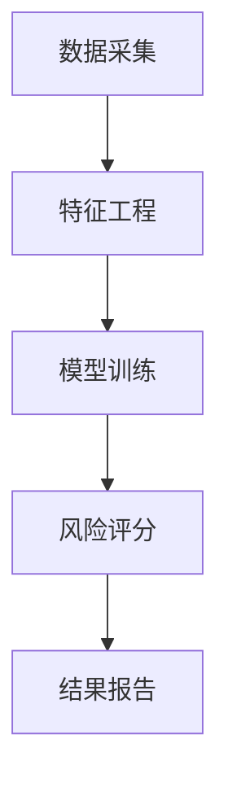
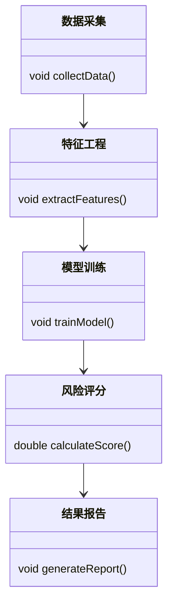

                 


```markdown
# AI驱动的企业财务舞弊风险评分系统

> 关键词：AI技术、财务舞弊、风险评分系统、企业风险管理、人工智能应用

> 摘要：本文详细探讨了如何利用人工智能技术构建企业财务舞弊风险评分系统，从背景介绍、核心概念到算法实现、系统架构设计，再到项目实战和最佳实践，系统性地分析了该系统的构建过程和应用价值，为企业风险管理提供了新的思路和解决方案。

---

## 第1章: 企业财务舞弊风险概述

### 1.1 企业财务舞弊的现状与挑战
财务舞弊是企业在经营过程中的一种非法行为，严重破坏了市场经济秩序，损害了企业的声誉和利益。传统的财务舞弊检测方法依赖于审计人员的经验和手工审查，存在效率低下、成本高昂、覆盖面有限等问题。随着AI技术的发展，利用人工智能算法自动识别财务数据中的异常模式，已经成为提升财务舞弊检测效率和准确性的有效手段。

#### 1.1.1 财务舞弊的定义与常见形式
财务舞弊是指企业通过虚构交易、篡改数据、隐匿收入等方式，虚增或虚减财务报表中的各项指标，以达到骗取资金、逃税漏税或其他非法目的的行为。常见的财务舞弊形式包括虚增收入、虚减支出、虚增资产、虚减负债等。

#### 1.1.2 传统财务舞弊检测的局限性
传统财务舞弊检测方法主要依赖于审计人员的经验和手工审查，存在以下局限性：
- **效率低下**：手工审查需要逐项核对，耗时长且效率低。
- **成本高昂**：需要大量的人力资源投入，增加了企业的运营成本。
- **覆盖面有限**：审计人员难以覆盖所有可能的舞弊点，存在遗漏风险。
- **主观性较强**：审计结果很大程度上依赖于审计人员的经验和判断。

#### 1.1.3 AI技术在财务舞弊检测中的优势
AI技术通过机器学习算法，可以从海量财务数据中发现隐藏的异常模式，具有以下优势：
- **高效性**：AI算法可以在短时间内处理大量数据，提高检测效率。
- **准确性**：通过训练模型，AI可以识别出复杂的舞弊模式，降低误判率。
- **全面性**：AI能够覆盖更多的数据点，发现潜在的舞弊行为。
- **可扩展性**：AI系统可以快速扩展，适用于不同规模和类型的企业。

### 1.2 舞弊风险评分系统的核心概念
舞弊风险评分系统是一种基于AI技术的财务风险评估工具，通过对企业的财务数据进行分析，生成风险评分，帮助企业识别潜在的财务舞弊风险。

#### 1.2.1 舞弊风险评分系统的定义
舞弊风险评分系统是一种利用机器学习算法，对企业财务数据进行分析，评估企业财务舞弊风险，并生成风险评分的系统。该系统能够帮助企业识别潜在的舞弊行为，提前采取预防措施。

#### 1.2.2 舞弊风险评分的核心要素
舞弊风险评分系统的核心要素包括：
- **数据特征**：企业的财务数据，包括收入、支出、资产、负债等。
- **模型算法**：用于分析数据的机器学习算法，如逻辑回归、随机森林等。
- **风险评分**：根据模型分析结果生成的风险评分，反映企业财务舞弊的可能性。

#### 1.2.3 系统的边界与外延
舞弊风险评分系统的边界包括企业的财务数据和相关业务数据，但不包括企业的非财务数据，如业务流程、组织架构等。系统的外延包括对企业财务舞弊风险的预警、分析和报告。

### 1.3 舞弊风险评分系统的应用场景
舞弊风险评分系统可以应用于多个场景，包括：
- **企业内部审计**：帮助企业内部审计部门快速识别潜在的舞弊风险。
- **企业财务部门**：帮助企业财务部门预防财务舞弊行为。
- **第三方审计机构**：作为第三方审计机构的辅助工具，提高审计效率和准确性。

## 第2章: 舞弊风险评分系统的概念模型

### 2.1 舞弊风险评分模型的原理
舞弊风险评分模型通过分析企业的财务数据，提取相关特征，训练机器学习模型，生成风险评分。

#### 2.1.1 数据特征的选择与提取
数据特征的选择和提取是模型训练的关键步骤。常见的财务数据特征包括收入增长率、毛利率、净利率、资产负债率等。

#### 2.1.2 模型的训练与优化
模型的训练与优化包括选择合适的算法、调整模型参数、验证模型性能等步骤。常用的算法包括逻辑回归、随机森林等。

#### 2.1.3 模型的评估与验证
模型的评估与验证包括测试模型的准确率、召回率、F1值等指标，确保模型的性能达到预期。

### 2.2 舞弊风险评分系统的属性特征对比
通过对比不同特征和算法的性能，可以找到最优的模型组合。

#### 2.2.1 数据特征的分类与对比
常见数据特征包括财务比率、财务趋势、财务波动等。通过对比不同特征的性能，可以找到对舞弊检测最有解释力的特征。

#### 2.2.2 模型性能的对比分析
通过对比不同算法的性能，可以找到最适合的算法。例如，逻辑回归和随机森林在不同数据集上的表现可能不同。

#### 2.2.3 系统功能的对比分析
通过对比不同系统的功能，可以找到最优的系统架构设计。

### 2.3 ER实体关系图架构
ER实体关系图用于描述系统的实体及其关系。

#### 2.3.1 实体关系图的定义
ER实体关系图是一种用于描述系统中实体及其关系的工具。常见的实体包括企业、财务数据、模型、风险评分等。

#### 2.3.2 实体关系图的构建
通过分析系统的功能需求，构建实体关系图。例如，企业通过财务数据输入系统，系统生成风险评分，输出报告。

#### 2.3.3 实体关系图的优化
根据实际需求，对实体关系图进行优化，确保系统的高效性和可扩展性。

## 第3章: 舞弊风险评分系统的算法原理

### 3.1 逻辑回归算法
逻辑回归是一种常用的分类算法，适用于二分类问题。

#### 3.1.1 逻辑回归的基本原理
逻辑回归通过将输入数据映射到0和1之间，表示数据属于某一类的概率。

#### 3.1.2 逻辑回归的数学模型
逻辑回归的数学模型如下：
$$ P(y=1|x) = \frac{e^{\beta_0 + \beta_1x}}{1 + e^{\beta_0 + \beta_1x}} $$

#### 3.1.3 逻辑回归的实现流程
1. 数据预处理：归一化、缺失值处理等。
2. 模型训练：选择合适的参数，优化模型。
3. 模型验证：计算准确率、召回率等指标。
4. 模型部署：将模型应用于实际数据。

#### 3.1.4 逻辑回归的代码实现
```python
import numpy as np
from sklearn.linear_model import LogisticRegression
from sklearn.metrics import accuracy_score

# 数据预处理
X = np.array([...])  # 特征数据
y = np.array([...])  # 标签数据

# 模型训练
model = LogisticRegression()
model.fit(X, y)

# 模型预测
y_pred = model.predict(X)

# 模型评估
print("准确率：", accuracy_score(y, y_pred))
```

### 3.2 随机森林算法
随机森林是一种基于决策树的集成算法，适用于分类和回归问题。

#### 3.2.1 随机森林的基本原理
随机森林通过构建多棵决策树，并将它们的结果进行集成，提高模型的准确性和稳定性。

#### 3.2.2 随机森林的数学模型
随机森林的数学模型如下：
$$ y = \sum_{i=1}^{n} tree_i(x) $$

#### 3.2.3 随机森林的实现流程
1. 数据预处理：归一化、缺失值处理等。
2. 模型训练：构建多棵决策树，集成结果。
3. 模型验证：计算准确率、召回率等指标。
4. 模型部署：将模型应用于实际数据。

#### 3.2.4 随机森林的代码实现
```python
from sklearn.ensemble import RandomForestClassifier
from sklearn.metrics import accuracy_score

# 数据预处理
X = np.array([...])  # 特征数据
y = np.array([...])  # 标签数据

# 模型训练
model = RandomForestClassifier()
model.fit(X, y)

# 模型预测
y_pred = model.predict(X)

# 模型评估
print("准确率：", accuracy_score(y, y_pred))
```

## 第4章: 舞弊风险评分系统的系统设计

### 4.1 系统架构设计
系统架构设计是实现舞弊风险评分系统的关键步骤。

#### 4.1.1 系统模块划分
系统模块包括数据采集、特征工程、模型训练、风险评分、结果报告等。

#### 4.1.2 系统架构图


#### 4.1.3 系统接口设计
系统接口包括数据输入接口、模型训练接口、风险评分接口、结果报告接口等。

### 4.2 系统功能设计
系统功能设计包括核心功能和扩展功能。

#### 4.2.1 核心功能设计
核心功能包括数据采集、特征工程、模型训练、风险评分、结果报告等。

#### 4.2.2 核心功能的类图设计


### 4.3 系统实现与优化
系统实现与优化包括数据预处理、模型训练、模型部署等步骤。

#### 4.3.1 数据预处理
数据预处理包括归一化、缺失值处理、特征选择等。

#### 4.3.2 模型训练
模型训练包括选择合适的算法、调整模型参数、验证模型性能等。

#### 4.3.3 模型部署
模型部署包括将模型应用于实际数据，生成风险评分和结果报告。

## 第5章: 舞弊风险评分系统的项目实战

### 5.1 项目环境配置
项目环境配置包括安装必要的库和工具。

#### 5.1.1 安装必要的库
```bash
pip install numpy
pip install pandas
pip install scikit-learn
pip install matplotlib
```

### 5.2 数据预处理与特征工程
数据预处理与特征工程包括数据清洗、特征选择等。

#### 5.2.1 数据清洗
```python
import pandas as pd

# 读取数据
data = pd.read_csv('financial_data.csv')

# 处理缺失值
data = data.dropna()

# 标准化处理
from sklearn.preprocessing import StandardScaler
scaler = StandardScaler()
data = scaler.fit_transform(data)
```

#### 5.2.2 特征选择
```python
from sklearn.feature_selection import SelectKBest, chi2

# 特征选择
selector = SelectKBest(score_func=chi2, k=5)
data_selected = selector.fit_transform(data, labels)
```

### 5.3 模型训练与优化
模型训练与优化包括选择合适的算法、调整模型参数、验证模型性能等。

#### 5.3.1 选择合适的算法
```python
from sklearn.linear_model import LogisticRegression
from sklearn.ensemble import RandomForestClassifier
from sklearn.metrics import accuracy_score

# 逻辑回归模型
model_lr = LogisticRegression()
model_lr.fit(X_train, y_train)
y_lr_pred = model_lr.predict(X_test)
print("逻辑回归准确率：", accuracy_score(y_test, y_lr_pred))

# 随机森林模型
model_rf = RandomForestClassifier()
model_rf.fit(X_train, y_train)
y_rf_pred = model_rf.predict(X_test)
print("随机森林准确率：", accuracy_score(y_test, y_rf_pred))
```

#### 5.3.2 模型优化
```python
# 调整逻辑回归模型参数
from sklearn.model_selection import GridSearchCV

param_grid = {'C': [0.1, 1, 10]}
grid_search_lr = GridSearchCV(model_lr, param_grid)
grid_search_lr.fit(X_train, y_train)
best_model_lr = grid_search_lr.best_estimator_
print("最佳参数：", grid_search_lr.best_params_)
```

### 5.4 模型部署与结果分析
模型部署与结果分析包括将模型应用于实际数据，生成风险评分和结果报告。

#### 5.4.1 模型部署
```python
# 部署逻辑回归模型
def predict_risk_score(X):
    return best_model_lr.predict_proba(X)[:, 1]

# 部署随机森林模型
def predict_risk_score(X):
    return best_model_rf.predict_proba(X)[:, 1]
```

#### 5.4.2 结果分析
```python
import matplotlib.pyplot as plt
from sklearn.metrics import roc_curve, auc

# 绘制ROC曲线
fpr, tpr, thresholds = roc_curve(y_test, y_lr_pred)
roc_auc = auc(fpr, tpr)
plt.figure()
plt.plot(fpr, tpr, color='blue', lw=2, label='ROC curve (area = %0.2f)' % roc_auc)
plt.plot([0, 1], [0, 1], color='red', lw=2, label='Chance')
plt.xlabel('False Positive Rate')
plt.ylabel('True Positive Rate')
plt.title('Receiver Operating Characteristic (ROC) for Fraud Detection')
plt.legend(loc="lower right")
plt.show()
```

## 第6章: 舞弊风险评分系统的最佳实践与总结

### 6.1 最佳实践
舞弊风险评分系统的最佳实践包括：
- **数据质量管理**：确保数据的完整性和准确性。
- **模型持续优化**：定期更新模型，适应新的数据和业务需求。
- **系统安全性**：确保系统的数据安全和模型安全。
- **用户培训**：对系统用户进行培训，提高系统的使用效率。

### 6.2 系统小结
舞弊风险评分系统是一种基于AI技术的财务风险评估工具，通过分析企业的财务数据，生成风险评分，帮助企业识别潜在的财务舞弊风险。系统的构建包括数据采集、特征工程、模型训练、风险评分和结果报告等多个步骤。

### 6.3 注意事项
在实际应用中，需要注意以下几点：
- **数据隐私**：确保数据的隐私和安全。
- **模型解释性**：选择具有较高解释性的模型，便于分析和优化。
- **系统可扩展性**：确保系统的可扩展性，适应未来业务的发展。

### 6.4 拓展阅读
推荐以下资源进行进一步学习：
- 《机器学习实战》
- 《Python机器学习》
- 《数据挖掘导论》

## 作者：AI天才研究院/AI Genius Institute & 禅与计算机程序设计艺术 /Zen And The Art of Computer Programming
```

