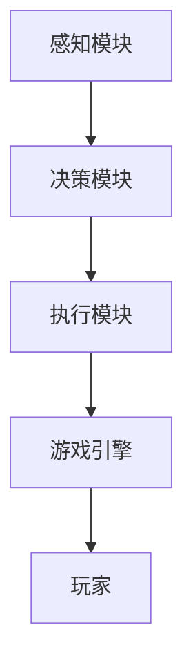

                 


# 实现基于AI Agent的智能游戏NPC

## 关键词：AI Agent, 智能NPC, 游戏开发, 路径规划, 行为决策, 人工智能

## 摘要：本文详细探讨了如何通过AI Agent实现智能游戏NPC的开发，从背景介绍到系统设计，从算法实现到项目实战，全面分析了智能NPC的实现过程。文章结合理论与实践，通过详细的算法推导和系统设计，展示了如何让NPC具备智能行为，提升游戏体验。

---

# 第1章: 基于AI Agent的智能NPC背景介绍

## 1.1 问题背景

### 1.1.1 游戏NPC的传统实现方式
传统的游戏NPC（非玩家角色）通常基于脚本和预设行为进行实现。这些NPC的行为是静态的，无法根据玩家的行为或环境变化做出动态反应，导致游戏体验单一，缺乏深度。

### 1.1.2 AI Agent在游戏中的潜力
AI Agent（人工智能代理）是一种能够感知环境、自主决策并采取行动的智能体。在游戏开发中，AI Agent可以赋予NPC动态、智能的行为模式，从而提升游戏的互动性和趣味性。

### 1.1.3 游戏NPC智能化的必要性
随着游戏行业的发展，玩家对游戏体验的要求越来越高。传统的静态NPC已经无法满足现代游戏的需求，引入AI Agent实现智能NPC成为必然趋势。

## 1.2 问题描述

### 1.2.1 传统NPC的局限性
- 行为单一：NPC的行为基于脚本，缺乏灵活性。
- 互动性差：NPC无法根据玩家的实际行为做出实时反应。
- 体验不足：静态的NPC降低了游戏的趣味性和沉浸感。

### 1.2.2 现代游戏对智能NPC的需求
- 动态行为：NPC能够根据环境和玩家行为调整自己的行动。
- 自主决策：NPC具备一定的决策能力，能够自主选择最优行为。
- 互动性增强：NPC与玩家的互动更加自然，能够提升玩家的沉浸感。

### 1.2.3 智能NPC的核心目标与边界
- 核心目标：通过AI Agent实现NPC的动态行为和智能决策。
- 边界：智能NPC的行为必须符合游戏规则，同时避免过度复杂化。

## 1.3 问题解决思路

### 1.3.1 引入AI Agent的可行性分析
- 技术可行性：现代AI算法（如路径规划、行为树等）已经成熟，可以应用于游戏开发。
- 经济可行性：AI Agent的实现成本相对较低，适合大规模应用。

### 1.3.2 基于AI Agent的智能NPC实现方案
- 系统设计：构建一个基于AI Agent的NPC系统，包括感知、决策、执行三个模块。
- 实现步骤：从需求分析到系统设计，再到算法实现和测试优化。

### 1.3.3 解决方案的优缺点对比
- 优点：提升NPC的智能性和互动性，增强游戏体验。
- 缺点：实现复杂度较高，需要额外的开发资源。

## 1.4 智能NPC的概念结构与核心要素

### 1.4.1 智能NPC的定义与组成
智能NPC是一种基于AI Agent的智能体，能够感知环境、自主决策并采取行动。

### 1.4.2 核心要素的详细描述
- 感知模块：感知环境和玩家行为。
- 决策模块：基于感知信息做出决策。
- 执行模块：根据决策执行具体动作。

### 1.4.3 智能NPC的边界与外延
智能NPC的行为必须符合游戏规则，同时避免过度复杂化。

## 1.5 本章小结
本章介绍了基于AI Agent的智能NPC的背景、需求和实现方案，为后续的系统设计和算法实现奠定了基础。

---

# 第2章: AI Agent与智能NPC的核心概念与联系

## 2.1 AI Agent的基本原理

### 2.1.1 AI Agent的定义与分类
AI Agent是一种能够感知环境并采取行动的智能体，根据智能水平可以分为简单Agent和复杂Agent。

### 2.1.2 基于智能NPC的AI Agent类型
- 行为树Agent：通过树状结构进行决策。
- 路径规划Agent：基于路径规划算法进行移动。

### 2.1.3 不同类型AI Agent的特点对比
| 类型       | 特点                           |
|------------|--------------------------------|
| 行为树Agent | 基于树状结构进行决策，适合复杂任务。 |
| 路径规划Agent | 基于路径规划算法，适合移动任务。 |

## 2.2 智能NPC与AI Agent的关系

### 2.2.1 智能NPC作为AI Agent的应用场景
智能NPC通过AI Agent实现动态行为和智能决策。

### 2.2.2 AI Agent在智能NPC中的角色与功能
AI Agent作为智能NPC的核心，负责感知、决策和执行。

### 2.2.3 智能NPC与AI Agent的协同工作原理
智能NPC通过AI Agent实现感知、决策和执行，从而实现智能行为。

## 2.3 智能NPC的核心属性与特征

### 2.3.1 智能NPC的核心属性
- 感知能力：能够感知环境和玩家行为。
- 决策能力：基于感知信息做出决策。
- 执行能力：根据决策执行具体动作。

### 2.3.2 不同智能NPC的特征对比
| 类型       | 特征                           |
|------------|--------------------------------|
| 简单NPC     | 行为基于脚本，缺乏灵活性。       |
| 智能NPC     | 行为基于AI Agent，具备动态性。   |

### 2.3.3 智能NPC与传统NPC的属性差异
| 属性       | 传统NPC                         | 智能NPC                           |
|------------|--------------------------------|------------------------------------|
| 行为        | 静态、基于脚本                   | 动态、基于AI Agent                 |
| 互动性      | 单一、缺乏互动                   | 自然、增强互动                     |
| 智能性      | 无                              | 具备一定的智能性                   |

## 2.4 ER实体关系图
```mermaid
er
actor: Player
agent: AI Agent
npc: NPC Entity
rules: Game Rules
interaction: Interaction

actor -|> interaction: 发起互动
interaction -|> agent: 处理互动
agent -|> npc: 控制NPC行为
npc -|> rules: 遵循游戏规则
```

## 2.5 本章小结
本章详细介绍了AI Agent的基本原理，以及智能NPC的核心属性和特征，为后续的算法实现奠定了基础。

---

# 第3章: 基于AI Agent的智能NPC算法原理

## 3.1 算法原理概述

### 3.1.1 路径规划算法
路径规划是智能NPC实现移动行为的核心算法，常用A*算法。

### 3.1.2 行为决策算法
行为决策是智能NPC实现自主决策的核心算法，常用行为树算法。

## 3.2 路径规划算法实现

### 3.2.1 A*算法原理
A*算法是一种基于启发式搜索的路径规划算法，公式为：
$$ f(n) = g(n) + h(n) $$
其中，$g(n)$ 表示从起点到当前节点的已知成本，$h(n)$ 表示从当前节点到目标节点的估计成本。

### 3.2.2 A*算法实现
```python
def a_star(start, goal):
    open_set = {start}
    came_from = {}
    g_score = {start: 0}
    f_score = {start: heuristic(start, goal)}
    
    while open_set:
        current = pop the node with the lowest f_score from open_set
        
        if current == goal:
            break
        
        neighbors = get_neighbors(current)
        for neighbor in neighbors:
            tentative_g_score = g_score[current] + cost(current, neighbor)
            
            if neighbor not in g_score or tentative_g_score < g_score[neighbor]:
                came_from[neighbor] = current
                g_score[neighbor] = tentative_g_score
                f_score[neighbor] = g_score[neighbor] + heuristic(neighbor, goal)
                add neighbor to open_set
    return reconstruct_path(start, goal, came_from)
```

### 3.2.3 路径规划算法的优化
- 启发式函数的选择：选择合适的启发式函数可以提高算法效率。
- 开放空间的处理：优化地图表示，减少计算量。

## 3.3 行为决策算法实现

### 3.3.1 行为树算法原理
行为树是一种基于树状结构的决策算法，用于实现复杂任务的决策。

### 3.3.2 行为树实现
```python
class BehaviorTree:
    def __init__(self, root):
        self.root = root
        
    def execute(self):
        return self.root.execute(self)
```

### 3.3.3 行为树的优化
- 节点的优化：减少树的深度，提高执行效率。
- 权重的调整：根据任务需求调整节点的权重。

## 3.4 本章小结
本章详细介绍了路径规划和行为决策算法的实现，为后续的系统设计奠定了基础。

---

# 第4章: 智能NPC系统分析与架构设计

## 4.1 系统分析

### 4.1.1 系统需求
- 智能NPC需要具备感知、决策和执行功能。
- 系统需要支持多种游戏规则和场景。

### 4.1.2 功能需求
- 感知模块：获取环境和玩家信息。
- 决策模块：基于感知信息做出决策。
- 执行模块：根据决策执行具体动作。

## 4.2 系统架构设计

### 4.2.1 系统功能设计
- 感知模块：负责获取环境和玩家信息。
- 决策模块：基于感知信息做出决策。
- 执行模块：根据决策执行具体动作。

### 4.2.2 系统架构图


### 4.2.3 系统交互设计
- 感知模块与玩家交互，获取玩家信息。
- 决策模块与感知模块交互，做出决策。
- 执行模块与游戏引擎交互，执行具体动作。

## 4.3 本章小结
本章详细介绍了智能NPC系统的架构设计，为后续的系统实现奠定了基础。

---

# 第5章: 智能NPC项目实战

## 5.1 环境安装

### 5.1.1 开发环境选择
- 开发语言：Python
- 游戏引擎：Unity或Unreal Engine
- AI框架：使用Python的AI库，如pygame或pyglet。

### 5.1.2 安装步骤
1. 安装Python和所需的AI库。
2. 安装游戏引擎。
3. 配置开发环境。

## 5.2 系统核心实现

### 5.2.1 感知模块实现
```python
class Perception:
    def __init__(self, game_world):
        self.game_world = game_world
        
    def get_player_info(self):
        # 获取玩家信息
        pass
```

### 5.2.2 决策模块实现
```python
class Decision:
    def __init__(self, perception):
        self.perception = perception
        
    def make_decision(self):
        # 基于感知信息做出决策
        pass
```

### 5.2.3 执行模块实现
```python
class Execution:
    def __init__(self, decision):
        self.decision = decision
        
    def execute_action(self):
        # 根据决策执行具体动作
        pass
```

## 5.3 代码实现与解读

### 5.3.1 感知模块实现
```python
def get_player_info(game_world):
    player_pos = game_world.get_player_position()
    return player_pos
```

### 5.3.2 决策模块实现
```python
def make_decision(perception):
    player_pos = get_player_info(perception.game_world)
    if player_pos.x > self.position.x:
        return "move_right"
    else:
        return "move_left"
```

### 5.3.3 执行模块实现
```python
def execute_action(decision):
    if decision == "move_right":
        self.position.x += 1
    elif decision == "move_left":
        self.position.x -= 1
```

## 5.4 实际案例分析与代码解读

### 5.4.1 案例分析
一个简单的追捕玩家的智能NPC实现。

### 5.4.2 代码解读
- 感知模块获取玩家位置。
- 决策模块根据玩家位置做出决策。
- 执行模块根据决策执行移动动作。

## 5.5 本章小结
本章通过实际案例展示了智能NPC的实现过程，从环境安装到代码实现，再到案例分析，帮助读者全面理解智能NPC的实现。

---

# 第6章: 总结与展望

## 6.1 总结
本文详细探讨了基于AI Agent的智能NPC的实现过程，从背景介绍到系统设计，从算法实现到项目实战，全面分析了智能NPC的实现过程。

## 6.2 展望
随着AI技术的不断发展，智能NPC的实现将更加复杂和智能化，未来的研究方向包括更复杂的决策算法和更高效的路径规划算法。

---

# 作者：AI天才研究院/AI Genius Institute & 禅与计算机程序设计艺术 /Zen And The Art of Computer Programming

---

本文通过详细的理论分析和实际案例，展示了如何通过AI Agent实现智能NPC的开发。从算法原理到系统设计，从代码实现到项目实战，全面解析了智能NPC的实现过程。希望本文能够为游戏开发者提供有价值的参考和启发。

