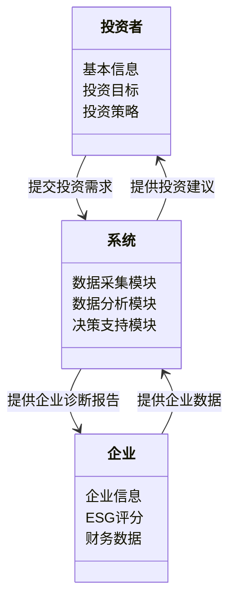
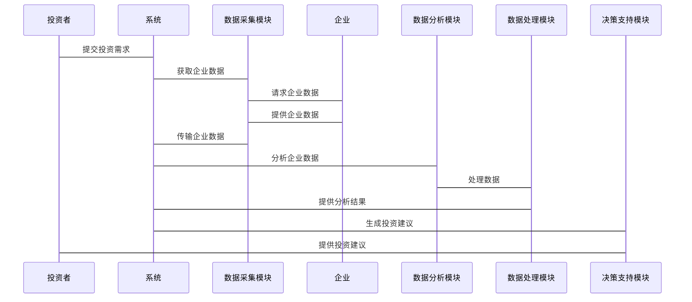

                 


# 巴菲特-芒格的可持续发展投资：长期价值创造

> 关键词：巴菲特，芒格，可持续发展投资，长期价值，价值投资，ESG，多元思维模型

> 摘要：本文深入探讨了巴菲特和芒格的投资理念与可持续发展投资的结合，分析了长期价值创造的核心要素，结合技术分析方法，提供了从理论到实践的系统化解决方案。

---

## 第一部分: 巴菲特与芒格投资理念的可持续发展视角

### 第1章: 巴菲特与芒格投资理念概述

#### 1.1 巴菲特与芒格投资理念的核心思想

##### 1.1.1 巴菲特的价值投资理论

- 巴菲特的价值投资理论强调寻找具有持续竞争优势的企业，关注企业的内在价值。
- 内在价值公式：
  $$ V = \frac{CF}{r - g} $$
  其中，$CF$ 是自由现金流，$r$ 是折现率，$g$ 是增长率。

##### 1.1.2 芒格的多元思维模型

- 芒格强调通过跨学科思维，构建多元知识框架，以全面评估企业的长期价值。
- 多元思维模型包括经济学、心理学、社会学等多个领域的知识。

##### 1.1.3 两人投资理念的结合与互补

- 巴菲特的价值投资理论注重企业内在价值的计算，而芒格的多元思维模型则提供了全面评估企业的视角。
- 两者的结合使投资决策更加全面和科学。

#### 1.2 可持续发展投资的背景与定义

##### 1.2.1 可持续发展投资的起源

- 可持续发展投资的概念起源于20世纪90年代，随着环境、社会和治理（ESG）因素的兴起而逐渐发展。
- ESG因素包括环境影响、社会责任和公司治理等方面。

##### 1.2.2 可持续发展投资的定义与特征

- 可持续发展投资是一种关注企业在创造经济价值的同时，对社会和环境产生积极影响的投资方式。
- 其特征包括长期性、系统性和综合性。

##### 1.2.3 可持续发展投资与传统投资的区别

- 传统投资主要关注企业的财务表现，而可持续发展投资则综合考虑企业的经济、社会和环境表现。
- 传统投资注重短期收益，而可持续发展投资注重长期价值的创造。

#### 1.3 巴菲特与芒格投资理念与可持续发展的联系

##### 1.3.1 巴菲特价值投资中的长期视角

- 巴菲特的价值投资注重企业的长期竞争优势和内在价值，与可持续发展投资的长期视角一致。
- 企业内在价值的计算公式：
  $$ V = \frac{CF}{r - g} $$
  其中，$CF$ 是自由现金流，$r$ 是折现率，$g$ 是增长率。

##### 1.3.2 芒格多元思维模型与可持续发展的关联

- 芒格的多元思维模型帮助投资者全面评估企业的社会和环境影响，从而更好地实现可持续发展投资的目标。
- 通过多元思维模型，投资者可以更好地识别企业的社会价值和环境责任。

##### 1.3.3 可持续发展投资对长期价值创造的推动作用

- 可持续发展投资通过关注企业的长期价值，推动企业实现经济效益与社会价值的统一。
- 长期价值创造的核心要素包括企业的内在价值、社会价值和环境价值。

### 第2章: 可持续发展投资的核心概念与框架

#### 2.1 可持续发展投资的三重底线

##### 2.1.1 经济绩效

- 经济绩效是企业在经济活动中创造的经济价值。
- 包括企业的盈利能力、成长性和财务健康状况。

##### 2.1.2 社会责任

- 社会责任是指企业在社会活动中对社会的贡献和责任。
- 包括企业对员工、客户和社会公益事业的责任。

##### 2.1.3 环境影响

- 环境影响是指企业在生产过程中对环境造成的污染和资源消耗。
- 包括企业的碳排放、能源消耗和环保措施。

#### 2.2 巴菲特与芒格投资理念中的可持续发展要素

##### 2.2.1 企业治理与长期价值

- 企业治理是可持续发展投资的重要组成部分，包括企业的组织结构、管理团队和公司治理。
- 良好的企业治理可以提升企业的长期价值，降低投资风险。

##### 2.2.2 社会责任与企业声誉

- 社会责任是企业实现可持续发展的重要因素，良好的社会责任可以提升企业的声誉和品牌价值。
- 企业声誉是投资者评估企业长期价值的重要指标之一。

##### 2.2.3 环境保护与企业竞争力

- 环境保护是企业实现可持续发展的重要方面，良好的环境表现可以提升企业的竞争力。
- 环境保护包括企业的环保措施、资源节约和绿色技术创新。

#### 2.3 可持续发展投资的评价体系

##### 2.3.1 ESG指标体系

- ESG指标体系是衡量企业可持续发展的重要工具，包括环境、社会和治理三个维度。
- ESG指标体系的评价方法：
  1. 环境（E）：包括碳排放、能源消耗和环保措施。
  2. 社会（S）：包括员工权益、社会责任和社区贡献。
  3. 治理（G）：包括公司治理、董事会结构和内部控制。

##### 2.3.2 可持续发展评级方法

- 可持续发展评级方法是通过对企业在可持续发展方面的表现进行评级，帮助投资者做出投资决策。
- 常用的可持续发展评级方法包括：
  1. 标准普尔的ESG评级
  2. 摩根士丹利资本国际（MSCI）的ESG评级
  3. 全球环境标准委员会（GECS）的ESG评级

##### 2.3.3 巴菲特与芒格投资理念对ESG的启示

- 巴菲特和芒格的投资理念强调企业的长期价值和内在价值，为ESG投资提供了重要的理论支持。
- 巴菲特的内在价值公式和芒格的多元思维模型可以作为ESG投资的重要工具。

### 第3章: 巴菲特与芒格投资理念的数学模型与算法

#### 3.1 巴菲特价值投资的数学模型

##### 3.1.1 股票内在价值计算公式

- 股票内在价值计算公式：
  $$ V = \frac{CF}{r - g} $$
  其中，$CF$ 是自由现金流，$r$ 是折现率，$g$ 是增长率。

##### 3.1.2 股东权益价值评估方法

- 股东权益价值评估方法包括：
  1. 现金流量折现法（DCF）
  2. 市盈率法
  3. 市净率法

##### 3.1.3 投资组合优化的数学模型

- 投资组合优化的数学模型包括：
  1. 均值-方差模型
  2. Markowitz有效前沿
  3. 风险调整回报模型

#### 3.2 芒格多元思维模型的算法实现

##### 3.2.1 多元思维模型的构建步骤

- 多元思维模型的构建步骤包括：
  1. 确定投资目标
  2. 识别关键因素
  3. 构建知识框架
  4. 持续优化和更新

##### 3.2.2 多元思维模型的权重分配方法

- 多元思维模型的权重分配方法包括：
  1. 等权重分配
  2. 根据因素重要性分配权重
  3. 动态调整权重

##### 3.2.3 多元思维模型的动态调整算法

- 多元思维模型的动态调整算法包括：
  1. 定期评估模型效果
  2. 根据市场变化调整模型
  3. 更新模型的权重和参数

#### 3.3 可持续发展投资的量化分析

##### 3.3.1 ESG评分的量化方法

- ESG评分的量化方法包括：
  1. 标准化评分
  2. 加权平均法
  3. 聚类分析法

##### 3.3.2 可持续发展投资组合优化算法

- 可持续发展投资组合优化算法包括：
  1. 基于ESG评分的投资组合优化
  2. 基于多元思维模型的投资组合优化
  3. 基于动态调整的可持续发展投资组合优化

##### 3.3.3 ESG与传统财务指标的结合

- ESG与传统财务指标的结合方法包括：
  1. 将ESG评分纳入投资组合优化模型
  2. 将ESG指标与传统财务指标结合进行投资决策
  3. 建立综合指标体系进行投资决策

---

## 第四部分: 系统分析与架构设计方案

### 第4章: 可持续发展投资的系统架构设计

#### 4.1 问题场景介绍

- 投资者需要在可持续发展框架下，实现长期价值创造。
- 通过技术手段，构建一个可持续发展投资分析系统，帮助投资者做出科学的投资决策。

#### 4.2 项目介绍

- 项目名称：可持续发展投资分析系统
- 项目目标：构建一个基于巴菲特和芒格投资理念的可持续发展投资分析系统，帮助投资者实现长期价值创造。
- 项目范围：包括数据采集、数据分析、投资决策支持等功能模块。

#### 4.3 系统功能设计

##### 4.3.1 领域模型mermaid类图



##### 4.3.2 系统架构设计mermaid架构图

```mermaid
archiecture

    系统架构 {
        数据采集模块
        数据分析模块
        决策支持模块
        用户界面模块
    }

    数据采集模块 --> 数据存储模块
    数据分析模块 --> 数据处理模块
    决策支持模块 --> 投资建议模块
    用户界面模块 --> 系统控制模块
```

##### 4.3.3 系统接口设计

- 数据采集接口：用于采集企业的财务数据、ESG评分和社会责任数据。
- 数据分析接口：用于分析企业的内在价值和可持续发展能力。
- 决策支持接口：用于提供投资建议和企业诊断报告。

##### 4.3.4 系统交互mermaid序列图



---

## 第五部分: 项目实战

### 第5章: 可持续发展投资的Python实现

#### 5.1 环境安装

- 安装Python和必要的库：
  ```bash
  pip install numpy pandas matplotlib seaborn
  ```

#### 5.2 系统核心实现源代码

##### 5.2.1 数据采集模块

```python
import pandas as pd

def get_esg_data(tickers):
    # 从数据库获取ESG评分数据
    esg_data = pd.DataFrame()
    for ticker in tickers:
        esg_data[ticker] = esg_scores[ticker]
    return esg_data

def get_financial_data(tickers):
    # 从数据库获取财务数据
    financial_data = pd.DataFrame()
    for ticker in tickers:
        financial_data[ticker] = financial_scores[ticker]
    return financial_data
```

##### 5.2.2 数据分析模块

```python
import numpy as np
from sklearn.cluster import KMeans

def calculate_intrinsic_value(company_data):
    # 计算股票的内在价值
    CF = company_data['free_cash_flow']
    r = company_data['discount_rate']
    g = company_data['growth_rate']
    V = CF / (r - g)
    return V

def cluster_companies(esg_data):
    # 对企业进行聚类分析
    kmeans = KMeans(n_clusters=3)
    clusters = kmeans.fit_predict(esg_data)
    return clusters
```

##### 5.2.3 决策支持模块

```python
import pandas as pd
import numpy as np

def generate_investment_recommendation(esg_clusters, financial_data):
    # 生成投资建议
    recommendation = []
    for cluster in esg_clusters:
        cluster_companies = esg_data[esg_data['cluster'] == cluster]
        cluster_financials = financial_data[cluster_companies.index]
        # 计算平均财务表现
        avg_roe = cluster_financials['ROE'].mean()
        avg_profit_margin = cluster_financials['Profit_Margin'].mean()
        recommendation.append({
            'Cluster': cluster,
            'Average_ROE': avg_roe,
            'Average_Profit_Margin': avg_profit_margin
        })
    return recommendation
```

#### 5.3 代码应用解读与分析

- 数据采集模块：从数据库获取企业的ESG评分和财务数据。
- 数据分析模块：计算企业的内在价值和进行聚类分析，识别具有相似ESG表现的企业。
- 决策支持模块：基于分析结果，生成投资建议，包括企业的财务表现和ESG评分。

#### 5.4 实际案例分析

##### 5.4.1 案例背景

- 案例：假设我们有三家企业，分别是A、B、C，分别属于不同的行业。
- 数据：包括企业的ESG评分、财务数据和市场表现。

##### 5.4.2 数据分析与计算

- 计算每家企业的内在价值：
  ```python
  company_data = {
      'A': {'free_cash_flow': 100, 'discount_rate': 0.1, 'growth_rate': 0.05},
      'B': {'free_cash_flow': 150, 'discount_rate': 0.1, 'growth_rate': 0.03},
      'C': {'free_cash_flow': 200, 'discount_rate': 0.1, 'growth_rate': 0.02}
  }

  V_A = calculate_intrinsic_value(company_data['A'])  # 100 / (0.1 - 0.05) = 2000
  V_B = calculate_intrinsic_value(company_data['B'])  # 150 / (0.1 - 0.03) = 1578.95
  V_C = calculate_intrinsic_value(company_data['C'])  # 200 / (0.1 - 0.02) = 2040.82
  ```

- 进行聚类分析：
  ```python
  esg_data = pd.DataFrame({
      'A': 85,
      'B': 70,
      'C': 90
  })
  clusters = cluster_companies(esg_data)
  print(clusters)  # 输出聚类结果
  ```

- 生成投资建议：
  ```python
  recommendation = generate_investment_recommendation(clusters, financial_data)
  print(recommendation)
  ```

##### 5.4.3 投资决策

- 基于分析结果，投资者可以根据企业的内在价值和ESG表现，做出投资决策。
- 例如，企业A的内在价值为2000，属于高价值企业，同时其ESG评分为85，属于高评分企业，可以考虑投资。

---

## 第六部分: 最佳实践、小结、注意事项、拓展阅读

### 第6章: 最佳实践与小结

#### 6.1 最佳实践

- **持续学习与更新**：投资理念和技术方法需要不断更新，关注市场变化和企业动态。
- **风险控制**：在投资过程中，需要注重风险控制，分散投资，避免过度集中。
- **长期视角**：可持续发展投资需要长期视角，关注企业的长期价值和可持续发展能力。

#### 6.2 小结

- 巴菲特和芒格的投资理念为可持续发展投资提供了重要的理论支持。
- 通过技术手段，结合数学模型和算法，可以更好地实现可持续发展投资的目标。
- 可持续发展投资需要关注企业的内在价值、社会价值和环境价值，实现长期价值的创造。

#### 6.3 注意事项

- **数据质量**：在数据采集和分析过程中，需要确保数据的准确性和完整性。
- **模型优化**：需要根据市场变化和企业动态，不断优化投资模型和算法。
- **伦理与责任**：投资者需要关注企业的社会责任和环境影响，推动企业实现可持续发展。

#### 6.4 拓展阅读

- **书籍推荐**：
  - 《巴菲特的智慧》
  - 《芒格的多元思维模型》
  - 《可持续发展投资》
- **技术资源**：
  - Python数据分析库（Pandas、NumPy）
  - 可视化工具（Matplotlib、Seaborn）
  - 机器学习库（Scikit-learn）
- **在线课程**：
  - 网络课程平台上的相关课程，如Coursera、edX等。

---

## 作者

作者：AI天才研究院/AI Genius Institute & 禅与计算机程序设计艺术/Zen And The Art of Computer Programming

