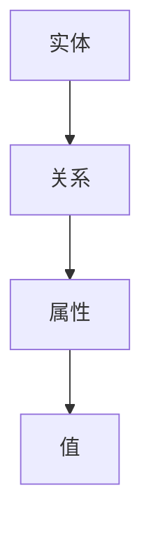
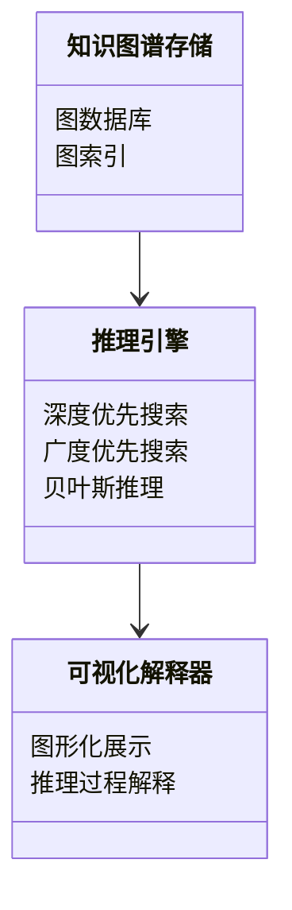

                 


# 《构建AI Agent的知识图谱推理解释器》

## 关键词：知识图谱，AI Agent，推理解释器，知识表示，AI推理，系统架构

## 摘要：  
本文详细探讨了如何构建AI Agent的知识图谱推理解释器，从背景介绍、核心概念、算法原理到系统架构和项目实战，全面分析了构建这一系统的各个方面。文章首先介绍了知识图谱和AI Agent的基本概念及其结合的必要性，然后深入分析了知识图谱推理解释器的核心概念与联系，详细讲解了相关算法原理及其实现，接着通过系统架构设计展示了如何将这些理论应用于实际项目中，并通过项目实战部分提供了具体的实现步骤和代码示例。最后，本文总结了最佳实践、注意事项和拓展阅读方向，为读者提供了全面的指导。

---

# 第一部分: 知识图谱与AI Agent概述

## 第1章: 知识图谱与AI Agent的背景介绍

### 1.1 问题背景

#### 1.1.1 知识图谱的定义与特点
知识图谱是一种结构化的语义网络，由节点（概念、实体或事件）和边（关系）组成，用于表示知识。其特点包括：
- **结构化**：通过图结构表示知识。
- **语义化**：节点和边具有明确的语义。
- **可扩展性**：支持大规模数据的构建与管理。

#### 1.1.2 AI Agent的基本概念
AI Agent（智能体）是能够感知环境、自主决策并执行任务的实体。其特点包括：
- **自主性**：无需外部干预。
- **反应性**：能实时感知并响应环境变化。
- **目标导向性**：基于目标进行决策和行动。

#### 1.1.3 知识图谱与AI Agent的结合应用
知识图谱为AI Agent提供了丰富的知识库，使其能够进行推理和决策。例如，在自然语言处理、智能问答系统和自动驾驶等领域，知识图谱与AI Agent的结合显著提升了系统的智能性。

---

### 1.2 问题描述

#### 1.2.1 知识图谱构建的挑战
知识图谱的构建需要解决数据异构性、语义理解、实体对齐等问题。此外，如何高效存储和管理大规模图数据也是一个技术难点。

#### 1.2.2 AI Agent的推理需求
AI Agent需要通过知识图谱进行推理，以支持复杂决策。推理过程涉及路径搜索、逻辑推理和概率推理等方法，且需要考虑推理的效率和准确性。

#### 1.2.3 知识图谱推理解释器的核心问题
知识图谱推理解释器需要将推理过程转化为可解释的形式，解决推理的可解释性和结果的可信性问题。

---

### 1.3 问题解决

#### 1.3.1 知识图谱推理解释器的解决方案
通过构建知识图谱和开发推理算法，结合可解释性技术，提供直观的推理结果展示。

#### 1.3.2 AI Agent的知识表示与推理
AI Agent通过知识图谱进行知识表示，并利用推理算法进行决策和行动。

#### 1.3.3 知识图谱在AI Agent中的应用价值
知识图谱为AI Agent提供了丰富的知识库，增强了系统的智能性和决策能力。

---

### 1.4 边界与外延

#### 1.4.1 知识图谱的边界
知识图谱主要关注知识的结构化表示，不直接涉及数据采集和清洗过程。

#### 1.4.2 AI Agent的边界
AI Agent的核心功能是感知和决策，其知识来源可以是知识图谱或其他形式的知识库。

#### 1.4.3 知识图谱推理解释器的外延
知识图谱推理解释器不仅限于AI Agent，还可以应用于其他需要推理和解释的领域。

---

### 1.5 概念结构与核心要素

#### 1.5.1 知识图谱的核心要素
- 实体（Entity）
- 关系（Relation）
- 属性（Attribute）
- 值（Value）

#### 1.5.2 AI Agent的核心要素
- 感知模块（Perception）
- 决策模块（Decision）
- 行动模块（Action）

#### 1.5.3 知识图谱推理解释器的结构与组成
- 知识图谱存储
- 推理算法
- 可视化解释模块

---

## 第2章: 知识图谱与AI Agent的核心概念与联系

### 2.1 知识图谱的核心原理

#### 2.1.1 知识图谱的表示方法
知识图谱常用的表示方法包括RDF（资源描述框架）、RDFS（RDF Schema）和OWL（Web本体语言）。

#### 2.1.2 知识图谱的构建过程
知识图谱的构建通常包括数据采集、数据清洗、实体识别、关系抽取和知识融合等步骤。

#### 2.1.3 知识图谱的存储与管理
知识图谱的存储可以采用图数据库（如Neo4j）或关系型数据库，并通过图索引优化查询效率。

---

### 2.2 AI Agent的核心原理

#### 2.2.1 AI Agent的定义与分类
AI Agent可以根据智能水平分为反应式和认知式智能体，也可以根据应用场景分为任务型和学习型智能体。

#### 2.2.2 AI Agent的感知与行动
AI Agent通过传感器或数据接口感知环境，通过执行器或API进行行动。

#### 2.2.3 AI Agent的知识表示与推理
AI Agent的知识表示通常采用逻辑规则、概率模型或符号表示，并通过推理算法进行决策。

---

### 2.3 知识图谱与AI Agent的联系

#### 2.3.1 知识图谱为AI Agent提供知识基础
知识图谱为AI Agent提供了丰富的知识库，支持其进行推理和决策。

#### 2.3.2 AI Agent为知识图谱提供推理能力
AI Agent通过推理算法，将知识图谱中的隐性知识显式化，增强了知识图谱的实用价值。

#### 2.3.3 知识图谱推理解释器的作用与意义
知识图谱推理解释器通过可视化和解释技术，帮助用户理解推理过程和结果，增强了系统的可信性。

---

### 2.4 核心概念对比表格

#### 表2-1: 知识图谱与AI Agent的核心概念对比

| 比较维度 | 知识图谱 | AI Agent |
|----------|----------|----------|
| 核心目标 | 表示知识   | 感知与决策 | 
| 主要功能 | 存储与检索知识 | 执行任务与推理 |
| 技术基础 | 图数据库、语义理解 | 机器学习、自然语言处理 |

---

### 2.5 ER实体关系图



---

## 第3章: 知识图谱推理解释器的算法原理

### 3.1 知识图谱构建算法

#### 3.1.1 RDF与RDFS的表示方法
RDF（资源描述框架）用于描述资源及其属性，RDFS（RDF Schema）用于定义资源的类型和关系。

#### 3.1.2 知识图谱构建流程
1. 数据预处理：清洗和标注数据。
2. 实体识别：通过NLP技术识别实体。
3. 关系抽取：抽取实体之间的关系。
4. 知识融合：合并多个来源的知识。

---

### 3.2 推理算法

#### 3.2.1 基于RDFS的推理算法
RDFS推理算法包括实例化、分类和属性抽取等步骤，可以通过深度优先搜索或广度优先搜索进行路径查找。

#### 3.2.2 基于OWL的推理算法
OWL支持本体推理，可以通过描述逻辑推理引擎进行推理。

#### 3.2.3 概率推理算法
概率推理算法包括贝叶斯网络和马尔可夫逻辑网络，用于处理不确定性问题。

---

### 3.3 推理算法的实现

#### 3.3.1 深度优先搜索与广度优先搜索
```python
def depth_first_search(start, goal):
    visited = set()
    stack = [start]
    while stack:
        node = stack.pop()
        if node == goal:
            return True
        if node not in visited:
            visited.add(node)
            for neighbor in neighbors[node]:
                stack.append(neighbor)
    return False

def breadth_first_search(start, goal):
    visited = set()
    queue = deque([start])
    while queue:
        node = queue.popleft()
        if node == goal:
            return True
        if node not in visited:
            visited.add(node)
            for neighbor in neighbors[node]:
                queue.append(neighbor)
    return False
```

#### 3.3.2 贝叶斯网络推理
贝叶斯网络通过概率公式进行推理，例如：
$$ P(A|B) = \frac{P(B|A)P(A)}{P(B)} $$

---

## 第4章: 系统分析与架构设计

### 4.1 系统分析

#### 4.1.1 问题场景介绍
知识图谱推理解释器需要支持AI Agent的推理需求，提供高效的推理服务和可解释的推理结果。

#### 4.1.2 系统目标与范围
- 提供知识图谱的存储与管理功能。
- 实现多种推理算法，支持可扩展性。
- 提供可视化的推理结果解释。

---

### 4.2 系统架构设计

#### 4.2.1 领域模型


#### 4.2.2 系统架构


---

## 第5章: 项目实战

### 5.1 环境安装与配置

#### 5.1.1 知识图谱存储工具
推荐使用Neo4j图数据库。

#### 5.1.2 推理算法库
可以使用networkx或igraph进行图分析。

---

### 5.2 系统核心实现

#### 5.2.1 知识图谱构建
```python
from neo4j import GraphDatabase
from neo4j.exceptions import ServiceUnavailable

class KnowledgeGraph:
    def __init__(self, uri, user, password):
        self.driver = GraphDatabase.driver(uri, auth=(user, password))
    
    def create_entity(self, entity_type, entity_label):
        # 创建实体节点
        with self.driver.session() as session:
            session.run("CREATE (:Entity {type: $type, label: $label})",
                        type=entity_type, label=entity_label)
```

#### 5.2.2 推理算法实现
```python
def shortest_path(start, end):
    # 使用BFS算法查找最短路径
    from collections import deque
    visited = {}
    queue = deque([(start, [start])])
    visited[start] = [start]
    
    while queue:
        node, path = queue.popleft()
        if node == end:
            return path
        for neighbor in neighbors[node]:
            if neighbor not in visited:
                visited[neighbor] = path + [neighbor]
                queue.append((neighbor, path + [neighbor]))
    return None
```

#### 5.2.3 可视化解释器开发
```python
import matplotlib.pyplot as plt
from networkx import draw

def visualize_graph(nodes, edges):
    G = nx.Graph()
    G.add_nodes_from(nodes)
    G.add_edges_from(edges)
    plt.figure(figsize=(10, 10))
    draw(G, with_labels=True, node_color='lightblue', edge_color='gray')
    plt.show()
```

---

## 第6章: 总结与展望

### 6.1 最佳实践 Tips

#### 6.1.1 知识图谱构建
- 数据预处理是关键，确保数据质量和一致性。
- 选择合适的图数据库和存储方案。

#### 6.1.2 推理算法选择
- 根据具体需求选择推理算法，如路径搜索适合短路径推理，贝叶斯推理适合概率推理。

#### 6.1.3 系统架构设计
- 模块化设计，便于扩展和维护。
- 确保系统的可扩展性和可维护性。

---

### 6.2 小结

本文详细探讨了构建AI Agent的知识图谱推理解释器的各个方面，从背景介绍到项目实战，为读者提供了全面的指导。通过理论分析和实践案例，帮助读者理解如何将知识图谱与AI Agent结合，开发高效的推理系统。

---

### 6.3 注意事项

- 知识图谱的构建需要考虑数据来源和数据质量。
- 推理算法的选择需要根据具体场景和需求。
- 系统设计需要考虑可扩展性和可维护性。

---

### 6.4 拓展阅读

- [《知识图谱实战》](https://example.com)
- [《AI Agent原理与应用》](https://example.com)
- [《图数据库与图计算》](https://example.com)

---

## 作者：AI天才研究院/AI Genius Institute & 禅与计算机程序设计艺术 /Zen And The Art of Computer Programming

