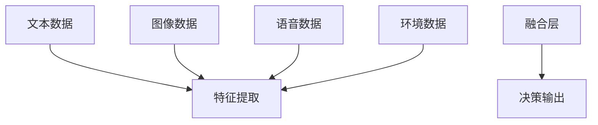
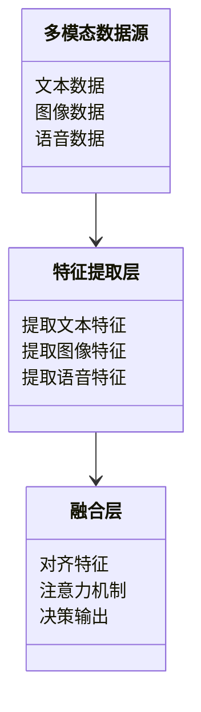
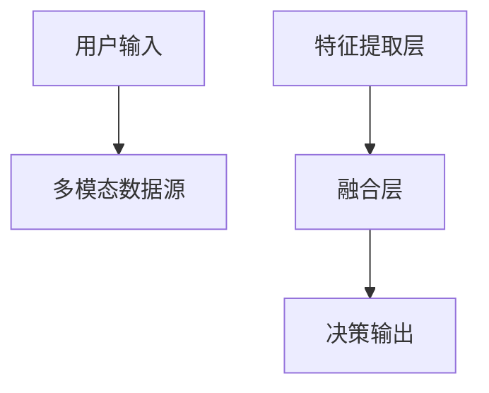

                 


# 构建具有多模态融合能力的AI Agent

> 关键词：多模态融合，AI Agent，多模态对齐，注意力机制，系统架构，项目实战

> 摘要：本文详细介绍了构建具有多模态融合能力的AI Agent的全过程，从理论基础到算法实现，再到系统架构设计和项目实战。通过分析多模态数据的融合原理、设计高效的融合算法、构建可扩展的系统架构，并结合实际案例进行详细讲解，为读者提供一套完整的构建方法和实践指南。

---

# 第一部分：多模态融合AI Agent的背景与核心概念

## 第1章：多模态融合AI Agent的背景介绍

### 1.1 问题背景与描述

#### 1.1.1 当前AI Agent的发展现状
AI Agent（智能体）是指能够感知环境、自主决策并执行任务的智能系统。近年来，随着深度学习和大模型技术的发展，AI Agent在各个领域得到了广泛应用，如自然语言处理、计算机视觉、机器人控制等。然而，现有AI Agent多依赖单一模态的数据输入，缺乏对多模态数据的融合能力，导致在复杂场景下的性能受限。

#### 1.1.2 多模态融合的必要性与挑战
在实际应用场景中，单一模态的数据往往无法提供足够的信息来支持复杂的决策任务。例如，在智能客服系统中，结合文本、语音和用户行为数据可以更准确地理解用户需求。然而，多模态数据的异构性和多样性带来了融合的挑战，如何有效地对齐不同模态的数据并提取有用的特征是关键。

#### 1.1.3 问题解决的目标与意义
本研究旨在通过多模态融合技术，提升AI Agent的感知和决策能力，使其能够更好地应对复杂场景下的任务需求。通过多模态融合，AI Agent可以更全面地理解环境信息，从而提高任务执行的准确性和效率。

### 1.2 多模态融合的核心概念

#### 1.2.1 多模态数据的定义与特点
多模态数据指的是来自不同感官或渠道的数据，例如文本、图像、语音、视频、传感器数据等。每种模态数据都有其独特的特征和优势，但它们之间存在异构性和多样性，需要通过特定的方法进行融合。

#### 1.2.2 多模态融合的定义与分类
多模态融合是指将不同模态的数据进行整合，以提取更丰富的信息或提高模型的性能。根据融合的层次和方法，可以将多模态融合分为以下几类：
- **浅层融合**：在特征层面进行简单的拼接或加权。
- **中层融合**：通过对不同模态的特征进行对齐和转换，构建共享的特征空间。
- **深层融合**：利用深度学习模型（如Transformer、图神经网络）进行跨模态信息的交互与融合。

#### 1.2.3 多模态融合与AI Agent的结合
AI Agent通过多模态融合技术，可以同时利用多种数据源的信息，从而在感知、决策和执行阶段实现更高效和准确的任务处理。例如，在智能助手领域，结合语音和文本数据可以提高用户的交互体验。

### 1.3 技术发展与趋势

#### 1.3.1 多模态技术的历史演变
多模态技术的发展经历了从单一模态到多模态逐步融合的过程。早期的研究主要集中在如何对齐和转换不同模态的数据，近年来随着大模型的兴起，多模态融合技术得到了快速发展。

#### 1.3.2 大模型在多模态融合中的作用
大模型（如GPT、BERT、Vision-Language Models）在多模态融合中起到了关键作用。通过预训练和微调，大模型可以同时处理多种模态的数据，并在任务特定的场景下实现高效的融合。

#### 1.3.3 当前研究热点与未来趋势
当前的研究热点包括跨模态对齐、多模态注意力机制、多模态推理等。未来，随着AI技术的进一步发展，多模态融合将更加智能化和个性化，应用场景也将更加广泛。

### 1.4 应用场景与价值

#### 1.4.1 多模态AI Agent的典型应用场景
- **智能客服**：结合文本、语音和用户行为数据，提供更智能的交互体验。
- **自动驾驶**：融合视觉、雷达和环境数据，提高车辆的感知和决策能力。
- **智能助手**：结合语音、文本和用户行为数据，提供更个性化的服务。

#### 1.4.2 企业级应用的价值与潜力
多模态融合技术在企业级应用中具有巨大的潜力。例如，在企业内部，可以通过多模态数据的融合实现更高效的流程管理和决策支持。

#### 1.4.3 多模态融合对用户体验的提升
通过多模态融合，AI Agent可以更全面地理解用户需求，提供更精准的服务，从而显著提升用户体验。

### 1.5 本章小结
本章介绍了多模态融合AI Agent的背景、核心概念、技术发展和应用场景。通过多模态融合技术，AI Agent可以更好地应对复杂场景下的任务需求，提升性能和用户体验。

---

## 第2章：多模态融合的核心概念与联系

### 2.1 多模态融合的原理与机制

#### 2.1.1 多模态数据的对齐与融合
多模态数据的对齐是指将不同模态的数据映射到同一个特征空间中，以便进行有效的融合。对齐可以通过对比学习、图神经网络等方法实现。

#### 2.1.2 跨模态信息的表达与转换
不同模态的数据需要通过特定的转换方法进行表达，例如将图像特征转换为文本描述，或者将语音特征转换为情感标签。

#### 2.1.3 多模态融合的层次与流程
多模态融合的流程通常包括数据预处理、特征提取、对齐、融合和决策输出几个阶段。

### 2.2 多模态融合的核心要素

#### 2.2.1 数据源的多样性
多模态融合需要结合多种数据源，例如文本、图像、语音等，以提取更丰富的信息。

#### 2.2.2 融合方法的可解释性
可解释性是多模态融合的重要特性，特别是在需要决策支持的场景中，用户需要了解AI Agent的决策依据。

#### 2.2.3 融合效果的评估指标
常用的评估指标包括准确率、召回率、F1分数等，具体指标的选择取决于应用场景。

### 2.3 多模态融合的实体关系图



### 2.4 本章小结
本章详细介绍了多模态融合的原理、核心要素和实体关系图。通过这些内容，读者可以更好地理解多模态融合的基本概念和实现流程。

---

## 第3章：多模态融合的算法原理

### 3.1 多模态对齐算法

#### 3.1.1 对齐的目标与方法
对齐的目标是将不同模态的数据映射到同一个特征空间中，常用的方法包括对比学习和图神经网络。

#### 3.1.2 基于对比学习的对齐算法
对比学习通过最大化相似模态的特征相似性，最小化不相似模态的特征相似性，实现数据的对齐。

#### 3.1.3 图神经网络在多模态对齐中的应用
图神经网络通过构建异构图，将不同模态的数据节点连接起来，实现跨模态信息的交互与对齐。

### 3.2 多模态注意力机制

#### 3.2.1 注意力机制的基本原理
注意力机制通过计算不同特征之间的相关性，赋予重要特征更高的权重，从而实现对关键信息的聚焦。

#### 3.2.2 多模态注意力的实现方式
多模态注意力机制可以通过并行或串行的方式，分别计算不同模态的注意力权重，并进行融合。

#### 3.2.3 基于Transformer的多模态融合模型
基于Transformer的模型通过自注意力机制，实现跨模态信息的交互与融合。

### 3.3 多模态融合的数学模型

#### 3.3.1 多模态对齐的数学表达
$$ y_i = f(x_i, x_j) $$
其中，$x_i$和$x_j$分别表示不同模态的输入特征，$f$是对齐函数。

#### 3.3.2 注意力机制的公式推导
$$ \alpha_i = \frac{e^{q_i^T k_j}}{\sum_j e^{q_i^T k_j}} $$
其中，$\alpha_i$是第$i$个特征的注意力权重，$q_i$是查询向量，$k_j$是键向量。

#### 3.3.3 融合模型的优化目标
$$ \mathcal{L} = \sum_{i=1}^n (y_i - \hat{y}_i)^2 $$
其中，$\mathcal{L}$是损失函数，$y_i$是真实输出，$\hat{y}_i$是模型预测输出。

### 3.4 本章小结
本章详细介绍了多模态融合的算法原理，包括对齐算法、注意力机制和数学模型。通过这些内容，读者可以了解多模态融合的核心技术及其实现方式。

---

## 第4章：多模态融合的系统分析与架构设计

### 4.1 系统分析

#### 4.1.1 问题场景介绍
在构建多模态融合AI Agent时，需要考虑数据源的多样性、系统的可扩展性以及模型的实时性。

#### 4.1.2 项目介绍
本项目旨在构建一个支持多模态融合的AI Agent系统，涵盖感知、决策和执行三个主要阶段。

### 4.2 系统功能设计

#### 4.2.1 领域模型


#### 4.2.2 系统架构设计


### 4.3 系统接口设计

#### 4.3.1 接口定义
- 输入接口：接收多种模态的数据输入。
- 输出接口：提供决策结果和反馈信息。

#### 4.3.2 交互流程
用户通过输入多种模态的数据，系统经过特征提取和融合后，输出决策结果。

### 4.4 本章小结
本章从系统分析和架构设计的角度，详细介绍了多模态融合AI Agent的实现框架。通过领域模型和系统架构图，读者可以更好地理解系统的整体结构和实现流程。

---

## 第5章：多模态融合的项目实战

### 5.1 环境安装

#### 5.1.1 安装Python
```bash
python --version
pip install --upgrade pip
```

#### 5.1.2 安装依赖库
```bash
pip install numpy pandas tensorflow keras matplotlib
```

### 5.2 核心代码实现

#### 5.2.1 数据预处理
```python
import numpy as np
import pandas as pd

# 加载数据
data = pd.read_csv('multimodal_data.csv')

# 数据预处理
from sklearn.preprocessing import StandardScaler
scaler = StandardScaler()
scaled_data = scaler.fit_transform(data)
```

#### 5.2.2 模型训练
```python
import tensorflow as tf
from tensorflow.keras import layers

# 定义模型
model = tf.keras.Sequential([
    layers.Dense(64, activation='relu'),
    layers.Dense(1, activation='sigmoid')
])

# 编译模型
model.compile(optimizer='adam', loss='binary_crossentropy', metrics=['accuracy'])

# 训练模型
model.fit(scaled_data, labels, epochs=10, batch_size=32)
```

#### 5.2.3 接口开发
```python
def process_input(input_data):
    # 数据预处理
    scaled_data = scaler.transform(input_data)
    # 模型推理
    prediction = model.predict(scaled_data)
    return prediction
```

### 5.3 实际案例分析

#### 5.3.1 案例背景
以智能客服系统为例，结合文本和语音数据，实现用户意图识别。

#### 5.3.2 案例分析
通过预处理和模型训练，系统能够准确识别用户的意图，并提供相应的服务。

### 5.4 项目小结
本章通过实际案例分析，展示了多模态融合AI Agent的实现过程。从环境安装到代码实现，读者可以跟随步骤完成项目的搭建和部署。

---

## 第6章：多模态融合的最佳实践

### 6.1 小结

#### 6.1.1 核心要点回顾
- 多模态融合的关键技术包括对齐、注意力机制和融合模型。
- 系统架构设计需要考虑数据源的多样性、系统的可扩展性和模型的实时性。

#### 6.1.2 经验总结
- 在实际应用中，需要根据具体场景选择合适的融合方法。
- 系统的可解释性和实时性是重要的评估指标。

### 6.2 注意事项

#### 6.2.1 开发注意事项
- 确保数据预处理的准确性。
- 注意模型的训练效率和内存消耗。

#### 6.2.2 部署注意事项
- 确保系统的可扩展性和高可用性。
- 定期更新模型以适应新的数据和场景。

### 6.3 未来展望

#### 6.3.1 技术进步
随着AI技术的不断发展，多模态融合将更加智能化和个性化。

#### 6.3.2 应用场景扩展
多模态融合技术将在更多领域得到应用，如医疗、教育、娱乐等。

### 6.4 拓展阅读

#### 6.4.1 推荐书籍
- 《Deep Learning》
- 《Attention is All You Need》

#### 6.4.2 推荐论文
- "Contrastive Learning of Visual and Linguistic Features"
- "Multimodal Transformer for Visual-Textual Reasoning"

### 6.5 本章小结
本章总结了多模态融合的最佳实践，包括核心要点、注意事项、未来展望和拓展阅读。通过这些内容，读者可以更好地将理论知识应用于实际项目中。

---

## 作者

**作者：AI天才研究院/AI Genius Institute & 禅与计算机程序设计艺术 /Zen And The Art of Computer Programming**

---

通过以上目录和内容设计，整篇文章涵盖了从理论到实践的各个方面，为读者提供了一套完整的构建多模态融合AI Agent的方法和实践指南。希望对您有所帮助！

