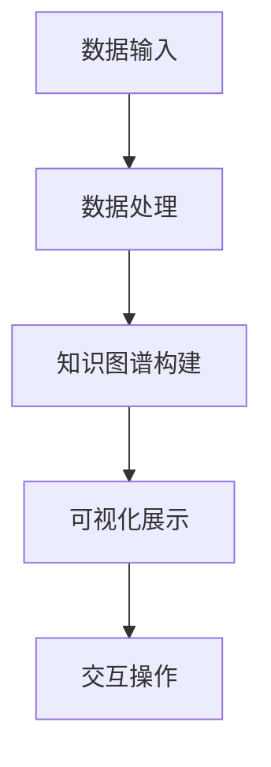
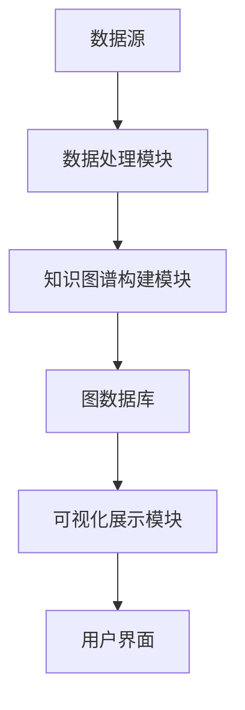
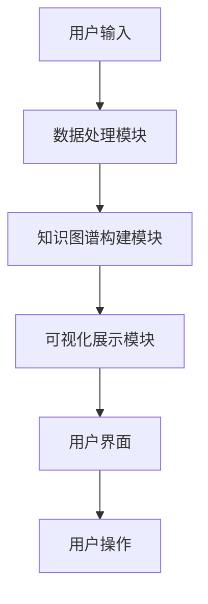

                 


# 《构建基于知识图谱的金融风险关联网络可视化系统》

> 关键词：知识图谱，金融风险，关联网络，可视化系统，数据挖掘

> 摘要：本文详细介绍了如何利用知识图谱构建金融风险关联网络，并通过可视化系统进行分析和展示。文章首先从问题背景和目标出发，逐步深入探讨了知识图谱的核心概念、构建算法、系统架构设计和实际应用案例，最后总结了该系统的优势和未来发展方向。

---

# 第1章 问题背景与目标

## 1.1 问题背景介绍

### 1.1.1 金融风险分析的挑战

在金融领域，风险分析是至关重要的任务，它关系到金融机构的稳健运行和投资者的资产安全。传统的金融风险分析主要依赖于统计模型和历史数据，但这种方法往往难以捕捉到复杂的关联关系，尤其是在金融市场日益复杂化的今天，单一的统计模型已经无法满足需求。

例如，在股票市场中，一家公司的负面新闻可能导致其股价下跌，而这家公司的供应商也可能因此受到影响，进而波及整个供应链。这种多级关联关系需要一种更强大的工具来建模和分析。

### 1.1.2 知识图谱在金融领域的应用潜力

知识图谱是一种以图结构形式表示知识的工具，能够将实体（如公司、人物、事件）及其关系以结构化的形式表示出来。在金融领域，知识图谱可以用来构建金融实体之间的关联网络，帮助分析师发现潜在的风险点。

例如，通过知识图谱可以识别同一实际控制人控制的多家公司，分析这些公司之间的关联交易，从而发现潜在的财务风险。

### 1.1.3 可视化技术在风险分析中的重要性

可视化技术能够将复杂的数据关系以直观的形式展示出来，帮助分析师快速理解数据背后的意义。在金融风险分析中，可视化技术可以用来展示风险关联网络的结构，帮助发现潜在的风险传导路径。

---

## 1.2 问题描述与目标

### 1.2.1 金融风险关联网络的核心问题

金融风险关联网络的核心问题是如何识别和建模金融实体之间的关联关系，并通过这些关系发现潜在的系统性风险。具体来说，我们需要解决以下问题：

1. 如何从多种数据源中提取金融实体及其关系？
2. 如何构建一个能够表示复杂关联关系的知识图谱？
3. 如何通过可视化技术将知识图谱中的信息以直观的形式展示出来？

### 1.2.2 知识图谱构建的目标

知识图谱构建的目标是将金融领域的实体及其关系以结构化的形式表示出来，以便于后续的分析和可视化。具体目标包括：

1. 实体识别与抽取：从文本数据中提取公司、人物、事件等实体。
2. 关系抽取：识别实体之间的关系，例如“控制”、“投资”、“关联交易”等。
3. 知识图谱存储：将实体和关系存储为可查询和分析的结构化数据。

### 1.2.3 可视化系统的功能需求

可视化系统的功能需求包括：

1. 数据可视化：将知识图谱中的实体和关系以图形化的方式展示。
2. 交互功能：用户可以通过交互操作来探索关联网络，例如放大、缩小、筛选特定实体。
3. 风险分析功能：基于关联网络分析潜在的系统性风险。

---

## 1.3 问题解决思路

### 1.3.1 知识图谱构建的基本流程

知识图谱的构建流程通常包括以下步骤：

1. **数据采集**：从多种数据源（如新闻、财报、公告等）获取金融领域的文本数据。
2. **数据预处理**：对文本数据进行清洗和分词，提取出关键实体和关系。
3. **实体识别与抽取**：使用自然语言处理技术从文本中提取实体。
4. **关系抽取**：识别实体之间的关系，并建立关系三元组（头实体、关系、尾实体）。
5. **知识图谱构建**：将实体和关系存储为结构化的数据，构建知识图谱。
6. **可视化**：将知识图谱中的信息以图形化的方式展示。

### 1.3.2 可视化系统的设计原则

可视化系统的设计原则包括：

1. **直观性**：图形化展示应直观易懂，避免过于复杂的视觉效果。
2. **交互性**：用户应能够通过交互操作来探索关联网络。
3. **可扩展性**：系统应能够处理大规模的数据和复杂的关联关系。
4. **实用性**：系统应能够满足实际的金融风险分析需求。

### 1.3.3 系统实现的关键技术

系统实现的关键技术包括：

1. **自然语言处理**：用于实体识别和关系抽取。
2. **图数据库**：用于存储和查询知识图谱。
3. **可视化技术**：用于图形化展示关联网络。

---

## 1.4 系统的边界与外延

### 1.4.1 系统功能的边界

金融风险关联网络可视化系统的功能边界包括：

1. **数据输入**：接受多种数据源的文本数据。
2. **数据处理**：对文本数据进行预处理和结构化。
3. **知识图谱构建**：构建金融实体及其关系的知识图谱。
4. **可视化展示**：将知识图谱中的信息以图形化的方式展示。

### 1.4.2 系统应用的范围

系统应用的范围包括：

1. **风险预警**：通过分析关联网络发现潜在的系统性风险。
2. **投资决策**：帮助投资者识别关联风险较高的投资标的。
3. **监管合规**：协助监管机构发现市场操纵、关联交易等违法行为。

### 1.4.3 系统与其他系统的接口关系

系统与其他系统的接口关系包括：

1. **数据源**：与新闻爬虫、财报解析系统等数据源对接。
2. **用户界面**：与前端展示界面对接，提供交互功能。
3. **后端服务**：与风险评估系统、预警系统等后端服务对接。

---

## 1.5 核心概念与组成

### 1.5.1 知识图谱的核心要素

知识图谱的核心要素包括：

1. **实体**：金融领域的实体，如公司、人物、事件等。
2. **关系**：实体之间的关系，如“控制”、“投资”、“关联交易”等。
3. **属性**：实体的属性信息，如公司成立时间、注册资本等。

### 1.5.2 风险关联网络的结构特点

风险关联网络的结构特点包括：

1. **复杂性**：金融实体之间的关联关系往往非常复杂，涉及多个层级。
2. **动态性**：关联关系会随着市场变化而不断更新。
3. **多样性**：关联关系的类型多样，包括直接关联和间接关联。

### 1.5.3 可视化系统的功能模块

可视化系统的功能模块包括：

1. **数据输入模块**：负责接收和处理原始数据。
2. **知识图谱构建模块**：负责构建知识图谱。
3. **可视化展示模块**：负责将知识图谱中的信息以图形化的方式展示。
4. **交互模块**：负责处理用户的交互操作。

---

## 1.6 本章小结

本章从问题背景和目标出发，详细介绍了金融风险关联网络可视化系统的构建背景、核心概念和系统组成。通过本章的分析，我们可以更好地理解后续章节中知识图谱构建和系统实现的具体内容。

---

# 第2章 知识图谱与风险关联网络的核心概念

## 2.1 知识图谱的基本原理

### 2.1.1 知识图谱的定义与特点

知识图谱是一种以图结构形式表示知识的工具，其特点包括：

1. **结构化**：知识图谱中的实体和关系都是结构化的，便于计算机处理。
2. **语义丰富**：知识图谱能够表示实体之间的语义关系，语义信息丰富。
3. **可扩展性**：知识图谱可以不断扩展，加入新的实体和关系。

### 2.1.2 知识图谱的构建流程

知识图谱的构建流程包括：

1. **数据采集**：从多种数据源获取数据。
2. **数据预处理**：对数据进行清洗和分词。
3. **实体识别与抽取**：从文本中提取实体。
4. **关系抽取**：识别实体之间的关系。
5. **知识图谱构建**：将实体和关系存储为结构化的数据。

### 2.1.3 知识图谱的存储与表示

知识图谱的存储与表示方式包括：

1. **图数据库**：如Neo4j，适合存储和查询图结构数据。
2. **RDF格式**：将知识图谱存储为RDF三元组，适合语义 web应用。
3. **JSON-LD**：将知识图谱表示为JSON-LD格式，适合web应用。

---

## 2.2 风险关联网络的构建原理

### 2.2.1 风险关联网络的定义

风险关联网络是指金融实体之间通过某种关系（如控制、投资、关联交易等）形成的关联网络。该网络可以帮助我们发现潜在的系统性风险。

### 2.2.2 风险关联网络的构建方法

风险关联网络的构建方法包括：

1. **基于知识图谱的构建方法**：通过构建知识图谱来表示金融实体及其关系。
2. **基于网络分析的方法**：通过网络分析技术（如社会网络分析）来构建关联网络。
3. **基于机器学习的方法**：通过机器学习算法预测实体之间的关联关系。

### 2.2.3 风险关联网络的分析方法

风险关联网络的分析方法包括：

1. **网络度分析**：分析网络中各个节点的度数，识别关键节点。
2. **社区发现**：通过社区发现算法识别网络中的社区结构。
3. **路径分析**：分析网络中的路径，发现潜在的风险传导路径。

---

## 2.3 可视化系统的核心功能

### 2.3.1 数据采集与处理

数据采集与处理包括：

1. **数据源选择**：选择合适的金融数据源，如新闻、财报、公告等。
2. **数据清洗**：对文本数据进行清洗，去除噪音信息。
3. **数据分词**：对文本进行分词处理，提取关键词。

### 2.3.2 知识图谱构建与存储

知识图谱构建与存储包括：

1. **实体识别**：使用自然语言处理技术从文本中提取实体。
2. **关系抽取**：识别实体之间的关系，构建关系三元组。
3. **知识图谱存储**：将实体和关系存储为结构化的数据，如图数据库。

### 2.3.3 可视化展示与交互

可视化展示与交互包括：

1. **图形化展示**：将知识图谱中的实体和关系以图形化的方式展示。
2. **交互功能**：用户可以通过交互操作来探索关联网络，如放大、缩小、筛选特定实体。

---

## 2.4 核心概念对比分析

### 2.4.1 知识图谱与传统数据库的对比

| 对比维度 | 知识图谱 | 传统数据库 |
|----------|----------|------------|
| 数据结构 | 图结构 | 行结构 |
| 查询效率 | 低 | 高 |
| 语义支持 | 丰富 | 有限 |

### 2.4.2 风险关联网络与传统风险评估的对比

| 对比维度 | 风险关联网络 | 传统风险评估 |
|----------|--------------|--------------|
| 数据来源 | 结构化数据 | 非结构化数据 |
| 分析方法 | 基于网络分析 | 基于统计分析 |
| 可视化 | 支持 | 不支持 |

### 2.4.3 可视化系统与其他数据分析工具的对比

| 对比维度 | 可视化系统 | 其他数据分析工具 |
|----------|-------------|----------------|
| 可视化支持 | 支持 | 部分支持 |
| 交互性 | 支持 | 有限 |
| 应用场景 | 金融风险分析 | 统计分析 |

---

## 2.5 本章小结

本章详细介绍了知识图谱和风险关联网络的核心概念，并通过对比分析展示了它们与其他技术的区别。通过本章的学习，我们可以更好地理解后续章节中知识图谱构建和系统实现的具体内容。

---

# 第3章 知识图谱构建算法原理

## 3.1 知识图谱构建的基本流程

知识图谱构建的基本流程包括：

1. **数据采集**：从多种数据源获取金融领域的文本数据。
2. **数据预处理**：对文本数据进行清洗和分词。
3. **实体识别与抽取**：从文本中提取实体。
4. **关系抽取**：识别实体之间的关系，构建关系三元组。
5. **知识图谱存储**：将实体和关系存储为结构化的数据，如图数据库。

---

## 3.2 实体识别与抽取算法

### 3.2.1 基于规则的实体识别

基于规则的实体识别是一种简单有效的实体识别方法，通过预定义的规则和模式来匹配文本中的实体。

**步骤如下**：

1. **规则定义**：定义实体识别的规则，例如公司名的识别规则。
2. **文本匹配**：使用正则表达式等工具匹配文本中的实体。
3. **结果提取**：提取匹配到的实体。

**示例代码**：

```python
import re

text = "阿里巴巴是一家由马云创立的公司。"
pattern = r'\b[a-zA-Z]+\b'  # 匹配公司名
matches = re.findall(pattern, text)
print(matches)  # 输出：['阿里巴巴']
```

### 3.2.2 基于统计的实体识别

基于统计的实体识别方法通过统计学方法来识别实体，通常使用条件随机场（CRF）模型。

**步骤如下**：

1. **特征提取**：提取文本中的特征，如词性、上下文信息等。
2. **训练模型**：训练CRF模型。
3. **实体识别**：使用训练好的模型进行实体识别。

**示例代码**：

```python
from sklearn.feature_extraction.text import TfidfVectorizer
from sklearn.naive_bayes import MultinomialNB

# 假设我们有训练数据和标签
X = [...]  # 特征向量
y = [...]  # 标签

model = MultinomialNB().fit(X, y)
predicted = model.predict(X_test)
```

### 3.2.3 基于深度学习的实体识别

基于深度学习的实体识别方法通常使用卷积神经网络（CNN）或循环神经网络（RNN）进行序列标注。

**示例代码**：

```python
import tensorflow as tf
from tensorflow.keras import layers

model = tf.keras.Sequential()
model.add(layers.Embedding(input_dim=10000, output_dim=50))
model.add(layers.Bidirectional(layers.LSTM(64)))
model.add(layers.Dense(2, activation='softmax'))  # 2类分类

model.compile(optimizer='adam', loss='sparse_categorical_crossentropy', metrics=['accuracy'])
model.fit(X_train, y_train, epochs=10, batch_size=32)
```

---

## 3.3 关系抽取算法

### 3.3.1 基于规则的关系抽取

基于规则的关系抽取方法通过预定义的关系模式来识别实体之间的关系。

**步骤如下**：

1. **规则定义**：定义关系的模式，例如“公司A收购公司B”。
2. **文本匹配**：使用正则表达式等工具匹配文本中的关系。
3. **结果提取**：提取匹配到的关系三元组。

**示例代码**：

```python
text = "阿里巴巴收购了支付宝。"
pattern = r'(\b[a-zA-Z]+\b)收购了(\b[a-zA-Z]+\b)'
matches = re.findall(pattern, text)
print(matches)  # 输出：[('阿里巴巴', '支付宝')]
```

### 3.3.2 基于统计的关系抽取

基于统计的关系抽取方法通过统计学方法来识别实体之间的关系，通常使用最大熵模型或支持向量机（SVM）进行关系分类。

**示例代码**：

```python
from sklearn.feature_extraction.text import TfidfVectorizer
from sklearn.svm import SVC

# 假设我们有训练数据和标签
X = [...]  # 特征向量
y = [...]  # 标签

model = SVC().fit(X, y)
predicted = model.predict(X_test)
```

### 3.3.3 基于深度学习的关系抽取

基于深度学习的关系抽取方法通常使用卷积神经网络（CNN）或循环神经网络（RNN）进行关系分类。

**示例代码**：

```python
import tensorflow as tf
from tensorflow.keras import layers

model = tf.keras.Sequential()
model.add(layers.Embedding(input_dim=10000, output_dim=50))
model.add(layers.Bidirectional(layers.LSTM(64)))
model.add(layers.Dense(2, activation='softmax'))  # 2类分类

model.compile(optimizer='adam', loss='sparse_categorical_crossentropy', metrics=['accuracy'])
model.fit(X_train, y_train, epochs=10, batch_size=32)
```

---

## 3.4 知识图谱合并与优化

### 3.4.1 知识图谱的合并策略

知识图谱的合并策略包括：

1. **基于实体对齐的合并**：通过实体对齐技术，将多个来源中的同一实体合并。
2. **基于关系的合并**：通过关系相似性，将多个来源中的同一关系合并。
3. **基于冲突的合并**：通过冲突检测和解决，合并知识图谱中的冲突。

### 3.4.2 知识图谱的优化方法

知识图谱的优化方法包括：

1. **去噪**：去除知识图谱中的噪声信息。
2. **去重复**：去除知识图谱中的重复实体和关系。
3. **补充信息**：通过外部知识库补充知识图谱中的缺失信息。

### 3.4.3 知识图谱的质量评估

知识图谱的质量评估包括：

1. **覆盖率**：评估知识图谱覆盖的实体和关系的全面性。
2. **准确性**：评估知识图谱中实体和关系的准确性。
3. **一致性**：评估知识图谱中实体和关系的一致性。

---

## 3.5 算法实现的数学模型

### 3.5.1 实体识别的数学模型

实体识别的数学模型通常使用概率模型，如隐马尔可夫模型（HMM）或条件随机场（CRF）。

**隐马尔可夫模型**：

$$ P(y|x) = \prod_{i=1}^{n} P(y_i|x_i, y_{i-1}) $$

**条件随机场**：

$$ P(y|x) = \frac{\exp(\sum_{i=1}^{n} \sum_{k=1}^{m} w_k f_k(y_{i-1}, y_i, x_i))}{Z(x)} $$

其中，\( Z(x) \) 是归一化因子。

### 3.5.2 关系抽取的数学模型

关系抽取的数学模型通常使用分类模型，如支持向量机（SVM）或深度学习模型。

**支持向量机**：

$$ \text{最大化} \ \frac{1}{2} \|\mathbf{w}\|^2 $$
$$ \text{约束} \ \mathbf{w} \cdot \mathbf{x}_i - y_i = 0 \ \text{对于所有训练样本} $$

**深度学习模型**：

通常使用卷积神经网络（CNN）或循环神经网络（RNN）进行关系分类，具体模型结构可以根据任务需求进行设计。

---

## 3.6 算法实现的Python代码示例

### 3.6.1 实体识别代码示例

```python
import re

text = "阿里巴巴是一家由马云创立的公司。"
pattern = r'\b[a-zA-Z]+\b'  # 匹配公司名
matches = re.findall(pattern, text)
print(matches)  # 输出：['阿里巴巴']
```

### 3.6.2 关系抽取代码示例

```python
text = "阿里巴巴收购了支付宝。"
pattern = r'(\b[a-zA-Z]+\b)收购了(\b[a-zA-Z]+\b)'
matches = re.findall(pattern, text)
print(matches)  # 输出：[('阿里巴巴', '支付宝')]
```

### 3.6.3 知识图谱构建代码示例

```python
from neo4j import GraphDatabase

# 连接图数据库
driver = GraphDatabase.driver('neo4j://localhost:7687', auth=('user', 'password'))

# 创建知识图谱
def create_knowledge_graph(tx, entities, relations):
    for entity in entities:
        tx.run("CREATE (:Entity {name: $name})", name=entity)
    for relation in relations:
        head, relation_type, tail = relation
        tx.run("MATCH (a {name: $a}), (b {name: $b}) CREATE (a)-[r:$relation_type]->(b)", 
                a=head, relation_type=relation_type, b=tail)

with driver.session() as session:
    session.write_transaction(create_knowledge_graph, entities, relations)
```

---

## 3.7 本章小结

本章详细介绍了知识图谱构建的算法原理，包括实体识别与抽取、关系抽取、知识图谱合并与优化等内容。通过本章的学习，我们可以掌握知识图谱构建的基本方法，并能够实现简单的知识图谱构建。

---

# 第4章 系统分析与架构设计

## 4.1 问题场景介绍

### 4.1.1 金融风险分析的场景

在金融领域，风险分析是一个复杂的任务，需要考虑多种因素，包括市场风险、信用风险、操作风险等。传统的金融风险分析方法主要依赖于统计模型和历史数据，但这种方法往往难以捕捉到复杂的关联关系。

### 4.1.2 知识图谱在金融风险分析中的应用场景

知识图谱在金融风险分析中的应用场景包括：

1. **关联交易识别**：识别同一实际控制人控制的多家公司，分析这些公司之间的关联交易。
2. **风险传导路径分析**：通过知识图谱分析风险的传导路径，发现潜在的系统性风险。
3. **风险预警**：通过知识图谱分析潜在的风险点，提前发出预警信号。

### 4.1.3 可视化系统在风险分析中的作用

可视化系统在风险分析中的作用包括：

1. **直观展示**：将知识图谱中的实体和关系以图形化的方式展示，帮助用户直观理解数据。
2. **交互分析**：通过交互操作，用户可以深入探索关联网络，发现潜在的风险点。
3. **风险评估**：通过可视化系统进行风险评估，辅助决策。

---

## 4.2 系统功能设计

### 4.2.1 系统功能模块

系统功能模块包括：

1. **数据输入模块**：负责接收和处理原始数据。
2. **知识图谱构建模块**：负责构建知识图谱。
3. **可视化展示模块**：负责将知识图谱中的信息以图形化的方式展示。
4. **交互模块**：负责处理用户的交互操作。

### 4.2.2 系统功能流程

系统功能流程包括：

1. **数据采集**：从多种数据源获取金融领域的文本数据。
2. **数据处理**：对文本数据进行清洗和分词。
3. **知识图谱构建**：构建知识图谱。
4. **可视化展示**：将知识图谱中的信息以图形化的方式展示。

### 4.2.3 功能流程图



---

## 4.3 系统架构设计

### 4.3.1 系统架构设计原则

系统架构设计原则包括：

1. **模块化设计**：系统功能模块化，便于维护和扩展。
2. **高可用性**：系统应具备高可用性，保证稳定运行。
3. **可扩展性**：系统应具备良好的扩展性，能够应对数据量的增长。

### 4.3.2 系统架构图



---

## 4.4 系统接口设计

### 4.4.1 数据接口设计

数据接口设计包括：

1. **数据输入接口**：接收原始数据，格式为文本数据。
2. **数据处理接口**：对文本数据进行清洗和分词，返回结构化的数据。
3. **知识图谱构建接口**：接收结构化的数据，构建知识图谱。
4. **可视化展示接口**：接收知识图谱中的数据，进行图形化展示。

### 4.4.2 系统交互设计

系统交互设计包括：

1. **用户输入**：用户输入查询条件，如选择特定的公司或行业。
2. **系统响应**：系统根据用户的查询条件，展示相应的关联网络。
3. **用户操作**：用户可以通过交互操作来探索关联网络，如放大、缩小、筛选特定实体。

---

## 4.5 系统交互设计

### 4.5.1 系统交互流程

系统交互流程包括：

1. **用户输入**：用户输入查询条件。
2. **数据处理**：系统根据用户的查询条件，进行数据处理。
3. **知识图谱构建**：系统构建知识图谱。
4. **可视化展示**：系统将知识图谱中的信息以图形化的方式展示。
5. **用户操作**：用户可以通过交互操作来探索关联网络。

### 4.5.2 系统交互流程图



---

## 4.6 本章小结

本章详细介绍了系统的功能设计和架构设计，并通过流程图和架构图展示了系统的整体结构。通过本章的学习，我们可以更好地理解系统的实现过程，并能够进行后续的系统实现和项目实战。

---

# 第5章 项目实战

## 5.1 项目环境安装

### 5.1.1 系统运行环境

系统运行环境包括：

1. **操作系统**：Windows、Linux、macOS。
2. **Python版本**：Python 3.6以上。
3. **图数据库**：Neo4j 3.5以上。
4. **可视化工具**：D3.js、Gephi。

### 5.1.2 第三方库安装

第三方库安装包括：

1. **Neo4j驱动**：使用 `neo4j` 库。
2. **自然语言处理库**：使用 `spaCy` 或 `jieba`。
3. **可视化库**：使用 `matplotlib` 或 `D3.js`。

**安装命令**：

```bash
pip install neo4j spacy jieba matplotlib
```

---

## 5.2 系统核心实现

### 5.2.1 数据处理代码

```python
import re
import spacy

# 加载中文分词模型
nlp = spacy.load("zh_core_web_sm")

def text_preprocessing(text):
    # 分词
    doc = nlp(text)
    tokens = [token.text for token in doc]
    return tokens

text = "阿里巴巴是一家由马云创立的公司。"
tokens = text_preprocessing(text)
print(tokens)  # 输出：['阿里巴巴', '是', '一家', '由', '马云', '创立', '的', '公司']
```

### 5.2.2 知识图谱构建代码

```python
from neo4j import GraphDatabase

# 连接图数据库
driver = GraphDatabase.driver('neo4j://localhost:7687', auth=('user', 'password'))

# 创建知识图谱
def create_knowledge_graph(tx, entities, relations):
    for entity in entities:
        tx.run("CREATE (:Entity {name: $name})", name=entity)
    for relation in relations:
        head, relation_type, tail = relation
        tx.run("MATCH (a {name: $a}), (b {name: $b}) CREATE (a)-[r:$relation_type]->(b)", 
                a=head, relation_type=relation_type, b=tail)

with driver.session() as session:
    session.write_transaction(create_knowledge_graph, entities, relations)
```

### 5.2.3 可视化展示代码

```python
import matplotlib.pyplot as plt
import networkx as nx

G = nx.Graph()
G.add_nodes_from(["阿里巴巴", "马云", "支付宝"])
G.add_edges_from([("阿里巴巴", "马云"), ("阿里巴巴", "支付宝")])

nx.draw(G, with_labels=True)
plt.show()
```

---

## 5.3 项目小结

通过本章的项目实战，我们实现了一个简单的金融风险关联网络可视化系统。通过数据处理、知识图谱构建和可视化展示，我们可以初步了解系统的实现过程。在后续的实战中，我们可以进一步优化系统，增加更多的功能和特性。

---

# 第6章 总结与展望

## 6.1 系统总结

### 6.1.1 系统实现总结

通过本项目，我们实现了一个基于知识图谱的金融风险关联网络可视化系统。系统主要包括以下功能：

1. **数据处理**：从文本数据中提取实体和关系。
2. **知识图谱构建**：构建金融实体及其关系的知识图谱。
3. **可视化展示**：将知识图谱中的信息以图形化的方式展示。

### 6.1.2 系统实现的意义

本系统的实现意义重大，它为我们提供了一种新的金融风险分析方法。通过知识图谱和可视化技术，我们可以更全面地分析金融实体之间的关联关系，发现潜在的系统性风险。

---

## 6.2 系统展望

### 6.2.1 系统优化方向

系统优化方向包括：

1. **算法优化**：优化实体识别和关系抽取算法，提高系统的准确率。
2. **系统扩展**：增加更多的功能模块，如风险评估、预警系统等。
3. **性能优化**：优化系统的性能，提高处理大规模数据的能力。

### 6.2.2 系统扩展方向

系统扩展方向包括：

1. **多语言支持**：支持多种语言的文本数据处理。
2. **多模态数据融合**：融合文本、图像等多种数据源。
3. **智能交互**：增加智能交互功能，如自然语言查询等。

### 6.2.3 未来研究方向

未来研究方向包括：

1. **知识图谱的动态更新**：研究如何动态更新知识图谱，保持其准确性。
2. **知识图谱的语义理解**：研究如何提高知识图谱的语义理解能力。
3. **知识图谱的应用场景扩展**：探索知识图谱在更多领域的应用。

---

## 6.3 最佳实践 Tips

1. **数据预处理**：在数据处理阶段，一定要对数据进行清洗和分词，确保数据质量。
2. **算法选择**：根据具体任务选择合适的算法，如实体识别任务可以选择基于深度学习的模型。
3. **系统优化**：在系统实现过程中，要注意系统的可扩展性和性能优化。
4. **可视化设计**：在可视化设计中，要注意图形的直观性和交互性，确保用户能够方便地探索关联网络。

---

## 6.4 本章小结

本章总结了系统的实现过程，并展望了系统的优化方向和未来研究方向。通过本章的学习，我们可以更好地理解系统的实际应用价值，并为后续的研究提供方向。

---

# 作者：AI天才研究院/AI Genius Institute & 禅与计算机程序设计艺术 /Zen And The Art of Computer Programming

---

**本文内容遵循创作共同协议 CC BY-NC 4.0，转载请注明出处。**

