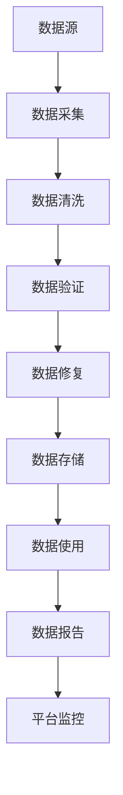
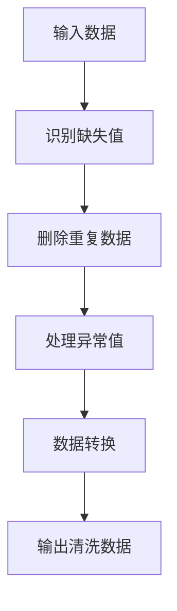
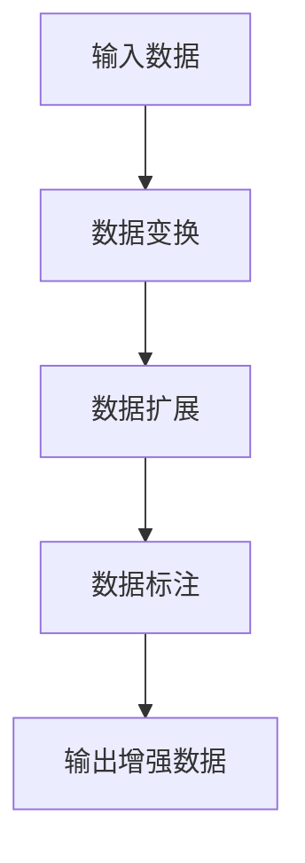
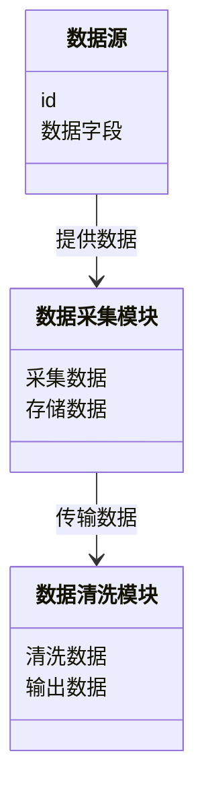
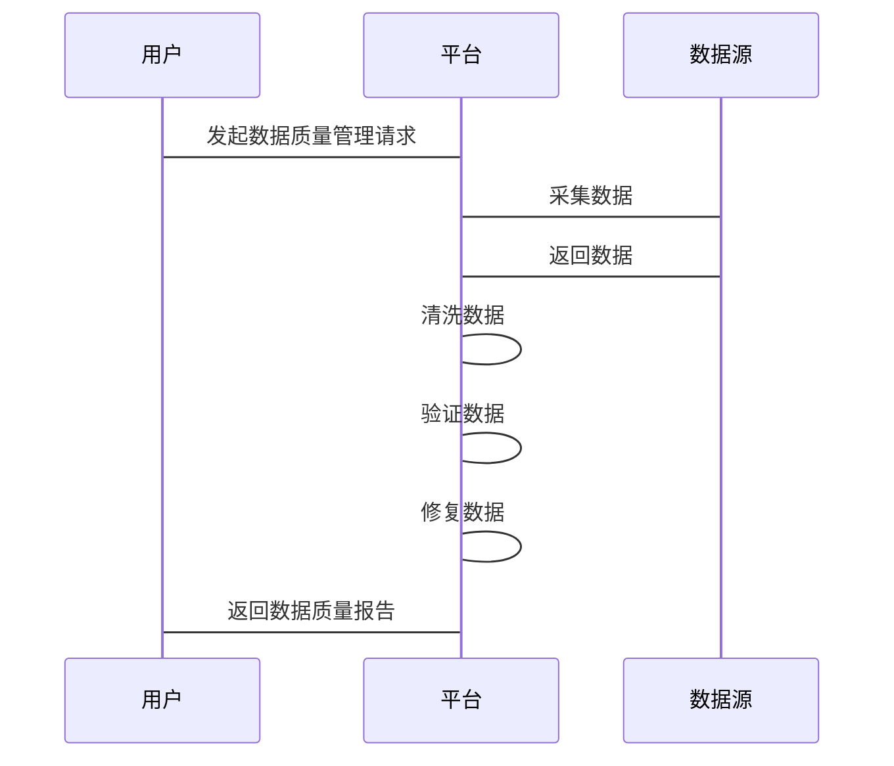

                 


# 金融数据质量自动化控制平台

## 关键词：
金融数据，数据质量管理，自动化控制，数据清洗，数据增强

## 摘要：
本文深入探讨了金融数据质量自动化控制平台的构建与应用，结合背景介绍、核心概念、算法原理、系统架构设计以及项目实战，系统地阐述了如何通过自动化技术提升金融数据质量管理的效率与准确性。文章从理论到实践，为读者提供了全面的指导，帮助金融行业更好地应对数据质量问题，确保数据的可靠性和安全性。

---

# 第一部分: 背景介绍

## 第1章: 金融数据质量自动化控制平台概述

### 1.1 问题背景

#### 1.1.1 金融数据质量管理的重要性
金融行业的数据质量管理直接关系到业务决策的准确性和合规性。随着金融市场的复杂化，数据的完整性、准确性、一致性和及时性变得尤为重要。数据质量直接影响风险评估、客户画像、交易监控等核心业务。

#### 1.1.2 数据质量问题的现状与挑战
- 数据源多样化：金融机构的数据来源包括交易数据、客户信息、市场数据等，来源多样化增加了数据清洗的复杂性。
- 数据格式不统一：不同系统输出的数据格式和结构可能不同，导致数据整合困难。
- 异常数据处理：金融市场中的异常交易、错误数据需要及时识别和处理，否则可能引发风险。
- 数据量大：金融数据通常具有高频率和大容量，传统的手动数据质量管理方式效率低下。

#### 1.1.3 自动化控制的必要性与优势
- **必要性**：随着金融业务的数字化和智能化，数据质量管理需要快速响应和自动化处理。
- **优势**：
  - 提高效率：自动化处理可以显著减少人工操作，提升数据处理速度。
  - 减少错误：自动化系统可以减少人为错误，提高数据准确性。
  - 实时监控：自动化平台能够实时监控数据流，及时发现和处理问题。

### 1.2 问题描述

#### 1.2.1 数据质量问题的主要表现
- 数据缺失：部分字段未填写或缺失。
- 数据冗余：重复数据或冗余字段。
- 数据不一致：同一数据在不同系统中表现不一致。
- 数据污染：错误数据或异常值。

#### 1.2.2 数据质量管理中的常见问题
- 数据清洗成本高：人工清洗数据耗时耗力。
- 数据处理规则复杂：不同业务场景需要不同的处理规则。
- 数据安全与隐私：数据处理过程中可能涉及敏感信息，需要严格控制。

#### 1.2.3 数据质量对金融业务的影响
- 影响决策质量：数据质量问题可能导致错误的业务决策。
- 增加风险：异常数据可能引发合规风险或操作风险。
- 影响用户体验：数据错误可能导致客户信任度下降。

### 1.3 问题解决

#### 1.3.1 数据质量管理的目标与原则
- **目标**：确保数据的完整性、准确性、一致性和及时性。
- **原则**：数据质量管理应遵循业务需求、技术可行性和成本效益原则。

#### 1.3.2 自动化控制的实现路径
- 数据采集与预处理：自动化采集数据并进行初步清洗。
- 数据规则引擎：基于预定义规则自动识别和处理数据问题。
- 数据质量监控：实时监控数据流，自动触发警报。

#### 1.3.3 平台建设的总体思路
- 模块化设计：将平台划分为数据采集、清洗、验证、修复等模块。
- 可扩展性：平台应支持不同业务场景的需求扩展。
- 高可用性：确保平台在高负载下的稳定运行。

### 1.4 边界与外延

#### 1.4.1 平台的功能边界
- 数据采集与清洗：平台负责从不同源采集数据并进行初步处理。
- 数据验证与修复：根据预定义规则验证数据并自动修复。
- 数据质量报告：生成数据质量报告，供业务部门参考。

#### 1.4.2 相关概念的外延与扩展
- 数据质量管理的范围不仅限于平台内部，还包括数据生成、存储、分析和使用全过程。
- 外延包括数据安全、数据隐私、数据生命周期管理等方面。

#### 1.4.3 平台与其他系统的接口关系
- 数据源系统：如交易系统、客户系统等。
- 数据使用方：如风控系统、分析系统等。
- 数据存储系统：如数据库、数据仓库等。

### 1.5 核心要素组成

#### 1.5.1 数据来源与处理流程
- 数据来源：交易数据、客户数据、市场数据等。
- 处理流程：数据采集、清洗、验证、修复、存储。

#### 1.5.2 数据质量评估指标
- 完整性：数据是否完整无缺失。
- 准确性：数据是否真实反映业务情况。
- 一致性：数据在不同系统中的表现是否一致。
- 及时性：数据是否按时更新。

#### 1.5.3 平台功能模块的构成
- 数据采集模块：负责数据的获取与初步处理。
- 数据清洗模块：自动识别并处理数据中的错误和异常。
- 数据验证模块：根据规则验证数据的正确性。
- 数据修复模块：自动修复数据问题。
- 数据报告模块：生成数据质量报告。

---

# 第二部分: 核心概念与联系

## 第2章: 数据质量管理的核心概念

### 2.1 数据质量管理框架

#### 2.1.1 数据质量管理的定义与目标
数据质量管理是指通过一系列方法和技术，确保数据的完整性、准确性、一致性和及时性。目标是提高数据的可用性和可靠性，支持业务决策。

#### 2.1.2 数据质量管理的实施步骤
1. **数据评估**：评估现有数据的质量状况。
2. **制定规则**：根据业务需求制定数据处理规则。
3. **数据清洗**：按照规则清洗数据。
4. **数据验证**：验证数据是否符合要求。
5. **持续监控**：实时监控数据质量，及时处理问题。

#### 2.1.3 数据质量管理的评估体系
- 数据完整性评估：检查数据是否完整。
- 数据准确性评估：检查数据是否准确。
- 数据一致性评估：检查数据在不同系统中是否一致。
- 数据及时性评估：检查数据是否及时更新。

### 2.2 数据清洗与数据增强

#### 2.2.1 数据清洗的定义与方法
- **定义**：数据清洗是指识别和处理数据中的错误、异常值和冗余信息，以提高数据质量。
- **方法**：
  - 删除重复数据。
  - 填补缺失值。
  - 标识和处理异常值。
  - 转换数据格式。

#### 2.2.2 数据增强的定义与技术
- **定义**：数据增强是指通过技术手段增加数据的多样性和丰富性，以提高数据的代表性和可用性。
- **技术**：
  - 数据变换：如标准化、归一化。
  - 数据扩展：如数据插值、合成数据。
  - 数据标注：如自动标注数据。

#### 2.2.3 数据清洗与增强的对比分析
| 特性       | 数据清洗               | 数据增强               |
|------------|------------------------|------------------------|
| 定义       | 去除错误，提高数据质量   | 增加数据多样性，丰富数据 |
| 方法       | 删除、填补、处理异常值   | 变换、扩展、标注       |
| 目标       | 提高数据准确性           | 提高数据的代表性和可用性 |
| 应用场景   | 数据预处理             | 数据扩展和增强         |

### 2.3 数据验证与数据修复

#### 2.3.1 数据验证的定义与技术
- **定义**：数据验证是指通过规则和标准，检查数据是否符合业务需求。
- **技术**：
  - 规则验证：根据预定义规则检查数据。
  - 逻辑验证：检查数据之间的逻辑关系。
  - 冗余验证：检查数据的冗余性。

#### 2.3.2 数据修复的定义与方法
- **定义**：数据修复是指对数据中的错误进行修正，使其符合要求。
- **方法**：
  - 自动修复：根据规则自动修复数据。
  - 手工修复：由人工干预修复数据。
  - 结合修复：结合自动和手工修复。

#### 2.3.3 数据验证与修复的对比分析
| 特性       | 数据验证               | 数据修复               |
|------------|------------------------|------------------------|
| 定义       | 检查数据是否符合要求     | 修正数据中的错误       |
| 方法       | 规则验证、逻辑验证     | 自动修复、手工修复     |
| 目标       | 确保数据正确性           | 提高数据准确性         |
| 应用场景   | 数据预处理             | 数据清洗后             |

---

## 图2-1: 数据质量管理的ER实体关系图

```mermaid
erDiagram
    customer[:客户] {
        id
        name
        address
    }
    transaction[:交易] {
        id
        amount
        time
        customer_id
    }
    platform[:平台] {
        id
        name
        version
    }
    rule[:规则] {
        id
        description
        condition
    }
    dataQualityReport[:数据质量报告] {
        id
        status
        timestamp
    }
    customer --> transaction : 进行
    platform --> rule : 使用
    rule --> dataQualityReport : 生成
```

---

## 图2-2: 数据质量管理的数据流mermaid流程图



---

# 第三部分: 算法原理讲解

## 第3章: 数据清洗与增强算法原理

### 3.1 数据清洗算法

#### 3.1.1 数据清洗算法的流程


#### 3.1.2 数据清洗算法的数学模型
数据清洗中的异常值识别可以通过多种方法实现，如z-score方法：

$$ z = \frac{x - \mu}{\sigma} $$

其中：
- \( x \) 是数据点
- \( \mu \) 是数据集的均值
- \( \sigma \) 是数据集的标准差

当 \( |z| > 3 \) 时，数据点被认为是异常值。

#### 3.1.3 数据清洗算法的Python实现
```python
import pandas as pd
import numpy as np

# 示例数据
data = {'id': [1, 2, 3, 4, 5],
        'amount': [100, 200, np.nan, 400, 500]}
df = pd.DataFrame(data)

# 删除缺失值
df_clean = df.dropna()

# 删除重复数据
df_clean = df_clean.drop_duplicates()

# 处理异常值
z = (df_clean['amount'] - df_clean['amount'].mean()) / df_clean['amount'].std()
df_clean = df_clean[abs(z) < 3]

print(df_clean)
```

### 3.2 数据增强算法

#### 3.2.1 数据增强算法的流程


#### 3.2.2 数据增强算法的数学模型
数据变换可以通过标准化实现：

$$ x' = \frac{x - \mu}{\sigma} $$

其中：
- \( x \) 是原始数据
- \( \mu \) 是数据集的均值
- \( \sigma \) 是数据集的标准差

#### 3.2.3 数据增强算法的Python实现
```python
import pandas as pd
import numpy as np

# 示例数据
data = {'id': [1, 2, 3, 4, 5],
        'amount': [100, 200, 300, 400, 500]}
df = pd.DataFrame(data)

# 数据标准化
from sklearn.preprocessing import StandardScaler
scaler = StandardScaler()
df_scaled = pd.DataFrame(scaler.fit_transform(df))

print(df_scaled)
```

---

# 第四部分: 系统分析与架构设计方案

## 第4章: 金融数据质量自动化控制平台系统设计

### 4.1 问题场景介绍

#### 4.1.1 交易数据质量管理场景
- 数据来源：交易系统、客户系统。
- 问题：数据格式不统一、数据冗余、数据缺失。

#### 4.1.2 风险评估数据质量管理场景
- 数据来源：市场数据、客户数据。
- 问题：数据准确性、数据一致性。

### 4.2 系统功能设计

#### 4.2.1 领域模型的mermaid类图


#### 4.2.2 系统架构设计的mermaid架构图
```mermaid
containerDiagram
    container 平台 {
        component 数据采集模块
        component 数据清洗模块
        component 数据验证模块
        component 数据修复模块
    }
    container 数据源 {
        component 交易系统
        component 客户系统
    }
    container 数据存储 {
        component 数据库
        component 数据仓库
    }
    数据源 --> 平台 : 提供数据
    平台 --> 数据存储 : 存储数据
```

### 4.3 接口设计与交互设计

#### 4.3.1 系统接口设计
- 数据采集接口：从交易系统和客户系统采集数据。
- 数据清洗接口：接收数据并进行清洗。
- 数据验证接口：根据规则验证数据。
- 数据修复接口：自动修复数据问题。

#### 4.3.2 交互设计的mermaid序列图


---

# 第五部分: 项目实战

## 第5章: 金融数据质量自动化控制平台项目实战

### 5.1 环境安装与配置

#### 5.1.1 安装Python环境
- 安装Python 3.8或更高版本。
- 安装必要的库：pandas、numpy、scikit-learn、mermaid。

#### 5.1.2 安装Jupyter Notebook
- 通过Anaconda安装Jupyter Notebook。

#### 5.1.3 安装依赖项
```bash
pip install pandas numpy scikit-learn mermaid
```

### 5.2 系统核心实现

#### 5.2.1 数据采集模块实现
```python
import pandas as pd

def collect_data(source):
    # 从数据源采集数据
    data = pd.read_csv(source)
    return data

# 示例使用
data = collect_data('data.csv')
print(data.head())
```

#### 5.2.2 数据清洗模块实现
```python
import pandas as pd
import numpy as np

def clean_data(data):
    # 删除缺失值
    data = data.dropna()
    # 删除重复数据
    data = data.drop_duplicates()
    # 处理异常值
    z = (data['amount'] - data['amount'].mean()) / data['amount'].std()
    data = data[abs(z) < 3]
    return data

# 示例使用
clean_data = clean_data(data)
print(clean_data.head())
```

#### 5.2.3 数据验证模块实现
```python
import pandas as pd

def validate_data(data, rules):
    # 根据规则验证数据
    valid_data = data.copy()
    for rule in rules:
        valid_data = valid_data[rule['condition']]
    return valid_data

# 示例规则
rules = [{'condition': 'amount > 0'}, {'condition': 'amount < 1000'}]
valid_data = validate_data(clean_data, rules)
print(valid_data.head())
```

#### 5.2.4 数据修复模块实现
```python
import pandas as pd

def repair_data(data):
    # 填补缺失值
    data['amount'].fillna(data['amount'].mean(), inplace=True)
    return data

# 示例使用
repaired_data = repair_data(valid_data)
print(repaired_data.head())
```

### 5.3 项目实战小结

#### 5.3.1 项目总结
通过本项目，我们实现了金融数据质量自动化控制平台的核心功能，包括数据采集、清洗、验证和修复。

#### 5.3.2 项目经验与教训
- 数据清洗和修复需要根据具体业务需求制定规则。
- 数据质量监控需要实时进行，才能及时发现和处理问题。

---

# 第六部分: 最佳实践

## 第6章: 金融数据质量自动化控制平台的最佳实践

### 6.1 最佳实践 Tips

#### 6.1.1 数据质量管理的关键成功因素
- 明确的业务需求。
- 健全的数据质量管理框架。
- 高效的数据清洗和修复算法。

#### 6.1.2 数据安全与隐私保护
- 数据在处理过程中应严格控制访问权限。
- 数据存储应符合相关法律法规要求。

#### 6.1.3 持续优化
- 定期评估数据质量。
- 根据业务变化调整数据处理规则。

### 6.2 小结

通过本篇文章的详细讲解，我们系统地介绍了金融数据质量自动化控制平台的构建与应用。从背景介绍到系统设计，再到项目实战，读者可以全面掌握如何利用自动化技术提升金融数据质量管理的效率和准确性。

### 6.3 注意事项

- 数据质量管理需要结合具体业务场景，不能一刀切。
- 数据处理规则需要根据业务需求不断优化。
- 数据安全和隐私保护是数据质量管理的重要组成部分。

### 6.4 拓展阅读

- 推荐阅读《数据质量管理：方法与实践》。
- 参考数据科学相关的开源工具，如Apache Spark、Pandas等。

---

# 作者：AI天才研究院/AI Genius Institute & 禅与计算机程序设计艺术 /Zen And The Art of Computer Programming

---

通过以上内容，我们详细介绍了金融数据质量自动化控制平台的构建与应用，希望对读者有所帮助。

