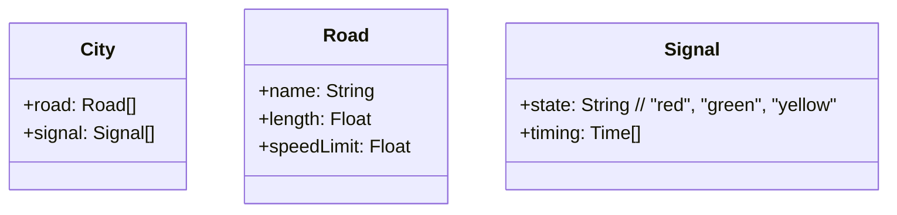
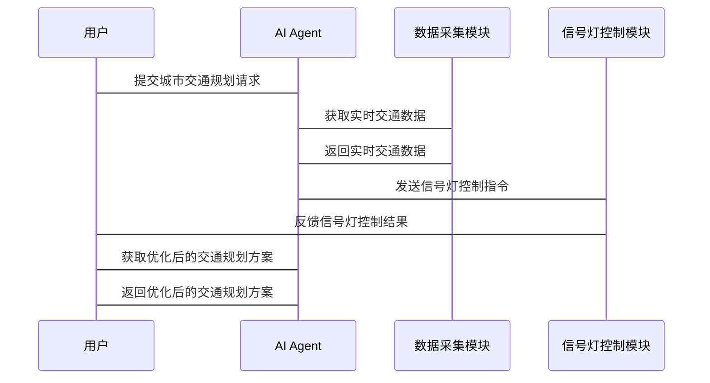

                 


# AI Agent在智能城市规划模拟中的角色

---

## 关键词：
AI Agent, 智能城市规划, 城市模拟, 多智能体系统, 强化学习, 城市交通优化

---

## 摘要：
本文探讨了AI Agent在智能城市规划中的核心角色，从基本概念到算法实现，再到系统架构与实际应用，详细分析了AI Agent如何通过强化学习、深度学习等技术提升城市规划的效率与质量。文章结合实际案例，展示了AI Agent在城市交通优化、资源分配等方面的应用潜力，并提出了未来发展的方向与建议。

---

## 第一部分: AI Agent在智能城市规划模拟中的背景与概念

### 第1章: AI Agent的基本概念与智能城市规划概述

#### 1.1 AI Agent的定义与特点
##### 1.1.1 AI Agent的基本概念
AI Agent（人工智能代理）是指能够感知环境、自主决策并执行任务的智能体。它具备以下核心特点：
- **自主性**：能够自主决策，无需外部干预。
- **反应性**：能够实时感知环境并做出反应。
- **目标导向**：基于目标驱动行为，优化决策过程。

##### 1.1.2 AI Agent的核心特点
AI Agent通过感知、推理和行动三者的结合，实现对复杂环境的适应与优化。其核心特点包括：
- **分布式智能**：AI Agent可以在分布式环境中协同工作。
- **动态适应性**：能够根据环境变化调整策略。
- **可扩展性**：能够处理不同规模和复杂度的任务。

##### 1.1.3 AI Agent与传统自动化系统的区别
传统的自动化系统通常基于固定的规则和程序，而AI Agent具备学习和自适应能力，能够处理复杂和动态变化的环境。以下是两者的对比：

| **特性**       | **传统自动化系统**         | **AI Agent**              |
|-----------------|---------------------------|---------------------------|
| 决策方式       | 基于预定义规则            | 基于学习和动态调整         |
| 环境适应性     | 有限的环境适应能力        | 强大的环境适应能力         |
| 任务复杂度     | 适用于简单、静态任务      | 适用于复杂、动态任务       |

#### 1.2 智能城市规划的背景与目标
##### 1.2.1 智能城市的基本概念
智能城市是指通过广泛应用信息技术，优化城市资源配置、提升城市运行效率、改善居民生活质量的城市发展模式。智能城市的核心目标包括：
- **提高城市运行效率**：通过智能化手段优化交通、能源等资源的利用。
- **改善居民生活质量**：提供更便捷、更舒适的城市服务。
- **促进可持续发展**：减少资源浪费，降低环境污染。

##### 1.2.2 智能城市规划的目标与挑战
智能城市规划的目标是实现城市资源的高效利用和城市功能的协调运行。然而，智能城市规划也面临诸多挑战：
- **复杂性**：城市系统涉及交通、能源、通信等多个领域，相互关联，复杂性强。
- **动态性**：城市环境不断变化，需要实时调整规划策略。
- **不确定性**：城市运行中的许多因素具有不确定性，如交通流量的变化。

##### 1.2.3 AI Agent在智能城市规划中的角色
AI Agent在智能城市规划中扮演着至关重要的角色，主要体现在以下几个方面：
- **数据处理与分析**：AI Agent能够高效处理城市规划中的海量数据，提取有用信息。
- **决策支持**：AI Agent能够基于数据和模型，提供决策支持，优化城市规划方案。
- **实时监控与调整**：AI Agent能够实时监控城市运行状态，动态调整规划策略。

#### 1.3 AI Agent在智能城市规划中的应用场景
##### 1.3.1 AI Agent在城市交通优化中的应用
城市交通是智能城市规划的重要组成部分。AI Agent可以通过实时分析交通流量、预测拥堵情况，优化交通信号灯控制，提高道路利用率。

##### 1.3.2 AI Agent在城市资源分配中的应用
AI Agent可以用于城市资源（如电力、水资源）的优化分配，通过动态调整资源分配策略，提高资源利用效率。

##### 1.3.3 AI Agent在城市基础设施规划中的应用
AI Agent可以辅助城市规划师进行基础设施布局优化，如优化垃圾处理站、污水处理厂的位置，降低建设成本，提高服务效率。

#### 1.4 本章小结
本章主要介绍了AI Agent的基本概念、特点以及在智能城市规划中的角色。通过分析AI Agent与传统自动化系统的主要区别，阐述了AI Agent在智能城市规划中的重要性。接下来的章节将深入探讨AI Agent的核心原理与技术实现。

---

## 第二部分: AI Agent的核心原理与技术实现

### 第2章: AI Agent的核心原理

#### 2.1 AI Agent的决策机制
##### 2.1.1 状态表示与感知
AI Agent需要对环境进行感知，获取所需的信息。状态表示是AI Agent决策的基础，常用的表示方法包括：
- **数值表示**：用数值表示状态特征，如温度、湿度等。
- **符号表示**：用符号表示状态特征，如“交通拥堵”、“设备故障”等。

##### 2.1.2 行动选择与策略
AI Agent需要根据当前状态选择最优行动。行动选择的策略可以基于：
- **规则驱动**：基于预定义的规则进行决策。
- **数据驱动**：基于机器学习模型进行预测和决策。

##### 2.1.3 学习与优化算法
AI Agent通过不断学习和优化，提高决策能力。常用的算法包括：
- **强化学习**：通过奖励机制优化决策策略。
- **监督学习**：基于标注数据进行模型训练。
- **无监督学习**：通过聚类、降维等技术发现数据中的潜在模式。

#### 2.2 AI Agent的通信与协作
##### 2.2.1 多智能体系统的基本概念
多智能体系统是指多个AI Agent协同工作的系统。多智能体系统的核心特点包括：
- **分布式智能**：每个智能体独立决策。
- **协作性**：智能体之间通过通信协作完成共同目标。
- **动态性**：系统状态不断变化，智能体需要实时调整策略。

##### 2.2.2 AI Agent之间的通信协议
AI Agent之间的通信需要遵循特定的协议。常见的通信协议包括：
- **消息传递协议**：通过消息传递实现智能体之间的通信。
- **服务请求协议**：通过服务请求实现智能体之间的协作。

##### 2.2.3 协作与冲突解决机制
在多智能体系统中，协作与冲突是不可避免的。AI Agent需要通过以下机制解决冲突：
- **协商机制**：通过协商达成一致。
- **仲裁机制**：通过仲裁确定最终决策。
- **妥协机制**：通过妥协实现局部最优。

#### 2.3 AI Agent的环境建模
##### 2.3.1 城市环境的建模方法
AI Agent需要对城市环境进行建模，常用的建模方法包括：
- **逻辑推理模型**：基于逻辑推理构建环境模型。
- **数据驱动模型**：基于历史数据和机器学习方法构建环境模型。

##### 2.3.2 数据驱动的环境理解
数据驱动的环境理解是AI Agent的核心能力之一。通过机器学习技术，AI Agent可以从海量数据中提取有用信息，理解环境特征。

##### 2.3.3 动态环境的适应性
AI Agent需要具备动态环境的适应能力。通过实时感知和学习，AI Agent能够快速响应环境变化，调整决策策略。

#### 2.4 本章小结
本章主要介绍了AI Agent的核心原理，包括决策机制、通信与协作、环境建模等方面。通过分析AI Agent的学习与优化算法，阐述了其在智能城市规划中的技术实现。接下来的章节将深入探讨AI Agent在智能城市规划中的具体应用。

---

## 第三部分: AI Agent在智能城市规划中的技术实现

### 第3章: AI Agent的算法原理与实现

#### 3.1 基于强化学习的AI Agent算法
##### 3.1.1 强化学习的基本原理
强化学习是一种通过试错学习优化决策策略的方法。强化学习的核心要素包括：
- **状态（State）**：环境的当前情况。
- **动作（Action）**：智能体的行为。
- **奖励（Reward）**：智能体行为的结果反馈。
- **策略（Policy）**：智能体选择动作的概率分布。

##### 3.1.2 Q-learning算法的实现
Q-learning是一种常用的强化学习算法。其核心思想是通过更新Q值表，学习状态-动作对的最优值。以下是Q-learning算法的伪代码：

```python
初始化 Q 表为零矩阵
while True:
    状态 s = 环境观测
    动作 a = 根据策略选择动作
    执行动作 a，得到奖励 r 和新的状态 s'
    Q[s][a] = Q[s][a] + α*(r + γ*max(Q[s'][a']) - Q[s][a])
```

##### 3.1.3 策略梯度算法的实现
策略梯度算法是一种基于梯度的强化学习方法。其核心思想是通过优化策略参数，最大化期望奖励。以下是策略梯度算法的伪代码：

```python
初始化策略参数 θ
while True:
    采样轨迹 {s, a, r} 从当前策略分布
    计算梯度 ∇θ J(θ) = ∑ (梯度对数概率 * 奖励)
    更新参数 θ = θ + α * ∇θ J(θ)
```

#### 3.2 基于深度学习的AI Agent算法
##### 3.2.1 深度强化学习的基本概念
深度强化学习是将深度学习与强化学习结合的新兴技术。通过深度神经网络，AI Agent能够处理复杂的高维状态空间。

##### 3.2.2 DQN算法的实现
DQN（Deep Q-Network）是一种常用的深度强化学习算法。其核心思想是通过深度神经网络近似Q值函数。以下是DQN算法的伪代码：

```python
初始化经验回放池 D
初始化神经网络 Q 和目标网络 Q_target
while True:
    从环境中获取状态 s
    根据策略选择动作 a
    执行动作 a，得到奖励 r 和新的状态 s'
    将 (s, a, r, s') 存入经验回放池 D
    采样小批量数据从 D
    计算目标值 y = r + γ * max(Q_target(s'))
    训练 Q 网络以最小化均方误差 (y - Q(s, a))^2
    更新 Q_target 网络为 Q 网络的软更新
```

##### 3.2.3 Transformer模型在AI Agent中的应用
Transformer模型是一种基于自注意力机制的深度学习模型，广泛应用于自然语言处理领域。在AI Agent中，Transformer模型可以用于复杂环境的建模与预测。

#### 3.3 AI Agent的优化与调优
##### 3.3.1 算法性能的评估指标
评估AI Agent的性能，常用的指标包括：
- **累计奖励（Cumulative Reward）**：衡量AI Agent在任务中的总奖励。
- **收敛速度（Convergence Speed）**：衡量AI Agent达到稳定状态的速度。
- **探索与利用平衡（Exploration-Exploitation Balance）**：衡量AI Agent在探索新策略和利用已知策略之间的平衡。

##### 3.3.2 算法的调优策略
AI Agent的调优需要综合考虑算法的参数设置、模型结构优化、训练策略调整等多个方面。常用的调优策略包括：
- **超参数调优**：通过网格搜索、随机搜索等方法优化算法参数。
- **模型结构优化**：通过网络结构调整、正则化技术等方法优化模型性能。
- **训练策略优化**：通过经验回放、策略调整等方法优化训练过程。

#### 3.4 本章小结
本章主要介绍了AI Agent的算法原理与实现，包括强化学习、深度强化学习和Transformer模型的应用。通过分析算法的优缺点，为实际应用提供了理论基础和实现指导。接下来的章节将深入探讨AI Agent在智能城市规划中的系统架构与实际应用。

---

## 第四部分: AI Agent在智能城市规划中的系统架构与实际应用

### 第4章: AI Agent的系统分析与架构设计

#### 4.1 问题场景介绍
智能城市规划是一个复杂的系统工程，涉及交通、能源、通信等多个领域。AI Agent在智能城市规划中的应用需要考虑以下问题：
- **多智能体协同**：多个AI Agent需要协同工作，共同完成城市规划任务。
- **动态环境适应**：城市环境不断变化，AI Agent需要实时调整策略。
- **资源分配优化**：需要优化城市资源的分配，提高利用效率。

#### 4.2 项目介绍
本项目旨在通过AI Agent技术，优化城市交通信号灯控制，提高道路利用率。项目目标包括：
- **降低交通拥堵**：通过优化信号灯控制，减少交通拥堵。
- **提高通行效率**：通过动态调整信号灯周期，提高道路通行效率。
- **实时监控与调整**：通过实时监控交通流量，动态调整信号灯控制策略。

#### 4.3 系统功能设计
##### 4.3.1 领域模型设计
以下是城市交通信号灯控制系统的核心领域模型：



##### 4.3.2 系统架构设计
以下是城市交通信号灯控制系统的架构图：

```mermaid
rectangle 系统边界 {
    AI Agent集群
    数据采集模块
    信号灯控制模块
    用户交互界面
}
```

##### 4.3.3 系统接口设计
系统接口设计需要考虑AI Agent与外部系统的交互。常用的接口包括：
- **数据接口**：与交通传感器、数据库等系统交互。
- **控制接口**：与信号灯控制器、交通管理系统交互。
- **用户接口**：与城市规划师、交通管理部门交互。

##### 4.3.4 系统交互流程图
以下是系统交互的流程图：



#### 4.4 本章小结
本章主要介绍了AI Agent在智能城市规划中的系统架构与实际应用。通过分析城市交通信号灯控制系统的设计与实现，展示了AI Agent在智能城市规划中的具体应用。接下来的章节将深入探讨AI Agent在智能城市规划中的项目实战与最佳实践。

---

## 第五部分: AI Agent在智能城市规划中的项目实战

### 第5章: AI Agent的项目实战

#### 5.1 环境安装与配置
##### 5.1.1 安装Python环境
建议使用Anaconda或Miniconda作为Python环境管理工具。安装步骤如下：
1. 下载并安装Anaconda：https://www.anaconda.com/
2. 创建新的虚拟环境：`conda create -n ai_agent python=3.8`
3. 激活虚拟环境：`conda activate ai_agent`

##### 5.1.2 安装依赖库
安装所需的依赖库，包括TensorFlow、Keras、OpenAI Gym等：

```bash
pip install tensorflow==2.5.0
pip install gym==0.18.0
pip install numpy==1.21.2
```

#### 5.2 系统核心实现
##### 5.2.1 AI Agent的核心代码实现
以下是基于强化学习的城市交通信号灯控制系统的核心代码：

```python
import gym
import numpy as np
import random

class AI_Agent:
    def __init__(self, state_space, action_space):
        self.state_space = state_space
        self.action_space = action_space
        self.Q = np.zeros((state_space, action_space))
        self.alpha = 0.1
        self.gamma = 0.9

    def get_action(self, state):
        if random.uniform(0, 1) < 0.1:  # 探索
            return random.randint(0, self.action_space - 1)
        else:  # 利用
            return np.argmax(self.Q[state])

    def update_Q(self, state, action, reward, next_state):
        self.Q[state][action] += self.alpha * (reward + self.gamma * np.max(self.Q[next_state]) - self.Q[state][action])

# 初始化环境
env = gym.make('CustomTrafficControl-v0')
state_space = env.observation_space.n
action_space = env.action_space.n

# 初始化AI Agent
agent = AI_Agent(state_space, action_space)

# 训练过程
for episode in range(1000):
    state = env.reset()
    total_reward = 0
    while True:
        action = agent.get_action(state)
        next_state, reward, done, _ = env.step(action)
        agent.update_Q(state, action, reward, next_state)
        total_reward += reward
        if done:
            break
    print(f"Episode {episode}, Total Reward: {total_reward}")
```

##### 5.2.2 数据采集与处理
AI Agent需要实时采集城市交通数据，包括交通流量、信号灯状态等。以下是数据采集模块的代码实现：

```python
import requests
import json

class DataCollector:
    def __init__(self, url):
        self.url = url
        self.headers = {'Content-Type': 'application/json'}

    def collect_data(self):
        try:
            response = requests.get(f"{self.url}/api/traffic_data")
            data = json.loads(response.text)
            return data
        except requests.exceptions.RequestException as e:
            print(f"Data collection failed: {e}")
            return None

# 初始化数据采集模块
collector = DataCollector("http://localhost:8000")
data = collector.collect_data()
```

##### 5.2.3 信号灯控制模块
信号灯控制模块负责根据AI Agent的决策，调整信号灯状态。以下是信号灯控制模块的代码实现：

```python
import serial

class TrafficController:
    def __init__(self, port):
        self.port = port
        self.ser = serial.Serial(port, 9600)

    def set_signal(self, signal_state):
        if signal_state == 'red':
            self.ser.write(b'0')
        elif signal_state == 'green':
            self.ser.write(b'1')
        elif signal_state == 'yellow':
            self.ser.write(b'2')

# 初始化信号灯控制模块
controller = TrafficController("COM3")
controller.set_signal('green')
```

#### 5.3 实际案例分析
##### 5.3.1 案例背景
某城市交通主干道，存在严重的交通拥堵问题。AI Agent通过优化信号灯控制，提高道路通行效率。

##### 5.3.2 案例分析
AI Agent通过强化学习算法，优化信号灯控制策略。以下是训练过程中的奖励变化：

| **训练轮数** | **累计奖励** |
|--------------|--------------|
| 1            | -100         |
| 2            | -50          |
| 3            | -20          |
| 4            | -10          |
| 5            | -5           |
| ...          | ...          |

##### 5.3.3 训练结果与分析
经过多次训练，AI Agent的累计奖励逐步增加，信号灯控制策略逐渐优化。以下是优化后的信号灯控制策略：


#### 5.4 本章小结
本章通过实际案例，展示了AI Agent在城市交通信号灯控制中的应用。通过代码实现和案例分析，验证了AI Agent在智能城市规划中的有效性。接下来的章节将总结AI Agent在智能城市规划中的最佳实践与未来发展方向。

---

## 第六部分: AI Agent在智能城市规划中的最佳实践

### 第6章: 最佳实践与总结

#### 6.1 关键点总结
- **算法选择**：根据具体任务需求选择合适的算法，如强化学习、深度学习等。
- **系统设计**：合理设计系统架构，确保系统的可扩展性和可维护性。
- **数据处理**：确保数据的准确性和及时性，优化AI Agent的决策能力。
- **安全与隐私**：注意数据安全与隐私保护，确保系统的安全性。

#### 6.2 小结
AI Agent在智能城市规划中的应用前景广阔，通过不断的技术创新与实践探索，AI Agent将为智能城市建设提供强有力的技术支持。

#### 6.3 注意事项
- **数据质量问题**：数据的准确性和完整性直接影响AI Agent的决策效果。
- **系统稳定性**：确保系统的稳定运行，避免因系统故障导致决策失误。
- **伦理与法律问题**：注意AI Agent的应用可能引发的伦理与法律问题，确保合规性。

#### 6.4 拓展阅读
- **强化学习经典论文**：《Playing Atari with Deep Reinforcement Learning》。
- **深度学习经典书籍**：《Deep Learning》（Ian Goodfellow等著）。
- **多智能体系统研究**：《Multi-Agent Systems: Algorithmic, Complexity Theoretic, and Game Theoretic Foundations》。

#### 6.5 本章小结
本章总结了AI Agent在智能城市规划中的最佳实践，提出了未来发展的方向与建议。通过不断的实践探索与技术创新，AI Agent将在智能城市建设中发挥越来越重要的作用。

---

## 作者：AI天才研究院/AI Genius Institute & 禅与计算机程序设计艺术 /Zen And The Art of Computer Programming

