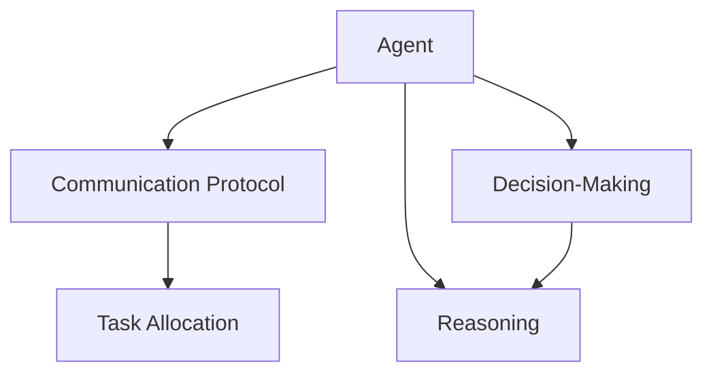
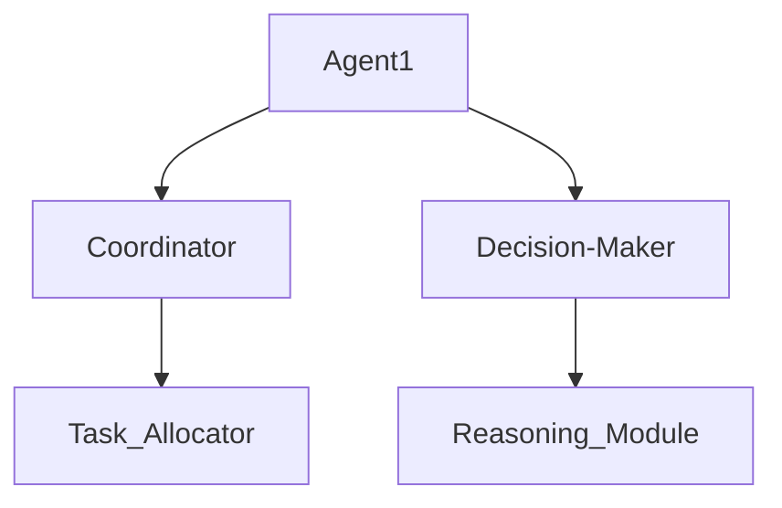
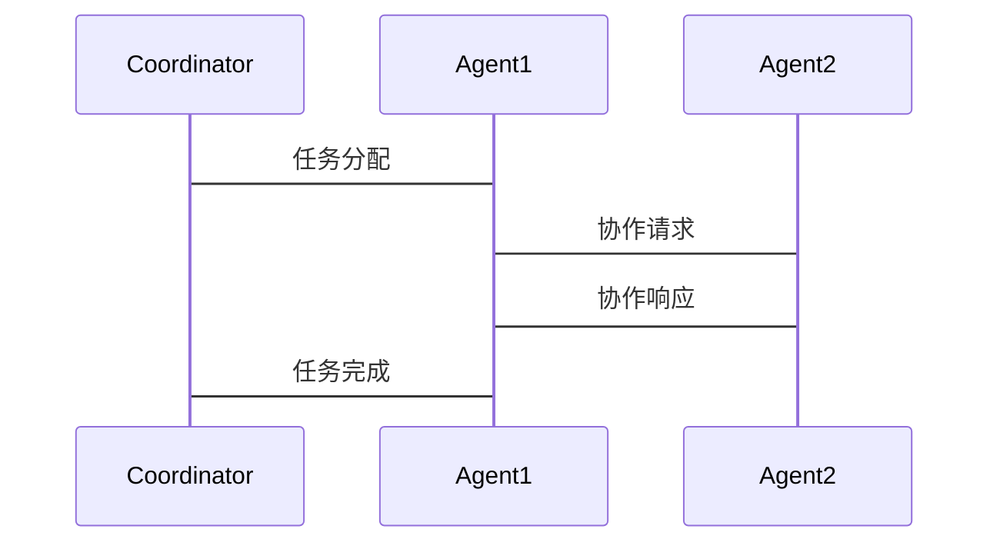

                 


# AI Agent的多Agent协同推理与决策

> 关键词：多Agent系统、协同推理、决策模型、分布式计算、强化学习

> 摘要：本文深入探讨了AI Agent在多Agent系统中的协同推理与决策问题，从基本概念、核心算法到系统架构设计，全面分析了多Agent协同推理与决策的实现原理和应用实践。通过详细讲解分布式推理算法、基于模型的推理、强化学习等关键技术，结合实际案例分析，为读者提供了系统化的知识体系和实践指南。

---

# 第一部分: AI Agent的多Agent协同推理与决策基础

## 第1章: 多Agent系统的背景与概念

### 1.1 多Agent系统概述

#### 1.1.1 从单智能体到多智能体的演进
单智能体系统通过集中式计算完成任务，但在复杂环境中存在资源消耗大、扩展性差等问题。多Agent系统通过分布式计算和协作机制，实现了任务的高效分解与协同完成。

#### 1.1.2 多智能体系统的核心特点
- **分布式计算**：多个智能体协同完成任务，降低单点故障风险。
- **协作性**：智能体之间通过通信与协作，共同达成全局目标。
- **自主性**：每个智能体具备自主决策能力，能够独立处理部分任务。

#### 1.1.3 多智能体系统的边界与外延
- **边界**：明确系统的输入与输出，定义智能体之间的交互接口。
- **外延**：多Agent系统可与其他系统（如数据库、传感器）结合，实现更复杂的任务。

### 1.2 多Agent协同推理与决策的背景

#### 1.2.1 问题背景分析
在复杂动态环境中，单智能体难以完成复杂任务，需要多个智能体协同工作。

#### 1.2.2 问题描述与目标
通过多个智能体的协作，实现复杂任务的分解与执行，提高系统的智能性和适应性。

#### 1.2.3 问题解决的必要性
- 提高系统效率：通过任务分解和并行处理，提升整体性能。
- 增强容错性：多个智能体协同，避免单点故障。

#### 1.2.4 多Agent系统的核心要素组成
- **智能体**：具备感知、推理、决策能力。
- **通信协议**：定义智能体之间的交互规则。
- **协作机制**：实现任务分解与协同。

---

## 第2章: 多Agent协同推理与决策的核心概念

### 2.1 多Agent系统的基本概念

#### 2.1.1 Agent的定义与属性
- **定义**：具备感知环境、自主决策、与环境交互能力的实体。
- **属性**：
  - 自主性：独立决策能力。
  - 反应性：实时感知环境变化并做出反应。
  - 社会性：与其他智能体协作完成任务。

#### 2.1.2 多Agent系统中的角色与分工
- **协调者**：负责任务分配与监控。
- **执行者**：具体执行分配的任务。
- **监督者**：负责评估任务执行情况。

### 2.2 协作机制与通信协议

#### 2.2.1 协作机制的分类与特点
- **基于角色分配**：根据任务需求分配角色。
- **基于任务分配**：根据任务特性分配智能体。
- **基于能力分配**：根据智能体的能力分配任务。

#### 2.2.2 通信协议的作用与实现
- **作用**：定义智能体之间的通信规则。
- **实现**：通过消息传递机制实现智能体之间的交互。

### 2.3 推理与决策的关系

#### 2.3.1 推理的基本原理
- **定义**：基于已知信息，推导出新的结论。
- **过程**：从环境信息中提取特征，进行逻辑推理。

#### 2.3.2 决策的定义与过程
- **定义**：基于推理结果，做出行动选择。
- **过程**：分析多种可能性，选择最优行动方案。

#### 2.3.3 推理与决策的协同关系
- 推理为决策提供依据，决策指导推理的方向和深度。

### 2.4 核心概念与联系

#### 2.4.1 多Agent系统的核心概念原理
- **分布式计算**：任务分解与并行处理。
- **协作机制**：智能体之间的协同与通信。

#### 2.4.2 概念属性特征对比表格
| 概念       | 自主性 | 反应性 | 社会性 |
|------------|-------|-------|-------|
| Agent      | 高     | 高     | 高     |
| 多Agent系统| 分散   | 分散   | 高     |

#### 2.4.3 ER实体关系图架构


---

## 第3章: 多Agent协同推理与决策的核心算法

### 3.1 分布式推理算法

#### 3.1.1 分布式推理的基本原理
- **定义**：多个智能体分别进行推理，然后汇总结果。
- **过程**：通过通信协议共享推理结果。

#### 3.1.2 分布式推理的实现步骤
1. **任务分解**：将整体任务分解为多个子任务。
2. **子任务分配**：分配给不同的智能体。
3. **推理计算**：各智能体独立完成推理。
4. **结果汇总**：将推理结果汇总，得出最终结论。

#### 3.1.3 分布式推理的数学模型
$$ P(global\ outcome) = \prod_{i=1}^{n} P_i(local\ outcome_i) $$

#### 3.1.4 分布式推理的Python实现示例
```python
import random

def distributed_reasoning(num_agents):
    results = []
    for _ in range(num_agents):
        # 每个智能体进行推理
        result = random.choice([True, False])
        results.append(result)
    # 汇总结果
    final_result = any(results)
    return final_result

print(distributed_reasoning(3))
```

### 3.2 基于模型的推理

#### 3.2.1 基于模型的推理的基本原理
- **定义**：基于领域知识构建模型，进行推理。

#### 3.2.2 基于模型的推理的实现步骤
1. **知识建模**：构建领域知识图谱。
2. **推理规则定义**：定义推理规则。
3. **推理执行**：基于规则进行推理。

#### 3.2.3 基于模型的推理的数学模型
$$ \text{结论} = \text{模型} \times \text{输入} $$

#### 3.2.4 基于模型的推理的Python实现示例
```python
from knowledge_graph import KnowledgeGraph

kg = KnowledgeGraph()
kg.add_fact("A", "cause", "B")
kg.add_fact("B", "cause", "C")

conclusion = kg.reasoning("A", "result")
print(conclusion)
```

---

## 第4章: 多Agent协同决策模型

### 4.1 基于效用的决策模型

#### 4.1.1 基于效用的决策模型的基本原理
- **定义**：通过效用函数评估不同决策的收益。

#### 4.1.2 基于效用的决策模型的实现步骤
1. **定义效用函数**：量化各决策的收益。
2. **计算效用值**：对各决策进行效用计算。
3. **选择最优决策**：选择效用值最大的决策。

#### 4.1.3 基于效用的决策模型的数学模型
$$ U(a) = \sum_{i=1}^{n} w_i \times x_i $$

#### 4.1.4 基于效用的决策模型的Python实现示例
```python
def utility_based_decision(moptions, weights):
    max_utility = -float('inf')
    best_option = None
    for option in moptions:
        utility = sum(w * v for w, v in zip(weights, option.features))
        if utility > max_utility:
            max_utility = utility
            best_option = option
    return best_option

print(utility_based_decision(options, weights))
```

### 4.2 基于强化学习的决策模型

#### 4.2.1 基于强化学习的决策模型的基本原理
- **定义**：通过强化学习训练智能体，使其在复杂环境中做出最优决策。

#### 4.2.2 基于强化学习的决策模型的实现步骤
1. **环境建模**：构建智能体所处的环境。
2. **动作空间定义**：定义智能体可执行的动作。
3. **奖励机制设计**：设计奖励函数，量化智能体行为的好坏。
4. **策略训练**：通过强化学习算法训练智能体策略。

#### 4.2.3 基于强化学习的决策模型的数学模型
$$ Q(s, a) = r + \gamma \max_{a'} Q(s', a') $$

#### 4.2.4 基于强化学习的决策模型的Python实现示例
```python
import numpy as np

class QLearning:
    def __init__(self, state_space, action_space, gamma=0.9):
        self.state_space = state_space
        self.action_space = action_space
        self.gamma = gamma
        self.Q = np.zeros((state_space, action_space))
    
    def choose_action(self, state, epsilon=0.1):
        if np.random.random() < epsilon:
            return np.random.randint(self.action_space)
        q_values = self.Q[state, :]
        return np.argmax(q_values)
    
    def update_Q(self, state, action, reward, next_state):
        self.Q[state, action] = reward + self.gamma * np.max(self.Q[next_state, :])

# 初始化
ql = QLearning(5, 3)
action = ql.choose_action(2)
ql.update_Q(2, action, reward=1, next_state=3)
```

---

## 第5章: 多Agent系统架构与设计

### 5.1 系统分析与架构设计

#### 5.1.1 问题场景介绍
- 智能交通系统中的路径规划问题。

#### 5.1.2 系统功能设计
- **领域模型**：构建交通网络模型。
- **架构设计**：设计多Agent协同的系统架构。

#### 5.1.3 系统架构设计图


#### 5.1.4 接口设计
- **通信接口**：定义智能体之间的通信协议。
- **任务接口**：定义任务分配的接口。

#### 5.1.5 交互序列图


### 5.2 项目实战

#### 5.2.1 环境安装
- **Python环境**：安装Python 3.8以上版本。
- **依赖库安装**：安装numpy、pandas、matplotlib等库。

#### 5.2.2 核心代码实现

##### 5.2.2.1 知识图谱构建代码
```python
from kg_converter import KnowledgeGraph

kg = KnowledgeGraph()
kg.add_fact("A", "cause", "B")
kg.add_fact("B", "cause", "C")
```

##### 5.2.2.2 强化学习算法代码
```python
class QLearning:
    def __init__(self, state_space, action_space, gamma=0.9):
        self.state_space = state_space
        self.action_space = action_space
        self.gamma = gamma
        self.Q = np.zeros((state_space, action_space))
    
    def choose_action(self, state, epsilon=0.1):
        if np.random.random() < epsilon:
            return np.random.randint(self.action_space)
        q_values = self.Q[state, :]
        return np.argmax(q_values)
    
    def update_Q(self, state, action, reward, next_state):
        self.Q[state, action] = reward + self.gamma * np.max(self.Q[next_state, :])
```

##### 5.2.2.3 分布式推理代码
```python
def distributed_reasoning(num_agents):
    results = []
    for _ in range(num_agents):
        # 每个智能体进行推理
        result = random.choice([True, False])
        results.append(result)
    # 汇总结果
    final_result = any(results)
    return final_result

print(distributed_reasoning(3))
```

#### 5.2.3 代码解读与分析
- **知识图谱构建**：通过KnowledgeGraph类构建领域知识图谱。
- **强化学习算法**：通过QLearning类实现强化学习算法，训练智能体的决策能力。
- **分布式推理**：通过分布式推理算法，实现多个智能体的协同推理。

#### 5.2.4 案例分析
- **智能交通系统**：通过多Agent协同推理与决策，实现路径规划和交通流量优化。

#### 5.2.5 项目小结
- **实现步骤**：从环境安装到代码实现，详细讲解了项目的实现过程。
- **关键点**：强调了知识图谱构建、强化学习算法、分布式推理算法等关键点。

---

## 第6章: 最佳实践与未来展望

### 6.1 最佳实践 tips
- **模块化设计**：将系统划分为多个模块，便于维护和扩展。
- **性能优化**：通过并行计算、缓存优化等技术提升系统性能。
- **安全性保障**：确保系统具备良好的安全防护机制，防止恶意攻击。

### 6.2 小结
多Agent协同推理与决策是人工智能领域的重要研究方向，通过分布式计算、知识图谱构建、强化学习等技术，实现复杂任务的高效完成。

### 6.3 注意事项
- **系统设计**：在系统设计阶段，充分考虑系统的可扩展性、可维护性。
- **算法选择**：根据具体场景选择合适的算法，避免盲目追求复杂度。
- **性能监控**：实时监控系统性能，及时发现和解决问题。

### 6.4 拓展阅读
- **推荐书籍**：《Multi-Agent Systems: Algorithmic, Complexity, and Synthesis》
- **推荐论文**：相关领域的最新研究论文。

---

## 第7章: 总结

通过本文的深入探讨，我们全面了解了AI Agent的多Agent协同推理与决策的实现原理和应用实践。从基础概念到高级算法，再到实际案例分析，为读者提供了系统化的知识体系和实践指南。未来，随着人工智能技术的不断发展，多Agent协同推理与决策将在更多领域得到广泛应用，为人类社会的发展做出更大的贡献。

---

**作者：AI天才研究院/AI Genius Institute & 禅与计算机程序设计艺术 /Zen And The Art of Computer Programming**

