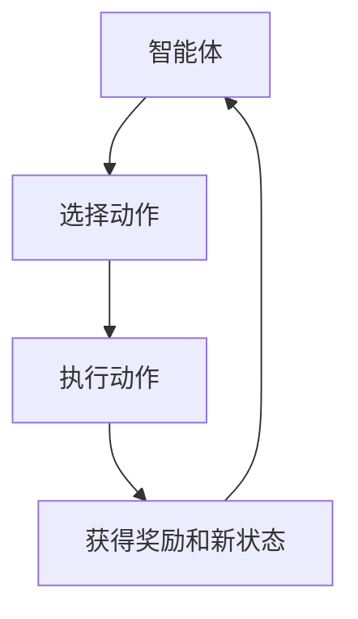
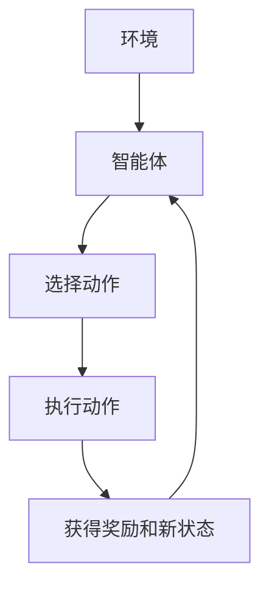
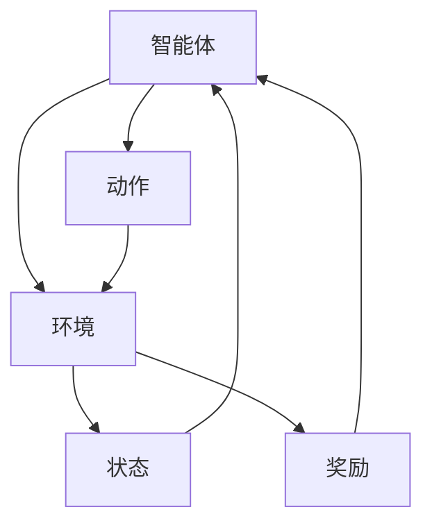

                 


# AI Agent的强化学习在复杂环境中的应用

> 关键词：AI Agent，强化学习，复杂环境，Q-Learning，DQN，环境建模

> 摘要：本文深入探讨AI Agent在复杂环境中的强化学习应用，分析强化学习的核心算法及其在复杂环境中的建模挑战，结合实际案例详细讲解AI Agent的决策机制与系统架构设计。

---

## 第一章: AI Agent与强化学习概述

### 1.1 AI Agent的基本概念

#### 1.1.1 什么是AI Agent？
AI Agent（智能体）是指在环境中能够感知并自主行动以实现目标的实体。AI Agent可以是软件程序、机器人或其他智能系统，其核心目标是通过与环境交互来优化自身行为以达到预定目标。

#### 1.1.2 AI Agent的特点与分类
AI Agent具有以下特点：
1. **自主性**：能够在没有外部干预的情况下自主决策。
2. **反应性**：能够感知环境并实时调整行为。
3. **目标导向**：所有行动都以实现特定目标为导向。
4. **学习能力**：通过与环境的交互不断优化自身行为。

AI Agent可以分为以下几类：
1. **简单反射型Agent**：基于当前感知直接行动，不考虑未来状态。
2. **基于模型的规划型Agent**：利用环境模型进行规划，考虑未来可能的状态。
3. **目标驱动型Agent**：以明确的目标为导向，采取最优行动。
4. **效用驱动型Agent**：通过最大化效用函数来优化决策。

#### 1.1.3 强化学习在AI Agent中的作用
强化学习（Reinforcement Learning, RL）是一种通过试错机制使智能体在与环境交互中学习最优策略的方法。AI Agent通过强化学习可以：
- 在复杂环境中自主探索，发现最优策略。
- 适应动态变化的环境，保持持续的性能优化。

### 1.2 强化学习的基本原理

#### 1.2.1 强化学习的定义与特点
强化学习是一种机器学习范式，智能体通过与环境交互，学习如何采取一系列行动以最大化累积奖励。其核心特点包括：
1. **试错学习**：通过不断尝试不同的行动，逐步逼近最优策略。
2. **延迟奖励**：奖励可能在行动之后较长时间才获得，需要智能体具备长期规划能力。
3. **不确定性**：环境可能是随机的或部分可观察的，智能体需要在不确定性中做出决策。

#### 1.2.2 状态、动作、奖励的定义
在强化学习中，核心要素包括：
1. **状态（State）**：描述环境当前情况的特征向量。
2. **动作（Action）**：智能体在给定状态下选择的行动。
3. **奖励（Reward）**：环境对智能体行动的反馈，用于指导智能体调整策略。

#### 1.2.3 强化学习与监督学习的区别
| 特性 | 监督学习 | 强化学习 |
|------|----------|----------|
| 数据来源 | 标签数据 | 奖励信号 |
| 目标 | 最小化预测误差 | 最大化累积奖励 |
| 交互方式 | 非交互式 | 试错式交互 |

### 1.3 复杂环境中的AI Agent应用场景

#### 1.3.1 复杂环境的定义与特点
复杂环境指的是具有以下特点的环境：
1. **高维状态空间**：状态可能有数百甚至数千个维度。
2. **非线性关系**：状态与动作之间的关系可能高度非线性。
3. **动态变化**：环境可能随时间发生变化，智能体需要不断调整策略。

#### 1.3.2 AI Agent在复杂环境中的优势
1. **自主性**：能够在复杂环境中自主决策，无需人工干预。
2. **适应性**：能够快速适应环境变化，保持高性能。
3. **优化能力**：通过强化学习不断优化决策策略。

#### 1.3.3 典型应用场景分析
1. **游戏AI**：在复杂游戏中训练AI Agent实现最优策略。
2. **机器人控制**：在动态环境中实现机器人自主导航和操作。
3. **金融交易**：在金融市场中进行智能投资和风险管理。

---

## 第二章: 强化学习的核心算法原理

### 2.1 Q-Learning算法

#### 2.1.1 Q-Learning的基本原理
Q-Learning是一种基于值函数的强化学习算法，通过学习状态-动作值函数（Q-value）来优化决策。其核心思想是：智能体通过与环境交互，逐步更新Q表，最终找到最优策略。

#### 2.1.2 Q-Learning的数学模型

状态-动作值函数Q(s, a)的更新公式如下：

$$ Q(s, a) = Q(s, a) + \alpha \left[ r + \gamma \max_{a'} Q(s', a') - Q(s, a) \right] $$

其中：
- \( \alpha \) 是学习率，控制更新步长。
- \( \gamma \) 是折扣因子，平衡当前奖励与未来奖励的重要性。
- \( r \) 是当前步的奖励。
- \( s' \) 是下一步的状态。

#### 2.1.3 Q-Learning的优缺点
| 优点 | 缺点 |
|------|------|
| 简单易实现 | 适用于低维状态空间 |
| 离线学习 | 无法处理高维或连续动作空间 |
| 适用于静态环境 | 无法处理动态变化的环境 |

#### 2.1.4 Q-Learning算法流程图（Mermaid）


### 2.2 Deep Q-Network (DQN)算法

#### 2.2.1 DQN的基本原理
DQN通过深度神经网络近似值函数，解决了Q-Learning在高维状态空间和连续动作空间中的应用难题。其核心思想是：使用两个神经网络（主网络和目标网络）交替更新，避免目标值的剧烈波动。

#### 2.2.2 DQN的网络结构与训练过程

DQN的网络结构如下：
- **主网络（Policy Network）**：用于选择当前动作。
- **目标网络（Target Network）**：用于评估动作的价值。

DQN的训练过程包括以下步骤：
1. **环境交互**：智能体根据当前状态选择动作，并执行动作，获得新状态和奖励。
2. **经验回放**：将经验存储在经验回放缓冲区，随机抽取小批量样本进行训练。
3. **网络更新**：定期更新目标网络的权重，使其逼近主网络的权重。

#### 2.2.3 DQN的数学模型与公式

动作选择策略：
$$ \epsilon \text{-贪心策略} $$

损失函数：
$$ \mathcal{L} = \mathbb{E}[ (r + \gamma Q(s', a') - Q(s, a))^2 ] $$

网络更新策略：
$$ \theta_{\text{target}} = \tau \theta_{\text{main}} + (1 - \tau) \theta_{\text{target}} $$

其中，\( \tau \) 是软更新系数。

#### 2.2.4 DQN算法流程图（Mermaid）


---

## 第三章: 复杂环境中的强化学习建模与挑战

### 3.1 环境建模

#### 3.1.1 状态空间的定义与构建
状态空间是描述环境状态的集合。在复杂环境中，状态空间通常是高维的，可能需要降维或特征提取技术来处理。

#### 3.1.2 动作空间的定义与构建
动作空间是智能体可以执行的动作的集合。在复杂环境中，动作空间可能是连续的，需要使用策略网络来参数化动作。

#### 3.1.3 奖励函数的设计
奖励函数的设计直接影响智能体的学习效果。在复杂环境中，需要设计合理的奖励机制，引导智能体向期望的行为方向发展。

### 3.2 复杂环境中的强化学习挑战

#### 3.2.1 状态空间的高维性
高维状态空间会导致计算复杂度急剧上升，需要使用深度神经网络来近似值函数。

#### 3.2.2 动作空间的复杂性
复杂动作空间需要智能体具备更强的决策能力，可能需要使用策略网络来参数化动作。

#### 3.2.3 环境的不确定性与动态性
复杂环境通常是动态变化的，智能体需要具备适应性，能够根据环境变化调整策略。

### 3.3 算法改进与优化

#### 3.3.1 策略梯度方法
策略梯度方法直接优化策略参数，适用于连续动作空间。其核心思想是：通过梯度上升方法最大化目标函数。

策略梯度更新公式：
$$ \theta = \theta + \alpha \nabla_\theta J(\theta) $$

#### 3.3.2 值函数逼近方法
值函数逼近方法通过近似值函数来优化策略，适用于高维状态空间。其核心思想是：通过深度神经网络近似值函数，降低计算复杂度。

#### 3.3.3 离线与在线学习的平衡
在线学习需要实时与环境交互，适用于动态变化的环境；离线学习可以利用历史数据进行训练，适用于静态环境。

---

## 第四章: AI Agent的决策机制与策略网络

### 4.1 策略网络的基本原理

#### 4.1.1 策略网络的定义
策略网络是一种用于生成策略的神经网络，直接从状态到动作进行映射。

#### 4.1.2 策略网络的训练方法
策略网络可以通过策略梯度方法进行训练，目标是最大化累积奖励。

#### 4.1.3 策略网络的优势
- 适用于连续动作空间。
- 可以直接生成动作，简化决策过程。

### 4.2 价值函数网络

#### 4.2.1 价值函数网络的定义
价值函数网络是一种用于估计状态值函数的神经网络，通过最大化值函数来优化策略。

#### 4.2.2 价值函数网络的训练方法
价值函数网络可以通过Q-Learning或DQN方法进行训练，目标是最小化损失函数。

#### 4.2.3 价值函数网络的优势
- 可以提供稳定的学习过程。
- 适用于高维状态空间。

---

## 第五章: 复杂环境中的系统架构设计

### 5.1 项目介绍

#### 5.1.1 项目背景
本项目旨在研究AI Agent在复杂环境中的强化学习应用，通过设计和实现一个AI Agent系统，验证强化学习算法在复杂环境中的有效性。

#### 5.1.2 系统功能设计
系统功能包括：
1. **环境模拟**：构建复杂环境的模拟器。
2. **智能体决策**：实现AI Agent的决策机制。
3. **强化学习训练**：训练智能体在复杂环境中优化策略。

#### 5.1.3 系统架构设计（Mermaid架构图）


---

## 第六章: 项目实战

### 6.1 环境安装与配置

#### 6.1.1 环境搭建
安装必要的依赖项，如Python、TensorFlow、OpenAI Gym等。

#### 6.1.2 环境配置
配置复杂环境的模拟器，定义状态、动作和奖励函数。

### 6.2 系统核心实现源代码

#### 6.2.1 策略网络实现
```python
import tensorflow as tf

class PolicyNetwork:
    def __init__(self, state_dim, action_dim):
        self.state_dim = state_dim
        self.action_dim = action_dim
        self.model = self.build_model()

    def build_model(self):
        model = tf.keras.Sequential([
            tf.keras.layers.Dense(64, activation='relu', input_dim=self.state_dim),
            tf.keras.layers.Dense(64, activation='relu'),
            tf.keras.layers.Dense(self.action_dim, activation='softmax')
        ])
        return model
```

#### 6.2.2 强化学习训练
```python
import numpy as np

class ReinforcementLearning:
    def __init__(self, policy_network):
        self.policy = policy_network
        self.optimizer = tf.keras.optimizers.Adam(learning_rate=0.001)

    def update_policy(self, states, actions, rewards, next_states):
        with tf.GradientTape() as tape:
            current_policy = self.policy.model(states)
            target_policy = self.policy.model(next_states)
            loss = tf.reduce_mean(tf.square(rewards + tf.reduce_max(target_policy, axis=1) * 0.99 - current_policy))
        gradients = tape.gradient(loss, self.policy.model.trainable_weights)
        self.optimizer.apply_gradients(zip(gradients, self.policy.model.trainable_weights))
```

### 6.3 代码应用解读与分析

#### 6.3.1 策略网络解读
策略网络是一个多层感知机（MLP），输入是状态向量，输出是动作概率分布。

#### 6.3.2 强化学习训练解读
强化学习训练过程包括：
1. 环境交互：智能体根据当前状态选择动作，执行动作，获得新状态和奖励。
2. 网络更新：根据经验回放更新策略网络，优化损失函数。

### 6.4 实际案例分析

#### 6.4.1 案例背景
在一个复杂的迷宫环境中，智能体需要通过学习找到最短路径。

#### 6.4.2 案例实现
```python
import gym

env = gym.make('ComplexMaze-v0')
rl = ReinforcementLearning(PolicyNetwork(state_dim, action_dim))

for episode in range(1000):
    state = env.reset()
    while not done:
        action = rl.policy.act(state)
        next_state, reward, done, _ = env.step(action)
        rl.update_policy(state, action, reward, next_state)
```

#### 6.4.3 案例分析
通过强化学习训练，智能体逐步学会在复杂环境中做出最优决策，最终找到最短路径。

### 6.5 项目小结

---

## 第七章: 最佳实践与未来展望

### 7.1 最佳实践 tips
1. **环境设计**：合理设计复杂环境的状态、动作和奖励函数。
2. **算法选择**：根据环境特点选择合适的强化学习算法。
3. **网络结构**：根据任务需求设计合理的神经网络结构。
4. **训练策略**：合理设置学习率、折扣因子等超参数。

### 7.2 小结
本文详细探讨了AI Agent在复杂环境中的强化学习应用，分析了强化学习的核心算法及其在复杂环境中的建模挑战，结合实际案例详细讲解了AI Agent的决策机制与系统架构设计。

### 7.3 注意事项
- 在复杂环境中，需要特别注意环境的不确定性和动态性。
- 强化学习算法的收敛速度和稳定性可能受到环境复杂度的影响。
- 在实际应用中，需要合理设计奖励函数，避免智能体出现次优化行为。

### 7.4 拓展阅读
1. 《Deep Reinforcement Learning》
2. 《Reinforcement Learning: Theory and Algorithms》
3. 《AI Agent Design and Implementation》

---

## 作者

作者：AI天才研究院/AI Genius Institute & 禅与计算机程序设计艺术 /Zen And The Art of Computer Programming

---

**[TO BE CONTINUED]**

