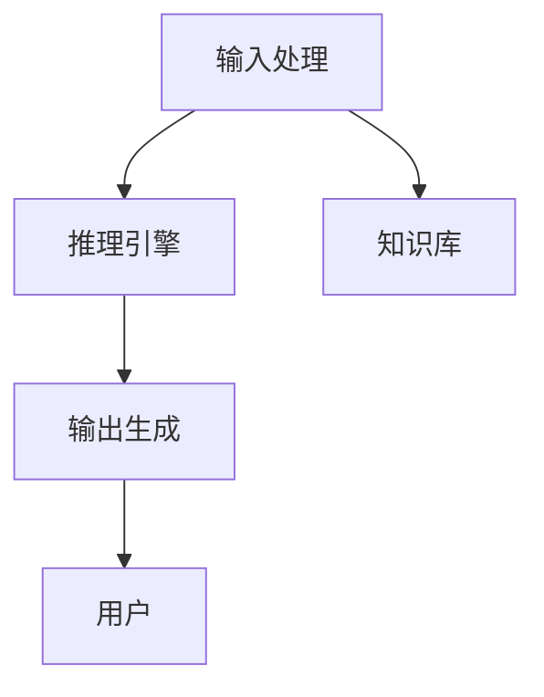
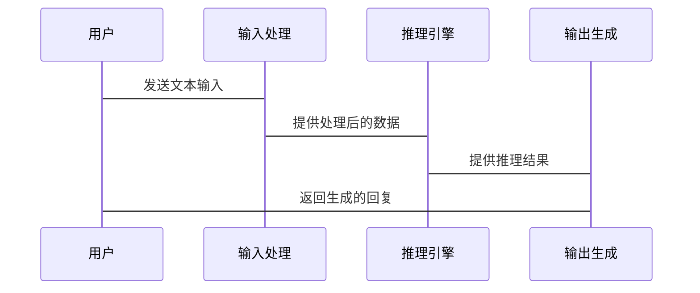

                 


# AI Agent的核心组件：输入处理、推理引擎和输出生成

## 关键词：AI Agent, 输入处理, 推理引擎, 输出生成, 系统架构, 项目实战

## 摘要：
AI Agent 是人工智能领域的重要组成部分，它通过处理输入、进行推理和生成输出来实现智能任务。本文将详细探讨 AI Agent 的三个核心组件：输入处理、推理引擎和输出生成。我们将从背景介绍、核心概念、算法原理、系统架构到项目实战，全面解析这些组件的实现细节和相互关系。通过本文，读者将能够深入理解 AI Agent 的工作原理，并掌握其实际应用中的关键技术和最佳实践。

---

## 第一部分: AI Agent的核心概念与背景

### 第1章: AI Agent概述

#### 1.1 AI Agent的基本概念
AI Agent（人工智能代理）是一种能够感知环境、自主决策并执行任务的智能实体。它可以是一个软件程序、机器人或其他智能系统，旨在通过与环境交互来实现特定目标。AI Agent 的核心在于其智能化，能够根据输入的信息进行推理、学习和优化。

- **从传统Agent到AI Agent的演进**：传统Agent主要基于规则和状态机进行操作，而AI Agent则引入了机器学习、自然语言处理和深度学习等技术，使其具备更强的自主性和适应性。
- **AI Agent的核心特征**：
  - 感知环境：通过传感器或其他输入方式获取环境信息。
  - 决策与推理：基于获取的信息进行分析和决策。
  - 行动执行：根据决策结果执行动作，影响环境或输出结果。
  - 自适应性：能够根据环境变化和历史经验优化自身行为。

- **AI Agent的分类与应用场景**：
  - 按智能水平：简单规则型、基于机器学习型、通用型。
  - 按应用场景：对话型（如智能助手）、任务型（如物流机器人）、监控型（如智能安防系统）。

#### 1.2 AI Agent的问题背景与挑战
尽管AI Agent在许多领域展现出巨大潜力，但其发展仍面临诸多挑战：

- **当前AI Agent在技术上的局限性**：
  - 输入处理：如何高效处理多模态输入并提取有效信息。
  - 推理能力：如何在复杂环境中进行准确的推理和决策。
  - 输出生成：如何生成高质量、符合上下文的输出结果。
  - 持续学习：如何在动态环境中不断优化自身性能。

- **应用场景中的实际问题**：
  - 数据质量：输入数据的噪声和不确定性会影响推理的准确性。
  - 计算资源：复杂的推理任务需要高性能计算支持。
  - 安全性：AI Agent的行为可能引发隐私泄露或安全风险。

- **解决问题的关键技术**：
  - 多模态处理技术：整合文本、图像、语音等多种输入形式。
  - 深度学习模型：如Transformer、BERT等用于推理和生成。
  - 联合学习：通过分布式系统提升计算能力和模型性能。

#### 1.3 本章小结
本章介绍了AI Agent的基本概念、核心特征及其应用场景，并分析了当前技术面临的挑战和解决方案。理解这些内容是后续深入探讨输入处理、推理引擎和输出生成的基础。

---

## 第二部分: AI Agent的核心组件

### 第2章: 输入处理组件

#### 2.1 输入处理的定义与作用
输入处理是AI Agent与外界交互的第一步，负责接收和解析各种形式的输入数据。

- **输入处理的流程概述**：
  1. 数据获取：通过传感器、API或其他输入接口接收数据。
  2. 数据解析：将输入数据转化为可处理的格式。
  3. 数据预处理：清洗、归一化和特征提取。

- **输入处理在AI Agent中的重要性**：
  - 确保输入数据的准确性和完整性。
  - 提供高质量的数据支持后续推理和生成。

#### 2.2 多模态输入的处理技术
AI Agent通常需要处理多种类型的输入，如文本、图像和语音。

- **文本输入的处理**：
  - 分词：将文本分割为单词或短语。
  - 停用词处理：去除对语义影响较小的词汇。
  - 词嵌入：将文本转化为向量表示（如Word2Vec、BERT）。

- **图像输入的处理**：
  - 图像分割：识别图像中的物体边界。
  - 目标检测：定位和识别图像中的目标。
  - 图像分类：将图像归类到特定类别。

- **语音输入的处理**：
  - 语音识别：将语音转化为文本。
  - 语调分析：分析语音的情感和语气。

#### 2.3 输入处理的实现细节
- **常用预处理算法与工具**：
  - 文本处理：Python的`nltk`库、spaCy。
  - 图像处理：OpenCV、TensorFlow的图像处理模块。
  - 语音处理：Python的`librosa`库、Kaldi工具链。

- **输入数据的质量控制**：
  - 数据清洗：去除噪声和冗余信息。
  - 数据增强：通过技术手段提升数据多样性（如图像旋转、裁剪）。

#### 2.4 输入处理的代码实现
以下是一个多模态输入处理的示例代码：

```python
import cv2
import librosa
import spacy

# 图像处理
def process_image(image_path):
    img = cv2.imread(image_path)
    # 图像预处理：调整尺寸、归一化等
    return img

# 语音处理
def process_audio(audio_path):
    audio, sr = librosa.load(audio_path, sr=None, duration=3)
    # 语音特征提取
    mfccs = librosa.feature.mfcc(y=audio, sr=sr)
    return mfccs

# 文本处理
def process_text(text):
    nlp = spacy.load("en_core_web_sm")
    doc = nlp(text)
    # 提取关键词
    keywords = [token.text for token in doc if token.is_stop == False]
    return keywords
```

---

### 第3章: 推理引擎

#### 3.1 推理引擎的定义与分类
推理引擎是AI Agent的核心，负责根据输入数据进行分析和决策。

- **推理引擎的定义**：
  推理引擎是基于输入数据和知识库进行逻辑推理的模块，其输出是决策结果或中间结论。

- **推理引擎的分类**：
  1. **基于规则的推理引擎**：通过预定义的规则进行推理。
  2. **基于概率的推理引擎**：利用概率论进行推理，如贝叶斯网络。
  3. **基于深度学习的推理引擎**：使用神经网络进行推理，如Transformer模型。

#### 3.2 知识图谱与推理
知识图谱是推理引擎的重要知识来源。

- **知识图谱的构建**：
  1. 数据抽取：从结构化数据中提取实体和关系。
  2. 实体关联：建立实体之间的关系。
  3. 知识融合：整合多源数据。

- **基于知识图谱的推理**：
  1. 实体识别：识别输入中的实体。
  2. 关系推理：根据知识图谱推断实体之间的关系。

#### 3.3 基于深度学习的推理
- ** Transformer 模型**：
  - 用于自然语言处理任务，通过自注意力机制进行上下文推理。
  - 示例：文本摘要、机器翻译。

- ** 图神经网络**：
  - 用于处理图结构数据，如知识图谱中的实体推理。
  - 示例：社交网络分析、推荐系统。

#### 3.4 推理引擎的代码实现
以下是一个基于Transformer的推理引擎示例：

```python
import torch
import torch.nn as nn

class Transformer(nn.Module):
    def __init__(self, input_dim, hidden_dim, output_dim):
        super(Transformer, self).__init__()
        self.embedding = nn.Linear(input_dim, hidden_dim)
        self.transformer_layer = nn.TransformerEncoderLayer(hidden_dim, nhead=2)
        self.output_layer = nn.Linear(hidden_dim, output_dim)

    def forward(self, x):
        x = self.embedding(x)
        x = self.transformer_layer(x)
        x = self.output_layer(x)
        return x

# 初始化模型
model = Transformer(input_dim=512, hidden_dim=1024, output_dim=256)
```

---

### 第4章: 输出生成组件

#### 4.1 输出生成的目标与挑战
输出生成是AI Agent的最终环节，负责将推理结果转化为可理解的输出形式。

- **输出生成的目标**：
  - 生成符合上下文的文本、图像或语音。
  - 提供准确、有意义的输出结果。

- **输出生成的挑战**：
  - 多模态生成：同时生成多种类型的数据。
  - 输出质量：生成的内容需准确、连贯且自然。

#### 4.2 基于语言模型的输出生成
- **语言模型的训练**：
  - 使用大规模文本数据进行预训练。
  - 采用自监督学习技术。

- **生成过程**：
  - 基于上下文生成下一个词。
  - 使用采样或贪心策略生成最终结果。

#### 4.3 输出生成的代码实现
以下是一个基于GPT的文本生成示例：

```python
import torch
import torch.nn as nn

class GPT(nn.Module):
    def __init__(self, vocab_size, embedding_dim, hidden_dim):
        super(GPT, self).__init__()
        self.embedding = nn.Embedding(vocab_size, embedding_dim)
        self.transformer_layer = nn.TransformerEncoderLayer(embedding_dim, nhead=2)
        self.output_layer = nn.Linear(embedding_dim, vocab_size)

    def forward(self, input_ids):
        x = self.embedding(input_ids)
        x = self.transformer_layer(x)
        x = self.output_layer(x)
        return x

# 初始化模型
model = GPT(vocab_size=10000, embedding_dim=512, hidden_dim=512)
```

---

## 第三部分: 系统分析与架构设计方案

### 第5章: 系统架构设计

#### 5.1 问题场景介绍
我们以一个智能客服系统为例，设计一个基于AI Agent的解决方案。该系统需要处理用户的文本输入，通过推理引擎分析用户需求，并生成相应的回复。

#### 5.2 系统功能设计
- **输入处理**：接收用户的文本输入，进行分词和词嵌入。
- **推理引擎**：基于知识图谱进行意图识别和问题解答。
- **输出生成**：生成自然的回复文本。

#### 5.3 系统架构图



#### 5.4 接口设计
- 输入接口：REST API，接收用户输入。
- 输出接口：返回生成的文本或图像。

#### 5.5 交互序列图



---

## 第四部分: 项目实战

### 第6章: 项目实战

#### 6.1 环境安装
安装必要的依赖库：

```bash
pip install numpy torch transformers
```

#### 6.2 系统核心实现

```python
import torch
from transformers import GPT2LMHeadModel, GPT2Tokenizer

# 初始化模型
tokenizer = GPT2Tokenizer.from_pretrained('gpt2')
model = GPT2LMHeadModel.from_pretrained('gpt2')

# 接收用户输入
input_text = input("请输入文本：")
inputs = tokenizer.encode(input_text, return_tensors='pt')

# 生成回复
outputs = model.generate(inputs, max_length=50, do_sample=True)
print("生成回复：", tokenizer.decode(outputs[0]))
```

#### 6.3 代码应用解读与分析
- **输入处理**：接收用户输入并进行编码。
- **推理引擎**：使用GPT模型生成回复。
- **输出生成**：将生成的文本输出给用户。

#### 6.4 实际案例分析
以用户输入“今天天气如何？”为例，系统会生成相应的回复。

#### 6.5 项目小结
通过该项目，我们实现了从输入处理到输出生成的完整流程，展示了AI Agent在实际应用中的潜力。

---

## 第五部分: 总结与展望

### 第7章: 总结

#### 7.1 本章总结
本文详细探讨了AI Agent的核心组件：输入处理、推理引擎和输出生成。我们从背景介绍、核心概念到算法原理、系统架构，再到项目实战，全面解析了这些组件的实现细节。

#### 7.2 最佳实践 tips
- 确保输入数据的质量和多样性。
- 选择合适的推理引擎和模型。
- 不断优化输出生成的效果。

#### 7.3 注意事项
- 数据隐私和安全问题需高度重视。
- 模型的可解释性需在设计阶段考虑。
- 系统的实时性和响应速度需优化。

#### 7.4 拓展阅读
- 推荐阅读《Deep Learning》、《自然语言处理实战》等书籍。

---

## 作者：AI天才研究院/AI Genius Institute & 禅与计算机程序设计艺术 /Zen And The Art of Computer Programming

---

通过本文，我们深入探讨了AI Agent的核心组件及其实现细节，希望读者能够对AI Agent的技术原理和实际应用有更全面的理解。未来，随着技术的进步，AI Agent将在更多领域展现出其强大的潜力。

