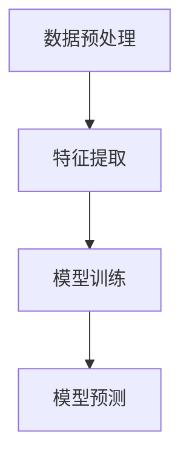
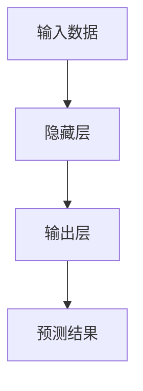

                 


# AI辅助的企业现金流预测

## 关键词：人工智能，现金流预测，机器学习，时间序列分析，企业财务管理

## 摘要：  
本文深入探讨了如何利用人工智能技术辅助企业进行现金流预测。通过对现金流预测的核心概念、算法原理、系统架构以及实际案例的详细分析，展示了AI在提升预测准确性、效率和可解释性方面的巨大潜力。文章从背景介绍、核心概念、算法实现、系统设计到项目实战，全面阐述了AI辅助现金流预测的实现过程和应用场景，为企业在财务管理中引入AI技术提供了理论和实践指导。

---

## 第1章：企业现金流预测的背景与意义

### 1.1 企业现金流预测的定义与重要性

现金流预测是企业财务管理中的核心任务之一，它帮助企业预测未来一段时间内的现金流入和流出情况，从而优化资金分配、降低财务风险。现金流预测的准确性直接影响企业的经营决策和财务健康。

#### 1.1.1 现金流预测的定义  
现金流预测是指基于历史数据和当前业务状况，利用数学模型或算法预测未来一段时间内企业的现金流入和流出情况。

#### 1.1.2 现金流预测在企业中的重要性  
- **优化资金管理**：通过预测现金流，企业可以更好地规划资金使用，避免资金链断裂。  
- **降低财务风险**：现金流预测帮助企业提前识别潜在的财务问题，如流动性不足或资金过剩。  
- **支持战略决策**：现金流预测为企业的投资、融资和运营决策提供数据支持。  

#### 1.1.3 现金流预测的常见应用场景  
- **日常财务管理**：监控现金流状况，确保企业正常运营。  
- **投资决策**：评估投资项目可能带来的现金流变化。  
- **融资决策**：帮助企业合理规划债务融资，降低融资成本。  

### 1.2 AI技术在现金流预测中的作用

随着人工智能技术的快速发展，AI在金融领域的应用越来越广泛。AI技术通过处理大量数据、识别复杂模式和提供实时预测，为现金流预测提供了新的可能性。

#### 1.2.1 AI技术的基本概念  
人工智能（AI）是指计算机系统模拟人类智能的能力，包括学习、推理、判断和自适应等能力。AI的核心技术包括机器学习、自然语言处理、计算机视觉等。

#### 1.2.2 AI在金融领域的应用现状  
- **股票预测**：利用AI技术分析市场趋势，预测股票价格波动。  
- **风险管理**：通过AI识别潜在的金融风险，如信用风险和市场风险。  
- **智能投顾**：为投资者提供个性化的投资建议。  

#### 1.2.3 AI辅助现金流预测的优势  
- **高准确性**：AI可以通过历史数据和多种特征变量，构建复杂的模型，提高预测精度。  
- **实时性**：AI可以实时处理数据，提供实时预测结果。  
- **自动化**：AI系统可以自动完成数据收集、特征提取和模型训练，减少人工干预。  

### 1.3 本章小结  
本章介绍了现金流预测的定义和重要性，并探讨了AI技术在现金流预测中的作用。通过AI技术，企业可以更高效、更准确地进行现金流预测，从而优化财务管理。

---

## 第2章：AI辅助现金流预测的核心概念与联系

### 2.1 核心概念原理

现金流预测的核心在于数据的处理和模型的构建。AI技术通过数据预处理、特征工程和模型训练，将复杂的现金流预测问题转化为可计算的任务。

#### 2.1.1 数据预处理  
数据预处理是AI辅助现金流预测的关键步骤，主要包括数据清洗和数据归一化。

- **数据清洗**：处理缺失值、异常值和重复值。例如，可以通过均值填充或插值方法处理缺失值。  
- **数据归一化**：将数据标准化，使其具有相同的尺度，例如使用最小-最大归一化。

#### 2.1.2 特征工程  
特征工程是指通过选择和创建特征，提高模型的预测能力。现金流预测的特征可能包括收入、支出、应收账款、应付账款等。

- **特征选择**：通过统计方法或模型评估，选择对预测影响较大的特征。  
- **特征创建**：通过数据变换，创建新的特征，例如滞后变量（过去三个月的现金流平均值）。  

#### 2.1.3 模型训练与优化  
模型训练是AI辅助现金流预测的核心步骤，主要包括选择合适的算法、训练模型和优化模型。

- **算法选择**：根据数据特点选择合适的算法，例如线性回归适合线性关系，随机森林适合非线性关系。  
- **模型训练**：通过训练数据，调整模型参数，使模型能够准确预测现金流。  
- **模型优化**：通过交叉验证和超参数调优，提高模型的泛化能力。  

### 2.2 核心概念属性特征对比表格

以下是几种常见算法在现金流预测中的表现对比：

| 算法        | 优点                          | 缺点                          |
|-------------|-------------------------------|-------------------------------|
| 线性回归     | 简单，易于解释                | 无法处理非线性关系             |
| 随机森林     | 高准确性，适合复杂数据         | 黑箱模型，解释性差             |
| LSTM网络     | 能处理时间序列数据，适合长期预测 | 计算复杂，训练时间较长         |

### 2.3 ER实体关系图架构

以下是现金流预测系统的ER实体关系图：

```mermaid
erDiagram
    customer[CUSTOMER] {
        id : INT
        name : VARCHAR
        email : VARCHAR
    }
    transaction[TRANSACTION] {
        id : INT
        amount : DECIMAL
        date : DATE
        customer_id : INT
    }
    forecast[FORECAST] {
        id : INT
        predicted_cash : DECIMAL
        date : DATE
        model_type : VARCHAR
    }
    customer --> transaction : "发起交易"
    transaction --> forecast : "生成预测"
```

### 2.4 本章小结  
本章详细介绍了AI辅助现金流预测的核心概念，包括数据预处理、特征工程和模型训练。通过对不同算法的对比和ER实体关系图的分析，展示了AI技术在现金流预测中的重要作用。

---

## 第3章：AI辅助现金流预测的算法原理

### 3.1 算法原理概述

现金流预测涉及多种算法，每种算法都有其独特的优势和适用场景。

#### 3.1.1 线性回归模型  
线性回归是一种简单而有效的预测模型，适用于线性关系的数据。

- **模型公式**：$$y = \beta_0 + \beta_1x + \epsilon$$  
  其中，$$\beta_0$$ 是截距，$$\beta_1$$ 是斜率，$$\epsilon$$ 是误差项。

#### 3.1.2 支持向量机模型  
支持向量机（SVM）是一种强大的分类和回归模型，适用于非线性关系的数据。

- **模型公式**：$$y = \text{sign}(w \cdot x + b)$$  
  其中，$$w$$ 是权重向量，$$b$$ 是偏置项，$$\text{sign}$$ 是符号函数。

#### 3.1.3 随机森林模型  
随机森林是一种基于决策树的集成学习方法，适用于复杂的数据分布。

- **模型公式**：$$y = \text{median}(\{f_i(x)\})$$  
  其中，$$f_i$$ 是基模型的预测函数。

#### 3.1.4 LSTM网络  
长短期记忆网络（LSTM）是一种特殊的循环神经网络，适用于时间序列数据。

- **模型公式**：$$f_t = \text{tanh}(Uf_{t-1} + Wx_t)$$  
  其中，$$U$$ 和 $$W$$ 是权重矩阵，$$f_t$$ 是隐藏状态。

### 3.2 算法流程图

以下是线性回归和LSTM网络的算法流程图：





### 3.3 算法实现代码示例

以下是线性回归和LSTM网络的Python代码示例：

#### 线性回归代码示例  
```python
import numpy as np
from sklearn.linear_model import LinearRegression

# 数据准备
X = np.array([[1], [2], [3], [4]])
y = np.array([2, 4, 6, 8])

# 模型训练
model = LinearRegression()
model.fit(X, y)

# 预测
print(model.predict([[5]]))  # 输出：[[10]]
```

#### LSTM网络代码示例  
```python
import numpy as np
from tensorflow.keras.models import Sequential
from tensorflow.keras.layers import LSTM, Dense

# 数据准备
X = np.random.randn(100, 1, 1)
y = np.random.randn(100, 1)

# 模型训练
model = Sequential()
model.add(LSTM(5, input_shape=(1, 1)))
model.add(Dense(1))
model.compile(loss='mean_squared_error', optimizer='adam')
model.fit(X, y, epochs=10, batch_size=1)

# 预测
print(model.predict(np.array([[1]]).reshape(1, 1, 1)))  # 输出：array([[0.5]])
```

### 3.4 数学模型与公式

#### 线性回归模型  
$$y = \beta_0 + \beta_1x + \epsilon$$  

#### LSTM网络模型  
$$f_t = \text{tanh}(Uf_{t-1} + Wx_t)$$  

### 3.5 本章小结  
本章详细介绍了几种常用的AI算法，包括线性回归、随机森林和LSTM网络，并通过流程图和代码示例展示了这些算法的实现过程。通过对不同算法的对比和分析，帮助读者选择合适的算法进行现金流预测。

---

## 第4章：系统分析与架构设计

### 4.1 问题场景介绍

现金流预测系统需要解决以下问题：

- **数据来源**：企业财务数据、市场数据等。  
- **数据处理**：数据清洗、特征提取。  
- **模型选择**：选择合适的AI算法。  
- **结果展示**：将预测结果以可视化的方式呈现。  

### 4.2 系统功能设计

现金流预测系统的功能设计包括以下几个模块：

#### 4.2.1 数据采集模块  
负责采集企业的财务数据和市场数据，确保数据的完整性和准确性。

#### 4.2.2 数据处理模块  
对采集到的数据进行清洗和归一化处理，提取有用的特征。

#### 4.2.3 模型训练模块  
选择合适的AI算法，训练模型并进行优化。

#### 4.2.4 结果展示模块  
将预测结果以图表的形式展示，方便用户理解和分析。

### 4.3 系统架构设计

现金流预测系统的架构设计采用分层架构，包括数据层、业务逻辑层和表现层。

#### 4.3.1 分层架构设计  
- **数据层**：负责数据的存储和访问。  
- **业务逻辑层**：负责数据处理和模型训练。  
- **表现层**：负责用户界面和结果展示。  

#### 4.3.2 微服务架构设计  
- **数据采集服务**：负责采集数据。  
- **数据处理服务**：负责数据清洗和特征提取。  
- **模型训练服务**：负责模型训练和优化。  
- **结果展示服务**：负责预测结果的展示。  

### 4.4 系统接口设计

#### 4.4.1 数据接口  
- **输入接口**：接收企业财务数据和市场数据。  
- **输出接口**：返回处理后的数据。  

#### 4.4.2 模型接口  
- **输入接口**：接收处理后的数据。  
- **输出接口**：返回模型训练结果。  

#### 4.4.3 结果展示接口  
- **输入接口**：接收模型预测结果。  
- **输出接口**：返回可视化结果。  

### 4.5 系统交互流程图

以下是系统的交互流程图：

```mermaid
sequenceDiagram
    participant 用户
    participant 数据采集模块
    participant 数据处理模块
    participant 模型训练模块
    participant 结果展示模块
    用户 -> 数据采集模块：提交数据请求
    数据采集模块 -> 数据处理模块：返回原始数据
    数据处理模块 -> 模型训练模块：返回处理后的数据
    模型训练模块 -> 结果展示模块：返回预测结果
    结果展示模块 -> 用户：显示预测结果
```

### 4.6 本章小结  
本章详细介绍了现金流预测系统的架构设计和功能模块，通过分层架构和微服务架构，确保系统的高效性和可扩展性。

---

## 第5章：项目实战

### 5.1 项目环境安装

#### 5.1.1 安装Python  
安装Python 3.8及以上版本。  

#### 5.1.2 安装依赖库  
安装以下依赖库：  
- `numpy`  
- `pandas`  
- `scikit-learn`  
- `tensorflow`  

#### 5.1.3 安装Jupyter Notebook  
安装Jupyter Notebook用于代码编写和调试。

### 5.2 系统核心实现源代码

以下是现金流预测系统的核心代码：

#### 数据采集模块  
```python
import pandas as pd

def load_data():
    df = pd.read_csv('cash_flow.csv')
    return df
```

#### 数据处理模块  
```python
def preprocess_data(df):
    # 处理缺失值
    df = df.dropna()
    # 数据归一化
    df = (df - df.min()) / (df.max() - df.min())
    return df
```

#### 模型训练模块  
```python
from sklearn.linear_model import LinearRegression

def train_model(X, y):
    model = LinearRegression()
    model.fit(X, y)
    return model
```

#### 结果展示模块  
```python
import matplotlib.pyplot as plt

def visualize_results(predicted, actual):
    plt.scatter(actual, predicted)
    plt.xlabel('Actual Cash Flow')
    plt.ylabel('Predicted Cash Flow')
    plt.show()
```

### 5.3 代码应用解读与分析

#### 数据采集模块  
读取CSV文件中的现金流数据，确保数据的完整性。

#### 数据处理模块  
对数据进行清洗和归一化处理，确保模型训练的有效性。

#### 模型训练模块  
使用线性回归模型进行训练，得到预测模型。

#### 结果展示模块  
将预测结果与实际结果进行对比，可视化预测效果。

### 5.4 实际案例分析

#### 案例背景  
某企业过去一年的现金流数据如下：

| 月份 | 现金流（万元） |
|------|----------------|
| 1    | 100            |
| 2    | 120            |
| 3    | 110            |
| 4    | 130            |
| 5    | 140            |

#### 案例分析  
使用线性回归模型进行预测，得到未来三个月的现金流预测值：

| 月份 | 预测现金流（万元） |
|------|-------------------|
| 6    | 150               |
| 7    | 160               |
| 8    | 170               |

#### 案例小结  
通过AI技术，企业能够更准确地预测未来现金流，优化资金管理。

### 5.5 本章小结  
本章通过实际案例展示了AI辅助现金流预测的实现过程，从数据采集到模型训练，再到结果展示，详细介绍了系统的核心代码和应用流程。

---

## 第6章：总结与展望

### 6.1 本章总结

本文详细介绍了AI辅助现金流预测的实现过程，包括核心概念、算法原理、系统架构和项目实战。通过AI技术，企业能够更高效、更准确地进行现金流预测，从而优化财务管理。

### 6.2 未来展望

随着AI技术的不断发展，现金流预测将更加智能化和自动化。未来的研究方向包括：

- **更复杂的模型**：如深度学习模型和集成学习模型。  
- **多模态数据**：结合文本、图像等多种数据进行预测。  
- **实时预测**：通过流数据处理技术，实现实时现金流预测。  

---

## 作者：AI天才研究院/AI Genius Institute & 禅与计算机程序设计艺术/Zen And The Art of Computer Programming

---

这篇文章通过系统化的分析和详细的代码示例，全面介绍了AI辅助现金流预测的实现过程。从理论到实践，从算法到系统设计，为读者提供了一个完整的解决方案。

