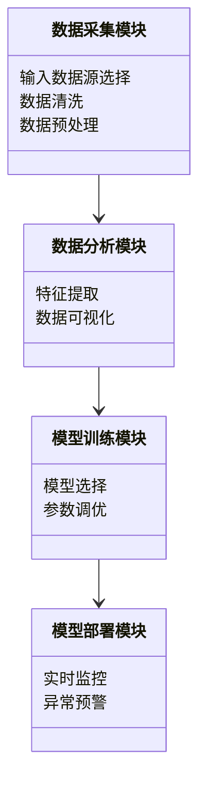
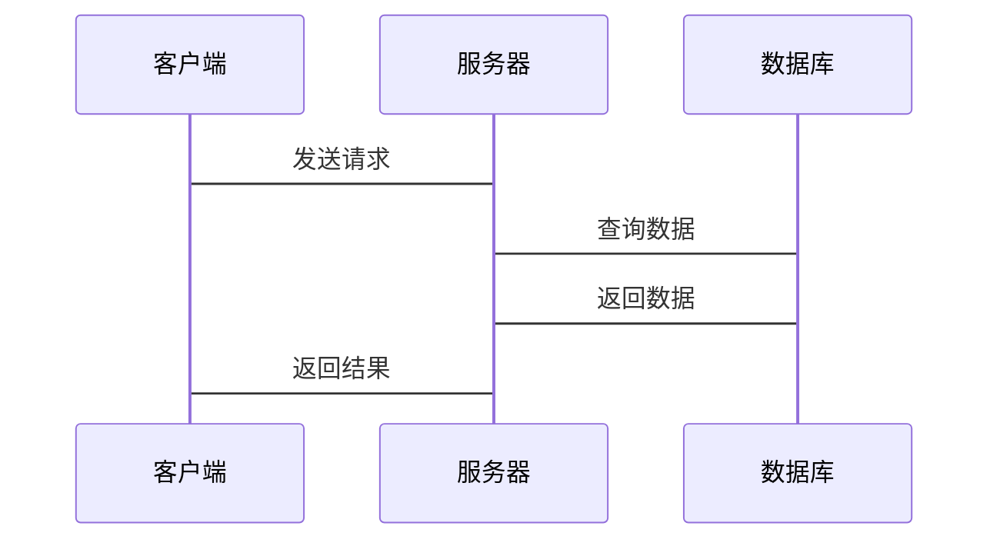

                 


# AI驱动的股票财务造假检测与预警

> 关键词：AI驱动，股票财务造假，财务预警，自然语言处理，时间序列分析，深度学习，图神经网络

> 摘要：本文系统地探讨了利用人工智能技术进行股票财务造假检测与预警的方法，从问题背景到算法实现，再到系统设计和项目实战，全面分析了AI在这一领域的应用潜力和实际效果。通过多模态数据的融合分析和深度学习模型的构建，提出了一个创新的解决方案，为投资者和监管机构提供了有力的工具。

---

## 第一部分：背景介绍

### 第1章：股票财务造假的背景与挑战

#### 1.1 问题背景
- **1.1.1 股票市场的虚假陈述现象**
  - 虚假财务报告的典型案例
  - 财务造假对企业信用和投资者信心的破坏
- **1.1.2 财务造假对企业、投资者和社会的危害**
  - 企业价值的虚增与投资者损失
  - 社会资本市场的信任危机
- **1.1.3 传统财务造假检测的局限性**
  - 人工审核的低效性和主观性
  - 数据单一性导致的检测盲区

#### 1.2 问题描述
- **1.2.1 财务报表造假的主要手段**
  - 利润虚增、成本隐瞒、关联交易非公允化
  - 虚构收入、虚增资产、虚减负债
- **1.2.2 股票市场中的虚假交易与操纵行为**
  - 操纵股价、内幕交易、虚假信息披露
- **1.2.3 财务造假的隐蔽性与复杂性**
  - 跨期造假、分散造假、混合造假

#### 1.3 问题解决
- **1.3.1 AI技术在财务造假检测中的优势**
  - 大数据处理能力
  - 智能学习与模式识别能力
  - 实时监控与预警能力
- **1.3.2 多模态数据融合分析的可行性**
  - 文本、数值、图像等多种数据源的融合
  - 异常检测与关联分析的结合
- **1.3.3 从数据到决策的端到端解决方案**
  - 数据采集、清洗、分析、建模、预警的全流程覆盖

#### 1.4 边界与外延
- **1.4.1 财务造假检测的边界条件**
  - 数据质量和完整性
  - 检测模型的泛化能力
  - 监管政策的合规性
- **1.4.2 相关领域的关联性分析**
  - 财务审计、法律合规、内部控制的交叉影响
- **1.4.3 技术与法规的协同作用**
  - 技术手段辅助监管
  - 法规框架约束技术应用

#### 1.5 概念结构与核心要素
- **1.5.1 财务造假检测的核心要素**
  - 数据源的多样性
  - 检测算法的准确性
  - 预警系统的实时性
- **1.5.2 AI驱动的分析框架**
  - 数据驱动 vs. 知识驱动
  - 统计分析 vs. 深度学习
- **1.5.3 多维度数据融合的检测模型**
  - 多模态数据的特征提取与融合方法
  - 跨模态关联分析与联合推理

---

## 第二部分：核心概念与AI驱动的技术分析

### 第2章：AI在股票财务分析中的应用

#### 2.1 自然语言处理（NLP）在财务文本分析中的应用
- **2.1.1 文本数据的特征提取**
  - 财务报告中的关键词识别
  - 公司公告的情感分析
- **2.1.2 基于NLP的异常检测**
  - 文本相似性分析
  - 关键词出现频率的异常检测

#### 2.2 图神经网络在关联交易分析中的应用
- **2.2.1 关联交易的网络构建**
  - 公司间的关联交易关系图
  - 供应链网络的异常检测
- **2.2.2 图神经网络的节点表示**
  - 节点嵌入与关系推理
  - 异常节点的识别与预警

#### 2.3 时间序列分析在财务数据预测中的应用
- **2.3.1 财务数据的时间依赖性**
  - 收入、利润、现金流的时间序列建模
- **2.3.2 基于LSTM的时间序列异常检测**
  - LSTM网络的结构与优势
  - 时间序列数据的异常检测与预警

### 第3章：AI驱动的股票财务造假检测算法原理

#### 3.1 异常检测算法
- **3.1.1 基于统计的方法**
  - Z-score、LOF、Isolation Forest
- **3.1.2 基于深度学习的方法**
  - Autoencoder、VAE、LSTM
- **3.1.3 混合模型的优势**
  - 统计方法与深度学习的结合

#### 3.2 聚类分析与分类模型
- **3.2.1 聚类分析**
  - K-means、DBSCAN、层次聚类
- **3.2.2 分类模型**
  - SVM、随机森林、神经网络
- **3.2.3 模型融合**
  - 偏差-方差分解与模型融合策略

#### 3.3 基于深度学习的财务数据建模
- **3.3.1 深度学习模型的选择**
  - CNN、RNN、Transformer
- **3.3.2 模型训练与调优**
  - 参数选择、正则化、超参数优化
- **3.3.3 模型评估与解释**
  - ROC-AUC、Precision-Recall曲线
  - 可解释性分析

### 第4章：系统架构设计

#### 4.1 问题场景介绍
- **4.1.1 业务目标**
  - 实时监控、异常检测、风险预警
- **4.1.2 使用场景**
  - 投资者风险评估、监管机构执法依据、企业内部控制
- **4.1.3 项目范围**
  - 数据范围、功能范围、性能要求

#### 4.2 系统功能设计
- **4.2.1 领域模型（Mermaid类图）**


#### 4.3 系统架构设计（Mermaid架构图）


#### 4.4 系统接口设计
- **4.4.1 数据接口**
  - 数据输入接口
  - 数据输出接口
- **4.4.2 模型接口**
  - 模型训练接口
  - 模型预测接口
- **4.4.3 用户接口**
  - Web界面
  - API接口

#### 4.5 系统交互设计（Mermaid序列图）


---

## 第三部分：项目实战

### 第5章：项目环境与代码实现

#### 5.1 环境安装
- **5.1.1 安装Python环境**
  - Anaconda或virtualenv的使用
- **5.1.2 安装依赖库**
  - NumPy、Pandas、Scikit-learn、Keras、TensorFlow、Gensim、NetworkX、PyTorch
- **5.1.3 安装NLP工具**
  - SpaCy、NLTK、Gensim

#### 5.2 核心代码实现
- **5.2.1 数据预处理代码**
```python
import pandas as pd
import numpy as np

# 加载数据
df = pd.read_csv('financial_data.csv')

# 数据清洗
df.dropna(inplace=True)
df = df[ df['revenue'].notna() & df['profit'].notna() ]
```

- **5.2.2 模型训练代码**
```python
from tensorflow.keras import layers, Model

# 定义模型
input_layer = layers.Input(shape=(timesteps, features))
lstm_layer = layers.LSTM(64, return_sequences=True)(input_layer)
dense_layer = layers.Dense(32, activation='relu')(lstm_layer)
output_layer = layers.Dense(1, activation='sigmoid')(dense_layer)

model = Model(inputs=input_layer, outputs=output_layer)
model.compile(optimizer='adam', loss='binary_crossentropy')
```

- **5.2.3 异常检测代码**
```python
import isolation_forest as iforest

model = iforest.IsolationForest(n_estimators=100, random_state=42)
model.fit(X_train)
y_pred = model.predict(X_test)
```

#### 5.3 代码应用解读
- **5.3.1 数据预处理阶段**
  - 数据清洗、特征选择、标准化
- **5.3.2 模型训练阶段**
  - 模型选择、参数调优、交叉验证
- **5.3.3 模型部署阶段**
  - API接口开发、实时监控、结果可视化

#### 5.4 案例分析与结果解读
- **5.4.1 数据来源**
  - 公开的财务数据、新闻数据、社交媒体数据
- **5.4.2 实验结果**
  - 检测准确率、召回率、F1分数
  - 模型的可解释性分析
- **5.4.3 案例分析**
  - 典型的财务造假案例检测
  - 系统预警的实际效果

#### 5.5 项目小结
- **5.5.1 项目总结**
  - 技术实现的难点与突破
  - 系统设计的优缺点
  - 实际应用中的问题与改进方向
- **5.5.2 经验与教训**
  - 数据质量的重要性
  - 模型选择的灵活性
  - 系统维护的持续性

---

## 第四部分：最佳实践与注意事项

### 第6章：最佳实践与系统优化

#### 6.1 最佳实践
- **6.1.1 数据质量管理**
  - 数据清洗、去噪、增强
- **6.1.2 模型优化**
  - 超参数调优、模型融合、解释性分析
- **6.1.3 系统维护**
  - 模型更新、数据更新、系统监控

#### 6.2 注意事项
- **6.2.1 数据隐私与合规性**
  - 数据使用的合法性
  - 隐私保护措施
- **6.2.2 模型的可解释性**
  - 避免"黑箱"模型
  - 提供可解释的分析结果
- **6.2.3 系统的可扩展性**
  - 适应数据量的增长
  - 支持多模态数据的接入

#### 6.3 小结
- **6.3.1 项目总结**
  - 技术实现的创新点
  - 系统设计的优势
  - 实际应用的价值
- **6.3.2 未来展望**
  - 新技术的应用（如大语言模型）
  - 多模态数据的进一步融合
  - 智能化监管的未来发展

---

## 第五部分：附录与参考文献

### 附录A：数学公式与模型细节

#### A.1 异常检测模型
$$ anomaly\_score = f(x) $$
其中，\( x \) 是输入数据，\( f \) 是异常检测函数。

#### A.2 时间序列模型
$$ LSTM(x_t) = \sigma(W_{hx}x_t + W_{hh}h_{t-1} + b) $$
其中，\( \sigma \) 是sigmoid函数，\( W_{hx} \) 和 \( W_{hh} \) 是权重矩阵，\( b \) 是偏置项。

### 附录B：项目代码与数据集

#### B.1 项目代码
```python
import pandas as pd
import numpy as np
from tensorflow.keras import layers, Model

# 数据加载与预处理
df = pd.read_csv('financial_data.csv')
df = df.dropna()
df = df[['revenue', 'profit', 'market_value']]

# 模型构建
input_layer = layers.Input(shape=(timesteps, 3))
lstm_layer = layers.LSTM(64, return_sequences=True)(input_layer)
dense_layer = layers.Dense(32, activation='relu')(lstm_layer)
output_layer = layers.Dense(1, activation='sigmoid')(dense_layer)
model = Model(inputs=input_layer, outputs=output_layer)
model.compile(optimizer='adam', loss='binary_crossentropy')

# 模型训练
model.fit(X_train, y_train, epochs=10, batch_size=32)
```

#### B.2 数据集说明
- 数据来源：公开的财务数据与新闻数据
- 数据格式：CSV格式，包含收入、利润、市值等字段
- 数据规模：百万级数据，时间跨度5年

---

## 作者

**作者：AI天才研究院/AI Genius Institute & 禅与计算机程序设计艺术 /Zen And The Art of Computer Programming**

---

通过以上目录结构和内容安排，文章将系统地介绍AI驱动的股票财务造假检测与预警的背景、技术原理、系统设计和实际应用，为读者提供全面的理论和技术指导。

