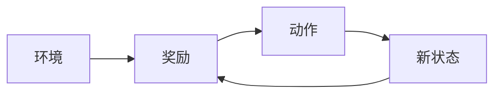
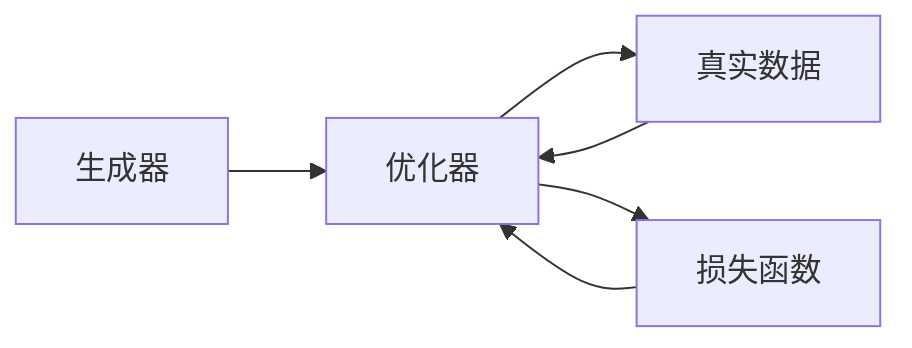
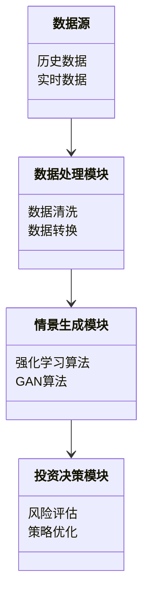
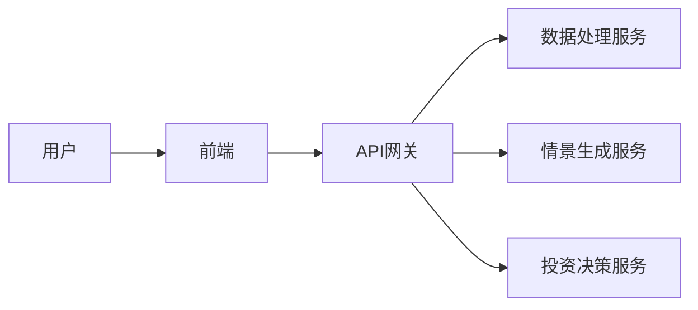
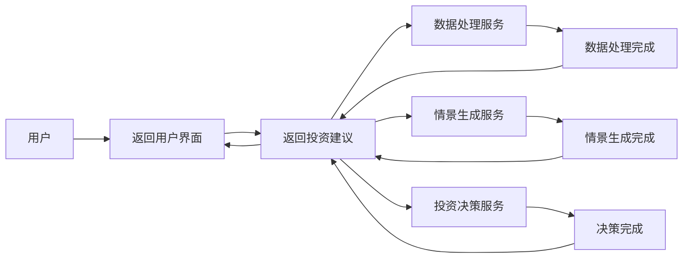

                 


# 利用AI agents进行情景分析：增强价值投资的适应性

## 关键词：AI agents, 情景分析, 价值投资, 适应性增强, 算法原理, 系统架构, 项目实战

## 摘要：  
本文探讨了如何利用AI agents进行情景分析，以增强价值投资的适应性。文章从AI agents的基本概念出发，分析其在情景分析中的应用，结合具体的算法原理和系统架构，详细阐述了如何通过AI agents提升价值投资的决策效率和准确性。通过实际案例分析，展示了AI agents在情景分析中的实际应用效果，并总结了相关经验和最佳实践。

---

# 第一部分: 利用AI agents进行情景分析的背景与概念

## 第1章: AI agents与情景分析概述

### 1.1 AI agents的基本概念

#### 1.1.1 AI agents的定义与分类
AI agents（人工智能代理）是指能够感知环境、做出决策并执行动作的智能实体。AI agents可以分为以下几类：
- **简单反射型代理**：基于当前输入做出反应，不依赖历史信息。
- **基于模型的反射型代理**：利用内部模型和历史信息进行决策。
- **目标驱动型代理**：根据预设目标或学习到的目标采取行动。
- **效用驱动型代理**：通过最大化效用函数来优化决策。

#### 1.1.2 AI agents的核心特征
AI agents的核心特征包括：
- **自主性**：能够在没有外部干预的情况下独立运作。
- **反应性**：能够感知环境并实时调整行为。
- **目标导向性**：基于目标或效用函数进行决策。
- **学习能力**：能够通过经验或数据优化自身的决策能力。

#### 1.1.3 AI agents在情景分析中的作用
AI agents在情景分析中的作用主要体现在：
- **数据处理**：快速分析大量数据，提取关键信息。
- **决策支持**：基于数据分析结果，提供决策建议。
- **动态调整**：根据市场变化实时调整分析策略。

### 1.2 情景分析的定义与应用

#### 1.2.1 情景分析的基本概念
情景分析是一种通过模拟不同假设条件下的市场变化，评估其对投资组合或资产价值影响的方法。

#### 1.2.2 情景分析在金融投资中的应用
情景分析在金融投资中的应用包括：
- **资产配置**：评估不同资产在不同市场环境下的表现。
- **风险评估**：分析投资组合在极端市场条件下的风险敞口。
- **策略优化**：根据不同情景下的表现，优化投资策略。

#### 1.2.3 情景分析的挑战与局限性
情景分析的挑战包括：
- **数据依赖性**：需要大量的历史数据支持。
- **假设偏差**：情景假设的准确性直接影响分析结果。
- **计算复杂性**：复杂的情景模拟需要强大的计算能力。

### 1.3 AI agents与价值投资的结合

#### 1.3.1 价值投资的核心理念
价值投资的核心理念是通过分析企业的基本面，寻找市场低估的资产进行投资。

#### 1.3.2 AI agents如何增强价值投资的适应性
AI agents通过以下方式增强价值投资的适应性：
- **实时数据处理**：快速分析市场动态，捕捉潜在投资机会。
- **多因素分析**：综合考虑宏观经济、行业趋势和公司基本面等多个因素。
- **动态调整**：根据市场变化实时优化投资组合。

#### 1.3.3 情景分析在价值投资中的意义
情景分析在价值投资中的意义在于：
- **风险控制**：通过模拟不同市场环境下的表现，评估投资组合的抗风险能力。
- **策略优化**：根据不同情景下的表现，优化投资策略。
- **投资决策支持**：为投资者提供基于数据的决策支持。

---

## 第2章: 价值投资中的情景分析需求

### 2.1 价值投资的基本原理

#### 2.1.1 价值投资的哲学基础
价值投资的哲学基础是市场短期波动不可预测，但长期价值可评估。

#### 2.1.2 价值投资的核心策略
价值投资的核心策略包括：
- **基本面分析**：分析企业的财务状况、行业地位和竞争优势。
- **安全边际**：寻找市场价格低于内在价值的资产。
- **长期持有**：避免频繁交易，降低交易成本。

#### 2.1.3 价值投资中的信息不对称问题
价值投资中的信息不对称问题主要表现在：
- **信息获取成本高**：高质量的信息往往难以获取。
- **信息处理复杂**：需要处理大量非结构化数据。

### 2.2 情景分析在价值投资中的重要性

#### 2.2.1 不同经济周期下的投资策略
不同经济周期下的投资策略包括：
- **衰退期**：寻找具有防御性的资产。
- **复苏期**：关注周期性行业的机会。
- **增长期**：投资于高增长行业的龙头企业。

#### 2.2.2 风险因素的动态变化
情景分析需要考虑的风险因素包括：
- **宏观经济风险**：如经济衰退、通货膨胀等。
- **行业风险**：如政策变化、技术进步等。
- **公司特定风险**：如管理风险、财务风险等。

#### 2.2.3 投资组合的动态优化
情景分析可以帮助投资者：
- **动态调整投资组合**：根据市场变化优化资产配置。
- **风险控制**：在不同情景下评估投资组合的抗风险能力。
- **收益最大化**：在不同情景下寻找收益与风险的最佳平衡点。

### 2.3 AI agents在价值投资中的应用前景

#### 2.3.1 AI agents在情景分析中的优势
AI agents在情景分析中的优势包括：
- **高效性**：能够快速处理大量数据，提供实时分析结果。
- **准确性**：通过机器学习算法提高分析结果的准确性。
- **适应性**：能够根据市场变化动态调整分析策略。

#### 2.3.2 AI agents如何提升投资决策的效率
AI agents通过以下方式提升投资决策的效率：
- **自动化数据处理**：实时收集和处理市场数据。
- **智能决策支持**：基于数据分析结果提供投资建议。
- **动态优化**：根据市场变化实时优化投资策略。

#### 2.3.3 未来发展趋势与挑战
未来发展趋势包括：
- **AI agents的智能化**：进一步提升AI agents的学习和推理能力。
- **多模态数据处理**：综合处理文本、图像等多种类型的数据。
- **伦理与监管问题**：解决AI agents在投资决策中的伦理和监管问题。

---

## 第3章: AI agents的核心原理

### 3.1 AI agents的组成与功能

#### 3.1.1 知识库与数据源
AI agents的知识库和数据源包括：
- **历史数据**：包括市场数据、公司基本面数据等。
- **实时数据**：包括当前市场行情、新闻等。
- **外部知识库**：如行业报告、学术论文等。

#### 3.1.2 感知与理解能力
AI agents的感知与理解能力包括：
- **自然语言处理**：理解新闻、报告等文本信息。
- **数据挖掘**：从非结构化数据中提取有用信息。
- **模式识别**：识别市场趋势和异常情况。

#### 3.1.3 决策与行动机制
AI agents的决策与行动机制包括：
- **策略选择**：基于当前市场情况选择最佳投资策略。
- **风险管理**：评估和控制投资风险。
- **执行交易**：根据决策执行买入、卖出等交易操作。

### 3.2 情景分析的数学模型

#### 3.2.1 情景分析的基本模型
情景分析的基本模型包括：
- **均值-方差模型**：评估投资组合的风险和收益。
- **蒙特卡洛模拟**：模拟不同市场情景下的投资组合表现。

#### 3.2.2 AI agents在情景分析中的应用
AI agents在情景分析中的应用包括：
- **强化学习**：通过试错学习优化投资策略。
- **生成对抗网络**：生成多种可能的市场情景并进行分析。

#### 3.2.3 数学公式与模型
以下是一个简单的均值-方差模型示例：

$$
\text{风险} = \sqrt{\text{方差}} = \sqrt{\sum_{i=1}^{n} w_i^2 \sigma_i^2}
$$

其中，$w_i$ 是资产$i$的权重，$\sigma_i^2$ 是资产$i$的方差。

### 3.3 AI agents的算法实现

#### 3.3.1 强化学习算法
强化学习算法通过试错学习优化决策策略。以下是一个简单的强化学习流程图：



#### 3.3.2 生成对抗网络
生成对抗网络（GAN）通过生成器和判别器的对抗训练生成多样化的市场情景。以下是一个GAN的架构图：



---

## 第4章: 系统分析与架构设计方案

### 4.1 问题场景介绍
本项目旨在开发一个基于AI agents的情景分析系统，用于支持价值投资决策。

### 4.2 项目介绍
项目目标是通过AI agents实现以下功能：
- **实时数据采集**：收集市场行情、公司基本面等数据。
- **情景生成**：生成多种市场情景并进行分析。
- **投资建议**：根据分析结果提供投资建议。

### 4.3 系统功能设计

#### 4.3.1 领域模型类图
以下是一个简单的领域模型类图：



### 4.4 系统架构设计

#### 4.4.1 系统架构图
以下是一个基于微服务架构的系统架构图：



### 4.5 系统接口设计

#### 4.5.1 API接口
以下是系统的主要API接口：

```python
# 数据处理接口
class DataProcessor:
    def __init__(self):
        self.data_source = "数据库"
    
    def process_data(self, data):
        # 数据清洗和转换逻辑
        pass

# 情景生成接口
class ScenarioGenerator:
    def __init__(self):
        self.model = "强化学习模型"
    
    def generate_scenario(self, parameters):
        # 生成市场情景
        pass

# 投资决策接口
class InvestmentAdvisor:
    def __init__(self):
        self.model = "投资决策模型"
    
    def recommend_strategy(self, scenario):
        # 提供投资建议
        pass
```

### 4.6 系统交互流程

#### 4.6.1 系统交互流程图
以下是一个系统交互流程图：



---

## 第5章: 项目实战

### 5.1 环境安装

#### 5.1.1 Python环境安装
安装Python和必要的库：

```bash
pip install numpy pandas scikit-learn tensorflow
```

### 5.2 系统核心实现

#### 5.2.1 数据处理模块
实现数据清洗和转换功能：

```python
import pandas as pd

class DataProcessor:
    def __init__(self):
        self.data = None
    
    def load_data(self, file_path):
        self.data = pd.read_csv(file_path)
    
    def clean_data(self):
        # 删除缺失值
        self.data.dropna(inplace=True)
```

#### 5.2.2 情景生成模块
实现强化学习和GAN算法：

```python
import numpy as np
import tensorflow as tf

class ReinforcementLearning:
    def __init__(self):
        self.model = self.build_model()
    
    def build_model(self):
        model = tf.keras.Sequential([
            tf.keras.layers.Dense(64, activation='relu'),
            tf.keras.layers.Dense(1, activation='linear')
        ])
        return model

class GAN:
    def __init__(self):
        self.generator = self.build_generator()
        self.discriminator = self.build_discriminator()
    
    def build_generator(self):
        model = tf.keras.Sequential([
            tf.keras.layers.Dense(64, activation='relu'),
            tf.keras.layers.Dense(1, activation='sigmoid')
        ])
        return model
    
    def build_discriminator(self):
        model = tf.keras.Sequential([
            tf.keras.layers.Dense(64, activation='relu'),
            tf.keras.layers.Dense(1, activation='sigmoid')
        ])
        return model
```

#### 5.2.3 投资决策模块
实现投资策略优化功能：

```python
import numpy as np
import pandas as pd

class InvestmentAdvisor:
    def __init__(self):
        self.data = None
    
    def load_data(self, file_path):
        self.data = pd.read_csv(file_path)
    
    def optimize_strategy(self, parameters):
        # 简单的优化逻辑
        return np.random.choice(['buy', 'sell'], size=1)[0]
```

### 5.3 案例分析与实际应用

#### 5.3.1 数据处理与分析
以下是一个简单的数据处理和分析示例：

```python
data = pd.read_csv('market_data.csv')
print(data.head())
data.describe()
```

#### 5.3.2 情景生成与评估
以下是一个情景生成与评估的示例：

```python
rl = ReinforcementLearning()
rl.model.fit(X_train, y_train, epochs=100, batch_size=32)
scenario = rl.generate_scenario(parameters)
```

#### 5.3.3 投资策略优化
以下是一个投资策略优化的示例：

```python
advisor = InvestmentAdvisor()
advisor.load_data('market_data.csv')
advisor.optimize_strategy(parameters)
```

### 5.4 项目小结
通过本项目，我们实现了一个基于AI agents的情景分析系统，能够支持价值投资的决策过程。系统通过数据处理、情景生成和投资决策模块，为投资者提供了实时的决策支持。

---

## 第6章: 最佳实践与总结

### 6.1 最佳实践 tips
- **数据质量**：确保数据的准确性和完整性。
- **模型优化**：定期优化AI agents的算法和模型。
- **风险管理**：建立有效的风险管理机制，控制投资风险。

### 6.2 小结
通过本文的探讨，我们了解了AI agents在情景分析中的重要作用，以及如何通过AI agents提升价值投资的适应性。AI agents的应用为价值投资带来了新的可能性，同时也提出了新的挑战。

### 6.3 注意事项
- **数据隐私**：注意数据的隐私保护和合规性。
- **模型解释性**：确保模型的决策过程具有可解释性。
- **系统稳定性**：保证系统的稳定性和可靠性。

### 6.4 拓展阅读
- **强化学习**：进一步学习强化学习的高级算法和应用。
- **生成对抗网络**：深入研究GAN在金融领域的其他应用。
- **多模态数据处理**：探索如何综合处理文本、图像等多种类型的数据。

---

# 结语

通过本文的探讨，我们了解了AI agents在情景分析中的重要作用，以及如何通过AI agents提升价值投资的适应性。AI agents的应用为价值投资带来了新的可能性，同时也提出了新的挑战。未来，随着技术的进步，AI agents将在金融领域发挥越来越重要的作用。

---

**作者：AI天才研究院/AI Genius Institute & 禅与计算机程序设计艺术 /Zen And The Art of Computer Programming**

