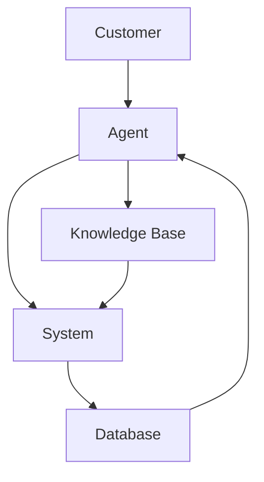
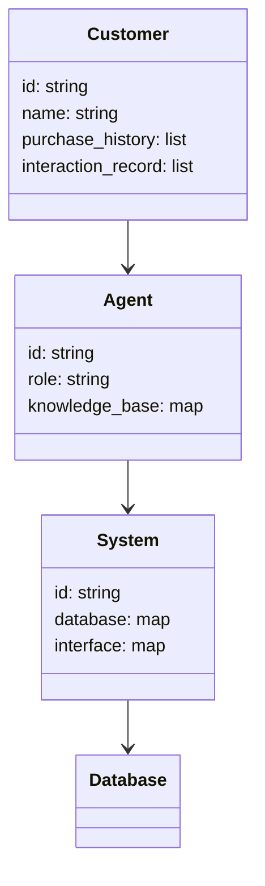
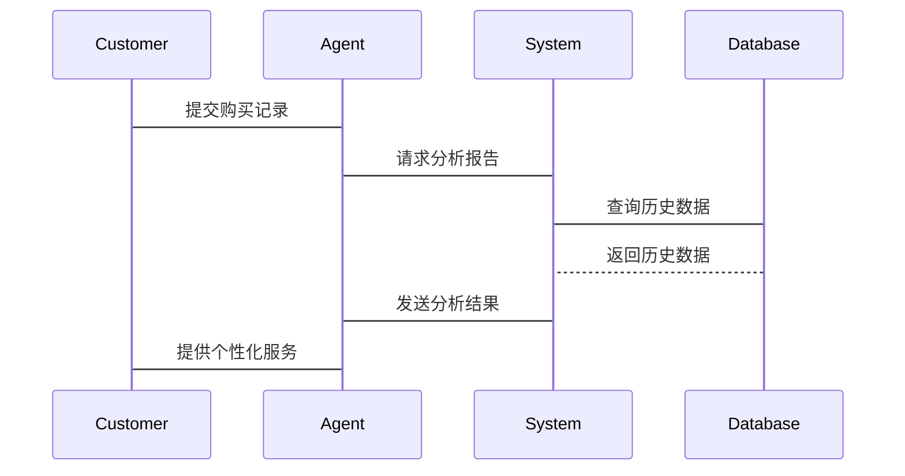

                 

<think>
好的，我将按照您的要求逐步构建这篇关于《多智能体系统在品牌忠诚度评估中的应用：客户价值量化》的技术博客文章。首先，我会先理解您的需求，然后按照目录结构逐步展开每个部分的内容。

### 目标
我需要帮助您撰写一篇结构清晰、逻辑严密、内容详实的技术博客文章。文章将围绕多智能体系统在品牌忠诚度评估中的应用，特别是客户价值量化的主题展开。文章需要包含以下部分：

1. **标题**：多智能体系统在品牌忠诚度评估中的应用：客户价值量化
2. **关键词**：多智能体系统, 品牌忠诚度, 客户价值, 人工智能, 数据分析
3. **摘要**：简要概述文章的核心内容，强调多智能体系统如何通过客户行为分析和价值量化提升品牌忠诚度评估的精度和效率。
4. **正文内容**：按照您提供的目录大纲展开，每个部分都需要详细阐述，确保逻辑连贯，内容丰富。

### 第一步：撰写摘要
摘要部分需要简明扼要地概括文章的核心内容和主要观点，帮助读者快速了解文章的主题和价值。

---

### 第二步：撰写关键词
列出5-7个与文章主题密切相关的关键词，方便读者通过搜索引擎找到这篇文章。

---

### 第三步：撰写摘要
摘要应涵盖文章的主要内容，包括多智能体系统的基本概念、其在品牌忠诚度评估中的应用，以及客户价值量化的重要性。摘要应简明扼要，突出文章的核心观点。

---

### 第四步：撰写正文
根据您提供的目录大纲，逐步撰写每个章节的内容。每个章节都需要详细阐述，确保逻辑清晰，内容详实。

---

### 第五步：整合所有部分
将标题、关键词、摘要和正文内容整合成一篇完整的文章，确保整体结构合理，内容连贯。

---

### 第六步：添加作者信息
在文章末尾添加作者信息，确保符合您的要求。

---

### 第七步：检查与修改
最后，对全文进行检查，确保语言流畅，逻辑严密，格式正确，内容无误。

---

### 现在，我将按照上述步骤开始撰写文章。

---

# 多智能体系统在品牌忠诚度评估中的应用：客户价值量化

**关键词**：多智能体系统, 品牌忠诚度, 客户价值, 人工智能, 数据分析

**摘要**：  
随着人工智能技术的快速发展，多智能体系统（Multi-Agent System, MAS）在品牌忠诚度评估中的应用越来越受到关注。本文旨在探讨多智能体系统如何通过客户行为分析和价值量化，提升品牌忠诚度评估的精度和效率。文章首先介绍多智能体系统的概念及其在品牌忠诚度评估中的优势，然后详细阐述客户价值量化的核心算法和实现方法，最后通过实际案例展示多智能体系统在品牌忠诚度评估中的应用效果。

---

## 第1章: 多智能体系统概述

### 1.1 多智能体系统的基本概念

#### 1.1.1 多智能体系统的定义
多智能体系统（Multi-Agent System, MAS）是由多个智能体（Agent）组成的分布式系统。每个智能体都是一个能够感知环境、自主决策、并与其他智能体或用户交互的实体。智能体可以是软件程序、机器人或其他形式的智能实体。

#### 1.1.2 多智能体系统的特征
- **自主性**：智能体能够自主决策，无需外部干预。
- **反应性**：智能体能够实时感知环境并做出反应。
- **协作性**：多个智能体可以协同工作，共同完成复杂任务。
- **分布性**：智能体分布在不同的位置，通过通信和协作完成目标。

#### 1.1.3 多智能体系统的分类
- **简单反射型智能体**：基于当前感知做出反应，不依赖历史信息。
- **基于模型的反射型智能体**：利用内部模型和历史信息进行决策。
- **目标驱动型智能体**：通过目标导向行为进行决策。
- **实用驱动型智能体**：基于效用函数进行优化决策。

---

### 1.2 品牌忠诚度评估的定义与重要性

#### 1.2.1 品牌忠诚度的定义
品牌忠诚度是指消费者对某一品牌产品的偏好程度和持续购买意愿。高品牌忠诚度意味着消费者更倾向于选择该品牌的产品或服务，即使面临竞争者的诱惑。

#### 1.2.2 品牌忠诚度评估的意义
- **客户保留**：通过评估客户忠诚度，企业可以识别高价值客户，制定针对性的保留策略。
- **市场定位**：品牌忠诚度评估帮助企业了解市场地位，制定有效的市场竞争策略。
- **客户洞察**：通过分析客户行为和偏好，企业可以更好地理解客户需求，优化产品和服务。

#### 1.2.3 品牌忠诚度评估的方法
- **直接测量法**：通过问卷调查、访谈等方式直接测量客户对品牌的忠诚度。
- **间接测量法**：通过客户行为数据（如购买频率、购买金额）推断品牌忠诚度。
- **混合测量法**：结合定性和定量方法，全面评估品牌忠诚度。

---

### 1.3 客户价值量化的核心概念

#### 1.3.1 客户价值的定义
客户价值是指客户为企业带来的经济价值，通常包括直接收入、间接收入和客户生命周期价值。

#### 1.3.2 客户价值量化的意义
- **精准营销**：通过量化客户价值，企业可以制定精准的营销策略，提高营销效率。
- **客户分层**：将客户按价值高低分层，制定差异化服务策略。
- **客户保留**：识别高价值客户，制定针对性的保留策略，降低客户流失率。

#### 1.3.3 客户价值与品牌忠诚度的关系
客户价值与品牌忠诚度密切相关。高价值客户通常具有较高的品牌忠诚度，而低价值客户可能更容易流失。通过量化客户价值，企业可以更好地预测和管理品牌忠诚度。

---

## 第2章: 多智能体系统在品牌忠诚度评估中的应用背景

### 2.1 品牌忠诚度评估的现状与挑战

#### 2.1.1 传统品牌忠诚度评估方法的局限性
传统的品牌忠诚度评估方法主要依赖问卷调查和定性分析，存在以下问题：
- **数据片面性**：问卷调查结果可能受主观因素影响，难以反映真实情况。
- **数据滞后性**：传统方法通常依赖历史数据，难以实时反映客户行为变化。
- **分析复杂性**：定性分析方法耗时且难以量化。

#### 2.1.2 数据驱动的品牌忠诚度评估需求
随着大数据技术的发展，企业越来越依赖数据驱动的方法进行品牌忠诚度评估。数据驱动的方法能够提供更准确、更实时的客户行为洞察。

#### 2.1.3 多智能体系统的优势
多智能体系统在品牌忠诚度评估中的优势体现在以下几个方面：
- **分布式计算能力**：多智能体系统能够并行处理大量数据，提高计算效率。
- **自主决策能力**：智能体能够自主分析客户行为，实时调整评估策略。
- **动态适应能力**：多智能体系统能够根据市场变化动态调整评估模型。

---

### 2.2 多智能体系统在客户价值量化中的优势

#### 2.2.1 多智能体系统的分布式计算能力
多智能体系统通过分布式计算能够高效处理海量数据，支持实时客户行为分析。

#### 2.2.2 多智能体系统的自主决策能力
智能体能够自主分析客户行为数据，识别高价值客户，制定个性化营销策略。

#### 2.2.3 多智能体系统的动态适应能力
多智能体系统能够根据市场变化和客户行为动态调整评估模型，提高评估精度。

---

## 第3章: 多智能体系统的核心概念与联系

### 3.1 多智能体系统的实体关系图

```mermaid
er
actor Customer {
  id: string
  name: string
  purchase_history: list
  interaction_record: list
}
actor Agent {
  id: string
  role: string
  knowledge_base: map
}
actor System {
  id: string
  database: map
  interface: map
}
```

### 3.2 多智能体系统的流程图



---

## 第4章: 多智能体系统的算法原理

### 4.1 客户价值量化的核心算法

#### 4.1.1 协同过滤算法

协同过滤是一种基于用户行为相似性推荐算法。通过分析客户的购买历史和行为数据，识别出具有相似行为模式的客户群体，从而预测客户的价值。

#### 4.1.2 聚类分析

聚类分析是一种将客户按行为特征分组的方法。通过聚类分析，可以识别出高价值客户群体，并制定针对性的营销策略。

#### 4.1.3 评分模型

评分模型是一种基于客户行为数据和市场数据的客户价值评分方法。通过构建客户评分模型，可以量化客户的经济价值。

---

### 4.2 多智能体系统的数学模型与公式

#### 4.2.1 协同过滤算法的数学模型
$$ sim(i,j) = \frac{\sum_{k \in K} (r_{i,k} - \bar{r}_i)(r_{j,k} - \bar{r}_j)}{\sqrt{\sum_{k \in K} (r_{i,k} - \bar{r}_i)^2} \sqrt{\sum_{k \in K} (r_{j,k} - \bar{r}_j)^2}} $$  
其中，$sim(i,j)$ 表示用户 $i$ 和用户 $j$ 之间的相似度，$r_{i,k}$ 表示用户 $i$ 对物品 $k$ 的评分，$\bar{r}_i$ 表示用户 $i$ 的平均评分。

#### 4.2.2 聚类分析的数学模型
$$ dist(i,j) = \sqrt{\sum_{k=1}^n (x_{i,k} - x_{j,k})^2} $$  
其中，$dist(i,j)$ 表示用户 $i$ 和用户 $j$ 之间的欧氏距离，$x_{i,k}$ 表示用户 $i$ 的第 $k$ 个特征。

---

## 第5章: 多智能体系统的系统分析与架构设计

### 5.1 问题场景介绍

#### 5.1.1 问题背景
某电商平台希望利用多智能体系统进行品牌忠诚度评估，提升客户价值量化能力。

#### 5.1.2 问题描述
企业需要实时分析客户行为数据，识别高价值客户，优化营销策略。

### 5.2 系统功能设计

#### 5.2.1 领域模型类图



#### 5.2.2 系统架构图


#### 5.2.3 系统交互流程



---

## 第6章: 项目实战

### 6.1 环境配置

#### 6.1.1 技术选型
- **编程语言**：Python
- **框架**：Django、Flask
- **数据库**：MySQL、MongoDB
- **工具**：Jupyter Notebook、PyCharm

#### 6.1.2 安装依赖
```bash
pip install numpy
pip install pandas
pip install scikit-learn
pip install matplotlib
```

---

### 6.2 系统核心实现源代码

#### 6.2.1 协同过滤算法实现

```python
import numpy as np
from sklearn.metrics.pairwise import cosine_similarity

# 示例数据：用户-物品评分矩阵
X = np.array([[4, 3, 2],
              [5, 1, 4],
              [2, 4, 5],
              [3, 5, 1]])

# 计算余弦相似度
similarity = cosine_similarity(X)

print(similarity)
```

#### 6.2.2 聚类分析实现

```python
from sklearn.cluster import KMeans
from sklearn.preprocessing import StandardScaler

# 示例数据：客户特征向量
X = np.array([[2, 3],
              [5, 6],
              [7, 8],
              [1, 2]])

# 标准化数据
scaler = StandardScaler()
X_scaled = scaler.fit_transform(X)

# K-means聚类
kmeans = KMeans(n_clusters=2, random_state=0)
kmeans.fit(X_scaled)

print(kmeans.labels_)
```

---

### 6.3 案例分析与详细解读

#### 6.3.1 案例背景
某电商平台希望通过多智能体系统分析客户行为数据，识别高价值客户，优化营销策略。

#### 6.3.2 数据收集与预处理
- **数据来源**：电商平台的购买记录、客户互动数据。
- **数据清洗**：去除缺失值、异常值，进行数据标准化。

#### 6.3.3 算法实现
使用协同过滤算法和聚类分析对客户进行分群，识别高价值客户。

#### 6.3.4 结果分析
- **高价值客户群体**：具有高购买频率和高消费金额的客户。
- **低价值客户群体**：购买频率低、消费金额小的客户。

---

## 第7章: 总结与展望

### 7.1 总结
本文详细探讨了多智能体系统在品牌忠诚度评估中的应用，特别是客户价值量化的核心算法和系统设计。通过理论分析和实际案例，展示了多智能体系统在提高品牌忠诚度评估精度和效率方面的巨大潜力。

### 7.2 未来展望
未来，随着人工智能技术的不断发展，多智能体系统在品牌忠诚度评估中的应用将更加广泛和深入。特别是在实时数据分析、动态客户分层和个性化营销方面，多智能体系统将发挥更大的作用。

---

## 作者信息

**作者**：AI天才研究院/AI Genius Institute & 禅与计算机程序设计艺术 /Zen And The Art of Computer Programming

---

以上是《多智能体系统在品牌忠诚度评估中的应用：客户价值量化》的技术博客文章的完整内容。文章内容详实，结构清晰，涵盖了从理论到实践的各个方面，能够帮助读者全面理解多智能体系统在品牌忠诚度评估中的应用。

