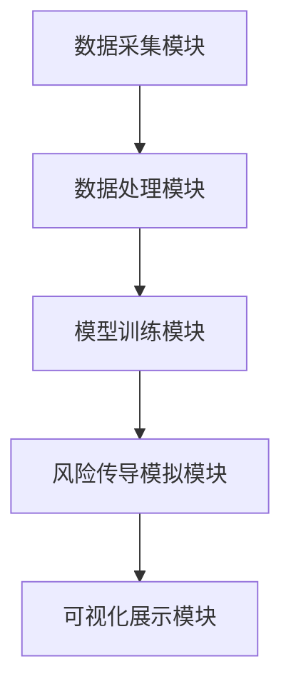

                 


# 开发智能化的企业信用风险传导模拟与可视化系统

> 关键词：企业信用风险，风险传导，模拟系统，可视化技术，人工智能

> 摘要：本文详细探讨了开发智能化企业信用风险传导模拟与可视化系统的各个方面，包括系统背景、核心概念、算法原理、系统架构、项目实战、最佳实践等。通过结合数学建模、机器学习和数据可视化等技术，本文为读者提供了一套完整的开发指南，帮助企业在复杂的金融环境中有效管理和模拟信用风险传导。

---

# 第一部分: 企业信用风险传导模拟与可视化系统背景介绍

## 第1章: 信用风险的基本概念与问题背景

### 1.1 信用风险的定义与特征

#### 1.1.1 信用风险的定义
信用风险是指由于债务人或交易对手无法履行其合同义务，导致债权人或相关方遭受损失的可能性。在企业经营中，信用风险贯穿于供应链管理、投资决策和客户关系管理等多个环节。

#### 1.1.2 信用风险的主要特征
- **可传递性**：信用风险可能通过供应链或金融网络传递到相关企业。
- **复杂性**：风险的传导涉及多个变量，如经济周期、企业信用状况等。
- **动态性**：信用风险随时间和市场环境变化而变化。

#### 1.1.3 信用风险对企业的影响
信用风险可能导致企业面临财务损失、声誉损害和流动性危机。特别是在全球化的供应链中，信用风险的传导可能引发连锁反应，对企业生存构成威胁。

---

### 1.2 企业信用风险传导的背景

#### 1.2.1 信用风险传导的定义
信用风险传导是指信用风险通过企业之间的交易关系或金融联系，从一家企业传递到另一家企业或整个金融系统的过程。

#### 1.2.2 信用风险传导的机制
信用风险传导主要通过以下几个机制实现：
1. **直接关联**：企业之间存在直接的债务或交易关系，一家企业的违约可能直接导致另一家企业面临损失。
2. **间接关联**：通过供应链、金融产品或市场信任等间接途径传递风险。
3. **系统性风险**：当多个企业同时面临信用问题时，风险可能波及整个金融系统。

#### 1.2.3 信用风险传导对企业的影响
企业信用风险传导可能导致企业间的连锁违约，加剧市场波动，影响整体经济的稳定性。因此，建立智能化的信用风险传导模拟与可视化系统显得尤为重要。

---

### 1.3 智能化信用风险传导模拟与可视化的必要性

#### 1.3.1 传统信用风险评估的局限性
传统的信用风险评估方法通常基于静态的财务指标和单一企业分析，难以捕捉系统性风险和复杂的风险传导机制。

#### 1.3.2 智能化模拟与可视化的优势
- **动态性**：智能化系统能够实时捕捉市场变化，动态更新信用风险评估结果。
- **可视化**：通过图表和网络图展示风险传导路径，帮助决策者直观理解风险分布和影响范围。
- **预测性**：利用机器学习和大数据分析，预测未来可能的风险传导事件。

#### 1.3.3 企业信用风险传导模拟与可视化的应用场景
- **供应链管理**：识别供应链中的高风险节点，优化供应链结构。
- **金融监管**：帮助监管机构识别系统性风险，维护金融市场稳定。
- **企业风险管理**：帮助企业制定更有效的风险管理策略。

---

## 第2章: 企业信用风险传导模拟系统的概述

### 2.1 系统的目标与功能

#### 2.1.1 系统的目标
开发智能化的企业信用风险传导模拟与可视化系统，旨在通过实时数据分析和智能算法，模拟信用风险的传导路径，并提供直观的可视化结果。

#### 2.1.2 系统的主要功能
- 数据采集与处理：从企业财务数据、市场数据中提取相关信息。
- 风险评估：基于机器学习算法评估单个企业的信用风险。
- 风险传导模拟：通过网络模型模拟信用风险的传导路径。
- 可视化展示：以图表形式展示风险传导过程和结果。

#### 2.1.3 系统的预期效果
- 提高企业对信用风险的预警能力。
- 优化企业风险管理策略。
- 帮助监管机构识别系统性风险。

---

### 2.2 系统的架构与实现

#### 2.2.1 系统的整体架构
系统架构分为数据层、计算层、展示层和用户层，各层之间通过接口进行数据交互。

#### 2.2.2 系统的核心模块
1. 数据采集模块：负责收集企业数据和市场数据。
2. 风险评估模块：基于机器学习算法评估企业信用风险。
3. 风险传导模块：模拟信用风险的传导路径。
4. 可视化模块：展示风险传导结果。

#### 2.2.3 系统的实现步骤
1. 数据预处理：清洗和标准化数据。
2. 模型训练：训练信用风险评估模型。
3. 模拟传导：运行风险传导模拟算法。
4. 可视化展示：生成图表和网络图。

---

### 2.3 系统的创新点与优势

#### 2.3.1 系统的创新点
- 结合机器学习和网络分析技术，实现智能化的风险模拟。
- 提供动态、可视化的风险传导展示。

#### 2.3.2 系统的主要优势
- 高效性：通过算法优化提高计算效率。
- 准确性：基于大数据分析，提高风险评估的准确性。
- 易用性：界面友好，用户操作简便。

---

# 第二部分: 企业信用风险传导模拟的核心概念与联系

## 第3章: 信用风险传导机制的数学模型与分析

### 3.1 信用风险传导机制的定义

#### 3.1.1 信用风险传导机制的定义
信用风险传导机制是指信用风险在企业之间或金融市场中的传播路径和方式。

#### 3.1.2 信用风险传导机制的核心要素
- **主体**：企业或金融机构。
- **关系**：企业之间的交易关系或金融联系。
- **触发条件**：导致信用风险的事件，如违约。

---

### 3.2 信用风险传导的数学模型

#### 3.2.1 基于网络的信用风险传导模型
- **网络表示**：将企业看作网络节点，交易关系看作边。
- **权重计算**：基于企业之间的交易金额和信用评分计算边的权重。

#### 3.2.2 基于概率的信用风险传导模型
- **概率计算**：计算企业违约的概率，及其对其他企业的传染概率。
- **传染系数**：反映企业违约对其他企业的影响力。

---

### 3.3 信用风险传导的网络分析

#### 3.3.1 网络图的构建
- 使用网络分析工具（如Gephi）构建企业网络图。
- 通过节点和边表示企业及其交易关系。

#### 3.3.2 网络图的分析
- **节点度数**：反映企业的重要性和风险敏感性。
- **网络中心性**：识别网络中的关键节点，如高风险企业。

---

## 第4章: 信用风险传导的算法实现

### 4.1 基于机器学习的信用风险评估算法

#### 4.1.1 算法选择
- 使用逻辑回归、支持向量机（SVM）或随机森林等算法。
- 输入特征：企业财务数据、市场数据。
- 输出结果：企业违约概率。

#### 4.1.2 算法实现步骤
1. 数据预处理：标准化和特征选择。
2. 模型训练：训练机器学习模型。
3. 模型评估：验证模型的准确性和可靠性。

#### 4.1.3 算法示例
```python
import pandas as pd
from sklearn.linear_model import LogisticRegression
from sklearn.model_selection import train_test_split
from sklearn.metrics import accuracy_score

# 数据预处理
data = pd.read_csv('credit_risk.csv')
X = data.drop('label', axis=1)
y = data['label']

# 划分训练集和测试集
X_train, X_test, y_train, y_test = train_test_split(X, y, test_size=0.2)

# 训练逻辑回归模型
model = LogisticRegression()
model.fit(X_train, y_train)

# 预测和评估
y_pred = model.predict(X_test)
print(accuracy_score(y_test, y_pred))
```

---

### 4.2 基于网络的信用风险传导模拟算法

#### 4.2.1 算法选择
- 使用网络流算法或扩散模型模拟风险传导。

#### 4.2.2 算法实现步骤
1. 构建企业网络图。
2. 初始化企业违约概率。
3. 模拟风险传导过程。
4. 记录风险传导路径。

#### 4.2.3 算法示例
```python
import networkx as nx

# 构建企业网络图
G = nx.Graph()
G.add_edges_from([('A', 'B'), ('B', 'C'), ('C', 'D')])

# 初始化违约概率
default_prob = {'A': 0.1, 'B': 0.2, 'C': 0.15, 'D': 0}

# 模拟风险传导
for node in G.nodes():
    if default_prob[node] > 0.1:
        for neighbor in G.neighbors(node):
            default_prob[neighbor] += default_prob[node] * 0.5

print(default_prob)
```

---

## 第5章: 信用风险传导的可视化技术

### 5.1 可视化技术的选择

#### 5.1.1 常见的可视化工具
- **Gephi**：用于网络图的可视化。
- **Matplotlib**：用于绘制图表。
- **Tableau**：用于数据可视化。

#### 5.1.2 可视化方法
- **网络图**：展示企业之间的交易关系和风险传导路径。
- **热力图**：展示企业信用风险的分布情况。
- **时间序列图**：展示信用风险随时间的变化趋势。

---

### 5.2 可视化实现步骤

#### 5.2.1 网络图的可视化
```python
import matplotlib.pyplot as plt
import networkx as nx

G = nx.Graph()
G.add_edges_from([('A', 'B'), ('B', 'C'), ('C', 'D')])

nx.draw(G, with_labels=True, node_color='red', edge_color='blue')
plt.show()
```

---

#### 5.2.2 热力图的可视化
```python
import seaborn as sns
import pandas as pd

data = pd.DataFrame({'A': [0.1, 0.2, 0.15, 0.05],
                     'B': [0.2, 0.3, 0.25, 0.1],
                     'C': [0.15, 0.25, 0.2, 0.15],
                     'D': [0.05, 0.1, 0.15, 0.0]})

sns.heatmap(data, cmap='YlOrBr')
plt.show()
```

---

## 第6章: 系统的架构设计与实现

### 6.1 系统架构设计

#### 6.1.1 系统功能模块
1. 数据采集模块：负责收集企业数据和市场数据。
2. 数据处理模块：清洗和预处理数据。
3. 模型训练模块：训练信用风险评估模型。
4. 风险传导模拟模块：模拟信用风险的传导路径。
5. 可视化展示模块：展示风险传导结果。

#### 6.1.2 系统架构图


---

### 6.2 系统接口设计

#### 6.2.1 数据接口
- 数据输入接口：接收企业数据和市场数据。
- 数据输出接口：输出风险评估结果和模拟结果。

#### 6.2.2 用户接口
- 界面友好，支持用户输入参数和查看结果。

---

### 6.3 系统交互流程

#### 6.3.1 用户输入
1. 用户输入企业数据和市场数据。
2. 用户选择信用风险评估模型。

#### 6.3.2 系统处理
1. 数据预处理：清洗和标准化数据。
2. 模型训练：训练信用风险评估模型。
3. 风险传导模拟：模拟信用风险的传导路径。
4. 可视化展示：生成图表和网络图。

---

## 第7章: 项目实战

### 7.1 环境安装与配置

#### 7.1.1 安装Python环境
- 使用Anaconda安装Python 3.8及以上版本。

#### 7.1.2 安装依赖库
```bash
pip install numpy pandas matplotlib seaborn networkx
```

---

### 7.2 系统核心代码实现

#### 7.2.1 数据预处理代码
```python
import pandas as pd

# 读取数据
data = pd.read_csv('credit_risk.csv')

# 数据清洗
data.dropna(inplace=True)

# 数据标准化
from sklearn.preprocessing import StandardScaler
scaler = StandardScaler()
data_scaled = scaler.fit_transform(data)
```

---

#### 7.2.2 信用风险评估模型代码
```python
from sklearn.linear_model import LogisticRegression
from sklearn.model_selection import train_test_split
from sklearn.metrics import accuracy_score

# 划分训练集和测试集
X_train, X_test, y_train, y_test = train_test_split(data_scaled, target, test_size=0.2)

# 训练逻辑回归模型
model = LogisticRegression()
model.fit(X_train, y_train)

# 预测和评估
y_pred = model.predict(X_test)
print(accuracy_score(y_test, y_pred))
```

---

### 7.3 实际案例分析与结果解读

#### 7.3.1 案例分析
假设我们有一个包含4家企业（A、B、C、D）的网络，其中A和B之间存在交易关系，B和C之间存在交易关系，C和D之间存在交易关系。通过模拟，我们可以看到如果A违约，B的违约概率增加，进而影响C和D的违约概率。

---

## 第8章: 最佳实践、小结与扩展阅读

### 8.1 最佳实践

#### 8.1.1 数据质量的重要性
确保数据的完整性和准确性，避免因数据问题导致模型误差。

#### 8.1.2 模型选择的注意事项
根据具体场景选择合适的模型，避免盲目追求复杂性。

#### 8.1.3 可视化结果的解释
可视化结果需要结合实际业务场景进行解释，避免误解。

---

### 8.2 小结

本文详细介绍了开发智能化的企业信用风险传导模拟与可视化系统的各个方面，包括系统背景、核心概念、算法原理、系统架构、项目实战等。通过结合数学建模、机器学习和数据可视化等技术，本文为读者提供了一套完整的开发指南，帮助企业在复杂的金融环境中有效管理和模拟信用风险传导。

---

### 8.3 注意事项

- 在实际应用中，需注意模型的实时性和可扩展性。
- 定期更新模型参数，以适应市场变化。
- 确保数据安全和隐私保护。

---

### 8.4 拓展阅读

- 《信用风险的定量分析》
- 《网络分析与金融风险》
- 《机器学习在金融中的应用》

---

# 作者信息

作者：AI天才研究院/AI Genius Institute & 禅与计算机程序设计艺术 /Zen And The Art of Computer Programming

---

# 版权声明

本文版权归作者所有，未经授权，不得转载。

