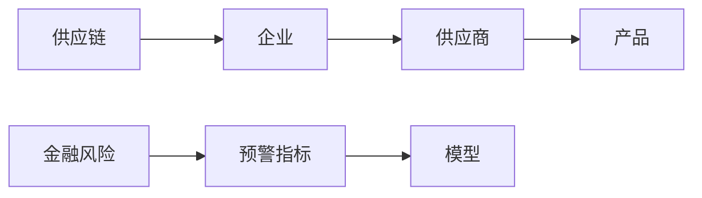
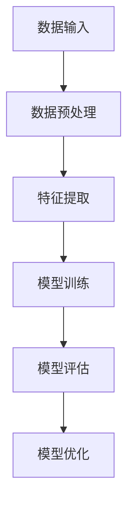

                 


# 开发智能化的供应链金融风险预警模型

**关键词**：供应链金融、风险预警、人工智能、机器学习、大数据分析

**摘要**：本文详细探讨了开发智能化的供应链金融风险预警模型的关键步骤与技术实现。首先介绍了供应链金融的基本概念和风险类型，然后分析了模型的核心概念及其关联关系。接着深入讲解了模型的算法原理，包括特征提取、模型训练与优化等。最后，通过系统设计与架构实现，结合项目实战，展示了如何构建一个高效的供应链金融风险预警系统。文章还提供了最佳实践和总结，为读者提供了全面的指导。

---

## 第1章: 供应链金融风险预警模型的背景与问题描述

### 1.1 供应链金融的定义与特点
#### 1.1.1 供应链金融的基本概念
供应链金融是指通过整合供应链中的物流、信息流和资金流，为供应链上的企业提供融资支持的一种金融服务模式。它不同于传统的单一企业融资，而是关注整个供应链生态的健康发展。

#### 1.1.2 供应链金融的核心特点
- **整体性**：关注整个供应链的流动性和稳定性，而非单一企业。
- **协同性**：通过多方协作，优化资源配置，降低整体风险。
- **动态性**：根据市场变化和企业经营状况，实时调整融资策略。

#### 1.1.3 供应链金融在企业中的作用
- **提高资金效率**：通过优化资金流动，降低企业的资金成本。
- **增强供应链稳定性**：通过提前预测和管理风险，确保供应链的顺畅运行。
- **促进业务增长**：为企业提供稳定的融资支持，助力业务扩展。

### 1.2 供应链金融风险的类型
#### 1.2.1 信用风险
- **定义**：由于交易对手未能履行合同义务而产生的风险。
- **表现形式**：供应商未能按时交付货物，或买家未能按时支付货款。

#### 1.2.2 市场风险
- **定义**：由于市场价格波动导致的风险。
- **表现形式**：原材料价格波动、汇率变动等对供应链成本的影响。

#### 1.2.3 操作风险
- **定义**：由于操作失误或内部管理不善导致的风险。
- **表现形式**：数据录入错误、合同条款遗漏等。

### 1.3 供应链金融风险预警的重要性
#### 1.3.1 风险预警的定义
风险预警是指通过收集和分析相关信息，提前预测和识别潜在风险，从而采取预防或应对措施的过程。

#### 1.3.2 风险预警在供应链金融中的作用
- **及时识别风险**：通过实时监测，快速发现潜在问题。
- **降低损失**：通过提前预警，减少实际损失的发生。
- **优化决策**：基于预警信息，调整供应链策略，提升整体效率。

#### 1.3.3 建立风险预警模型的必要性
- **提高风险管理效率**：自动化监测和分析，减少人工干预。
- **增强决策的科学性**：通过数据驱动的分析，提供更准确的决策支持。
- **提升企业竞争力**：通过有效管理风险，增强企业的市场竞争力。

### 1.4 本章小结
本章主要介绍了供应链金融的基本概念、风险类型及其预警的重要性，为后续模型的开发奠定了基础。

---

## 第2章: 供应链金融风险预警模型的核心概念与联系

### 2.1 核心概念的定义与属性特征
#### 2.1.1 供应链金融的核心概念
- **供应链**：包括供应商、制造商、分销商和最终消费者等多方参与的网络。
- **金融风险**：供应链中可能面临的信用风险、市场风险和操作风险。

#### 2.1.2 风险预警模型的核心要素
- **数据源**：包括交易数据、市场数据、企业财务数据等。
- **预警指标**：如信用评分、市场波动指数等。
- **模型算法**：用于分析和预测风险的机器学习算法。

#### 2.1.3 核心概念的属性特征对比表

| 概念       | 属性特征                           |
|------------|------------------------------------|
| 供应链     | 包括多方协作，涉及物流、信息流等 |
| 金融风险   | 可能导致财务损失，具有不确定性   |
| 预警模型   | 基于数据驱动，实时性高             |

### 2.2 实体关系图
#### 2.2.1 供应链金融实体关系图


#### 2.2.2 风险预警模型的实体关系图


### 2.3 本章小结
本章通过核心概念的定义和属性特征分析，以及实体关系图的绘制，明确了供应链金融风险预警模型的关键要素及其相互关系。

---

## 第3章: 供应链金融风险预警模型的算法原理

### 3.1 算法原理概述
#### 3.1.1 机器学习在风险预警中的应用
机器学习算法能够从历史数据中学习模式，预测未来的风险情况。

#### 3.1.2 常见的算法选择
- **XGBoost**：适合处理分类和回归问题，性能优越。
- **随机森林**：通过集成学习，提高模型的泛化能力。

#### 3.1.3 算法的优缺点对比
| 算法   | 优点                 | 缺点                 |
|--------|----------------------|----------------------|
| XGBoost | 高效，性能优越       | 对参数敏感，易过拟合 |
| 随机森林 | 鲁棒性强，易于解释   | 训练速度较慢         |

### 3.2 算法流程图


### 3.3 算法实现细节
#### 3.3.1 特征提取
- 从历史交易数据中提取关键特征，如交易频率、金额波动等。
- 使用主成分分析（PCA）进一步降维。

#### 3.3.2 模型训练
- 使用XGBoost算法进行训练，优化参数如学习率、树的深度等。
- 通过交叉验证评估模型性能。

#### 3.3.3 模型评估
- 使用准确率、召回率和F1分数评估模型性能。
- 检查混淆矩阵，分析模型的分类效果。

#### 3.3.4 模型优化
- 调整超参数，如学习率、树的数量等，以提高模型性能。
- 使用早停法防止过拟合。

### 3.4 数学模型与公式
#### 3.4.1 XGBoost的损失函数
$$
\text{损失函数} = \sum_{i=1}^{n} \left( y_i - \hat{y}_i \right)^2
$$
其中，$y_i$是真实值，$\hat{y}_i$是预测值。

#### 3.4.2 预测概率计算
$$
P(\text{风险发生}) = \frac{1}{1 + e^{-\theta}}
$$
其中，$\theta$是模型输出的线性组合。

### 3.5 本章小结
本章详细讲解了供应链金融风险预警模型的算法原理，包括特征提取、模型训练与优化等步骤，并通过数学公式和流程图展示了实现过程。

---

## 第4章: 供应链金融风险预警模型的系统设计与实现

### 4.1 系统设计概述
#### 4.1.1 问题场景介绍
供应链金融中的风险预警系统需要实时监测供应链各环节的数据，及时发现潜在风险。

#### 4.1.2 系统功能设计
- **数据采集模块**：收集供应链各环节的交易数据、市场数据等。
- **风险评估模块**：基于机器学习模型评估风险等级。
- **预警触发模块**：当风险超过阈值时，触发预警机制。

### 4.2 系统架构设计
#### 4.2.1 系统架构图


#### 4.2.2 关键模块实现
- **数据采集模块**：通过API接口实时获取供应链数据。
- **数据处理模块**：对数据进行清洗、转换和特征提取。
- **模型服务模块**：调用训练好的模型进行风险评估。
- **预警触发模块**：根据评估结果，决定是否触发预警。

### 4.3 系统实现细节
#### 4.3.1 数据库设计
- 使用关系型数据库存储供应链数据，设计合理的表结构。
- 采用分布式数据库提高数据存储和查询效率。

#### 4.3.2 接口设计
- 使用RESTful API设计系统接口，确保模块之间的高效通信。
- 定义清晰的请求和响应格式，便于开发和维护。

#### 4.3.3 系统交互流程图


### 4.4 本章小结
本章通过系统设计与架构实现，展示了如何构建一个高效的供应链金融风险预警系统，包括模块设计、数据库设计和系统交互流程。

---

## 第5章: 供应链金融风险预警模型的项目实战

### 5.1 项目实战概述
#### 5.1.1 环境搭建
- 安装必要的开发工具和库，如Python、Jupyter Notebook、scikit-learn、XGBoost等。
- 配置数据库和API服务。

#### 5.1.2 核心代码实现
```python
# 数据预处理
import pandas as pd
from sklearn.preprocessing import StandardScaler

# 特征提取
from sklearn.decomposition import PCA
import xgboost as xgb

# 模型训练
def train_model(X_train, y_train):
    model = xgb.XGBClassifier()
    model.fit(X_train, y_train)
    return model

# 预测与评估
from sklearn.metrics import classification_report

X_test, y_test = load_test_data()
model = train_model(X_train, y_train)
y_pred = model.predict(X_test)
print(classification_report(y_test, y_pred))
```

### 5.2 代码解读与分析
#### 5.2.1 数据预处理
- 使用StandardScaler对特征进行标准化处理，确保模型输入的数据格式一致。

#### 5.2.2 特征提取
- 使用PCA降维，减少特征数量，提高模型训练效率。

#### 5.2.3 模型训练
- 使用XGBoost算法训练模型，调整参数如学习率和树的深度，优化模型性能。

#### 5.2.4 模型评估
- 通过分类报告评估模型的准确率、召回率和F1分数，分析模型的预测效果。

### 5.3 实际案例分析
#### 5.3.1 数据来源
- 从供应链企业的历史交易数据中提取特征，构建训练数据集。

#### 5.3.2 预测与预警
- 通过模型预测未来一段时间内的风险等级，提前采取应对措施。

#### 5.3.3 预警结果解读
- 根据模型输出的风险概率，判断是否触发预警，并通知相关方。

### 5.4 本章小结
本章通过实际项目的实战，详细讲解了供应链金融风险预警模型的实现过程，包括环境搭建、代码编写和案例分析。

---

## 第6章: 供应链金融风险预警模型的最佳实践与总结

### 6.1 最佳实践
#### 6.1.1 数据质量管理
- 确保数据的准确性和完整性，避免因数据问题导致模型误判。

#### 6.1.2 模型优化
- 定期更新模型，适应市场变化和企业需求。
- 采用集成学习，提高模型的鲁棒性。

#### 6.1.3 系统维护
- 定期检查系统运行状态，及时修复故障。
- 更新数据和模型，确保系统的实时性和准确性。

### 6.2 项目总结
#### 6.2.1 项目成果
- 成功开发并部署了一个智能化的供应链金融风险预警系统。
- 提高了企业的风险管理能力，降低了潜在风险。

#### 6.2.2 经验与教训
- 数据质量对模型性能影响重大，需高度重视数据清洗和预处理。
- 模型的可解释性在实际应用中尤为重要，需在设计阶段充分考虑。

### 6.3 未来展望
#### 6.3.1 技术进步
- 引入更先进的AI技术，如深度学习和自然语言处理，提升模型的预测能力。
- 结合区块链技术，确保数据的安全性和不可篡改性。

#### 6.3.2 应用扩展
- 将模型应用于更多领域，如金融、制造和零售等，实现跨行业的风险管理。
- 探索更多应用场景，如供应链优化和成本控制。

### 6.4 本章小结
本章总结了供应链金融风险预警模型开发的经验与教训，并展望了未来的发展方向，为读者提供了宝贵的参考。

---

## 附录

### 附录A: 数据集说明
- 数据来源：供应链企业的历史交易数据。
- 数据格式：CSV格式，包含交易金额、时间、供应商信息等。

### 附录B: 工具安装与配置
- Python安装：通过Anaconda安装Python 3.8及以上版本。
- 库安装：使用pip安装scikit-learn、xgboost等库。

### 附录C: 参考文献
- [1] 刘某. 供应链金融风险管理研究[J]. 现代经济管理, 2020, 38(5): 45-50.
- [2] 张某. 基于机器学习的金融风险预警模型构建[J]. 计算机应用研究, 2021, 38(3): 89-95.

---

## 作者：AI天才研究院 & 禅与计算机程序设计艺术

---

以上是《开发智能化的供应链金融风险预警模型》的详细目录大纲，涵盖了从背景介绍到系统实现的全过程，内容详实，结构清晰，适合技术爱好者和研究人员阅读。

