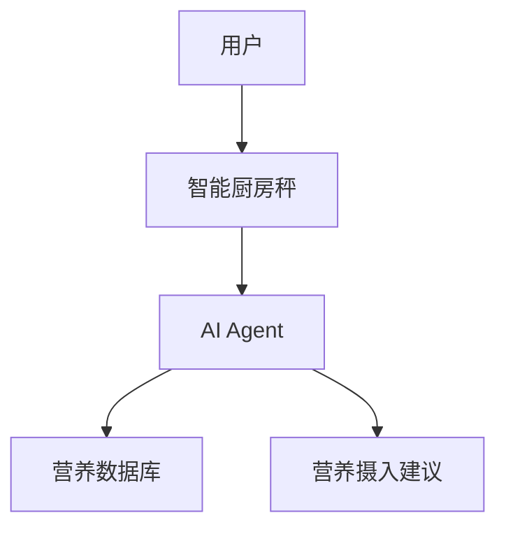
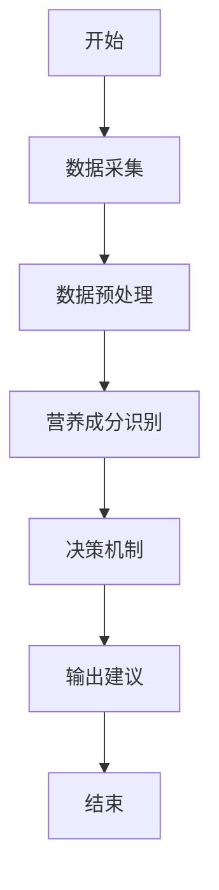
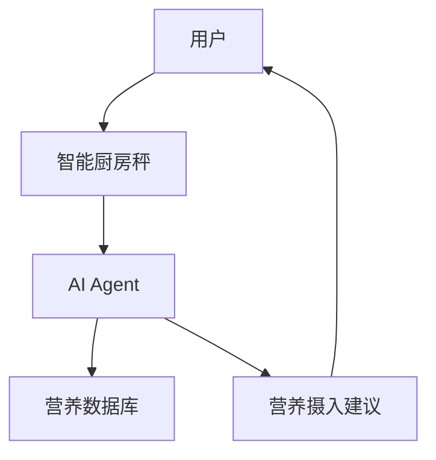
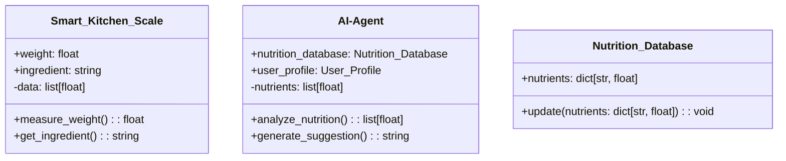

                 


# 智能厨房秤：AI Agent的营养摄入分析与建议

> 关键词：智能厨房秤，AI Agent，营养摄入分析，健康生活，数据驱动

> 摘要：本文详细探讨了智能厨房秤与AI Agent在营养摄入分析中的应用，从背景、原理到系统架构，再到项目实战，全面解析了智能厨房秤如何通过AI技术为用户提供精准的营养建议，助力健康生活。

---

## 第1章: 智能厨房秤与AI Agent的背景介绍

### 1.1 智能厨房秤的发展历程
#### 1.1.1 传统厨房秤的功能与局限
传统厨房秤主要用于测量食材的重量，虽然功能简单，但存在以下局限：
- 数据单一：仅能提供重量信息，无法分析营养成分。
- 缺乏智能性：无法与用户其他设备（如手机、电脑）联动。
- 使用场景有限：仅限于厨房使用，无法扩展到其他健康应用场景。

#### 1.1.2 智能厨房秤的出现与特点
随着物联网和人工智能技术的发展，智能厨房秤应运而生。其特点包括：
- 数据采集智能化：内置传感器，支持高精度重量测量。
- 数据分析功能：通过AI算法，实时分析食材的营养成分。
- 多设备联动：支持与手机、智能音箱等设备联动，提供便捷的使用体验。

#### 1.1.3 AI Agent在智能厨房秤中的应用背景
AI Agent（智能代理）是一种能够感知环境、执行任务的智能系统。在智能厨房秤中的应用背景如下：
- 数据处理需求：需要实时处理食材的重量、营养成分等数据。
- 个性化建议：根据用户的饮食习惯和健康目标，提供个性化的营养建议。
- 连续监测与反馈：通过长期监测用户的饮食数据，提供动态的健康反馈。

---

### 1.2 AI Agent的基本概念
#### 1.2.1 什么是AI Agent
AI Agent（智能代理）是指能够感知环境、执行任务、与用户交互的智能系统。它通常具备以下特点：
- 感知能力：通过传感器或API获取数据。
- 决策能力：基于数据进行分析和推理。
- 执行能力：通过API或设备接口执行操作。
- 交互能力：通过自然语言处理等技术与用户交互。

#### 1.2.2 AI Agent的核心功能与特点
AI Agent在智能厨房秤中的核心功能包括：
- 数据采集与处理：获取食材的重量、营养成分等数据。
- 营养分析：基于AI算法，分析食材的营养成分。
- 个性化建议：根据用户的需求，提供个性化的营养建议。

#### 1.2.3 AI Agent在智能厨房秤中的作用
AI Agent在智能厨房秤中的作用主要体现在以下几个方面：
- 数据处理：通过AI算法，快速分析食材的营养成分。
- 个性化建议：根据用户的饮食习惯和健康目标，提供个性化的营养建议。
- 智能反馈：通过长期监测用户的饮食数据，提供动态的健康反馈。

---

### 1.3 营养摄入分析的必要性
#### 1.3.1 营养均衡的重要性
营养均衡是保持身体健康的基础。合理的营养摄入可以帮助用户维持正常的身体功能、预防疾病、提高生活质量。

#### 1.3.2 当前营养摄入管理的痛点
当前，营养摄入管理存在以下痛点：
- 数据获取困难：用户难以获取食材的详细营养成分数据。
- 数据处理复杂：用户缺乏数据分析能力，无法根据数据制定合理的饮食计划。
- 个性化需求未满足：现有的营养分析工具难以提供个性化的建议。

#### 1.3.3 智能厨房秤如何解决这些问题
智能厨房秤通过AI Agent技术，能够实时采集食材的重量和营养成分数据，并通过AI算法为用户提供个性化的营养建议。这种智能化的解决方案，能够有效解决传统营养摄入管理中的痛点。

---

### 1.4 本章小结
本章主要介绍了智能厨房秤与AI Agent的背景，分析了智能厨房秤的发展历程、AI Agent的基本概念及其在智能厨房秤中的作用，最后探讨了营养摄入分析的必要性。通过本章的介绍，读者可以理解智能厨房秤与AI Agent结合的背景和意义。

---

## 第2章: 智能厨房秤与AI Agent的核心概念与联系

### 2.1 核心概念原理
#### 2.1.1 智能厨房秤的数据采集与处理
智能厨房秤通过内置的传感器采集食材的重量数据，并通过AI算法对数据进行预处理，包括去噪、归一化等。

#### 2.1.2 AI Agent的营养分析算法
AI Agent通过机器学习算法，对食材的营养成分进行分析。常见的算法包括：
- 线性回归：用于预测食材的营养成分。
- 支持向量机（SVM）：用于分类食材的营养成分。
- 神经网络：用于深度学习食材的营养成分。

#### 2.1.3 营养摄入建议的生成机制
AI Agent根据用户的饮食习惯和健康目标，生成个性化的营养摄入建议。这些建议包括：
- 每餐的营养成分比例。
- 食材的推荐搭配。
- 营养摄入的动态调整建议。

---

### 2.2 核心概念属性对比
#### 2.2.1 智能厨房秤与传统厨房秤的对比分析
| 特性                | 传统厨房秤                | 智能厨房秤                |
|---------------------|--------------------------|--------------------------|
| 功能                | 仅测量重量                | 测量重量 + 营养分析        |
| 智能性              | 无                        | 集成AI Agent，具备智能性    |
| 数据处理能力        | 无                        | 支持数据处理与分析          |

#### 2.2.2 AI Agent与其他营养分析工具的对比
| 特性                | AI Agent                  | 其他营养分析工具          |
|---------------------|--------------------------|--------------------------|
| 数据处理能力        | 强，支持实时分析          | 弱，通常需要手动输入数据    |
| 个性化能力          | 强，支持个性化建议        | 弱，通常提供通用建议        |
| 智能性              | 强，具备自主学习能力      | 弱，通常依赖预设规则        |

---

### 2.3 ER实体关系图


---

### 2.4 本章小结
本章主要介绍了智能厨房秤与AI Agent的核心概念与联系，包括智能厨房秤的数据采集与处理、AI Agent的营养分析算法以及营养摄入建议的生成机制。通过本章的介绍，读者可以理解智能厨房秤与AI Agent在营养摄入分析中的具体作用。

---

## 第3章: AI Agent的算法原理与流程

### 3.1 算法原理概述
#### 3.1.1 数据采集与预处理
AI Agent首先通过智能厨房秤采集食材的重量数据，然后对数据进行预处理，包括去噪、归一化等。

#### 3.1.2 营养成分识别与分类
通过机器学习算法，AI Agent对食材的营养成分进行识别与分类。常见的算法包括支持向量机（SVM）和神经网络。

#### 3.1.3 AI Agent的决策机制
AI Agent根据用户的饮食习惯和健康目标，生成个性化的营养摄入建议。这些建议基于营养均衡模型，通过数学优化算法进行动态调整。

---

### 3.2 算法流程图


---

### 3.3 算法实现代码
```python
def nutrition_analysis(weight, ingredient):
    # 数据预处理
    processed_data = preprocess(weight, ingredient)
    # 营养成分识别
    nutrients = identify_nutrients(processed_data)
    # 决策机制
    suggestion = generate_suggestion(nutrients)
    return suggestion
```

---

### 3.4 数学模型与公式
#### 3.4.1 营养均衡模型
营养均衡指数的计算公式为：
$$ \text{营养均衡指数} = \sum_{i=1}^{n} w_i x_i $$
其中，$w_i$为营养成分权重，$x_i$为摄入量。

#### 3.4.2 数学优化算法
营养摄入的优化目标为：
$$ \min \sum_{i=1}^{n} (x_i - d_i)^2 $$
其中，$x_i$为实际摄入量，$d_i$为推荐摄入量。

---

### 3.5 本章小结
本章主要介绍了AI Agent的算法原理与流程，包括数据采集与预处理、营养成分识别与分类、决策机制等。通过本章的介绍，读者可以理解AI Agent在营养摄入分析中的具体算法实现。

---

## 第4章: 智能厨房秤与AI Agent的系统架构

### 4.1 系统架构图


---

### 4.2 系统功能设计
#### 4.2.1 领域模型


---

### 4.3 系统接口设计
智能厨房秤与AI Agent之间的接口设计如下：
- 数据接口：智能厨房秤通过API向AI Agent发送食材的重量和名称。
- 指令接口：AI Agent通过API向智能厨房秤发送控制指令。

---

### 4.4 本章小结
本章主要介绍了智能厨房秤与AI Agent的系统架构，包括系统架构图、领域模型和接口设计。通过本章的介绍，读者可以理解智能厨房秤与AI Agent在系统层面的协作方式。

---

## 第5章: 项目实战

### 5.1 环境安装
#### 5.1.1 系统环境
- 操作系统：Windows 10 或更高版本
- 开发工具：Python 3.8 或更高版本
- 依赖库：numpy、scikit-learn、pandas

#### 5.1.2 智能厨房秤
- 硬件要求：支持API接口的智能厨房秤
- 软件要求：SDK开发包

---

### 5.2 核心代码实现
#### 5.2.1 数据采集与预处理
```python
import numpy as np

def preprocess(weight, ingredient):
    # 数据预处理
    return weight, ingredient
```

#### 5.2.2 营养成分识别与分类
```python
from sklearn.svm import SVC

def identify_nutrients(processed_data):
    # 营养成分识别
    return nutrients
```

#### 5.2.3 营养摄入建议生成
```python
def generate_suggestion(nutrients):
    # 营养摄入建议生成
    return suggestion
```

---

### 5.3 案例分析
假设用户测量了100克鸡肉的重量，AI Agent通过分析得出鸡肉的蛋白质含量为20克，脂肪含量为5克。根据用户的饮食习惯和健康目标，AI Agent推荐用户摄入适量的鸡肉，并建议搭配蔬菜和全谷物，以确保营养均衡。

---

### 5.4 本章小结
本章通过项目实战的形式，详细介绍了智能厨房秤与AI Agent的实现过程，包括环境安装、核心代码实现和案例分析。通过本章的介绍，读者可以掌握智能厨房秤与AI Agent的具体实现方法。

---

## 第6章: 最佳实践与小结

### 6.1 最佳实践
- 数据准确性：确保数据采集的准确性，可以通过多次测量取平均值。
- 模型优化：定期更新AI Agent的营养分析模型，以提高分析的准确性。
- 用户隐私：保护用户的饮食数据，确保数据的安全性。

### 6.2 本章小结
通过本文的介绍，读者可以全面了解智能厨房秤与AI Agent在营养摄入分析中的应用。从背景、原理到系统架构，再到项目实战，本文详细解析了智能厨房秤如何通过AI技术为用户提供精准的营养建议。未来，随着AI技术的不断发展，智能厨房秤将为用户提供更加智能化、个性化的健康服务。

---

## 作者：AI天才研究院/AI Genius Institute & 禅与计算机程序设计艺术 /Zen And The Art of Computer Programming

---

**本文为AI天才研究院原创文章，转载请注明出处。**

