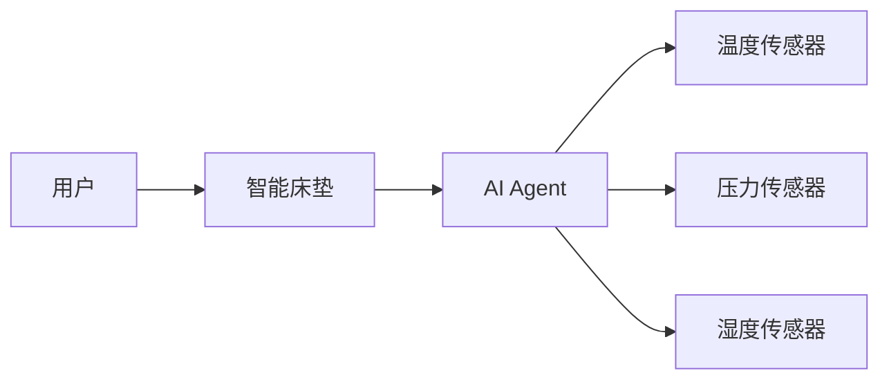

                 


# 智能床垫：AI Agent的体温调节系统

> 关键词：智能床垫, AI Agent, 体温调节, 多传感器融合, 智能家居, 物联网, 人工智能

> 摘要：本文深入探讨智能床垫在体温调节系统中的应用，结合AI Agent和多传感器技术，分析其原理、设计和实现，展示如何通过智能技术提升睡眠质量。

---

## 第一章: 问题背景与描述

### 1.1 问题背景
#### 1.1.1 现代床垫的发展趋势
床垫作为人们日常生活中不可或缺的寝具，近年来随着科技的发展，逐渐从单纯提供支撑和舒适性向智能化方向发展。消费者对床垫的功能要求不再局限于提供基本的支撑和舒适性，而是希望床垫能够根据用户的个体需求和环境变化，提供个性化的睡眠解决方案。

#### 1.1.2 体温调节的重要性
人体的体温在24小时内会有自然波动，且不同人对温度的敏感度和适应度不同。理想的睡眠环境应能根据用户的体温变化和环境温度自动调节，以提供最舒适的睡眠环境。研究表明，适宜的睡眠温度有助于提高睡眠质量，进而提升整体健康状况。

#### 1.1.3 智能床垫的市场现状
随着物联网和人工智能技术的快速发展，智能床垫逐渐成为智能家居的重要组成部分。市场上已经出现了多种智能床垫产品，它们通过集成温度传感器、压力传感器等，结合AI算法，实现对床垫硬度和温度的智能调节。然而，现有的产品在用户体验、调节精度和智能化水平方面仍有提升空间。

### 1.2 问题描述
#### 1.2.1 传统床垫的局限性
传统床垫无法根据用户的个体需求和环境变化进行智能调节，用户只能通过更换床垫或添加外部设备（如电热毯）来改善睡眠环境，这种方式不仅不方便，而且难以实现精准调节。

#### 1.2.2 用户对智能调节的需求
用户希望床垫能够根据自己的体温变化、环境温度和睡眠周期自动调节温度和硬度，以提供个性化的睡眠解决方案。此外，用户还希望床垫能够与其他智能家居设备联动，实现更加智能化的家居体验。

#### 1.2.3 智能床垫的技术挑战
智能床垫的技术实现需要克服多传感器数据融合、AI算法优化、系统稳定性等多个技术难点。如何在有限的成本和功耗条件下，实现高精度的温度调节和舒适的用户体验，是当前智能床垫技术发展的主要挑战。

---

## 第二章: 智能床垫的解决方案

### 2.1 问题解决思路
#### 2.1.1 AI Agent的核心作用
AI Agent（智能体）在智能床垫中扮演着“大脑”的角色，负责接收和处理来自温度传感器、压力传感器等设备的数据，分析用户的体温变化和环境温度，制定调节策略，并通过控制加热层或冷却层实现温度调节。

#### 2.1.2 多传感器数据采集
智能床垫需要集成多种传感器，包括温度传感器、压力传感器、湿度传感器等，以全面感知用户的体温变化和睡眠环境。通过多传感器数据的融合，可以更准确地判断用户的体温需求。

#### 2.1.3 智能调节算法设计
基于多传感器数据的智能调节算法是智能床垫的核心技术。通过机器学习和优化算法，可以实现对温度的精准调节，确保用户在不同睡眠阶段都能获得最舒适的温度环境。

### 2.2 解决方案的边界与外延
#### 2.2.1 系统功能边界
智能床垫的调节功能仅限于床垫本身，不涉及其他外部设备的控制。虽然可以通过智能家居平台实现联动，但核心功能仅限于床垫本体的温度和硬度调节。

#### 2.2.2 外部接口的定义
智能床垫需要与智能家居平台（如智能音箱、智能灯等）进行数据交互，通过标准的API接口实现设备联动。此外，还需要与用户的手机APP进行数据同步，方便用户随时查看和调整床垫的调节参数。

#### 2.2.3 系统扩展的可能性
未来，智能床垫可以通过增加更多传感器（如心率传感器、呼吸传感器等）和AI算法的优化，进一步提升调节的精准度和智能化水平。同时，还可以与其他健康监测设备（如智能手环、健康监测床垫等）联动，提供更加全面的健康监测和管理服务。

---

## 第三章: 核心概念与联系

### 3.1 核心概念原理
#### 3.1.1 AI Agent的基本原理
AI Agent通过接收多传感器的数据，利用机器学习算法进行分析和预测，制定调节策略，并通过执行器（如加热层、冷却层）实现温度调节。整个过程是一个典型的闭环控制系统，包括数据采集、数据分析、决策制定和执行反馈四个环节。

#### 3.1.2 多传感器融合技术
多传感器融合技术通过整合多种传感器的数据，利用数据融合算法（如加权融合、卡尔曼滤波等），提高系统的感知精度和可靠性。在智能床垫中，多传感器融合技术主要用于准确判断用户的体温变化和环境温度，确保调节策略的有效性。

#### 3.1.3 智能调节算法的实现
智能调节算法基于多传感器数据，利用机器学习模型进行预测和优化，实现对温度的精准调节。常用的算法包括PID控制算法、模糊控制算法和基于神经网络的预测控制算法。

### 3.2 核心概念对比
#### 3.2.1 AI Agent与传统控制系统的对比
| 对比维度 | AI Agent | 传统控制系统 |
|----------|-----------|--------------|
| 数据来源 | 多传感器数据 | 单一传感器数据 |
| 决策方式 | 基于机器学习模型 | 基于固定规则和逻辑 |
| 系统适应性 | 高度自适应，能够根据数据变化优化调节策略 | 较低，通常需要人工调整参数 |

#### 3.2.2 多传感器数据融合的优缺点
| 对比维度 | 优点 | 缺点 |
|----------|------|-----|
| 精度 | 提高系统的感知精度 | 增加系统的复杂性和成本 |
| 可靠性 | 提高系统的可靠性和抗干扰能力 | 需要复杂的算法和较高的计算资源 |

#### 3.2.3 智能调节算法的效率对比
| 对比维度 | PID控制算法 | 基于机器学习的预测算法 |
|----------|-----------|-----------------|
| 调节速度 | 较快，适用于快速响应的调节场景 | 较慢，适用于需要预测和优化的调节场景 |
| 精度 | 较低，适用于简单的线性调节问题 | 较高，适用于复杂的非线性调节问题 |
| 系统适应性 | 较低，需要人工调整参数 | 较高，能够自适应系统的动态变化 |

### 3.3 实体关系图
通过Mermaid图可以清晰地展示智能床垫系统中各实体之间的关系：



---

## 第四章: 算法原理与数学模型

### 4.1 AI Agent的算法原理
AI Agent通过接收多传感器的数据，利用机器学习模型进行分析和预测，制定调节策略，并通过执行器（如加热层、冷却层）实现温度调节。整个过程是一个典型的闭环控制系统，包括数据采集、数据分析、决策制定和执行反馈四个环节。

#### 4.1.1 PID控制算法
PID控制算法是一种常用的调节算法，适用于线性系统。PID控制算法通过比例、积分和微分三个部分来实现对系统输出的精确控制。

$$ e(t) = r(t) - y(t) $$
$$ u(t) = K_p e(t) + K_i \int e(t) dt + K_d \frac{de(t)}{dt} $$

其中，\( e(t) \) 是系统的误差，\( r(t) \) 是系统的设定值，\( y(t) \) 是系统的输出值，\( K_p \) 是比例系数，\( K_i \) 是积分系数，\( K_d \) 是微分系数。

#### 4.1.2 机器学习预测算法
基于机器学习的预测算法通过训练模型，预测系统的未来状态，并根据预测结果制定调节策略。常用的机器学习算法包括支持向量回归（SVR）、随机森林回归（RFR）和长短期记忆网络（LSTM）等。

#### 4.1.3 算法的优化与调整
为了提高系统的调节精度和效率，需要对PID控制算法和机器学习模型进行优化和调整。例如，可以通过遗传算法优化PID控制参数，或者通过交叉验证选择最优的机器学习模型。

### 4.2 算法实现与代码示例
以下是一个基于PID控制算法的智能床垫温度调节系统的Python实现示例：

```python
import numpy as np
import matplotlib.pyplot as plt

def pid_control(setpoint, current_temp, Kp, Ki, Kd, dt):
    error = setpoint - current_temp
    integral += error * dt
    derivative = (error - previous_error) / dt
    output = Kp * error + Ki * integral + Kd * derivative
    return output

# 初始化参数
Kp = 1
Ki = 0.1
Kd = 0.01
dt = 0.1
integral = 0
previous_error = 0

# 设置目标温度
setpoint = 25  # 单位：摄氏度

# 模拟环境温度变化
current_temp = 20  # 初始温度
environment_temp = np.sin(np.arange(0, 10, dt)) * 5 + 20  # 模拟环境温度波动

# 初始化输出和时间数组
outputs = []
times = []

for t in range(0, 10, dt):
    # 计算输出
    output = pid_control(setpoint, current_temp, Kp, Ki, Kd, dt)
    outputs.append(output)
    times.append(t)
    # 更新当前温度
    current_temp = environment_temp[t] + output * 0.1

# 绘制输出曲线
plt.figure(figsize=(10, 6))
plt.plot(times, outputs, label='Output')
plt.xlabel('Time (s)')
plt.ylabel('Output')
plt.legend()
plt.show()
```

---

## 第五章: 系统分析与架构设计

### 5.1 系统功能设计
智能床垫系统的功能设计主要围绕温度调节、硬度调节和数据采集三个核心功能展开。

#### 5.1.1 温度调节
智能床垫通过集成加热层和冷却层，实现对床垫温度的精准调节。温度传感器实时监测用户的体温和环境温度，AI Agent根据传感器数据和用户需求，制定调节策略，并通过加热层和冷却层实现温度调节。

#### 5.1.2 硬度调节
智能床垫可以根据用户的体重和睡姿调整床垫的硬度。压力传感器实时监测用户的体重分布，AI Agent根据压力传感器数据和用户的睡眠习惯，调整床垫的硬度，提供个性化的睡眠体验。

#### 5.1.3 数据采集
智能床垫需要采集用户的体温、体重分布、环境温度等多种数据，为调节算法提供输入。数据采集模块需要具备高精度、低功耗和长寿命的特点。

### 5.2 系统架构设计
智能床垫系统的架构设计包括数据采集层、数据处理层和执行层三个部分。

#### 5.2.1 数据采集层
数据采集层主要负责采集用户的体温、体重分布、环境温度等数据。常用的传感器包括温度传感器、压力传感器和湿度传感器。

#### 5.2.2 数据处理层
数据处理层负责对采集到的数据进行融合和分析，利用机器学习算法进行预测和优化，制定调节策略。

#### 5.2.3 执行层
执行层负责根据调节策略，通过加热层和冷却层实现温度调节，通过硬度调节模块实现硬度调节。

### 5.3 系统接口设计
智能床垫系统需要与智能家居平台、手机APP等外部设备进行数据交互。系统接口设计需要遵循标准协议，确保系统的兼容性和扩展性。

### 5.4 系统交互流程
以下是智能床垫系统的典型交互流程：


---

## 第六章: 项目实战

### 6.1 环境安装
#### 6.1.1 硬件安装
需要安装温度传感器、压力传感器、加热层和冷却层等硬件设备。硬件设备需要具备高精度、低功耗和长寿命的特点。

#### 6.1.2 软件安装
需要安装Python编程环境、机器学习库（如scikit-learn、TensorFlow）和数据可视化工具（如Matplotlib）。

### 6.2 系统核心实现
#### 6.2.1 数据采集与处理
通过传感器采集用户的体温和环境温度数据，利用数据融合算法对数据进行处理和分析。

#### 6.2.2 调节策略制定
基于机器学习模型，制定温度调节策略，并通过PID控制算法实现温度调节。

#### 6.2.3 硬度调节实现
根据压力传感器数据，调整床垫的硬度，提供个性化的睡眠体验。

### 6.3 案例分析
以下是一个基于PID控制算法的智能床垫温度调节系统的实现案例：

```python
import numpy as np
import matplotlib.pyplot as plt

def pid_control(setpoint, current_temp, Kp, Ki, Kd, dt):
    error = setpoint - current_temp
    integral += error * dt
    derivative = (error - previous_error) / dt
    output = Kp * error + Ki * integral + Kd * derivative
    return output

# 初始化参数
Kp = 1
Ki = 0.1
Kd = 0.01
dt = 0.1
integral = 0
previous_error = 0

# 设置目标温度
setpoint = 25  # 单位：摄氏度

# 模拟环境温度变化
current_temp = 20  # 初始温度
environment_temp = np.sin(np.arange(0, 10, dt)) * 5 + 20  # 模拟环境温度波动

# 初始化输出和时间数组
outputs = []
times = []

for t in range(0, 10, dt):
    # 计算输出
    output = pid_control(setpoint, current_temp, Kp, Ki, Kd, dt)
    outputs.append(output)
    times.append(t)
    # 更新当前温度
    current_temp = environment_temp[t] + output * 0.1

# 绘制输出曲线
plt.figure(figsize=(10, 6))
plt.plot(times, outputs, label='Output')
plt.xlabel('Time (s)')
plt.ylabel('Output')
plt.legend()
plt.show()
```

### 6.4 项目小结
通过本项目实战，我们可以看到智能床垫的实现需要结合硬件和软件技术，利用AI Agent和多传感器融合技术，实现对床垫温度和硬度的智能调节。项目的成功实施需要团队在硬件设计、算法优化和系统集成等方面具备较强的综合能力。

---

## 第七章: 最佳实践与总结

### 7.1 最佳实践
#### 7.1.1 硬件选型
在硬件选型时，需要选择高精度、低功耗、长寿命的传感器和执行器，确保系统的稳定性和可靠性。

#### 7.1.2 算法优化
在算法优化方面，需要根据实际需求选择合适的算法，通过实验和数据分析不断优化算法的性能。

#### 7.1.3 系统集成
在系统集成方面，需要确保各模块之间的协同工作，通过合理的接口设计和通信协议，实现系统的高效运行。

### 7.2 小结
智能床垫的实现是一个复杂的系统工程，需要结合硬件和软件技术，利用AI Agent和多传感器融合技术，实现对床垫温度和硬度的智能调节。通过本文的分析和实践，我们可以看到智能床垫的巨大潜力和广阔的应用前景。

### 7.3 注意事项
在实际应用中，需要注意系统的安全性和隐私保护，确保用户的个人隐私和数据安全。此外，还需要注意系统的可靠性和稳定性，确保系统的长期运行和用户体验。

### 7.4 拓展阅读
对于感兴趣的研究者和开发者，推荐阅读以下书籍和资料：
- 《AI in Healthcare》
- 《Smart Home Systems》
- 《IoT and Sensor Networks》

---

## 作者：AI天才研究院/AI Genius Institute & 禅与计算机程序设计艺术/Zen And The Art of Computer Programming

---

通过本文的深入分析和详细阐述，我们可以看到智能床垫在AI Agent和多传感器融合技术的支持下，已经成为现代智能家居的重要组成部分。未来，随着技术的不断发展和创新，智能床垫将为用户提供更加智能化、个性化的睡眠解决方案，进一步提升用户的睡眠质量和生活品质。

