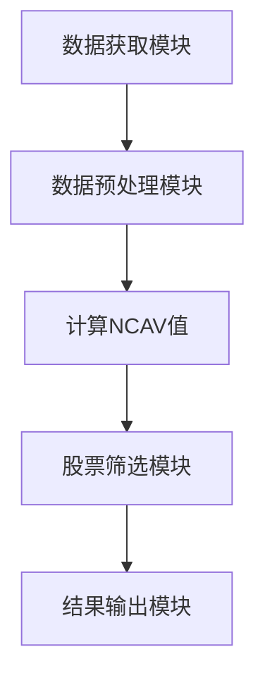

                 


# 格雷厄姆的NCAV策略：寻找极度低估的股票

**关键词**：NCAV、价值投资、股票估值、本杰明·格雷厄姆、投资策略

**摘要**：本文深入探讨了格雷厄姆的NCAV（Net Current Asset Value）策略，这是一种用于识别市场中被低估的股票的有效方法。通过详细分析NCAV的定义、计算方法及其在投资决策中的应用，本文旨在帮助读者理解如何利用这一策略来寻找潜在的高回报投资机会。文章还结合实际案例，展示了NCAV策略在实践中的应用，并提供了系统架构和项目实现的详细指导。

---

## 第一章：NCAV策略的背景与核心概念

### 1.1 格雷厄姆与NCAV策略的起源

#### 1.1.1 格雷厄姆的生平与投资理念
本杰明·格雷厄姆（Benjamin Graham）是价值投资的鼻祖，被誉为“价值投资之父”。他出生于1894年，早年在金融领域积累了丰富的经验，后来转向学术研究，并在哥伦比亚大学商学院任教，培养了许多著名投资者，如沃伦·巴菲特。格雷厄姆的投资理念强调安全边际和对公司内在价值的深入分析，主张以低于内在价值的价格买入股票，以确保投资的安全性。

#### 1.1.2 NCAV策略的提出背景
在20世纪20年代末至30年代初的经济大萧条期间，格雷厄姆观察到许多股票的价格暴跌，但其内在价值并未受到同等程度的损失。他意识到，这种价格与价值的脱节为投资者提供了以极低价格买入优质资产的机会。为了量化这一机会，格雷厄姆提出了NCAV（Net Current Asset Value）策略，这是一种基于公司流动资产与流动负债关系的估值方法。

#### 1.1.3 NCAV策略的核心思想
格雷厄姆的NCAV策略的核心思想是：寻找那些市场价格低于其净流动资产价值的公司。他认为，如果一家公司的市场价值低于其净流动资产价值，那么该公司的股票就是被低估的，具有投资价值。

### 1.2 NCAV策略的核心概念与联系

#### 1.2.1 NCAV的定义与计算公式
NCAV（Net Current Asset Value）是指公司在清偿流动负债后的剩余流动资产价值。其计算公式为：

$$
\text{NCAV} = \text{流动资产} - \text{流动负债}
$$

其中，流动资产包括现金、应收账款、存货等，流动负债包括应付账款、短期债务等。

#### 1.2.2 NCAV与股票内在价值的关系
格雷厄姆认为，NCAV是衡量公司内在价值的重要指标之一。如果一家公司的NCAV高于其市值（即市价低于NCAV），那么该公司的股票就是被低估的。因此，投资者可以通过寻找那些市值低于NCAV的公司，来找到潜在的高回报投资机会。

#### 1.2.3 NCAV策略与其他价值投资策略的对比
NCAV策略与其他价值投资策略（如市盈率法、市净率法等）相比，具有以下独特优势：
1. **简单易懂**：NCAV的计算方法相对简单，易于理解和应用。
2. **注重安全边际**：NCAV策略强调以低于内在价值的价格买入股票，注重安全边际。
3. **适用于多种行业**：NCAV策略适用于多种行业的公司，尤其是那些流动资产占比较高的公司。

### 1.3 NCAV策略在寻找极度低估股票中的作用

#### 1.3.1 极度低估股票的定义与特征
极度低估股票是指那些市场价格远低于其内在价值的股票。其主要特征包括：
1. **低市盈率**：市盈率远低于行业平均水平。
2. **低市净率**：市净率远低于行业平均水平。
3. **高NCAV**：NCAV值远高于市场价格。

#### 1.3.2 NCAV策略如何识别极度低估股票
通过计算公司的NCAV值，并将其与市场价格进行对比，投资者可以识别出那些市场价格低于NCAV值的公司。这些公司往往具有较高的安全边际，是潜在的高回报投资机会。

#### 1.3.3 极度低估股票的投资价值与风险
极度低估股票的投资价值在于其潜在的上涨空间。然而，这类股票也存在一定的风险，如公司基本面恶化、市场情绪波动等。因此，在投资极度低估股票时，投资者需要充分考虑公司的基本面和市场环境。

---

## 第二章：NCAV策略的核心概念与数学模型

### 2.1 NCAV策略的核心概念原理

#### 2.1.1 NCAV的计算公式与数学模型
NCAV的计算公式如下：

$$
\text{NCAV} = \text{流动资产} - \text{流动负债}
$$

其中，流动资产包括现金、应收账款、存货等，流动负债包括应付账款、短期债务等。

#### 2.1.2 NCAV与股票市场价格的关系
格雷厄姆认为，NCAV是衡量公司内在价值的重要指标之一。如果一家公司的NCAV高于其市值（即市价低于NCAV），那么该公司的股票就是被低估的，具有投资价值。

#### 2.1.3 NCAV策略的独特优势
NCAV策略的独特优势在于其简单易懂、注重安全边际、适用于多种行业等。

### 2.2 NCAV策略的数学模型与算法

#### 2.2.1 NCAV计算的数学模型
NCAV的计算公式可以表示为：

$$
\text{NCAV} = \text{流动资产} - \text{流动负债}
$$

其中，流动资产和流动负债的具体项目可以根据公司财务报表中的数据进行计算。

#### 2.2.2 NCAV策略的算法流程
以下是NCAV策略的算法流程：

1. **获取公司财务数据**：包括流动资产和流动负债。
2. **计算NCAV值**：使用公式$$\text{NCAV} = \text{流动资产} - \text{流动负债}$$计算公司的NCAV值。
3. **比较NCAV值与市场价格**：如果市场价格低于NCAV值，则该公司的股票被视为被低估，具有投资价值。

#### 2.2.3 NCAV策略的代码实现
以下是一个简单的Python代码示例，用于计算公司的NCAV值：

```python
# 计算NCAV值
def calculate_ncav(current_assets, current_liabilities):
    return current_assets - current_liabilities

# 示例数据
current_assets = 1000000  # 流动资产（美元）
current_liabilities = 800000  # 流动负债（美元）

ncav = calculate_ncav(current_assets, current_liabilities)
print(f"计算的NCAV值为：{ncav}美元")
```

### 2.3 NCAV策略的案例分析

#### 2.3.1 案例一：XYZ公司
假设XYZ公司的流动资产为1,000,000美元，流动负债为800,000美元，其市场价格为600,000美元。根据NCAV策略，XYZ公司的NCAV值为：

$$
\text{NCAV} = 1,000,000 - 800,000 = 200,000 \text{美元}
$$

由于XYZ公司的市场价格（600,000美元）低于其NCAV值（200,000美元），因此XYZ公司的股票被视为被低估，具有投资价值。

#### 2.3.2 案例二：ABC公司
假设ABC公司的流动资产为1,500,000美元，流动负债为1,200,000美元，其市场价格为1,000,000美元。根据NCAV策略，ABC公司的NCAV值为：

$$
\text{NCAV} = 1,500,000 - 1,200,000 = 300,000 \text{美元}
$$

由于ABC公司的市场价格（1,000,000美元）高于其NCAV值（300,000美元），因此ABC公司的股票不被视为被低估，不具有投资价值。

---

## 第三章：NCAV策略的系统架构与实现

### 3.1 系统架构设计

#### 3.1.1 系统功能模块
NCAV策略的系统架构设计包括以下功能模块：
1. **数据获取模块**：获取公司的财务数据。
2. **NCAV计算模块**：计算公司的NCAV值。
3. **股票筛选模块**：筛选出市场价格低于NCAV值的股票。

#### 3.1.2 系统架构图
以下是NCAV策略的系统架构图：



#### 3.1.3 系统接口设计
1. **数据获取接口**：用于获取公司的财务数据。
2. **NCAV计算接口**：用于计算公司的NCAV值。
3. **股票筛选接口**：用于筛选出市场价格低于NCAV值的股票。

### 3.2 系统实现

#### 3.2.1 Python代码实现
以下是一个简单的Python代码示例，用于实现NCAV策略的系统：

```python
import pandas as pd

# 数据获取模块
def get_financial_data(ticker):
    # 获取公司财务数据
    # 返回流动资产和流动负债
    return current_assets, current_liabilities

# NCAV计算模块
def calculate_ncav(current_assets, current_liabilities):
    return current_assets - current_liabilities

# 股票筛选模块
def screen_stocks(stocks):
    selected_stocks = []
    for stock in stocks:
        current_assets, current_liabilities = get_financial_data(stock)
        ncav = calculate_ncav(current_assets, current_liabilities)
        if stock_price < ncav:
            selected_stocks.append(stock)
    return selected_stocks

# 示例数据
stocks = ['AAPL', 'GOOG', 'MSFT']
selected_stocks = screen_stocks(stocks)
print(f"筛选出的低估股票为：{selected_stocks}")
```

### 3.3 系统实现的案例分析

#### 3.3.1 案例分析
以下是一个具体的案例分析，展示如何使用NCAV策略筛选出低估股票：

```python
# 示例数据
stocks = ['AAPL', 'GOOG', 'MSFT']
prices = {'AAPL': 150, 'GOOG': 200, 'MSFT': 100}
current_assets = {'AAPL': 800, 'GOOG': 1000, 'MSFT': 600}
current_liabilities = {'AAPL': 500, 'GOOG': 800, 'MSFT': 400}

# 筛选低估股票
selected_stocks = []
for stock in stocks:
    ncav = calculate_ncav(current_assets[stock], current_liabilities[stock])
    if prices[stock] < ncav:
        selected_stocks.append(stock)

print(f"筛选出的低估股票为：{selected_stocks}")
```

---

## 第四章：NCAV策略的应用与最佳实践

### 4.1 应用场景

#### 4.1.1 识别低估股票
NCAV策略的核心应用是识别那些市场价格低于其NCAV值的公司，这些公司通常具有较高的安全边际，是潜在的高回报投资机会。

#### 4.1.2 投资组合管理
通过NCAV策略，投资者可以构建一个包含低估股票的投资组合，从而在长期获得较高的投资回报。

### 4.2 最佳实践

#### 4.2.1 选择合适的公司
在应用NCAV策略时，投资者应选择那些流动资产占比较高、流动负债占比较低的公司，以确保NCAV值的准确性。

#### 4.2.2 考虑市场环境
在应用NCAV策略时，投资者应充分考虑市场环境，如经济周期、行业趋势等，以避免因市场波动而造成损失。

#### 4.2.3 定期调整投资组合
为了保持投资组合的健康，投资者应定期审查和调整其投资组合，以确保其包含的股票仍然符合NCAV策略的要求。

### 4.3 注意事项

#### 4.3.1 风险提示
尽管NCAV策略是一种有效的投资策略，但投资者在应用该策略时仍需注意以下风险：
1. **市场风险**：市场波动可能会影响股票价格，从而影响NCAV值的准确性。
2. **公司基本面风险**：公司基本面的变化可能会影响NCAV值的准确性，从而影响投资决策。

#### 4.3.2 法律与合规风险
投资者在应用NCAV策略时，应遵守相关法律法规，避免因不当投资行为而引发法律风险。

### 4.4 拓展阅读
为了进一步深入理解NCAV策略，读者可以参考以下书籍和资源：
1. 《证券分析》（*Security Analysis*）——本杰明·格雷厄姆
2. 《巴菲特的投资组合策略》（*Warren Buffett’s Portfolio Strategy*）——乔尔·蒂博尔
3. 网站：[格雷厄姆投资俱乐部](https://www.grahamclub.com)

---

## 第五章：结论与展望

### 5.1 结论
通过本文的深入分析，我们可以得出以下结论：
1. **NCAV策略是一种有效的投资策略**：它可以帮助投资者识别那些市场价格低于其NCAV值的公司，从而找到潜在的高回报投资机会。
2. **NCAV策略的应用需要结合实际情况**：投资者在应用NCAV策略时，应充分考虑市场环境和公司基本面，以避免因市场波动而造成损失。
3. **NCAV策略具有较高的投资价值**：通过应用NCAV策略，投资者可以在长期获得较高的投资回报。

### 5.2 未来展望
尽管NCAV策略是一种有效的投资策略，但随着市场环境的变化和投资理论的发展，未来可能会出现更多新的投资策略和方法。投资者需要不断学习和更新自己的知识，以适应市场的变化，抓住新的投资机会。

---

## 附录

### 附录A：术语表
1. **NCAV（Net Current Asset Value）**：净流动资产价值，指公司在清偿流动负债后的剩余流动资产价值。
2. **流动资产**：包括现金、应收账款、存货等。
3. **流动负债**：包括应付账款、短期债务等。
4. **内在价值**：指公司未来现金流的现值，是股票的真正价值。
5. **安全边际**：指股票的市场价格低于其内在价值的部分，是投资的安全保障。

### 附录B：经典案例分析
1. **案例一：XYZ公司**：XYZ公司的流动资产为1,000,000美元，流动负债为800,000美元，其市场价格为600,000美元。根据NCAV策略，XYZ公司的NCAV值为200,000美元，低于市场价格，因此XYZ公司的股票被视为被低估，具有投资价值。
2. **案例二：ABC公司**：ABC公司的流动资产为1,500,000美元，流动负债为1,200,000美元，其市场价格为1,000,000美元。根据NCAV策略，ABC公司的NCAV值为300,000美元，高于市场价格，因此ABC公司的股票不被视为被低估，不具有投资价值。

### 附录C：工具与资源推荐
1. **Python编程语言**：用于实现NCAV策略的系统和算法。
2. **Pandas库**：用于数据处理和分析。
3. **Matplotlib库**：用于数据可视化。
4. **Yahoo Finance API**：用于获取公司财务数据和股票价格。
5. **书籍推荐**：
   - 《证券分析》（*Security Analysis*）——本杰明·格雷厄姆
   - 《巴菲特的投资组合策略》（*Warren Buffett’s Portfolio Strategy*）——乔尔·蒂博尔

---

## 作者信息

**作者：AI天才研究院/AI Genius Institute & 禅与计算机程序设计艺术 /Zen And The Art of Computer Programming**

---

通过本文的详细分析，我们可以看到，格雷厄姆的NCAV策略是一种简单而有效的投资策略，可以帮助投资者识别那些市场价格低于其NCAV值的公司，从而找到潜在的高回报投资机会。尽管NCAV策略的应用需要结合实际情况，但其投资价值是不容忽视的。未来，随着市场环境的变化和投资理论的发展，NCAV策略将会在投资领域发挥更大的作用。

