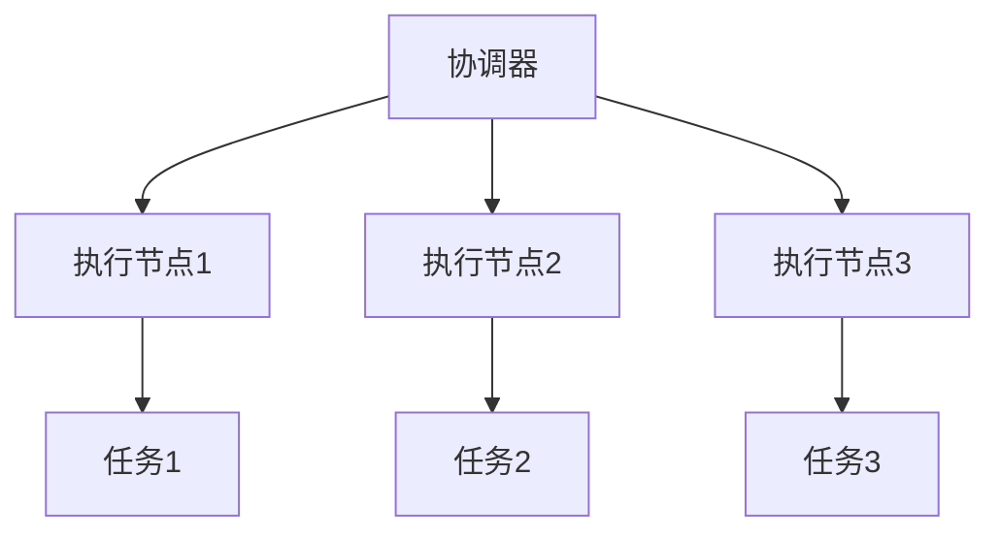
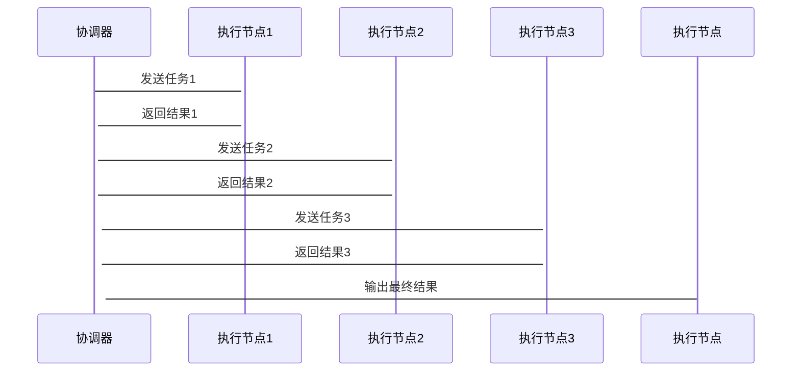

                 


# 群体智能 AI Agent：多个 LLM 协作的分布式系统

> 关键词：群体智能，AI Agent，多个 LLM，分布式系统，协作机制，算法原理

> 摘要：本文探讨了群体智能AI Agent中多个大语言模型（LLM）协作的分布式系统。从背景介绍、核心概念到算法原理、系统架构，再到项目实战和扩展，全面分析了这一领域的现状、挑战和未来方向。通过详细讲解，本文为读者提供了实现多个LLM协作的理论基础和实践指导。

---

# 第一部分: 群体智能与AI Agent概述

## 第1章: 群体智能与AI Agent的背景与概念

### 1.1 群体智能的基本概念

#### 1.1.1 群体智能的定义
群体智能（Swarm Intelligence）是指多个个体通过局部交互和自组织方式，共同完成复杂任务的智能形式。个体之间没有中央控制，通过简单的行为规则实现全局目标。

#### 1.1.2 群体智能的核心特征
- **去中心化**：没有单一控制中心，个体自主决策。
- **自组织性**：个体通过局部交互形成全局结构。
- **涌现性**：全局智能是各部分协作的结果，而非个体智能的简单叠加。

#### 1.1.3 群体智能与传统AI的区别
- **传统AI**：依赖专家系统或深度学习模型，通常单点决策。
- **群体智能**：多个个体协作，涌现全局智能，适应动态环境。

### 1.2 多个LLM协作的背景与意义

#### 1.2.1 多个LLM协作的背景
随着大语言模型（LLM）的发展，单个模型的能力已接近人类水平，但实际应用中任务复杂度高，单一模型难以胜任。通过多个LLM协作，可提高系统整体性能和适应性。

#### 1.2.2 多个LLM协作的优势
- **任务分解**：复杂任务分解为子任务，各LLM专注处理。
- **冗余容错**：多个模型协作可提高系统鲁棒性。
- **知识互补**：不同模型擅长不同领域，协作可提升整体效果。

#### 1.2.3 分布式系统中的群体智能
在分布式系统中，多个LLM作为节点，通过协作协议和通信机制，共同完成任务。这种架构适用于实时性强、任务动态变化的场景。

### 1.3 群体智能AI Agent的定义与特点

#### 1.3.1 AI Agent的基本概念
AI Agent是能够感知环境、自主决策并采取行动以实现目标的智能体。它可以是软件程序，能够处理信息、执行任务。

#### 1.3.2 多个LLM协作的AI Agent特点
- **分布式智能**：多个AI Agent协作，共同完成任务。
- **动态协作**：根据任务需求灵活调整协作方式。
- **自适应性**：系统能根据环境变化自动调整策略。

---

## 第2章: 多个LLM协作的分布式系统基础

### 2.1 分布式系统的基本概念

#### 2.1.1 分布式系统的定义
分布式系统是由多个计算节点通过通信网络连接，协同完成任务的系统。节点之间通过消息传递进行交互。

#### 2.1.2 分布式系统的特点
- **去中心化**：无单一控制点，节点对等。
- **高可用性**：单点故障不影响整体系统。
- **可扩展性**：通过增加节点提高性能。

#### 2.1.3 分布式系统的关键问题
- **一致性**：如何保证系统状态的一致性。
- **通信**：节点之间如何高效通信。
- **任务分配**：如何将任务分配给合适的节点。

### 2.2 多个LLM协作的分布式系统架构

#### 2.2.1 分布式系统中的节点角色
- **协调器**：负责任务分配和协调。
- **执行节点**：执行具体任务的LLM节点。
- **通信层**：节点之间的通信机制，如消息队列。

#### 2.2.2 协作协议的设计
协作协议规定了节点之间如何交互。常见的协议设计包括：
1. **任务分配协议**：协调器将任务分解为子任务，分配给节点。
2. **结果汇总协议**：节点完成任务后，将结果返回给协调器。
3. **错误处理协议**：处理节点故障或通信失败的情况。

#### 2.2.3 分布式计算中的通信机制
通信机制决定了节点之间如何交换信息。常用的通信机制包括：
- **点对点通信**：节点之间直接通信。
- **消息队列**：通过消息队列实现异步通信。
- **发布-订阅模式**：节点订阅感兴趣的主题，接收相关信息。

### 2.3 群体智能中的任务分配与协调

#### 2.3.1 任务分配的基本原则
任务分配需考虑节点的负载、能力、可用性等因素。常用的任务分配策略包括：
1. **负载均衡**：确保节点负载均匀。
2. **能力匹配**：将任务分配给最擅长处理该任务的节点。
3. **动态调整**：根据实时情况动态调整任务分配。

#### 2.3.2 协调机制的设计
协调机制需确保任务分配的公平性和高效性。常用的方法包括：
- **轮询分配**：按顺序分配任务。
- **优先级分配**：根据任务优先级分配。
- **协商分配**：节点之间协商任务分配。

#### 2.3.3 分布式系统中的同步问题
在分布式系统中，同步问题是一个重要挑战。常见的同步机制包括：
- **两阶段提交**：确保所有节点一致。
- **事件时间戳**：通过时间戳解决冲突。
- **分布式锁**：防止并发冲突。

---

## 第3章: 多个LLM协作的核心概念

### 3.1 多个LLM协作的原理

#### 3.1.1 分布式计算中的协作机制
协作机制决定了多个LLM如何协同工作。常见的协作机制包括：
- **主从模式**：一个主节点协调，多个从节点执行任务。
- **对等模式**：节点之间对等协作，无主从之分。
- **混合模式**：结合主从和对等模式的优点。

#### 3.1.2 多个LLM之间的通信协议
通信协议是协作的关键。常用的协议包括：
- **HTTP/HTTPS**：基于RESTful API的通信。
- **RPC（远程过程调用）**：通过函数调用实现通信。
- **消息队列（如Kafka、RabbitMQ）**：异步通信。

#### 3.1.3 协作中的任务分解与重组
任务分解是协作的基础。常用的方法包括：
- **垂直分解**：按功能分解任务。
- **水平分解**：按数据量分解任务。
- **混合分解**：结合垂直和水平分解。

### 3.2 多个LLM协作的属性特征对比

#### 3.2.1 各种协作机制的对比分析
| 协作机制 | 优点 | 缺点 |
|----------|------|------|
| 主从模式 | 简单易管理 | 单点依赖 |
| 对等模式 | 高可用性 | 协调复杂 |
| 混合模式 | 结合优点 | 实现复杂 |

#### 3.2.2 不同任务分配策略的优缺点
| 策略 | 优点 | 缺点 |
|------|------|------|
| 负载均衡 | 高效利用资源 | 无法保证能力匹配 |
| 能力匹配 | 高效执行任务 | 负载不均衡 |
| 动态调整 | 灵活适应变化 | 实现复杂 |

#### 3.2.3 各种通信机制的性能对比
| 通信机制 | 优点 | 缺点 |
|----------|------|------|
| 点对点 | 实时性高 | 不适用于大规模系统 |
| 消息队列 | 异步通信 | 延迟较高 |
| 发布-订阅 | 高效分发 | 实现复杂 |

### 3.3 群体智能AI Agent的实体关系图



---

## 第4章: 群体智能AI Agent的算法原理

### 4.1 分布式注意力机制

#### 4.1.1 分布式注意力机制的原理
分布式注意力机制是一种基于分布式系统的注意力机制，通过多个节点协作计算注意力权重。

#### 4.1.2 分布式注意力机制的实现
- **任务分解**：将注意力计算任务分解为多个子任务。
- **子任务分配**：分配给不同的节点计算。
- **结果汇总**：将子结果汇总得到最终的注意力权重。

#### 4.1.3 分布式注意力机制的数学模型

$$
\text{Attention}(Q, K, V) = \text{softmax}\left(\frac{QK^T}{\sqrt{d_k}}\right)V
$$

其中，$Q$、$K$、$V$分别表示查询、键、值矩阵，$d_k$是键的维度。

### 4.2 协作协议的设计

#### 4.2.1 协作协议的核心思想
协作协议需确保多个LLM之间的高效协作，同时处理可能出现的冲突和错误。

#### 4.2.2 协作协议的实现步骤
1. **任务分配**：协调器将任务分解为子任务，分配给各个节点。
2. **子任务执行**：各节点独立执行子任务，生成结果。
3. **结果汇总**：各节点将结果返回给协调器，协调器汇总得到最终结果。

#### 4.2.3 协作协议的数学模型
协作协议的设计需要考虑多个因素，如任务优先级、节点负载等。常用的方法包括：
- **加权平均**：根据节点能力加权汇总结果。
- **投票机制**：多个节点投票决定最终结果。
- **共识算法**：如Paxos、Raft等，用于达成一致。

---

## 第5章: 群体智能AI Agent的系统架构设计

### 5.1 系统功能设计

#### 5.1.1 系统功能模块
- **协调器模块**：负责任务分配和结果汇总。
- **执行节点模块**：执行具体任务的LLM节点。
- **通信模块**：节点之间的通信机制。

#### 5.1.2 系统功能流程
1. **任务接收**：协调器接收任务请求。
2. **任务分解**：协调器将任务分解为子任务。
3. **任务分配**：协调器将子任务分配给执行节点。
4. **子任务执行**：执行节点独立执行子任务，生成结果。
5. **结果汇总**：执行节点将结果返回给协调器。
6. **结果输出**：协调器汇总结果，输出最终结果。

### 5.2 系统架构设计

#### 5.2.1 系统架构图


#### 5.2.2 系统接口设计
- **协调器接口**：接收任务请求，分解任务，分配子任务。
- **执行节点接口**：接收子任务，执行任务，返回结果。
- **通信接口**：节点之间的通信机制，如HTTP API。

#### 5.2.3 系统交互流程


---

## 第6章: 群体智能AI Agent的项目实战

### 6.1 项目介绍

#### 6.1.1 项目背景
假设我们正在开发一个智能客服系统，需要处理大量的客户咨询任务。为了提高系统的响应速度和准确性，我们决定采用多个LLM协作的分布式系统。

#### 6.1.2 项目目标
实现一个智能客服系统，通过多个LLM协作，提高系统的响应速度和准确性。

### 6.2 环境配置

#### 6.2.1 系统需求
- **硬件需求**：多台服务器，每台服务器配置至少4核CPU，8GB内存。
- **软件需求**：安装Python 3.8以上版本，安装必要的库，如Flask、Kafka、Pandas等。

#### 6.2.2 安装依赖
```bash
pip install flask kafka-python pandas
```

### 6.3 核心实现

#### 6.3.1 协调器实现
```python
from flask import Flask
from kafka import KafkaProducer, KafkaConsumer
import json

app = Flask(__name__)
app.config['JSON_AS_ASCII'] = False

# 初始化Kafka生产者和消费者
producer = KafkaProducer(bootstrap_servers='localhost:9092')
consumer = KafkaConsumer('result_topic', group_id='result_group')

@app.route('/process_task', methods=['POST'])
def process_task():
    data = request.get_json()
    # 分解任务
    tasks = decompose_tasks(data['task'])
    # 分配任务
    assign_tasks(tasks)
    return 'Tasks assigned successfully'

if __name__ == '__main__':
    app.run()
```

#### 6.3.2 执行节点实现
```python
from kafka import KafkaConsumer, KafkaProducer
import json

# 初始化Kafka生产者和消费者
producer = KafkaProducer(bootstrap_servers='localhost:9092')
consumer = KafkaConsumer('task_topic', group_id='task_group')

def execute_task(task):
    # 执行任务
    result = process_task(task)
    # 发送结果
    producer.send('result_topic', json.dumps(result))

if __name__ == '__main__':
    for message in consumer:
        task = json.loads(message.value)
        execute_task(task)
```

### 6.4 项目小结

#### 6.4.1 环境配置与系统部署
在多台服务器上部署协调器和执行节点，配置Kafka集群用于节点之间的通信。

#### 6.4.2 代码实现与功能测试
编写协调器和执行节点的代码，测试任务分配和结果汇总功能，确保系统正常运行。

#### 6.4.3 实际案例分析与解读
通过智能客服系统的实际案例，展示如何部署和使用多个LLM协作的分布式系统，分析系统的性能和效果。

---

## 第7章: 群体智能AI Agent的扩展与优化

### 7.1 系统扩展

#### 7.1.1 系统扩展性设计
- **横向扩展**：通过增加节点提高系统处理能力。
- **纵向扩展**：通过升级硬件提高单节点处理能力。

#### 7.1.2 系统可扩展性实现
- **节点自动发现**：新节点加入时，系统自动识别并分配任务。
- **负载自动均衡**：根据节点负载动态调整任务分配。

### 7.2 系统优化

#### 7.2.1 性能优化
- **减少通信开销**：优化通信协议，减少数据传输量。
- **提高处理效率**：优化任务分解和分配算法，提高处理速度。

#### 7.2.2 安全性优化
- **身份认证**：节点之间进行身份认证，防止未授权访问。
- **数据加密**：通信数据加密传输，防止数据泄露。

### 7.3 未来研究方向

#### 7.3.1 模型的可扩展性研究
研究如何设计更高效的协作机制，提高系统的扩展性。

#### 7.3.2 模型的可解释性研究
研究如何提高系统的可解释性，方便用户理解和信任。

#### 7.3.3 模型的鲁棒性研究
研究如何提高系统的鲁棒性，使其在面对攻击和异常情况时仍能正常运行。

---

## 第8章: 最佳实践与注意事项

### 8.1 最佳实践

#### 8.1.1 系统设计
- **模块化设计**：系统模块化设计，便于维护和扩展。
- **容错设计**：系统具备容错能力，节点故障不影响整体系统。

#### 8.1.2 代码实现
- **代码规范**：遵循代码规范，确保代码可读性和可维护性。
- **单元测试**：编写单元测试，确保代码质量。

#### 8.1.3 系统部署
- **环境配置**：确保环境配置正确，避免部署问题。
- **监控与日志**：部署监控和日志系统，方便故障排查。

### 8.2 注意事项

#### 8.2.1 系统安全性
- **身份认证**：确保系统具备完善的身份认证机制。
- **数据加密**：确保数据传输和存储的安全性。

#### 8.2.2 系统性能
- **通信优化**：优化通信机制，减少通信开销。
- **负载均衡**：合理分配任务，避免节点过载。

#### 8.2.3 系统可用性
- **高可用性设计**：系统具备高可用性，确保服务不中断。
- **容灾设计**：具备容灾能力，应对灾难性事件。

---

## 第9章: 结语与展望

### 9.1 结语
群体智能AI Agent通过多个LLM协作，构建了一个高效、可靠的分布式系统。本文详细探讨了系统的背景、概念、算法、架构、实现和扩展，为读者提供了全面的理论和实践指导。

### 9.2 未来展望
随着AI技术的发展，群体智能AI Agent将具备更强大的能力和更广泛的应用场景。未来的研究方向包括模型的可扩展性、可解释性和鲁棒性，以及与其他AI技术的结合。

---

## 作者

作者：AI天才研究院/AI Genius Institute & 禅与计算机程序设计艺术 /Zen And The Art of Computer Programming

---

**本文由AI天才研究院/AI Genius Institute精心撰写，转载请注明出处。**

