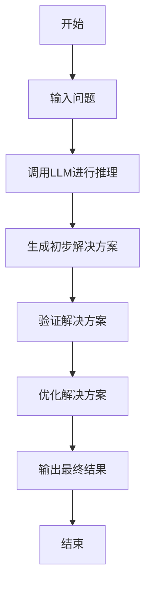

                 


# AI Agent 的决策系统：基于 LLM 的推理与规划

> 关键词：AI Agent, 决策系统, 大语言模型, 推理与规划, 系统架构, 数学模型

> 摘要：本文深入探讨了AI Agent 的决策系统，特别是基于大语言模型（LLM）的推理与规划。文章从AI Agent的基本概念、决策系统的原理、基于LLM的推理与规划算法，到系统的数学模型、架构设计、项目实战及最佳实践，全面而系统地分析了AI Agent决策系统的构建与优化。通过实际案例和详细的技术分析，本文旨在为技术从业者、研究人员和学生提供一份全面的指南，帮助他们理解并掌握AI Agent决策系统的开发与应用。

---

# 第一部分: AI Agent 的决策系统基础

## 第1章: AI Agent 的背景与概念

### 1.1 AI Agent 的基本概念
#### 1.1.1 什么是 AI Agent
- 定义：AI Agent 是一种智能体，能够感知环境、自主决策并执行任务。
- 核心特征：
  - 感知能力：通过传感器或数据输入感知环境。
  - 学习能力：通过数据和经验不断优化决策。
  - 决策能力：基于当前状态和目标，生成行动计划。
  - 执行能力：通过执行动作影响环境状态。
- 应用场景：
  - 自动驾驶：实时感知环境并做出驾驶决策。
  - 智能客服：基于用户需求生成回应并执行任务。
  - 医疗诊断：分析病历数据并辅助医生制定治疗方案。

#### 1.1.2 AI Agent 的分类与应用场景
- 分类：
  - 软件 Agent：基于规则或模型的决策系统。
  - 硬件 Agent：嵌入智能算法的物理设备（如机器人）。
  - 服务 Agent：提供特定服务的智能体（如智能助手）。
- 应用场景：
  - 智能家居：控制家电设备并提供生活服务。
  - 金融投资：分析市场数据并做出投资决策。
  - 游戏AI：在游戏中做出实时决策。

### 1.2 决策系统的基本原理
#### 1.2.1 决策系统的定义
- 决策系统：通过输入数据，生成决策并执行动作的系统。
- 核心功能：
  - 数据处理：从环境中获取数据。
  - 状态分析：分析当前状态并识别问题。
  - 决策生成：基于分析结果生成解决方案。
  - 行动执行：通过执行动作改变环境状态。

#### 1.2.2 决策系统的组成与功能
- 组成：
  - 输入模块：接收环境数据。
  - 分析模块：对数据进行处理和分析。
  - 决策模块：基于分析结果生成决策。
  - 执行模块：将决策转化为具体动作。
- 功能：
  - 数据处理：将输入数据转换为可用信息。
  - 状态分析：识别环境中的关键问题或机会。
  - 决策生成：基于当前状态生成可行的解决方案。
  - 行动执行：通过执行动作影响环境状态。

#### 1.2.3 决策系统的分类
- 分类：
  - 基于规则的决策系统：根据预定义规则进行决策。
  - 基于模型的决策系统：基于数学模型或机器学习模型进行决策。
  - 基于反馈的决策系统：根据实时反馈调整决策。

### 1.3 基于 LLM 的推理与规划背景
#### 1.3.1 大语言模型（LLM）的概述
- 定义：大语言模型是一种基于深度学习的自然语言处理模型，能够理解和生成人类语言。
- 核心技术：
  - Transformer 模型：基于自注意力机制的神经网络结构。
  - 预训练与微调：通过大量数据预训练，针对特定任务进行微调。
- 应用潜力：
  - 文本生成：生成高质量的文本内容。
  - 问题回答：基于上下文回答复杂问题。
  - 情感分析：分析文本中的情感倾向。

#### 1.3.2 LLM 在决策系统中的应用潜力
- 基于 LLM 的推理：
  - 文本理解：理解用户需求并生成响应。
  - 多步推理：基于上下文进行多步推理，生成复杂决策。
- 基于 LLM 的规划：
  - 生成行动计划：基于当前状态和目标，生成行动计划。
  - 优化计划：根据环境反馈优化计划。

#### 1.3.3 当前研究与应用现状
- 研究现状：
  - 基于 LLM 的推理与规划算法研究。
  - LLM 与强化学习结合的研究。
- 应用现状：
  - 自然语言处理：文本生成、问答系统。
  - 智能助手：基于 LLM 的对话系统。
  - 自动驾驶：基于 LLM 的路径规划与决策。

---

## 第2章: AI Agent 决策系统的核心概念与联系

### 2.1 核心概念原理
#### 2.1.1 AI Agent 的决策过程
- 决策过程：
  1. 状态感知：通过传感器或数据输入感知环境。
  2. 状态分析：识别环境中的关键问题或机会。
  3. 决策生成：基于分析结果生成可行的解决方案。
  4. 行动执行：通过执行动作改变环境状态。
- 决策机制：
  - 基于规则的决策：根据预定义规则生成决策。
  - 基于模型的决策：基于数学模型或机器学习模型生成决策。
  - 基于反馈的决策：根据实时反馈调整决策。

#### 2.1.2 LLM 在决策系统中的角色
- LLM 作为决策系统的核心模块：
  - 接收输入数据并生成决策建议。
  - 基于上下文进行多步推理，生成复杂决策。
  - 通过与环境交互，优化决策结果。

#### 2.1.3 推理与规划的数学模型
- 推理模型：
  - 基于概率的推理：使用概率论进行推理。
  - 基于逻辑的推理：使用逻辑推理进行决策。
- 规划模型：
  - 状态空间模型：将环境状态表示为状态空间。
  - 动作空间模型：将可行动作表示为动作空间。
  - 奖励函数模型：定义决策的奖励机制。

### 2.2 核心概念属性特征对比
- 决策系统与传统 AI 的对比：
  | 特性 | 传统 AI | 基于 LLM 的 AI Agent |
  |------|---------|-----------------------|
  | 决策机制 | 基于规则 | 基于模型推理与规划 |
  | 学习能力 | 无或有限 | 强大的自适应学习能力 |
  | 环境交互 | 被动接收输入 | 主动与环境交互 |
- 基于 LLM 的推理与规划的特征分析：
  - 自然语言处理能力：能够理解和生成人类语言。
  - 多步推理能力：能够基于上下文进行复杂推理。
  - 实时反馈能力：能够根据环境反馈调整决策。
- 决策系统的性能指标：
  - 决策正确率：决策结果的准确性。
  - 决策响应时间：生成决策的速度。
  - 决策稳定性：在复杂环境中的稳定性。

### 2.3 ER 实体关系图
```mermaid
er
actor(Agent, 决策目标, 环境)
rectangle(决策系统, 推理模块, 规划模块)
关联(Agent, 决策系统, "使用")
关联(决策系统, 决策目标, "处理")
关联(决策系统, 环境, "感知")
```

---

## 第3章: 基于 LLM 的推理与规划算法原理

### 3.1 LLM 的基本原理
#### 3.1.1 大语言模型的结构
- Transformer 模型：
  - 自注意力机制：通过自注意力计算每个词的重要性。
  - 前馈网络：对输入进行非线性变换。
- 编码器-解码器结构：
  - 编码器：将输入序列编码为上下文表示。
  - 解码器：基于编码结果生成输出序列。

#### 3.1.2 模型的训练方法
- 预训练：
  - 使用大规模通用数据进行无监督训练。
  - 目标函数：最小化预测与真实值之间的差异。
- 微调：
  - 使用特定任务数据进行有监督训练。
  - 目标函数：根据任务需求调整损失函数。

#### 3.1.3 模型的推理机制
- 推理过程：
  1. 输入处理：将输入文本转换为模型可处理的形式。
  2. 上下文表示：通过自注意力机制生成上下文表示。
  3. 输出生成：解码器生成输出序列。

### 3.2 推理与规划算法
#### 3.2.1 基于规则的推理算法
- 算法步骤：
  1. 定义规则：根据业务需求定义推理规则。
  2. 数据处理：将输入数据转换为规则匹配的形式。
  3. 规则匹配：根据规则生成推理结果。
- 示例：
  - 规则：如果温度 > 30°C，则开启空调。
  - 输入：当前温度 = 31°C。
  - 输出：开启空调。

#### 3.2.2 基于模型的推理算法
- 算法步骤：
  1. 数据预处理：将输入数据转换为模型输入形式。
  2. 模型推理：将输入数据输入模型，生成推理结果。
  3. 结果解释：将模型输出结果转换为人类可理解的形式。
- 示例：
  - 模型：基于 GPT 的 LLM。
  - 输入：当前温度 = 31°C。
  - 输出：建议开启空调以保持舒适温度。

#### 3.2.3 增量式规划算法
- 算法步骤：
  1. 初始化：定义初始状态和目标。
  2. 状态感知：通过传感器获取当前状态。
  3. 状态分析：分析当前状态，识别问题或机会。
  4. 行动生成：基于分析结果生成可行的行动计划。
  5. 行动优化：根据环境反馈优化行动计划。
  6. 行动执行：执行行动计划，改变环境状态。

### 3.3 算法流程图


---

## 第4章: 数学模型与公式

### 4.1 决策系统的数学模型
#### 4.1.1 状态空间模型
- 定义：将环境状态表示为状态空间。
- 示例：在自动驾驶中，状态可以表示为（x, y, 速度, 方向）。
- 转移模型：定义从当前状态到下一个状态的转移概率。

#### 4.1.2 动作空间模型
- 定义：将可行动作表示为动作空间。
- 示例：在自动驾驶中，动作可以表示为（加速, 刹车, 转向）。
- 动作选择：基于当前状态选择最优动作。

#### 4.1.3 奖励函数模型
- 定义：定义决策的奖励机制。
- 示例：在自动驾驶中，奖励可以表示为（到达目的地的速度）。
- 目标函数：最大化累计奖励。

### 4.2 推理与规划的数学公式
#### 4.2.1 概率推理公式
- 贝叶斯定理：
  $$ P(A|B) = \frac{P(B|A)P(A)}{P(B)} $$
  - 用于基于概率的推理，计算条件概率。

#### 4.2.2 规划优化公式
- 最大化期望奖励：
  $$ \arg\max_{a} \sum_{s'} P(s'|a,s) R(s,a) $$
  - 其中，$s$ 是当前状态，$a$ 是动作，$s'$ 是下一个状态，$R(s,a)$ 是奖励函数。

---

## 第5章: 系统分析与架构设计

### 5.1 问题场景介绍
- 问题描述：设计一个基于 LLM 的 AI Agent，能够根据用户需求生成行动计划并执行任务。
- 项目介绍：开发一个智能助手，能够根据用户需求生成行动计划并执行任务。

### 5.2 系统功能设计
- 领域模型：
  ```mermaid
  classDiagram
    class Agent {
      +id: int
      +name: string
      +state: string
      +goal: string
      -knowledge: map<string, string>
      +makeDecision(): void
      +executeAction(): void
    }
  ```

### 5.3 系统架构设计
- 架构图：
  ```mermaid
  architecture
  title AI Agent 架构图
  网络层 --> 数据层 --> 业务层 --> 表现层
  ```

### 5.4 系统接口设计
- 接口定义：
  - 输入接口：接收用户输入。
  - 输出接口：输出决策结果。
  - 交互接口：与环境进行交互。

### 5.5 系统交互设计
- 交互流程图：
  ```mermaid
  sequenceDiagram
    User ->> Agent: 提交请求
    Agent ->> 环境: 获取环境数据
    Agent ->> LLM: 调用推理模块
    LLM ->> Agent: 返回推理结果
    Agent ->> 环境: 执行行动计划
    环境 ->> Agent: 返回反馈
    Agent ->> User: 返回结果
  ```

---

## 第6章: 项目实战

### 6.1 环境安装
- 安装 Python 3.8+
- 安装 LLM 模型（如 GPT-3）
- 安装必要的库（如 requests, transformers）

### 6.2 系统核心实现源代码
- 核心代码示例：
  ```python
  from transformers import GPT2LMHeadModel, GPT2Tokenizer

  model_name = "gpt2"
  tokenizer = GPT2Tokenizer.from_pretrained(model_name)
  model = GPT2LMHeadModel.from_pretrained(model_name)

  def generate_response(prompt):
      inputs = tokenizer.encode(prompt, return_tensors="pt")
      outputs = model.generate(inputs, max_length=50, do_sample=True)
      response = tokenizer.decode(outputs[0], skip_special_tokens=True)
      return response

  prompt = "当前温度为31度，建议开启空调。"
  response = generate_response(prompt)
  print(response)
  ```

### 6.3 代码应用解读与分析
- 代码解读：
  - 使用 GPT-2 模型生成响应。
  - 输入：当前温度为31度，建议开启空调。
  - 输出：生成的响应。

### 6.4 实际案例分析
- 案例分析：
  - 输入：当前温度为31度，建议开启空调。
  - 输出：建议开启空调以保持舒适温度。

### 6.5 项目小结
- 项目总结：通过实际案例展示了基于 LLM 的推理与规划的应用。

---

## 第7章: 最佳实践、小结、注意事项、拓展阅读

### 7.1 最佳实践
- 选择合适的 LLM 模型：根据具体任务选择合适的模型。
- 数据预处理：对数据进行清洗和特征提取。
- 模型调优：根据任务需求调整模型参数。

### 7.2 小结
- 本文深入探讨了 AI Agent 的决策系统，特别是基于 LLM 的推理与规划。
- 通过实际案例展示了基于 LLM 的推理与规划的应用。

### 7.3 注意事项
- 数据隐私：确保数据的隐私和安全。
- 系统稳定性：确保系统的稳定性和可靠性。
- 模型可解释性：确保模型的可解释性。

### 7.4 拓展阅读
- 推荐书籍：《深度学习》、《神经网络与深度学习》。
- 推荐论文：《Attention Is All You Need》、《Large Language Models Are Zero-Shot Learners》。

---

## 作者信息

作者：AI天才研究院/AI Genius Institute & 禅与计算机程序设计艺术 /Zen And The Art of Computer Programming

