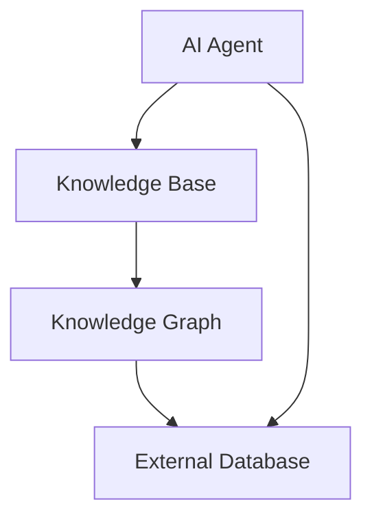
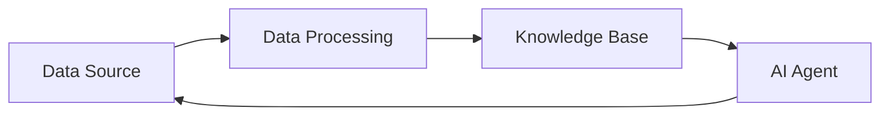

                 


# AI Agent 的知识更新：保持 LLM 知识的时效性

**关键词**：AI Agent、LLM、知识更新、持续学习、在线学习、知识蒸馏

**摘要**：  
随着人工智能技术的快速发展，AI Agent（人工智能代理）作为实现智能化系统的核心技术，其知识更新能力直接影响其性能和应用效果。本文从AI Agent的知识更新机制出发，详细探讨了如何保持大型语言模型（LLM）知识的时效性。文章首先介绍了AI Agent和知识更新的基本概念，然后深入分析了知识更新的核心原理、算法实现和系统架构，最后结合实际案例，展示了如何在项目中实现高效的AI Agent知识更新。通过本文的阐述，读者可以全面理解AI Agent知识更新的理论与实践，为后续的研究和应用提供参考。

---

# 第一部分：AI Agent 的知识更新背景与核心概念

## 第1章：AI Agent 的知识更新背景

### 1.1 问题背景与描述

#### 1.1.1 LLM 的知识时效性问题  
大型语言模型（LLM）如GPT系列在自然语言处理任务中表现出色，但其知识往往基于训练数据的截止日期（通常为2023年10月左右）。随着时间推移，模型的知识可能会过时，无法准确回答最新的问题。例如，当用户询问最新的科技新闻或动态时，模型可能无法提供准确的信息。

#### 1.1.2 AI Agent 的知识更新需求  
AI Agent 是一种能够自主感知环境、执行任务并优化决策的智能体。其核心能力依赖于知识的准确性和时效性。为了应对动态变化的环境，AI Agent 需要不断更新其知识库，以保持对最新信息的了解。

#### 1.1.3 知识更新的重要性与挑战  
知识更新是AI Agent 持续进化的核心机制。及时更新知识可以提高模型的准确性、可靠性和实用性。然而，知识更新也面临诸多挑战，例如数据来源的多样性、更新频率的控制以及更新过程中的计算效率问题。

---

### 1.2 知识更新的解决方案

#### 1.2.1 持续学习与在线学习  
持续学习（Lifelong Learning）是指模型在不遗忘之前知识的前提下，逐步学习新任务的能力。与传统离线学习不同，持续学习强调模型的动态更新能力。  
在线学习（Online Learning）是一种实时更新模型参数的方法，适用于数据流场景。通过逐样本更新模型，AI Agent 可以快速适应新数据。

#### 1.2.2 知识蒸馏与模型优化  
知识蒸馏（Knowledge Distillation）是一种将大型模型的知识迁移到小模型的技术。通过蒸馏过程，AI Agent 可以在保持性能的同时，降低模型的计算复杂度。  
模型优化（Model Optimization）包括参数剪枝和量化等技术，旨在在不显著降低性能的前提下，减少模型的存储和计算开销。

#### 1.2.3 知识图谱与外部知识库的结合  
知识图谱（Knowledge Graph）是一种结构化的知识表示方式，能够将实体及其关系以图的形式表示。AI Agent 可以通过查询知识图谱，获取实时更新的最新知识。此外，结合外部知识库（如Wikipedia、新闻数据库等），AI Agent 可以进一步扩展其知识范围。

---

### 1.3 AI Agent 的核心概念与边界

#### 1.3.1 AI Agent 的定义与分类  
AI Agent 是一种能够感知环境、自主决策并执行任务的智能体。根据功能和应用场景，AI Agent 可以分为简单反射型代理、基于模型的反射型代理、目标驱动型代理和效用驱动型代理。

#### 1.3.2 知识更新的边界与外延  
知识更新的边界包括模型更新的范围、更新频率以及更新数据的来源。外延则涉及知识表示、知识存储和知识检索等技术。

#### 1.3.3 核心要素与组成结构  
AI Agent 的知识更新系统由以下几个核心要素组成：  
1. 知识表示：知识的结构化表示方法。  
2. 知识存储：知识的存储方式和存储介质。  
3. 知识更新：知识的获取、处理和整合过程。  
4. 知识检索：根据需求快速检索知识的能力。

---

### 1.4 本章小结  
本章介绍了AI Agent 知识更新的背景与核心概念，包括知识时效性问题、知识更新的解决方案以及AI Agent 的核心概念与边界。下一章将深入探讨AI Agent 的知识更新机制，分析其实现原理与技术细节。

---

## 第2章：AI Agent 的知识更新机制

### 2.1 知识更新的核心原理

#### 2.1.1 持续学习的基本原理  
持续学习是一种动态更新模型知识的方法。其核心思想是通过逐步学习新数据，避免遗忘旧知识。持续学习通常包括两个阶段：任务识别（Task Recognition）和知识整合（Knowledge Integration）。

#### 2.1.2 在线学习与离线学习的对比  
在线学习的特点是实时更新模型参数，适用于数据流场景。而离线学习则是在批量数据上一次性更新模型参数。两者各有优劣，具体选择取决于应用场景。

#### 2.1.3 知识蒸馏与模型压缩技术  
知识蒸馏通过教师模型（Teacher Model）指导学生模型（Student Model）学习知识。模型压缩技术（如剪枝和量化）则通过减少模型参数数量，降低计算复杂度。

---

### 2.2 知识更新的实现方式

#### 2.2.1 微调（Fine-tuning）方法  
微调是一种常用的模型更新方法。通过在特定任务上对模型进行微调，可以提升模型在新数据上的表现。例如，可以在医疗领域对一个通用的LLM进行微调，使其更适合医疗场景。

#### 2.2.2 参数更新与知识整合  
参数更新是通过优化目标函数，调整模型参数以适应新数据。知识整合则是将新知识与旧知识有机结合，避免信息冲突。

#### 2.2.3 知识图谱的动态更新  
知识图谱的动态更新包括实体新增、关系新增和实体消亡等操作。通过定期更新知识图谱，AI Agent 可以获取最新知识。

---

### 2.3 知识更新的评估与优化

#### 2.3.1 知识更新的评估指标  
知识更新的评估指标包括准确率（Accuracy）、召回率（Recall）、F1值（F1 Score）和更新效率（Update Efficiency）。

#### 2.3.2 知识更新的优化策略  
优化策略包括：  
1. 选择合适的更新频率。  
2. 优化知识表示方式。  
3. 提高模型的泛化能力。

#### 2.3.3 知识更新的稳定性与效率  
稳定性指的是模型在更新过程中保持性能不变的能力。效率则是指更新速度和计算资源的消耗。

---

### 2.4 本章小结  
本章详细分析了AI Agent 知识更新的核心原理与实现方式，探讨了知识更新的评估与优化策略。下一章将从系统架构的角度，分析AI Agent 知识更新的实现方案。

---

## 第3章：AI Agent 知识更新的核心概念与联系

### 3.1 核心概念的原理分析

#### 3.1.1 持续学习的数学模型  
持续学习的数学模型可以表示为：  
$$ P(\theta_{t+1} | \theta_t, X_t, y_t) $$  
其中，$\theta_t$ 表示第t步的模型参数，$X_t$ 和 $y_t$ 表示第t步的输入和标签。

#### 3.1.2 在线学习的算法流程  
在线学习的算法流程可以用以下步骤表示：  
1. 初始化模型参数 $\theta_0$。  
2. 对于每一条新数据 $(x_i, y_i)$，更新模型参数：  
   $$ \theta_{t+1} = \theta_t + \eta(x_i, y_i) $$  
   其中，$\eta$ 是学习率。

#### 3.1.3 知识蒸馏的实现机制  
知识蒸馏的实现机制包括：  
1. 教师模型生成软标签（Soft Label）。  
2. 学生模型通过最小化预测分布与软标签的差异，学习教师模型的知识。

---

### 3.2 核心概念的属性特征对比

#### 表3-1: 持续学习与在线学习的对比分析  
| 对比维度 | 持续学习 | 在线学习 |  
|----------|----------|----------|  
| 数据来源 | 批量数据 | 实时数据 |  
| 更新频率 | 低频 | 高频 |  
| 计算开销 | 高 | 低 |  

---

### 3.3 ER实体关系图架构



---

### 3.4 本章小结  
本章通过对比分析和图示，详细阐述了AI Agent 知识更新的核心概念与联系。下一章将从算法原理的角度，深入探讨知识更新的实现细节。

---

## 第4章：AI Agent 知识更新的算法实现

### 4.1 算法原理与流程

#### 4.1.1 持续学习算法  
持续学习算法的流程如下：  
1. 初始化模型参数 $\theta_0$。  
2. 对于每个新任务 $T_i$，更新模型参数：  
   $$ \theta_{i+1} = \theta_i + \eta(x_i, y_i) $$  
3. 通过知识蒸馏或参数剪枝，整合新知识。

#### 4.1.2 在线学习算法  
在线学习算法的流程如下：  
1. 初始化模型参数 $\theta_0$。  
2. 对于每条新数据 $(x_i, y_i)$，更新模型参数：  
   $$ \theta_{i+1} = \theta_i + \eta(x_i, y_i) $$  

---

### 4.2 算法实现的代码示例

```python
import torch
import torch.nn as nn
import torch.optim as optim

class AI_Agent(nn.Module):
    def __init__(self, input_size, output_size):
        super(AI_Agent, self).__init__()
        self.fc = nn.Linear(input_size, output_size)

    def forward(self, x):
        return self.fc(x)

# 初始化模型和优化器
model = AI_Agent(input_size=10, output_size=5)
optimizer = optim.SGD(model.parameters(), lr=0.01)

# 持续学习示例
for batch_x, batch_y in dataloader:
    optimizer.zero_grad()
    outputs = model(batch_x)
    loss = criterion(outputs, batch_y)
    loss.backward()
    optimizer.step()
```

---

### 4.3 算法的数学模型与公式

#### 4.3.1 持续学习的数学模型  
持续学习的数学模型可以表示为：  
$$ \theta_{t+1} = \theta_t + \eta (x_t, y_t) $$  
其中，$\eta$ 是学习率，$(x_t, y_t)$ 是第t步的输入和标签。

#### 4.3.2 在线学习的数学模型  
在线学习的数学模型可以表示为：  
$$ \theta_{t+1} = \theta_t + \eta (x_t, y_t) $$  

---

### 4.4 本章小结  
本章通过代码示例和数学公式，详细阐述了AI Agent 知识更新的算法实现。下一章将从系统架构的角度，分析AI Agent 知识更新的实现方案。

---

## 第5章：AI Agent 知识更新的系统架构设计

### 5.1 系统分析与设计

#### 5.1.1 系统功能设计  
AI Agent 知识更新系统的功能包括：  
1. 知识获取：从外部数据源获取新知识。  
2. 知识处理：对新知识进行清洗和结构化。  
3. 知识更新：将新知识整合到现有知识库中。  
4. 知识检索：根据需求快速检索知识。

#### 5.1.2 系统架构设计  
系统的架构设计包括：  
1. 数据采集模块：负责从外部数据源获取数据。  
2. 数据处理模块：对数据进行清洗和结构化。  
3. 知识库模块：存储和管理知识。  
4. 更新控制模块：控制知识更新的频率和策略。

---

### 5.2 系统实现与代码



---

### 5.3 系统交互与流程

1. 数据采集模块从外部数据源获取新数据。  
2. 数据处理模块对数据进行清洗和结构化。  
3. 知识库模块将新知识整合到现有知识库中。  
4. AI Agent 根据需求，从知识库中检索知识。

---

### 5.4 本章小结  
本章详细分析了AI Agent 知识更新的系统架构设计，包括功能设计、架构设计和系统交互流程。下一章将通过实际案例，展示AI Agent 知识更新的项目实现。

---

## 第6章：AI Agent 知识更新的项目实战

### 6.1 项目背景与目标

#### 6.1.1 项目背景  
本项目旨在实现一个能够实时更新知识的AI Agent，用于回答用户的问题。

#### 6.1.2 项目目标  
1. 实现AI Agent 的知识更新功能。  
2. 提供高效的查询接口。  
3. 确保知识的时效性。

---

### 6.2 核心代码实现

```python
class KnowledgeUpdater:
    def __init__(self, knowledge_base):
        self.knowledge_base = knowledge_base

    def update_knowledge(self, new_data):
        # 数据处理
        processed_data = self._process_data(new_data)
        # 知识更新
        self.knowledge_base.update(processed_data)

    def _process_data(self, data):
        # 数据清洗和结构化
        processed_data = []
        for item in data:
            if self._is_valid(item):
                processed_data.append(self._structure(item))
        return processed_data

    def _is_valid(self, item):
        # 数据有效性检查
        return True

    def _structure(self, item):
        # 数据结构化
        return item
```

---

### 6.3 项目实现与分析

#### 6.3.1 知识获取与处理  
知识获取包括从外部数据源（如API、文件等）获取数据。数据处理包括数据清洗和结构化。

#### 6.3.2 知识更新与检索  
知识更新包括将新知识整合到知识库中。知识检索包括根据用户查询快速检索知识。

---

### 6.4 本章小结  
本章通过实际案例，展示了AI Agent 知识更新的项目实现。通过本章的学习，读者可以掌握AI Agent 知识更新的核心技术。

---

## 第7章：AI Agent 知识更新的最佳实践

### 7.1 最佳实践 Tips

#### 7.1.1 数据质量管理  
确保数据来源的多样性和准确性。  
定期检查数据质量，避免过时数据的干扰。

#### 7.1.2 知识表示优化  
选择合适的知识表示方法，如知识图谱。  
通过语义分析，优化知识表示的效率。

#### 7.1.3 系统性能优化  
通过模型优化技术（如剪枝和量化），降低计算复杂度。  
选择合适的更新频率，平衡性能和效率。

---

### 7.2 小结  
通过本文的阐述，读者可以全面理解AI Agent 知识更新的理论与实践。下一章将总结全文，并展望未来的研究方向。

---

## 第8章：总结与展望

### 8.1 总结  
本文详细探讨了AI Agent 知识更新的核心概念、算法实现和系统架构设计。通过实际案例，展示了AI Agent 知识更新的项目实现。

### 8.2 未来展望  
未来的研究方向包括：  
1. 更高效的在线学习算法。  
2. 更智能的知识表示方法。  
3. 更实时的知识更新机制。

---

## 作者：AI天才研究院/AI Genius Institute & 禅与计算机程序设计艺术 /Zen And The Art of Computer Programming

---

通过本文的阐述，读者可以全面理解AI Agent 知识更新的理论与实践。如需进一步探讨，欢迎关注我们的技术博客或联系研究团队。

