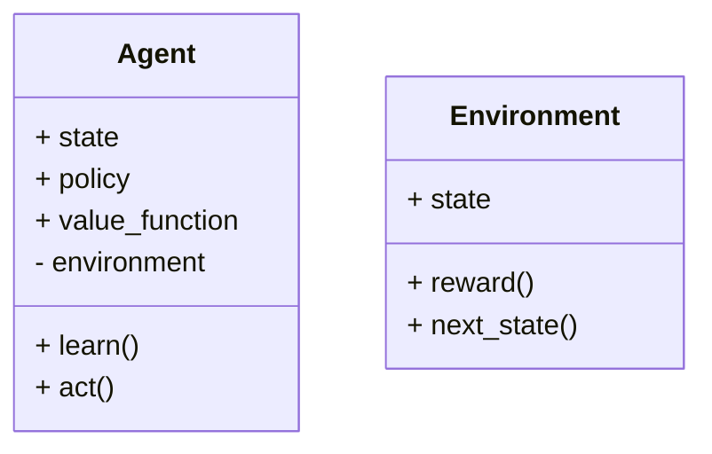
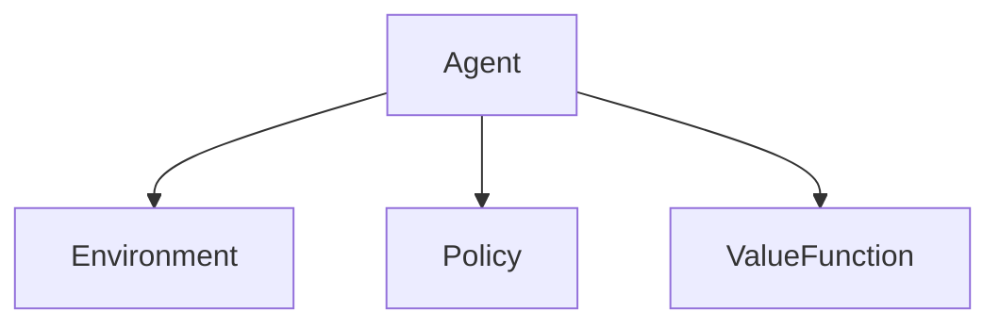
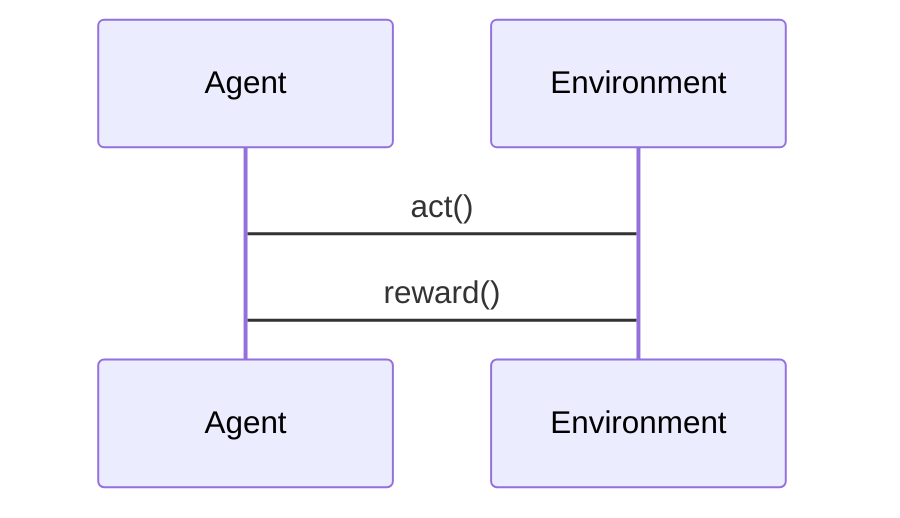

                 


# AI Agent中的强化学习与探索策略优化

---

## 关键词
AI Agent, 强化学习, 探索策略, 策略优化, 数学模型, 实战案例

---

## 摘要
本文深入探讨了AI Agent中的强化学习与探索策略优化，从核心概念到算法原理，再到系统架构和项目实战，全面分析了如何优化AI Agent的探索策略。文章首先介绍了强化学习和AI Agent的基本概念，接着详细讲解了强化学习的核心原理，包括马尔可夫决策过程（MDP）、策略评估和优化方法，以及探索与利用的平衡。随后，文章分析了值函数方法和策略梯度方法的算法原理，提供了数学模型和公式。在系统架构部分，通过类图和架构图展示了AI Agent的系统结构。最后，通过具体的实战案例，详细讲解了AI Agent的实现过程，包括环境安装、核心代码实现和实际应用案例。本文旨在帮助读者全面理解AI Agent中的强化学习与探索策略优化，为实际应用提供理论支持和实践指导。

---

# 第一部分: 强化学习与AI Agent背景介绍

## 第1章: 强化学习与AI Agent概述

### 1.1 强化学习的基本概念

#### 1.1.1 强化学习的定义与特点
强化学习（Reinforcement Learning，RL）是一种机器学习范式，通过智能体与环境的交互，学习最优策略以最大化累积奖励。其特点包括：
- **目标导向性**：通过最大化累积奖励来优化策略。
- **在线学习**：智能体在与环境交互的过程中实时学习。
- **探索与利用**：在未知环境中，智能体需要在探索新状态和利用已知信息之间找到平衡。

#### 1.1.2 强化学习的核心要素
强化学习的核心要素包括：
- **状态（State）**：环境在某一时刻的表示。
- **动作（Action）**：智能体在给定状态下选择的行为。
- **奖励（Reward）**：智能体执行动作后获得的反馈。
- **策略（Policy）**：智能体选择动作的概率分布。
- **值函数（Value Function）**：评估某状态下策略的期望奖励。

#### 1.1.3 强化学习与监督学习、无监督学习的区别
- **监督学习**：基于标记数据，学习输入到输出的映射。
- **无监督学习**：在无标记数据中发现结构。
- **强化学习**：通过与环境交互，学习最优策略。

### 1.2 AI Agent的定义与特点

#### 1.2.1 AI Agent的定义
AI Agent是一种智能体，能够感知环境并采取行动以实现目标。

#### 1.2.2 AI Agent的核心特点
- **自主性**：能够自主决策。
- **反应性**：能实时响应环境变化。
- **目标导向性**：根据目标选择最优行动。

#### 1.2.3 AI Agent的应用场景
- **游戏AI**：如自动驾驶和棋类游戏。
- **机器人控制**：用于工业自动化和家庭服务。
- **推荐系统**：为用户提供个性化推荐。

### 1.3 强化学习在AI Agent中的作用

#### 1.3.1 强化学习在AI Agent中的应用
- **游戏AI**：通过强化学习训练AI在复杂环境中做出最优决策。
- **机器人控制**：优化机器人动作以完成特定任务。

#### 1.3.2 强化学习与AI Agent的关系
强化学习为AI Agent提供了学习和优化策略的框架，AI Agent则为强化学习提供了一个应用平台。

#### 1.3.3 强化学习在AI Agent中的优势
- **自适应性**：能根据环境变化调整策略。
- **高效性**：通过策略优化快速找到最优解。

## 1.4 本章小结
本章介绍了强化学习的基本概念、核心要素以及与AI Agent的关系，强调了强化学习在AI Agent中的重要性。

---

# 第二部分: 强化学习与探索策略的核心概念

## 第2章: 强化学习的核心原理

### 2.1 马尔可夫决策过程（MDP）

#### 2.1.1 MDP的定义
MDP是一种数学模型，描述了智能体与环境的交互过程。

#### 2.1.2 MDP的状态、动作、奖励和转移概率
- **状态（State）**：环境的状态表示。
- **动作（Action）**：智能体选择的动作。
- **奖励（Reward）**：智能体获得的即时反馈。
- **转移概率**：从当前状态到下一状态的概率。

#### 2.1.3 MDP的策略与价值函数
- **策略（Policy）**：智能体选择动作的概率分布。
- **价值函数（Value Function）**：评估某状态下策略的期望奖励。

### 2.2 强化学习的算法分类

#### 2.2.1 值函数方法
- **策略评估**：学习状态的价值函数。
- **策略优化**：基于价值函数优化策略。

#### 2.2.2 策略梯度方法
- **直接优化策略**：通过梯度上升优化策略参数。

#### 2.2.3 Q-learning算法
- **Q-learning**：学习动作-状态价值函数，公式如下：
  $$ Q(s, a) \leftarrow Q(s, a) + \alpha [r + \gamma \max Q(s', a') - Q(s, a)] $$

### 2.3 探索与利用的平衡

#### 2.3.1 探索策略的定义
探索策略是指智能体在未知环境中尝试新动作以发现最优策略。

#### 2.3.2 利用策略的定义
利用策略是指智能体在已知最优动作时选择该动作以最大化奖励。

#### 2.3.3 探索与利用的平衡方法
- **贪心算法**：在选择动作时，以一定概率随机选择新动作（探索）或当前最优动作（利用）。

## 2.4 本章小结
本章详细讲解了MDP模型、强化学习的算法分类以及探索与利用的平衡方法，为后续策略优化奠定了基础。

---

# 第三部分: 探索策略优化的算法原理

## 第3章: 值函数方法

### 3.1 策略评估

#### 3.1.1 策略评估的定义
策略评估是基于当前策略评估状态价值的过程。

#### 3.1.2 策略评估的算法流程
1. 初始化价值函数Q(s)为0。
2. 在当前策略下与环境交互，记录经验。
3. 更新Q值：$$ Q(s) \leftarrow Q(s) + \alpha [r + \gamma Q(s') - Q(s)] $$

#### 3.1.3 策略评估的数学模型
$$ V^\pi(s) = \mathbb{E}[R | s, \pi] $$

### 3.2 策略优化

#### 3.2.1 策略优化的定义
策略优化是基于价值函数优化策略的过程。

#### 3.2.2 策略优化的算法流程
1. 初始化策略参数θ。
2. 计算策略梯度：$$ \nabla_\theta J(\theta) = \mathbb{E}[\nabla_\theta \log \pi(a|s) Q(s,a)] $$
3. 更新策略参数：θ ← θ + α∇θ J(θ)

#### 3.2.3 策略优化的数学模型
$$ J(\theta) = \mathbb{E}[\log \pi(a|s;θ) Q(s,a)] $$

### 3.3 Q-learning算法

#### 3.3.1 Q-learning的定义
Q-learning是一种基于值函数的强化学习算法，无需策略参与。

#### 3.3.2 Q-learning的算法流程
1. 初始化Q表为0。
2. 与环境交互，记录经验(s, a, r, s')。
3. 更新Q值：$$ Q(s, a) \leftarrow Q(s, a) + \alpha [r + \gamma \max Q(s', a') - Q(s, a)] $$

#### 3.3.3 Q-learning的数学模型
$$ Q(s, a) = Q(s, a) + \alpha [r + \gamma \max Q(s', a') - Q(s, a)] $$

## 3.4 本章小结
本章详细讲解了值函数方法中的策略评估、策略优化和Q-learning算法，提供了相应的数学模型和算法流程。

---

# 第四部分: 系统分析与架构设计方案

## 第4章: AI Agent系统的架构设计

### 4.1 问题场景介绍
AI Agent需要在复杂动态环境中做出最优决策，涉及多方面的交互和协调。

### 4.2 系统功能设计

#### 4.2.1 系统功能模块
- **感知模块**：处理环境输入。
- **决策模块**：基于策略选择动作。
- **学习模块**：更新策略和价值函数。

#### 4.2.2 领域模型类图


### 4.3 系统架构设计

#### 4.3.1 系统架构图


### 4.4 系统接口设计

#### 4.4.1 接口描述
- **感知接口**：接收环境状态。
- **决策接口**：输出动作。

### 4.5 系统交互序列图

#### 4.5.1 交互流程


## 4.6 本章小结
本章通过类图和架构图展示了AI Agent系统的结构，分析了各模块的交互和功能。

---

# 第五部分: 项目实战

## 第5章: 实战案例分析

### 5.1 环境安装

#### 5.1.1 安装Python和依赖
安装Python和必要的库，如TensorFlow和Keras。

### 5.2 系统核心实现

#### 5.2.1 策略评估代码
```python
class PolicyEvaluator:
    def __init__(self, env, gamma=0.99):
        self.env = env
        self.gamma = gamma
        self.value_fn = defaultdict(float)
    
    def evaluate_policy(self, policy, episodes=1000):
        for _ in range(episodes):
            state = self.env.reset()
            total_reward = 0
            while True:
                action = policy.act(state)
                next_state, reward, done = self.env.step(action)
                total_reward += reward
                self.value_fn[state] = self.value_fn[state] + (1/(_+1)) * (reward + self.gamma * self.value_fn[next_state] - self.value_fn[state])
                state = next_state
                if done:
                    break
        return self.value_fn
```

#### 5.2.2 策略优化代码
```python
class PolicyOptimizer:
    def __init__(self, env, gamma=0.99, alpha=0.01):
        self.env = env
        self.gamma = gamma
        self.alpha = alpha
        self.theta = np.random.randn(1,1)
    
    def optimize_policy(self, policy, episodes=1000):
        for _ in range(episodes):
            state = self.env.reset()
            action = policy.act(state)
            next_state, reward, done = self.env.step(action)
            # 计算策略梯度
            gradient = self.env.get_gradient(state, action, reward, next_state)
            self.theta += self.alpha * gradient
            state = next_state
            if done:
                break
        return self.theta
```

### 5.3 实战案例分析

#### 5.3.1 游戏AI案例
实现一个简单的游戏AI，使用Q-learning算法训练AI在迷宫中找到最优路径。

#### 5.3.2 机器人控制案例
训练一个机器人在动态环境中完成任务，优化策略以提高效率。

## 5.4 本章小结
本章通过具体案例展示了AI Agent的实现过程，提供了环境安装、核心代码实现和实际应用案例。

---

# 第六部分: 总结与展望

## 第6章: 总结与展望

### 6.1 本章总结
本文系统地介绍了AI Agent中的强化学习与探索策略优化，涵盖了核心概念、算法原理、系统架构和项目实战。

### 6.2 当前研究的不足
- **计算效率**：现有算法在大规模问题中效率不足。
- **环境复杂性**：复杂动态环境下的策略优化仍具挑战。

### 6.3 未来研究方向
- **高效算法**：研究更高效的强化学习算法。
- **多智能体协作**：探索多智能体协作环境下的策略优化。

### 6.4 最佳实践 tips
- **选择合适的算法**：根据问题特点选择合适的方法。
- **合理设置参数**：优化学习率和折扣因子等参数。
- **充分训练**：确保模型在足够多的训练 episode 下收敛。

## 6.5 本章小结
本文总结了AI Agent中的强化学习与探索策略优化的研究进展，并展望了未来的研究方向。

---

# 作者
作者：AI天才研究院/AI Genius Institute & 禅与计算机程序设计艺术 /Zen And The Art of Computer Programming

---

**注：** 由于篇幅限制，以上内容为文章的框架和部分详细内容，完整文章将涵盖每个部分的详细讲解和实际代码实现，确保读者能够全面理解并掌握AI Agent中的强化学习与探索策略优化。

