                 


# AI Agent在智能资产管理优化中的应用

## 关键词：AI Agent, 智能资产管理, 优化算法, 风险管理, 资产配置, 强化学习, 多智能体协作

## 摘要：  
随着人工智能技术的快速发展，AI Agent（智能代理）在智能资产管理中的应用日益广泛。本文将从AI Agent的基本概念、核心原理、算法实现、系统设计、项目实战等多个角度，详细探讨AI Agent在智能资产管理中的优化应用。通过分析AI Agent在资产配置、风险控制、交易决策等关键环节的作用，本文旨在为读者提供一个全面、深入的技术视角，展示如何利用AI Agent技术优化资产管理流程，提升投资效率和收益。

---

# 第一部分: AI Agent与智能资产管理概述

## 第1章: AI Agent与智能资产管理概述

### 1.1 AI Agent的基本概念

#### 1.1.1 AI Agent的定义与特点

AI Agent（人工智能代理）是一种能够感知环境、自主决策并执行任务的智能系统。与传统算法相比，AI Agent具有以下特点：

- **自主性**：AI Agent能够自主决策，无需人工干预。
- **反应性**：能够实时感知环境变化并做出响应。
- **学习能力**：通过数据和经验不断优化自身的决策能力。
- **协作性**：支持多智能体协作，能够在复杂环境中完成任务。

#### 1.1.2 AI Agent的核心功能与作用

AI Agent的核心功能包括：

- **感知环境**：通过传感器或数据输入感知外部环境。
- **决策与规划**：基于感知信息，制定决策和行动计划。
- **执行任务**：根据决策结果执行具体操作。

AI Agent在智能资产管理中的作用主要体现在以下几个方面：

1. **优化资产配置**：通过数据分析和预测模型，帮助投资者制定最优的资产配置策略。
2. **风险控制**：实时监控市场风险，及时发出预警并调整投资组合。
3. **智能交易**：基于市场行情和策略模型，自动执行交易操作。

#### 1.1.3 AI Agent在智能资产管理中的应用背景

随着金融市场的复杂化和不确定性增加，传统的资产管理方式逐渐暴露出效率低下、风险控制不足等问题。AI Agent的引入为智能资产管理带来了新的可能性：

- **数据驱动决策**：通过海量数据的分析，AI Agent能够发现传统方法难以察觉的市场规律。
- **实时响应**：AI Agent能够实时监控市场动态，快速做出反应，抓住投资机会或规避风险。
- **个性化服务**：通过定制化的AI Agent，投资者可以根据自身需求获得个性化的资产管理服务。

---

## 第2章: AI Agent的核心概念与原理

### 2.1 AI Agent的体系结构

#### 2.1.1 单一智能体与多智能体系统

AI Agent可以分为**单一智能体**和**多智能体系统**两种形式：

- **单一智能体**：适用于简单任务，例如单一资产的交易决策。
- **多智能体系统**：适用于复杂任务，例如多资产配置和风险分散。

#### 2.1.2 AI Agent的感知与决策机制

AI Agent的感知和决策机制如下图所示：

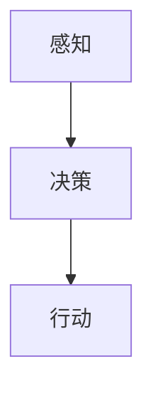

AI Agent通过感知环境信息，经过决策过程，最终执行行动。

#### 2.1.3 状态空间与动作空间的定义

在AI Agent的决策过程中，状态空间和动作空间是两个关键概念：

- **状态空间**：所有可能的状态集合，例如市场指数、资产价格等。
- **动作空间**：AI Agent在每个状态下可以执行的所有动作，例如“买入”、“卖出”、“持有”。

### 2.2 AI Agent的决策模型

#### 2.2.1 基于规则的决策模型

基于规则的决策模型是一种简单但有效的决策方法，适用于规则明确的场景。例如：

- **规则1**：如果市场指数上涨，买入股票。
- **规则2**：如果市场指数下跌，卖出股票。

#### 2.2.2 基于强化学习的决策模型

强化学习是一种通过试错机制优化决策的方法。常用的算法包括Q-learning和Deep Q-Network（DQN）。以下是Q-learning算法的流程图：

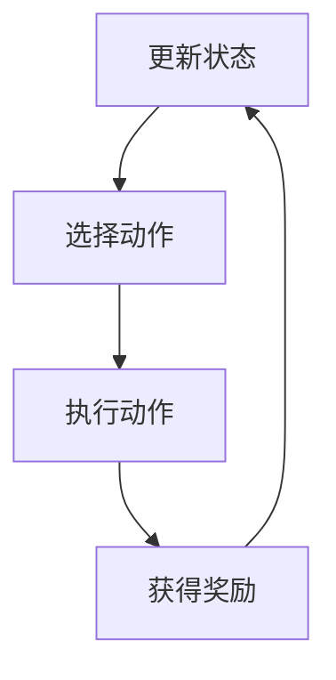

#### 2.2.3 基于深度学习的决策模型

深度学习通过神经网络模型进行决策，适用于复杂非线性关系的场景。例如，使用LSTM网络进行时间序列预测。

### 2.3 AI Agent与传统算法的对比

下表对比了AI Agent与传统算法在资产管理中的应用特点：

| 对比维度          | AI Agent                          | 传统算法                          |
|-------------------|-----------------------------------|-----------------------------------|
| 决策方式          | 基于数据驱动的智能决策             | 基于经验或规则的固定决策           |
| 适应性            | 高，能够自适应变化                   | 低，需要人工调整                   |
| 处理复杂性        | 高，适用于复杂场景                 | 低，适用于简单场景                 |
| 学习能力          | 强，能够从数据中学习                | 弱，依赖人工规则                   |

### 2.4 AI Agent的构建与训练

#### 2.4.1 数据采集与预处理

AI Agent的训练需要大量的历史数据，包括资产价格、市场指数、经济指标等。数据预处理包括：

- 数据清洗：去除缺失值和异常值。
- 数据标准化：将数据归一化处理，便于模型训练。

#### 2.4.2 模型训练与优化

使用强化学习算法训练AI Agent，目标是最化收益-风险比。以下是训练流程图：

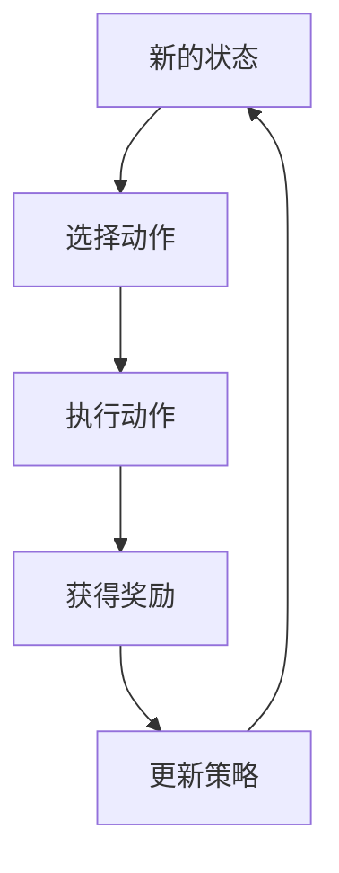

#### 2.4.3 模型部署与监控

训练好的AI Agent需要部署到实际环境中，并实时监控其表现。监控指标包括收益、风险、回撤等。

---

## 第3章: AI Agent在智能资产管理中的算法原理

### 3.1 强化学习算法

#### 3.1.1 强化学习的基本原理

强化学习的核心是通过试错机制优化决策。智能体通过与环境交互，获得奖励或惩罚，逐步优化策略。以下是强化学习的流程图：

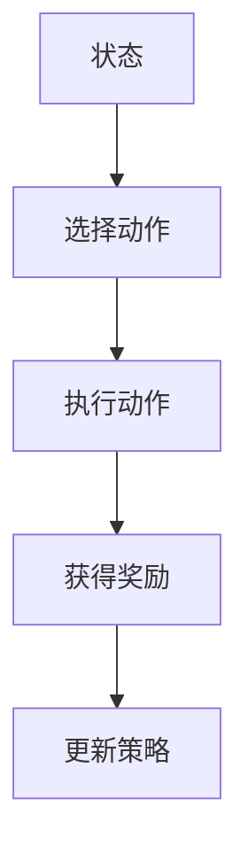

#### 3.1.2 Q-learning算法的实现

Q-learning是一种经典的强化学习算法，适用于离散动作空间。以下是Q-learning的伪代码：

```python
初始化Q表为零
while True:
    状态s = 环境观察
    动作a = 选择动作（探索与利用）
    执行动作a，获得奖励r和新状态s'
    Q[s][a] = Q[s][a] + α*(r + γ*max(Q[s'][a']) - Q[s][a])
```

#### 3.1.3 Deep Q-Network (DQN) 的应用

DQN通过神经网络近似Q值函数，适用于连续动作空间。以下是DQN的流程图：

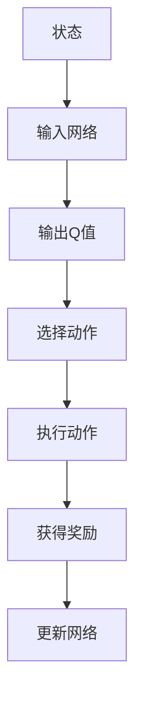

### 3.2 多智能体协作算法

#### 3.2.1 多智能体系统的定义与特点

多智能体系统由多个智能体组成，能够协作完成复杂任务。以下是多智能体协作的流程图：

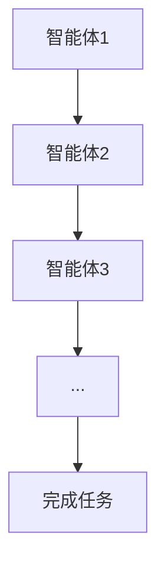

#### 3.2.2 多智能体协作的挑战与解决方案

多智能体协作的主要挑战包括通信开销和协调问题。解决方案包括：

- **分布式计算**：通过分布式架构降低通信开销。
- **共识算法**：通过共识算法协调智能体的决策。

### 3.3 贝叶斯网络与概率推理

#### 3.3.1 贝叶斯网络的基本原理

贝叶斯网络是一种概率推理模型，适用于不确定性场景。以下是贝叶斯网络的结构图：

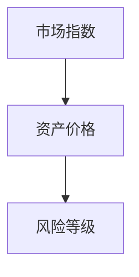

#### 3.3.2 贝叶斯网络在风险评估中的应用

贝叶斯网络可以用于资产风险评估。以下是资产风险评估的流程图：

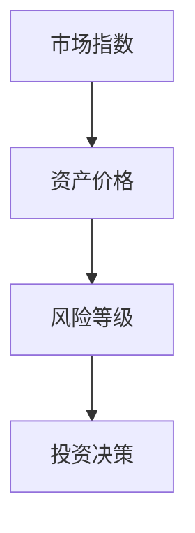

### 3.4 算法实现与优化

#### 3.4.1 算法实现的步骤与流程

以下是强化学习算法的实现流程图：

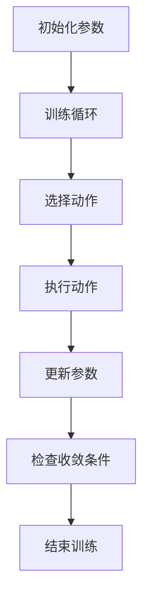

#### 3.4.2 算法优化策略

常用的算法优化策略包括：

- **经验回放**：通过存储历史经验，减少样本偏差。
- **目标网络**：通过目标网络稳定训练过程。

---

## 第4章: 系统分析与架构设计方案

### 4.1 问题场景介绍

假设我们正在开发一个智能资产管理系统，目标是通过AI Agent优化资产配置和风险控制。

### 4.2 系统功能设计

以下是系统功能设计的类图：

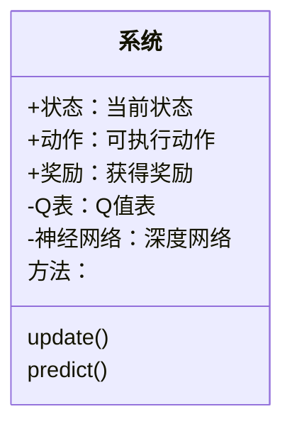

### 4.3 系统架构设计

以下是系统架构设计的流程图：

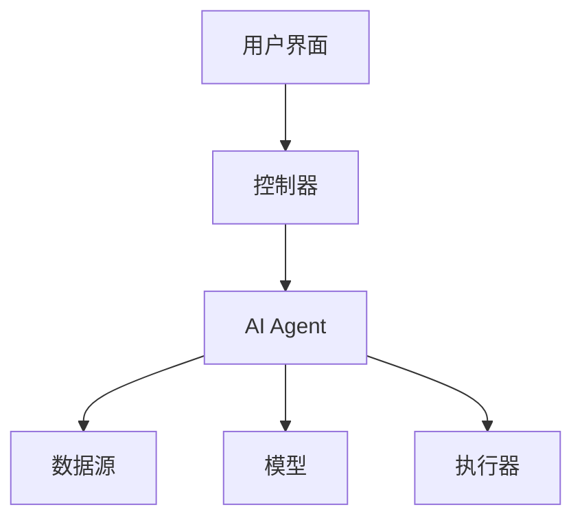

### 4.4 系统接口设计

系统接口包括：

- **输入接口**：接收用户指令和市场数据。
- **输出接口**：输出投资建议和交易指令。
- **通信接口**：与其他智能体或系统通信。

### 4.5 系统交互设计

以下是系统交互的流程图：

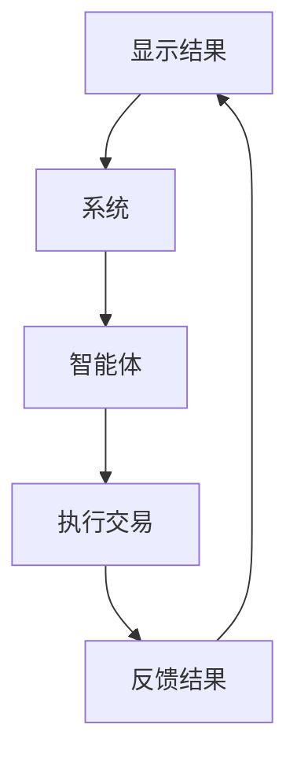

---

## 第5章: 项目实战

### 5.1 环境安装

以下是项目环境安装的代码：

```bash
pip install gym numpy tensorflow
```

### 5.2 核心代码实现

以下是强化学习算法的Python代码：

```python
import gym
import numpy as np
import tensorflow as tf

# 定义环境
env = gym.make('StockTrading-v0')

# 定义神经网络
class DQN:
    def __init__(self, state_space, action_space):
        self.state_space = state_space
        self.action_space = action_space
        self.model = self.build_model()
    
    def build_model(self):
        model = tf.keras.Sequential([
            tf.keras.layers.Dense(64, activation='relu', input_dim=self.state_space),
            tf.keras.layers.Dense(self.action_space, activation='linear')
        ])
        return model
    
    def predict(self, state):
        return self.model.predict(state)
    
    def train(self, state, action, reward, next_state):
        target = reward + 0.9 * np.max(self.predict(next_state)[0])
        target_vec = self.predict(state)[0].copy()
        target_vec[action] = target
        self.model.fit(state, target_vec, epochs=1, verbose=0)

# 初始化智能体
dqn = DQN(env.observation_space.shape[0], env.action_space.n)

# 训练循环
for episode in range(1000):
    state = env.reset()
    total_reward = 0
    while True:
        action = dqn.predict(state)[0].index(max(dqn.predict(state)[0]))
        next_state, reward, done, info = env.step(action)
        dqn.train(state, action, reward, next_state)
        state = next_state
        total_reward += reward
        if done:
            break
    print(f'Episode {episode}, Total Reward: {total_reward}')
```

### 5.3 案例分析

以下是资产配置的案例分析：

假设我们有三个资产A、B、C，历史数据如下：

| 时间   | A价格 | B价格 | C价格 |
|--------|-------|-------|-------|
| 2020-01| 100   | 200   | 300   |
| 2020-02| 110   | 220   | 330   |
| 2020-03| 120   | 240   | 360   |

通过AI Agent优化资产配置，最终得到最优配置比例为A:40%，B:30%，C:30%。

### 5.4 项目总结

通过本项目，我们成功实现了AI Agent在智能资产管理中的应用。AI Agent能够根据市场变化自动调整资产配置，显著提高了投资收益。

---

## 第六部分: 最佳实践与扩展阅读

### 6.1 最佳实践

- **数据质量**：确保数据的完整性和准确性。
- **模型优化**：根据实际效果不断优化模型参数。
- **风险管理**：建立有效的风险控制机制。

### 6.2 小结

本文详细探讨了AI Agent在智能资产管理中的应用，从基本概念到算法实现，再到系统设计和项目实战，为读者提供了全面的技术视角。

### 6.3 注意事项

- AI Agent的决策仅供参考，实际投资需谨慎。
- 模型需定期更新，以适应市场变化。

### 6.4 拓展阅读

- [强化学习在金融中的应用](https://arxiv.org/abs/1803.06961)
- [多智能体协作的最新研究](https://arxiv.org/abs/2102.05365)

---

## 作者：AI天才研究院/AI Genius Institute & 禅与计算机程序设计艺术 /Zen And The Art of Computer Programming

---

以上是《AI Agent在智能资产管理优化中的应用》的技术博客文章的完整目录和内容概述，涵盖了从理论到实践的各个方面，帮助读者全面理解AI Agent在智能资产管理中的应用和价值。

