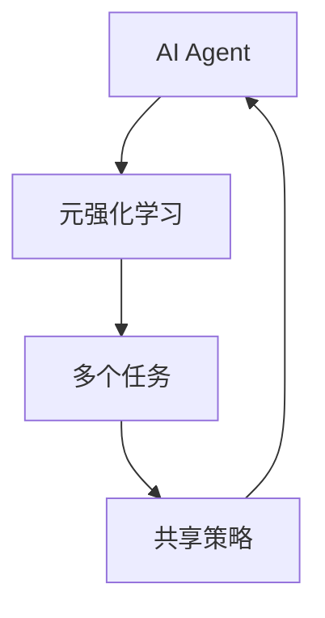
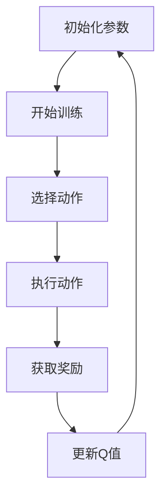
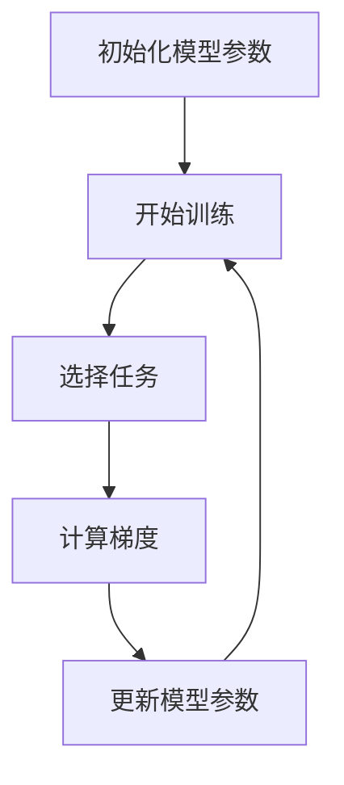
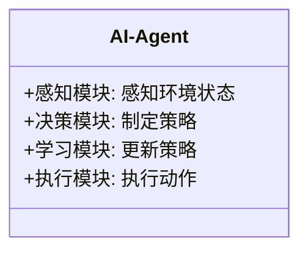
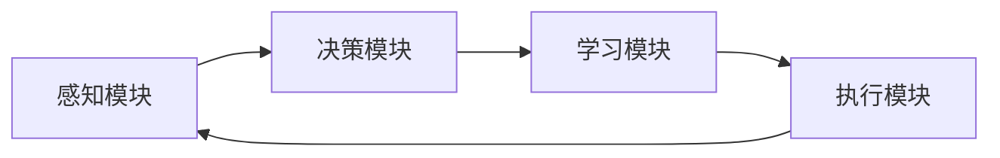
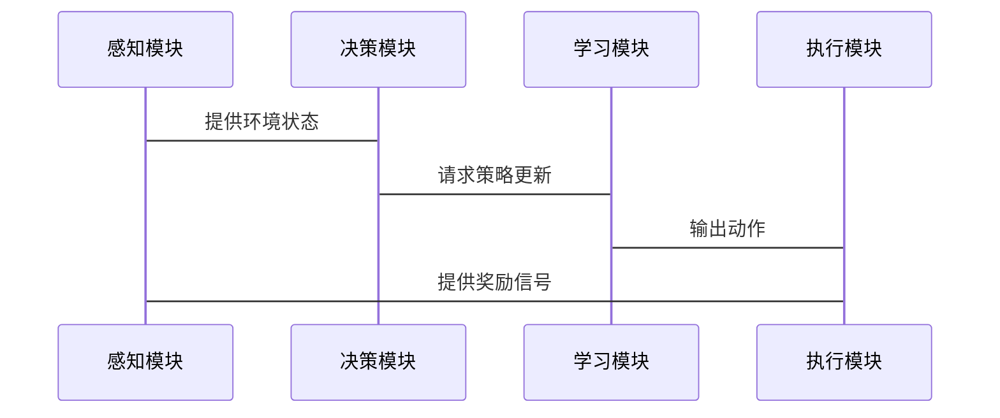

                 


# AI Agent的元强化学习策略开发

> 关键词：AI Agent, 元强化学习, 策略开发, 算法原理, 系统架构

> 摘要：本文深入探讨了AI Agent的元强化学习策略开发，从背景介绍、核心概念到算法原理、系统架构，再到项目实战，全面解析了元强化学习在AI Agent中的应用与实现。文章通过详细的理论分析和实际案例，帮助读者理解如何利用元强化学习提升AI Agent的策略开发效率与性能。

---

# 第一部分：AI Agent与元强化学习背景介绍

## 第1章：AI Agent与元强化学习概述

### 1.1 AI Agent的基本概念

#### 1.1.1 AI Agent的定义与特点

AI Agent（人工智能代理）是指能够感知环境、自主决策并采取行动的智能实体。它具备以下特点：
- **自主性**：能够在没有外部干预的情况下自主决策。
- **反应性**：能够实时感知环境并做出反应。
- **目标导向性**：具备明确的目标，并通过行动实现目标。
- **学习能力**：能够通过经验改进自身的决策能力。

#### 1.1.2 AI Agent的分类与应用场景

AI Agent可以根据其智能水平和应用场景分为以下几类：
- **反应式AI Agent**：基于当前感知做出反应，适用于实时决策任务。
- **认知式AI Agent**：具备复杂推理和规划能力，适用于需要战略决策的任务。
- **协作式AI Agent**：能够与其他AI Agent或人类协作完成任务。

应用场景包括自动驾驶、智能助手、游戏AI、机器人控制等。

#### 1.1.3 AI Agent与传统强化学习的对比

传统强化学习（Reinforcement Learning, RL）通过智能体与环境的交互，通过试错学习找到最优策略。AI Agent结合强化学习技术，能够实现更复杂的任务。AI Agent的优势在于其具备自主性和目标导向性，能够适应动态环境。

---

### 1.2 元强化学习的定义与特点

元强化学习（Meta-Reinforcement Learning, Meta-RL）是一种新兴的学习范式，旨在通过元学习（Meta-Learning）提升强化学习的效率和性能。其核心思想是通过学习如何学习，使得AI Agent能够在不同任务或环境中快速适应并优化策略。

元强化学习的特点包括：
- **快速适应性**：能够在新环境中快速调整策略。
- **通用性**：适用于多种任务和环境。
- **高效性**：通过元学习减少训练数据和时间。

---

### 1.3 元强化学习在AI Agent中的应用

元强化学习在AI Agent中的应用主要体现在以下几个方面：
- **多任务学习**：AI Agent能够快速适应不同任务，提升学习效率。
- **动态环境适应**：在环境动态变化时，AI Agent能够快速调整策略。
- **复杂任务优化**：通过元学习，AI Agent能够在复杂任务中找到更优的策略。

---

# 第二部分：元强化学习的核心概念与联系

## 第2章：元强化学习的核心原理

### 2.1 元强化学习的原理

#### 2.1.1 元强化学习的基本原理

元强化学习的核心思想是通过学习一种“学习方式”，使得AI Agent能够在不同任务或环境中快速优化策略。具体来说，元强化学习通过元学习算法，从多个任务中学习共享的表示和策略，从而提升泛化能力。

#### 2.1.2 元强化学习的核心算法

元强化学习的典型算法包括：
- **Meta-Q-Learning**：基于Q学习的元强化学习算法。
- **Model-Agnostic Meta-Learning (MAML)**：模型不可知的元学习算法。
- **Recurrent Meta-Learning**：基于循环神经网络的元学习方法。

---

#### 2.1.3 元强化学习的数学模型

元强化学习的数学模型通常包括以下几个部分：
- **状态空间**：环境的状态表示。
- **动作空间**：AI Agent的可能动作。
- **目标函数**：衡量策略优劣的标准。
- **元学习目标**：通过优化元学习目标，提升策略的适应性。

---

### 2.2 元强化学习与相关概念的对比

#### 2.2.1 元强化学习与传统强化学习的对比

| 特性                | 传统强化学习             | 元强化学习             |
|---------------------|--------------------------|------------------------|
| 学习目标            | 学习单一任务的最优策略     | 学习多个任务的共享策略   |
| 训练效率            | 需要大量数据和时间         | 通过元学习减少训练时间   |
| 适应性              | 适应单个任务             | 能够快速适应多个任务     |

#### 2.2.2 元强化学习与迁移学习的对比

| 特性                | 元强化学习             | 迁移学习             |
|---------------------|--------------------------|------------------------|
| 学习目标            | 学习多个任务的共享策略     | 将一个任务的知识迁移到另一个任务 |
| 适用场景            | 多任务学习             | 不同任务之间的知识迁移   |
| 方法                | 通过元学习优化策略       | 通过特征提取或任务适配   |

#### 2.2.3 元强化学习与元学习的对比

| 特性                | 元强化学习             | 元学习               |
|---------------------|--------------------------|------------------------|
| 学习目标            | 优化强化学习策略         | 学习如何学习           |
| 适用范围            | 强化学习领域             | 各个机器学习领域       |
| 核心思想            | 学习如何优化策略         | 学习如何表示和推理      |

---

### 2.3 元强化学习的实体关系图



---

# 第三部分：元强化学习的算法原理讲解

## 第3章：元强化学习的算法原理

### 3.1 Meta-Q-Learning算法

#### 3.1.1 算法原理

Meta-Q-Learning是一种基于Q学习的元强化学习算法。其核心思想是通过元学习优化Q函数的更新规则，使得AI Agent能够在多个任务中共享策略。

#### 3.1.2 算法流程



#### 3.1.3 算法实现

以下是Meta-Q-Learning的Python实现示例：

```python
import numpy as np

class MetaQAgent:
    def __init__(self, state_space, action_space, learning_rate=0.01):
        self.state_space = state_space
        self.action_space = action_space
        self.lr = learning_rate
        self.Q = np.zeros((state_space, action_space))

    def meta_update(self, tasks):
        for task in tasks:
            for s in range(self.state_space):
                for a in range(self.action_space):
                    self.Q[s][a] += self.lr * (sum(task.rewards[s][a] for task in tasks) - self.Q[s][a])

    def act(self, state):
        return np.argmax(self.Q[state])
```

---

### 3.2 Model-Agnostic Meta-Learning (MAML)算法

#### 3.2.1 算法原理

MAML是一种模型不可知的元学习算法，适用于各种模型架构。其核心思想是通过优化模型的参数，使得模型能够在多个任务中快速适应。

#### 3.2.2 算法流程



#### 3.2.3 算法实现

以下是MAML的Python实现示例：

```python
import torch

class MAMLAgent:
    def __init__(self, model, inner_lr=0.1, meta_lr=0.001):
        self.model = model
        self.inner_lr = inner_lr
        self.meta_lr = meta_lr
        self.optimizer = torch.optim.Adam(self.model.parameters(), lr=meta_lr)

    def inner_update(self, task, train_data):
        # 计算梯度并更新模型参数
        loss = task.criterion(task.model, train_data)
        loss.backward()
        self.optimizer.step()

    def meta_update(self, tasks, val_data):
        for task in tasks:
            # 计算元梯度
            task.inner_update(train_data)
            # 计算元梯度并更新模型参数
            self.optimizer.zero_grad()
            loss = task.criterion(task.model, val_data)
            loss.backward()
            self.optimizer.step()
```

---

### 3.3 算法的数学模型

#### 3.3.1 Meta-Q-Learning的数学模型

$$ Q(s, a) = Q(s, a) + \alpha \cdot (r + \gamma Q(s', a') - Q(s, a)) $$

其中：
- \( Q(s, a) \)：状态-动作值函数。
- \( r \)：奖励。
- \( \gamma \)：折扣因子。
- \( \alpha \)：学习率。

#### 3.3.2 MAML的数学模型

$$ \theta' = \theta + \eta \cdot \nabla_{\theta} \mathcal{L}(\theta, T_i) $$

其中：
- \( \theta \)：模型参数。
- \( \mathcal{L}(\theta, T_i) \)：任务\( T_i \)的损失函数。
- \( \eta \)：学习率。

---

# 第四部分：系统分析与架构设计方案

## 第4章：AI Agent的系统架构设计

### 4.1 问题场景介绍

AI Agent需要在动态环境中快速适应并优化策略。为了实现这一点，我们需要设计一个高效的系统架构，包括感知、决策、学习和执行模块。

---

### 4.2 系统功能设计

#### 4.2.1 领域模型（Mermaid类图）



---

#### 4.2.2 系统架构设计（Mermaid架构图）



---

### 4.3 系统接口设计

- **输入接口**：接收环境状态和奖励信号。
- **输出接口**：输出动作和策略更新。

---

### 4.4 系统交互设计（Mermaid序列图）



---

# 第五部分：项目实战

## 第5章：元强化学习在AI Agent中的应用

### 5.1 项目介绍

本项目旨在开发一个基于元强化学习的AI Agent，能够在多个任务中快速适应并优化策略。

---

### 5.2 环境安装与配置

```bash
pip install numpy matplotlib
```

---

### 5.3 系统核心实现源代码

#### 5.3.1 元强化学习算法实现

```python
class MetaRLAgent:
    def __init__(self, state_space, action_space):
        self.state_space = state_space
        self.action_space = action_space
        self.Q = np.zeros((state_space, action_space))

    def meta_update(self, tasks):
        for task in tasks:
            for s in range(self.state_space):
                for a in range(self.action_space):
                    self.Q[s][a] += 0.1 * (task.reward(s, a) - self.Q[s][a])

    def act(self, state):
        return np.argmax(self.Q[state])
```

---

#### 5.3.2 任务定义与环境模拟

```python
class Task:
    def __init__(self, state_space, action_space):
        self.state_space = state_space
        self.action_space = action_space

    def reward(self, state, action):
        if action == self.optimal_action(state):
            return 1
        else:
            return -1

    def optimal_action(self, state):
        return state % 2
```

---

### 5.4 案例分析与实际应用

通过实现Meta-Q-Learning算法，我们可以在多个任务中验证其有效性。例如，在一个多任务环境中，AI Agent能够快速调整策略以适应不同的任务需求。

---

## 第6章：总结与展望

### 6.1 总结

本文详细探讨了AI Agent的元强化学习策略开发，从理论到实践，全面解析了元强化学习的核心概念、算法原理和系统架构。通过实际案例，展示了如何利用元强化学习提升AI Agent的性能和适应性。

---

### 6.2 注意事项与建议

- **数据质量**：元强化学习的效果依赖于高质量的数据和任务多样性。
- **计算资源**：元强化学习的训练过程需要大量的计算资源。
- **算法选择**：根据具体任务选择合适的元强化学习算法。

---

### 6.3 拓展阅读

- **推荐书籍**：《Reinforcement Learning: Theory and Algorithms》
- **推荐论文**：《Model-Agnostic Meta-Learning》

---

# 作者

作者：AI天才研究院/AI Genius Institute & 禅与计算机程序设计艺术 /Zen And The Art of Computer Programming

---

以上是文章的完整目录大纲和内容概要，您可以根据实际需求进行扩展和补充。

