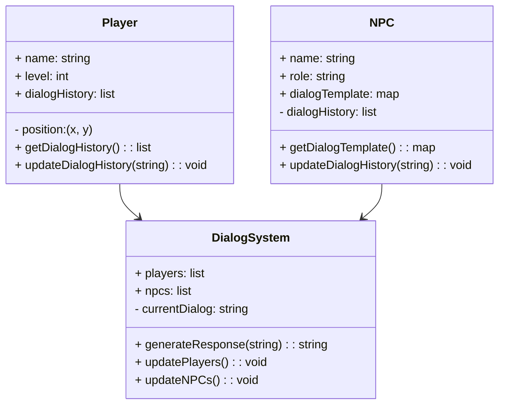
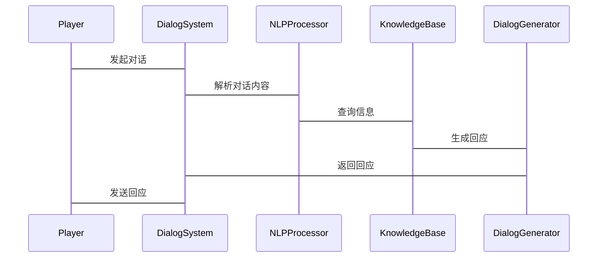

                 


# AI Agent的对话系统在多人游戏中的应用

## 关键词：
AI Agent, 对话系统, 多人游戏, 自然语言处理, 生成式模型, 游戏设计, 人工智能

## 摘要：
本文深入探讨了AI Agent在多人游戏中的对话系统的应用，从基础概念到算法原理，再到系统设计和项目实战，全面分析了对话系统在游戏中的重要性及其技术实现。文章结合理论与实践，详细阐述了生成式对话模型、数学模型、系统架构以及实际案例，为读者提供了全面的视角。

## 第1章: AI Agent与对话系统概述

### 1.1 AI Agent的基本概念
AI Agent（人工智能代理）是指能够感知环境并采取行动以实现目标的智能实体。在多人游戏中，AI Agent通常扮演非玩家角色（NPC），负责与玩家互动或执行特定任务。对话系统是AI Agent实现交互的关键技术，通过自然语言处理技术，使AI Agent能够理解和生成人类语言，从而增强游戏的沉浸感和互动性。

#### 1.1.1 AI Agent的定义与分类
AI Agent可以分为简单反射式Agent和复杂推理式Agent。简单反射式Agent基于预定义的规则做出反应，而复杂推理式Agent则能够通过学习和推理做出更复杂的决策。在多人游戏中，AI Agent通常结合了两种类型的特点，以提供更智能的交互体验。

#### 1.1.2 对话系统的定义与特点
对话系统是一种基于自然语言处理技术的交互系统，能够理解和生成人类语言。其特点包括：
- **自然性**：对话系统能够以自然语言进行交流，使用户感到亲切。
- **智能性**：通过自然语言处理技术，对话系统能够理解上下文并生成有意义的回答。
- **适应性**：对话系统能够根据用户的反馈调整对话内容和风格。

#### 1.1.3 AI Agent在对话系统中的作用
AI Agent在对话系统中扮演着关键角色，负责接收用户输入、分析意图并生成适当的回应。通过对话系统，AI Agent能够与玩家进行实时互动，提升游戏的趣味性和可玩性。

### 1.2 多人游戏中的对话场景
在多人游戏中，对话系统扮演着重要的角色，尤其是在角色扮演类游戏（RPG）和多人在线游戏（MMO）中。通过对话系统，玩家可以与游戏中的角色进行互动，获取信息、完成任务或与其他玩家交流。

#### 1.2.1 多人游戏的基本概念
多人游戏是指允许多个玩家同时参与的游戏，玩家可以通过网络连接进行实时互动。这类游戏通常具有复杂的游戏世界和丰富的故事情节，需要高度智能的非玩家角色（NPC）来增强游戏体验。

#### 1.2.2 游戏中的对话需求
在多人游戏中，对话系统的需求主要体现在以下几个方面：
- **任务提示**：通过对话系统，玩家可以获取任务信息和提示。
- **剧情推进**：对话系统是推动游戏剧情发展的重要手段。
- **玩家互动**：玩家可以通过对话系统与其他玩家或NPC进行交流，增强游戏的社交性和互动性。

#### 1.2.3 对话系统在游戏中的应用场景
对话系统在多人游戏中的应用场景包括：
- **任务对话**：玩家通过对话系统获取任务信息并完成任务。
- **剧情对话**：通过对话系统推动游戏剧情的发展。
- **社交对话**：玩家通过对话系统与其他玩家或NPC进行交流，增强游戏的社交性。

## 第2章: AI Agent对话系统的原理与核心概念

### 2.1 对话系统的核心原理
对话系统的原理主要包括自然语言处理（NLP）、意图识别和对话生成。通过这些技术，对话系统能够理解用户的输入并生成有意义的回答。

#### 2.1.1 对话生成的流程
对话生成的流程包括以下几个步骤：
1. **输入处理**：接收用户的输入并进行预处理。
2. **意图识别**：通过自然语言处理技术识别用户的意图。
3. **对话生成**：根据用户的意图生成适当的回应。
4. **输出反馈**：将生成的回应返回给用户。

#### 2.1.2 对话理解的机制
对话理解的机制主要包括关键词匹配、语义分析和上下文理解。通过这些机制，对话系统能够准确理解用户的输入并做出相应的回应。

#### 2.1.3 对话系统的反馈机制
对话系统的反馈机制是指系统根据用户的反馈调整对话内容和风格。通过实时反馈，对话系统能够更好地满足用户的需求，提升用户体验。

### 2.2 AI Agent与对话系统的联系
AI Agent与对话系统的联系主要体现在智能决策能力和自然语言处理能力上。AI Agent通过对话系统与用户进行交互，实现智能决策和自然语言理解。

#### 2.2.1 AI Agent的智能决策能力
AI Agent具有智能决策能力，能够根据当前的游戏状态和用户输入做出最优决策。这种能力使得AI Agent在对话系统中能够提供个性化的服务和互动体验。

#### 2.2.2 对话系统的自然语言处理能力
对话系统的自然语言处理能力使得AI Agent能够理解和生成自然语言，从而实现与用户的自然对话。这种能力是对话系统在多人游戏中的应用基础。

#### 2.2.3 两者结合的协同效应
AI Agent与对话系统的结合能够充分发挥两者的协同效应，通过智能决策和自然语言处理，实现更智能、更自然的对话交互。

## 第3章: 对话系统的算法原理

### 3.1 生成式对话模型
生成式对话模型是基于生成式模型的对话生成技术，主要包括基于规则的生成式模型和基于深度学习的生成式模型。

#### 3.1.1 基于生成式模型的对话生成
基于生成式模型的对话生成主要包括模板生成和神经网络生成。模板生成是一种简单有效的对话生成方法，通过预定义的模板生成对话内容。神经网络生成是一种更复杂的生成方法，通过深度学习模型生成高质量的对话内容。

#### 3.1.2 常见的生成式模型算法
常见的生成式模型算法包括马尔可夫链、循环神经网络（RNN）和变换器（Transformer）。这些算法在对话生成中各有优缺点，适用于不同的场景。

#### 3.1.3 生成式模型的优缺点
生成式模型的优点在于能够生成多样化和高质量的对话内容，但其缺点是计算复杂度高，生成过程需要大量的计算资源。此外，生成式模型的生成结果可能缺乏逻辑性和连贯性。

### 3.2 对话系统的训练与优化
对话系统的训练与优化主要包括数据预处理、模型训练和模型优化。通过这些步骤，可以提升对话系统的生成能力和对话质量。

#### 3.2.1 数据预处理与训练策略
数据预处理包括数据清洗、分词和标注。训练策略包括监督学习和无监督学习。通过合理的数据预处理和训练策略，可以提高对话系统的生成能力。

#### 3.2.2 对话系统的评估指标
对话系统的评估指标包括生成对话的质量、相关性和连贯性。通过这些指标，可以评估对话系统的性能并进行优化。

#### 3.2.3 模型的调优与优化
模型的调优与优化包括参数调整、模型剪枝和模型融合。通过这些技术，可以提升对话系统的生成能力和对话质量。

## 第4章: 对话系统的数学模型与公式

### 4.1 生成式模型的数学基础
生成式模型的数学基础包括概率论、统计学和信息论。这些数学理论为生成式模型的算法设计提供了理论基础。

#### 4.1.1 概率分布与生成式模型
概率分布是生成式模型的核心概念，通过概率分布可以描述数据的生成过程。生成式模型通过学习数据的分布特性，生成与训练数据相似的新数据。

#### 4.1.2 变量关系与公式推导
变量关系是生成式模型的核心内容，通过公式推导可以理解生成式模型的数学原理。例如，生成式模型的联合概率分布可以通过变量关系进行分解和推导。

#### 4.1.3 模型的损失函数与优化目标
生成式模型的损失函数通常包括重构损失和对抗损失。优化目标是通过优化算法最小化损失函数，提升模型的生成能力。

### 4.2 对话系统的数学公式
对话系统的数学公式包括生成式模型的数学表达式和对话理解的数学模型。

#### 4.2.1 对话生成的公式表达
对话生成的公式表达包括生成概率和条件概率。生成概率描述了模型生成特定对话内容的概率，条件概率描述了在给定上下文的情况下生成对话内容的概率。

#### 4.2.2 对话理解的公式表达
对话理解的公式表达包括关键词匹配和语义相似度计算。关键词匹配通过计算对话内容中的关键词出现概率，确定对话的主题和意图。语义相似度计算通过计算对话内容的语义相似度，实现对话理解。

#### 4.2.3 对话系统的综合评估公式
对话系统的综合评估公式包括生成对话的质量、相关性和连贯性。通过综合评估公式，可以全面评估对话系统的性能。

## 第5章: 对话系统的系统分析与架构设计

### 5.1 游戏场景介绍
在多人游戏中，对话系统需要满足玩家与NPC之间的互动需求。游戏场景包括游戏世界、角色设定和对话流程。

#### 5.1.1 游戏世界的构建
游戏世界的构建包括游戏环境、角色设定和故事情节。通过合理的游戏世界构建，可以为对话系统提供丰富的对话场景和交互环境。

#### 5.1.2 角色设定与对话流程
角色设定包括角色属性、角色背景和对话风格。对话流程包括对话触发、对话内容生成和对话反馈。通过合理的角色设定和对话流程设计，可以提升对话系统的交互性和用户体验。

### 5.2 系统功能设计

#### 5.2.1 领域模型（Mermaid类图）


#### 5.2.2 系统架构设计（Mermaid架构图）


#### 5.2.3 系统接口设计
系统接口设计包括对话发起接口、对话解析接口和对话生成接口。通过这些接口，对话系统可以与游戏引擎和玩家进行交互。

#### 5.2.4 系统交互流程（Mermaid序列图）


### 5.3 项目实战

#### 5.3.1 环境安装
对话系统开发需要安装Python、TensorFlow、Keras和自然语言处理库（如spaCy）。安装命令如下：
```
pip install python python-tensorflow keras spacy
```

#### 5.3.2 系统核心实现源代码
以下是一个简单的对话系统实现代码：
```python
import spacy
from tensorflow.keras.models import Sequential
from tensorflow.keras.layers import Dense, LSTM

# 加载自然语言处理模型
nlp = spacy.load("en_core_web_sm")

# 定义对话生成模型
model = Sequential()
model.add(LSTM(128, input_shape=(None, 128)))
model.add(Dense(64, activation='relu'))
model.add(Dense(1, activation='sigmoid'))
model.compile(loss='binary_crossentropy', optimizer='adam', metrics=['accuracy'])

# 对话生成函数
def generate_response(user_input):
    # 对用户输入进行分词和标注
    doc = nlp(user_input)
    # 提取对话特征
    features = [token.embedding for token in doc]
    # 生成对话回应
    prediction = model.predict(features)
    if prediction > 0.5:
        return "肯定的回应"
    else:
        return "否定的回应"

# 对话系统主程序
def main():
    while True:
        user_input = input("请输入对话内容：")
        response = generate_response(user_input)
        print("对话系统的回应：", response)

if __name__ == "__main__":
    main()
```

#### 5.3.3 代码应用解读与分析
上述代码实现了基于LSTM的对话生成模型。通过自然语言处理库spaCy对用户输入进行分词和标注，提取对话特征后，通过LSTM模型生成对话回应。对话系统主程序通过循环接收用户输入，生成对话回应，实现简单的对话交互。

#### 5.3.4 实际案例分析
以下是一个简单的对话系统案例分析：
- **用户输入**：你今天过得怎么样？
- **系统回应**：我很好，谢谢。您呢？
- **用户输入**：我很好，谢谢。
- **系统回应**：很高兴听到您也过得很好。

通过上述案例，可以看出对话系统能够通过简单的对话生成模型实现基本的对话交互。

#### 5.3.5 项目小结
对话系统在多人游戏中的应用需要结合自然语言处理技术和生成式模型，通过合理的系统设计和实现，可以提升游戏的互动性和用户体验。

## 第6章: 总结与展望

### 6.1 总结
本文深入探讨了AI Agent在多人游戏中的对话系统的应用，从基础概念到算法原理，再到系统设计和项目实战，全面分析了对话系统在游戏中的重要性及其技术实现。通过理论与实践的结合，为读者提供了全面的视角。

### 6.2 未来展望
未来，对话系统在多人游戏中的应用将更加智能化和个性化。随着自然语言处理技术的发展，对话系统将能够实现更复杂的对话交互，为玩家提供更丰富的游戏体验。

### 6.3 最佳实践 tips
- **数据质量**：对话系统的性能很大程度上依赖于训练数据的质量，高质量的数据能够提升对话系统的生成能力和对话质量。
- **模型优化**：通过模型优化技术，可以提升对话系统的生成效率和对话质量。
- **用户反馈**：通过用户反馈不断优化对话系统，提升用户体验。

### 6.4 小结
对话系统在多人游戏中的应用是一个复杂而有趣的技术领域，需要结合自然语言处理技术、生成式模型和系统设计等多方面的知识。通过不断的实践和优化，可以实现更智能、更自然的对话交互。

### 6.5 注意事项
- **数据隐私**：在实际应用中，需要注意用户数据的隐私保护，避免数据泄露和滥用。
- **性能优化**：在实际应用中，需要注意对话系统的性能优化，提升对话生成的速度和效率。
- **用户体验**：在实际应用中，需要注意用户体验，通过合理的对话设计和用户反馈，提升用户满意度。

### 6.6 拓展阅读
- **自然语言处理**：深入学习自然语言处理技术，了解最新的研究成果和应用。
- **生成式模型**：研究生成式模型的最新进展，了解其在对话系统中的应用。
- **游戏设计**：学习游戏设计的基本原理，了解如何将对话系统应用于不同类型的游戏。

## 作者：AI天才研究院/AI Genius Institute & 禅与计算机程序设计艺术 /Zen And The Art of Computer Programming

---

以上是《AI Agent的对话系统在多人游戏中的应用》的完整目录大纲和文章内容。希望对您有所帮助！

