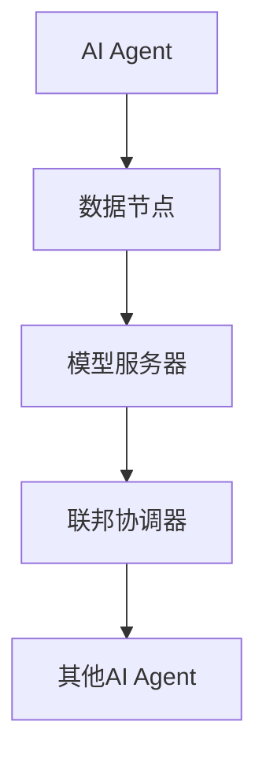

                 


# AI Agent的隐私保护联邦学习：数据不出本地的协作训练

> 关键词：联邦学习，隐私保护，AI Agent，数据协作，加密技术，分布式系统，机器学习

> 摘要：本文深入探讨了AI Agent在隐私保护联邦学习中的应用，分析了数据不出本地的协作训练机制，介绍了联邦学习的核心原理、算法实现、系统架构设计以及实际项目案例。文章旨在为读者提供一个全面的技术视角，帮助理解如何在保护数据隐私的前提下实现高效的协作学习。

---

## 第一部分: 联邦学习与隐私保护概述

### 第1章: 联邦学习与隐私保护概述

#### 1.1 联邦学习的基本概念
##### 1.1.1 联邦学习的定义
联邦学习（Federated Learning）是一种分布式机器学习技术，允许多个参与方在不共享原始数据的情况下协作训练模型。其核心思想是“数据不动，模型动”，即数据保留在本地，仅交换模型更新参数。

##### 1.1.2 联邦学习的核心特点
- **数据本地化**：数据不出本地，仅传输模型更新。
- **隐私保护**：通过加密和差分隐私等技术保护数据隐私。
- **分布式协作**：多个参与方协同训练，共同优化模型。

##### 1.1.3 联邦学习与传统数据共享的区别
| 特性 | 联邦学习 | 传统数据共享 |
|------|----------|--------------|
| 数据传输 | 仅传输模型参数 | 传输原始数据 |
| 数据隐私 | 高 | 低 |
| 计算效率 | 较低 | 较高 |
| 适用场景 | 数据敏感场景 | 数据不敏感场景 |

#### 1.2 隐私保护的重要性
##### 1.2.1 数据泄露的风险
- 数据泄露可能导致企业损失、用户隐私暴露。
- 合规性问题：数据保护法规（如GDPR）要求企业保护用户数据。

##### 1.2.2 隐私保护的法律与伦理要求
- 数据主体拥有对其数据的控制权。
- 数据处理必须符合相关法律法规。

##### 1.2.3 联邦学习如何实现数据隐私保护
- **加密技术**：如同态加密、安全多方计算。
- **差分隐私**：在数据中添加噪声，确保个体数据无法被推断。
- **访问控制**：严格控制数据访问权限。

#### 1.3 AI Agent在联邦学习中的角色
##### 1.3.1 AI Agent的定义与特点
- AI Agent是一种智能体，能够感知环境、自主决策并执行任务。
- 具备学习能力，能够通过经验改进性能。

##### 1.3.2 AI Agent在联邦学习中的作用
- **数据持有者**：AI Agent持有本地数据，仅参与模型训练。
- **模型更新者**：AI Agent负责本地模型更新，并将更新参数上传至服务器。
- **协作协调者**：AI Agent与其他节点协作，确保模型收敛。

##### 1.3.3 AI Agent与其他协作学习模型的对比
| 模型 | 联邦学习 | �垂联邦学习 | 跨联邦学习 |
|------|----------|------------|------------|
| 数据共享方式 | 模型参数 | 模型参数 | 模型参数 |
| 数据分布 | 横向分布 | 垂直分布 | 混合分布 |
| 适用场景 | 多方数据横向协作 | 多方数据纵向协作 | 多方数据混合协作 |

---

## 第二部分: 联邦学习的核心原理

### 第2章: 联邦学习的核心原理

#### 2.1 联邦学习的基本原理
##### 2.1.1 数据不出本地的协作训练
- 数据保留在本地，仅传输模型参数。
- 通过迭代优化算法（如SGD、Adam）更新模型。

##### 2.1.2 联邦学习的通信机制
- **同步联邦学习**：所有节点同时更新模型，并将参数同步至中心服务器。
- **异步联邦学习**：节点按需更新模型，服务器异步汇总参数。

##### 2.1.3 联邦学习的同步与优化策略
- **参数聚合**：服务器将所有节点的模型参数汇总，得到全局模型。
- **模型同步**：节点定期从服务器获取最新全局模型，更新本地模型。

#### 2.2 隐私保护的关键技术
##### 2.2.1 同态加密
- **定义**：允许在加密数据上进行计算，结果解密后与直接计算结果相同。
- **应用**：用于保护模型参数的隐私，确保只有授权方能够解密。

##### 2.2.2 差分隐私
- **定义**：通过对数据添加噪声，确保个体数据无法被推断。
- **应用**：用于保护训练数据的隐私，防止数据泄露。

##### 2.2.3 联邦学习中的数据脱敏技术
- **数据匿名化**：去除或加密敏感信息。
- **数据分割**：将数据分割为多个部分，确保单一部分无法推断完整信息。

#### 2.3 AI Agent的协作机制
##### 2.3.1 AI Agent的分布式协作流程
1. **初始化**：AI Agent下载初始模型参数。
2. **本地训练**：AI Agent在本地数据上更新模型参数。
3. **模型上传**：AI Agent将更新参数上传至服务器。
4. **模型聚合**：服务器汇总所有节点的参数，更新全局模型。
5. **模型分发**：服务器将最新全局模型分发给所有节点。

##### 2.3.2 AI Agent的通信协议设计
- **通信频率**：定期同步或按需同步。
- **通信方式**：加密通信通道，确保数据传输安全。

##### 2.3.3 AI Agent的隐私保护策略
- **数据加密**：本地数据加密存储。
- **模型加密**：模型参数加密传输。

---

### 第3章: 联邦学习的算法原理

#### 3.1 联邦学习的算法框架
##### 3.1.1 横向联邦学习
- **特点**：数据按横向分布，每个节点拥有完整的特征维度。
- **应用**：适用于多机构协作训练同一模型。

##### 3.1.2 纵向联邦学习
- **特点**：数据按纵向分布，每个节点拥有部分特征维度。
- **应用**：适用于数据垂直分割的场景。

##### 3.1.3 联邦学习的分类与应用场景
| 类型 | 描述 | 应用场景 |
|------|------|----------|
| 横向 | 数据横向分布 | 多机构协作 |
| 纵向 | 数据纵向分布 | 数据链协作 |
| 混合 | 数据混合分布 | 复杂场景协作 |

#### 3.2 联邦学习的数学模型
##### 3.2.1 联邦学习的优化目标
- **目标函数**：$ \min_{\theta} \sum_{i=1}^{n} f_i(\theta) $，其中$ f_i(\theta) $为第$i$个节点的损失函数。
- **优化算法**：使用随机梯度下降（SGD）或Adam优化器。

##### 3.2.2 联邦学习的数学公式
- **局部优化**：$ \theta_i^{new} = \theta_i^{old} - \eta \nabla f_i(\theta_i^{old}) $。
- **全局聚合**：$ \theta^{new} = \frac{1}{n} \sum_{i=1}^{n} \theta_i^{new} $。

##### 3.2.3 联邦学习的收敛性分析
- **收敛条件**：模型参数逐步趋近于全局最优。
- **收敛速度**：取决于数据分布和优化算法。

#### 3.3 AI Agent的协作算法
##### 3.3.1 分布式优化算法
- **算法步骤**：
  1. 初始化全局模型$\theta$。
  2. 每个AI Agent在本地数据上优化模型，得到$\theta_i$。
  3. 将$\theta_i$上传至服务器。
  4. 服务器聚合所有$\theta_i$，更新全局模型$\theta$。

##### 3.3.2 联邦学习中的同步算法
- **同步方式**：周期性同步或事件驱动同步。
- **同步机制**：通过可靠的通信协议确保模型更新的准确性和及时性。

##### 3.3.3 联邦学习的隐私保护算法
- **同态加密算法**：支持在加密数据上的计算。
- **差分隐私算法**：通过添加噪声保护数据隐私。

---

### 第4章: 联邦学习的系统架构设计

#### 4.1 系统架构概述
##### 4.1.1 联邦学习系统的组成
- **数据节点**：持有本地数据，负责模型训练。
- **模型服务器**：负责模型聚合和分发。
- **联邦协调器**：负责任务分配和流程管理。

##### 4.1.2 系统的功能模块划分
| 模块 | 功能描述 |
|------|----------|
| 数据节点 | 本地数据存储与模型训练 |
| 模型服务器 | 模型聚合与分发 |
| 联邦协调器 | 任务管理与流程控制 |

##### 4.1.3 系统的通信架构设计
- **通信协议**：使用HTTPS或加密通道确保数据传输安全。
- **消息格式**：定义统一的消息格式，确保各节点间通信兼容。

#### 4.2 AI Agent的实体关系图


#### 4.3 系统设计的关键点
##### 4.3.1 数据节点的设计
- **数据存储**：支持多种数据格式，如文本、图像、结构化数据。
- **模型训练**：支持多种算法框架，如TensorFlow、PyTorch。

##### 4.3.2 模型服务器的设计
- **模型存储**：存储全局模型参数。
- **模型聚合**：实现参数聚合算法，如平均、加权平均。

##### 4.3.3 联邦协调器的设计
- **任务分配**：根据节点状态分配训练任务。
- **流程控制**：管理训练流程，确保模型收敛。

---

## 第三部分: 项目实战

### 第5章: 项目实战

#### 5.1 项目介绍
- **项目名称**：基于TensorFlow Federated的联邦学习实现。
- **项目目标**：实现一个简单的联邦学习模型，验证AI Agent在数据不出本地的前提下完成协作训练。

#### 5.2 环境安装
```bash
pip install tensorflow-federated
pip install numpy
pip install matplotlib
```

#### 5.3 系统核心实现源代码
##### 5.3.1 数据生成
```python
import numpy as np

# 生成本地数据
def generate_data(num_samples=100):
    X = np.random.randn(num_samples, 2)
    y = np.random.randint(2, size=num_samples)
    return X, y
```

##### 5.3.2 模型定义
```python
import tensorflow as tf
from tensorflow.keras import layers

def create_model():
    model = tf.keras.Sequential([
        layers.Dense(64, activation='relu', input_shape=(2,)),
        layers.Dense(1, activation='sigmoid')
    ])
    model.compile(optimizer='adam', loss='binary_crossentropy', metrics=['accuracy'])
    return model
```

##### 5.3.3 联邦学习实现
```python
import tensorflow_federated as tff

# 定义联邦学习策略
def model_fn():
    model = create_model()
    return model

# 初始化联邦学习程序
iterative_process = tff.federated_algorithm.build_federated_algorithm(model_fn, tff.federated_algorithm.StaticFederation())

# 执行联邦学习
state = iterative_process.initialize()
for _ in range(10):
    state, metrics = iterative_process.next(state, [[X, y]])
    print(metrics)
```

##### 5.3.4 结果分析
- **训练曲线**：绘制模型在每次迭代中的准确率变化。
- **模型评估**：计算模型在测试集上的准确率。

#### 5.4 案例分析
- **数据分布**：每个AI Agent持有部分数据，数据分布均匀。
- **模型收敛**：经过多次迭代，模型准确率逐步提升。

#### 5.5 项目总结
- **成功经验**：实现了数据不出本地的协作训练。
- **问题与改进**：通信效率有待提高，未来可以优化同步算法。

---

## 第四部分: 总结与扩展

### 第6章: 总结与注意事项

#### 6.1 总结
- 联邦学习是一种高效的数据协作技术，能够在保护数据隐私的前提下实现模型训练。
- AI Agent在联邦学习中扮演重要角色，是数据持有者、模型更新者和协作协调者。
- 通过加密技术、差分隐私等手段，可以有效保护数据隐私。

#### 6.2 注意事项
- **数据安全**：确保数据在传输和存储过程中安全。
- **算法效率**：优化模型训练效率，降低通信开销。
- **合规性**：确保符合相关数据保护法规。

#### 6.3 未来扩展
- **联邦学习的自动化**：实现自动化的模型训练和优化。
- **多模态数据协作**：支持多种数据类型的协作训练。
- **边缘计算结合**：将联邦学习与边缘计算结合，提升数据处理效率。

---

## 作者

作者：AI天才研究院/AI Genius Institute & 禅与计算机程序设计艺术 /Zen And The Art of Computer Programming

