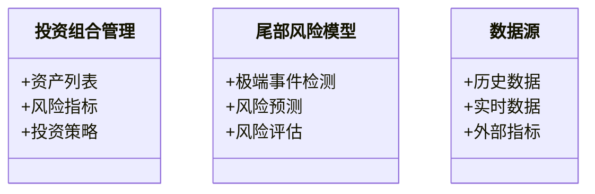
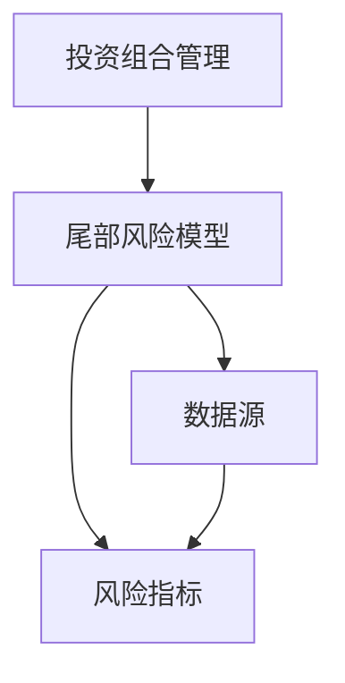

                 


# AI辅助的投资组合尾部风险度量

## 关键词：AI技术、投资组合、尾部风险、风险管理、机器学习

## 摘要：本文详细探讨了如何利用AI技术辅助投资组合的尾部风险度量。首先介绍了尾部风险的基本概念和传统度量方法的局限性，然后分析了AI在尾部风险预测中的应用原理，包括机器学习算法和深度学习模型。接着，文章详细讲解了基于机器学习的尾部风险预测模型的构建过程，包括特征选择、模型训练和优化。最后，通过实际案例分析展示了AI辅助投资组合尾部风险度量的应用效果，并总结了在实际应用中的注意事项和最佳实践。

---

# 第一部分: 背景介绍

## 第1章: 投资组合尾部风险度量的背景与问题

### 1.1 尾部风险的定义与特征

#### 1.1.1 尾部风险的定义

尾部风险是指在投资组合中，发生概率极低但影响极大的极端事件所引发的损失风险。与传统风险度量（如波动率、VaR等）不同，尾部风险关注的是“黑天鹅”事件，即超出正常概率分布范围的极端情况。

$$ VaR = \text{在一定置信水平下，投资组合的最大可能损失} $$

$$ CVaR = \text{在VaR的基础上，考虑损失超过VaR的平均值} $$

#### 1.1.2 尾部风险的特征

尾部风险具有以下特征：

1. **低概率性**：极端事件的发生概率极低，但影响巨大。
2. **不可预测性**：传统统计模型难以准确预测尾部事件。
3. **高破坏性**：尾部事件可能导致投资组合的重大损失甚至崩盘。
4. **关联性**：尾部风险往往与市场波动、流动性危机等系统性风险密切相关。

| 特性 | 传统风险度量 | 尾部风险度量 |
|------|--------------|--------------|
| 概率  | 中等概率     | 极低概率      |
| 影响  | 中等影响     | 极高影响      |
| 预测性| 可预测        | 不可预测      |

#### 1.1.3 尾部风险与传统风险度量的区别

传统风险度量方法（如VaR、波动率）主要关注常态分布下的风险，而尾部风险度量关注的是“肥尾”现象，即极端事件发生的概率高于正态分布的预测。

$$ 正态分布尾部概率 = \frac{1}{\sqrt{2\pi}} e^{-x^2/2} $$

$$ 肥尾分布尾部概率 = \frac{1}{B} x^{-\alpha} $$

### 1.2 投资组合风险度量的现状

#### 1.2.1 传统投资组合风险度量方法

传统方法主要包括：

1. **VaR（Value at Risk）**：在给定置信水平下，投资组合的最大可能损失。
2. **CVaR（Conditional Value at Risk）**：VaR的延伸，考虑超过VaR的平均损失。
3. **波动率**：衡量资产价格的波动程度。

#### 1.2.2 传统方法的局限性

1. **忽视尾部风险**：传统方法假设资产收益服从正态分布，忽视了极端事件的可能性。
2. **模型假设的局限**：正态分布假设在实际市场中并不成立，尤其在金融危机期间。
3. **无法捕捉系统性风险**：尾部风险往往与系统性风险相关，传统方法难以量化。

#### 1.2.3 尾部风险在投资组合管理中的重要性

1. **保护投资者利益**：通过识别和量化尾部风险，投资者可以更好地规避极端损失。
2. **优化投资组合构造**：在极端情况下，投资组合可能面临巨大损失，尾部风险度量可以帮助优化资产配置。
3. **提升风险管理能力**：通过量化尾部风险，机构可以更好地应对潜在的系统性危机。

### 1.3 AI技术在金融风险管理中的应用前景

#### 1.3.1 AI技术在金融领域的应用现状

AI技术已经在金融领域得到广泛应用，包括：

1. **股票预测**：利用机器学习模型预测股票价格走势。
2. **信用评分**：通过AI技术评估客户的信用风险。
3. **欺诈检测**：利用深度学习识别交易中的欺诈行为。

#### 1.3.2 尾部风险度量中引入AI技术的必要性

1. **传统方法的局限性**：传统统计方法难以准确捕捉极端事件。
2. **数据驱动的优势**：AI技术可以通过大数据分析发现隐含的模式。
3. **实时性要求**：金融市场需要实时的风险评估，AI技术可以提供高效的解决方案。

#### 1.3.3 AI辅助投资组合风险管理的优势

1. **高精度预测**：通过机器学习模型，可以更准确地预测极端事件。
2. **自适应性**：AI模型可以根据市场变化动态调整风险度量。
3. **数据处理能力**：AI技术可以处理海量数据，发现传统方法难以察觉的模式。

---

## 第2章: 尾部风险度量的核心概念与联系

### 2.1 尾部风险的数学模型

#### 2.1.1 概率分布模型在尾部风险中的应用

1. **正态分布**：假设资产收益服从正态分布，但实际市场中存在“肥尾”现象。
2. **柯西分布**：一种具有肥尾的分布，常用于描述极端事件。
3. **t分布**：具有较短的尾部，但参数调整后可以模拟肥尾现象。

$$ 柯西分布概率密度函数 = \frac{1}{\pi (1 + (x - \mu/\sigma)^2)} $$

#### 2.1.2 尾部风险的数学表达式

$$ P(X > x) = \frac{1}{1 + (x - \mu)^2} $$

其中，$\mu$ 是分布的中心位置。

### 2.2 尾部风险与投资组合的关系

#### 2.2.1 投资组合风险的构成

1. **市场风险**：由于市场波动导致的投资组合损失。
2. **流动性风险**：由于资产流动性不足导致的损失。
3. **信用风险**：由于债务人违约导致的损失。

#### 2.2.2 尾部风险对投资组合的影响

1. **系统性风险**：尾部风险往往与系统性风险相关，如金融危机。
2. **非系统性风险**：个别资产的极端损失可能影响投资组合的整体表现。

#### 2.2.3 尾部风险的度量指标

1. **VaR**：在给定置信水平下，投资组合的最大可能损失。
2. **CVaR**：超过VaR的平均损失。
3. **极端损失概率（ELP）**：资产收益低于某一阈值的概率。

### 2.3 AI技术在尾部风险度量中的应用原理

#### 2.3.1 机器学习在风险预测中的作用

1. **特征提取**：通过机器学习模型提取影响尾部风险的关键特征。
2. **非线性关系**：机器学习可以捕捉复杂的非线性关系，提高预测精度。
3. **动态调整**：AI模型可以根据市场变化动态调整预测参数。

#### 2.3.2 深度学习在尾部风险建模中的优势

1. **自动特征提取**：深度学习可以自动提取高阶特征，减少人工干预。
2. **非线性拟合能力**：深度学习模型可以更好地捕捉极端事件的模式。
3. **时间序列预测**：通过LSTM等模型，可以有效预测时间序列中的极端事件。

#### 2.3.3 AI技术与传统统计方法的结合

1. **混合模型**：结合统计模型和机器学习模型，提高预测精度。
2. **数据增强**：利用统计方法生成合成数据，增强模型的鲁棒性。
3. **模型解释性**：通过统计方法解释机器学习模型的预测结果。

---

## 第3章: 尾部风险度量的算法原理

### 3.1 基于机器学习的尾部风险预测模型

#### 3.1.1 模型输入特征的选择

1. **资产收益**：资产的历史收益率。
2. **市场波动率**：市场的波动情况。
3. **相关性指标**：资产之间的相关性。
4. **宏观经济指标**：如GDP增长率、利率等。

#### 3.1.2 模型训练与优化

1. **特征工程**：对特征进行标准化、归一化处理。
2. **模型选择**：选择适合的机器学习模型，如随机森林、支持向量机等。
3. **超参数优化**：通过网格搜索或随机搜索优化模型参数。

#### 3.1.3 模型评估与验证

1. **交叉验证**：使用K折交叉验证评估模型的泛化能力。
2. **性能指标**：如准确率、召回率、F1分数等。
3. **异常检测**：通过ROC曲线评估模型的区分能力。

### 3.2 基于深度学习的尾部风险预测模型

#### 3.2.1 深度学习模型的选择

1. **LSTM网络**：适用于时间序列数据的预测。
2. **Transformer模型**：适用于长序列数据的处理。
3. **深度神经网络（DNN）**：适用于复杂的非线性关系。

#### 3.2.2 模型训练流程

1. **数据预处理**：清洗数据，处理缺失值、异常值。
2. **数据分割**：将数据划分为训练集、验证集和测试集。
3. **模型训练**：使用训练数据训练模型，调整超参数。
4. **模型评估**：使用验证集和测试集评估模型性能。

#### 3.2.3 模型优化与调优

1. **学习率调整**：通过学习率调度器动态调整学习率。
2. **批量大小调整**：优化批量大小，提高训练效率。
3. **正则化技术**：使用Dropout、L2正则化等技术防止过拟合。

---

## 第4章: 尾部风险度量的系统分析与架构设计

### 4.1 系统功能设计

#### 4.1.1 领域模型设计



#### 4.1.2 系统架构设计



---

## 第5章: 项目实战

### 5.1 环境安装与配置

#### 5.1.1 Python环境安装

```bash
pip install numpy
pip install pandas
pip install scikit-learn
pip install keras
pip install tensorflow
```

#### 5.1.2 数据集准备

```python
import pandas as pd
import numpy as np

# 生成模拟数据
np.random.seed(42)
data = pd.DataFrame({
    '资产收益': np.random.normal(0, 1, 1000),
    '市场波动率': np.random.uniform(0, 1, 1000),
    '相关性指标': np.random.uniform(0, 1, 1000),
    '宏观经济指标': np.random.uniform(0, 1, 1000)
})
```

#### 5.1.3 模型训练与优化

```python
from sklearn.ensemble import RandomForestClassifier
from sklearn.metrics import accuracy_score

# 特征选择
X = data[['资产收益', '市场波动率', '相关性指标', '宏观经济指标']]
y = data['极端事件标志']

# 数据分割
from sklearn.model_selection import train_test_split
X_train, X_test, y_train, y_test = train_test_split(X, y, test_size=0.2, random_state=42)

# 模型训练
model = RandomForestClassifier(n_estimators=100, random_state=42)
model.fit(X_train, y_train)

# 模型预测
y_pred = model.predict(X_test)
print('准确率:', accuracy_score(y_test, y_pred))
```

### 5.2 系统实现与代码分析

#### 5.2.1 核心代码实现

```python
import keras
from keras.models import Sequential
from keras.layers import Dense, LSTM

# LSTM模型构建
model = Sequential()
model.add(LSTM(64, input_shape=(None, 4)))
model.add(Dense(1, activation='sigmoid'))
model.compile(loss='binary_crossentropy', optimizer='adam', metrics=['accuracy'])
```

#### 5.2.2 系统功能实现

1. **数据采集**：从数据源获取历史数据和实时数据。
2. **模型训练**：利用机器学习和深度学习模型训练尾部风险预测模型。
3. **风险评估**：根据模型预测结果，评估投资组合的尾部风险。
4. **结果输出**：输出风险评估结果，供投资者参考。

---

## 第6章: 最佳实践与小结

### 6.1 小结

通过本文的探讨，我们可以看到，AI技术在投资组合尾部风险度量中具有重要的应用价值。基于机器学习和深度学习的模型可以更准确地预测极端事件，帮助投资者更好地规避尾部风险。

### 6.2 注意事项

1. **数据质量**：数据的质量直接影响模型的性能，需确保数据的准确性和完整性。
2. **模型解释性**：复杂的模型可能导致解释性较差，需结合业务背景进行解释。
3. **模型更新**：金融市场变化迅速，需定期更新模型参数和特征。

### 6.3 拓展阅读

1. **《Python机器学习实战》**：深入理解机器学习算法的实现和应用。
2. **《深度学习》（Ian Goodfellow著）**：系统学习深度学习理论和应用。
3. **《金融风险管理》**：了解金融风险管理的基本理论和方法。

---

# 作者：AI天才研究院/AI Genius Institute & 禅与计算机程序设计艺术 /Zen And The Art of Computer Programming

