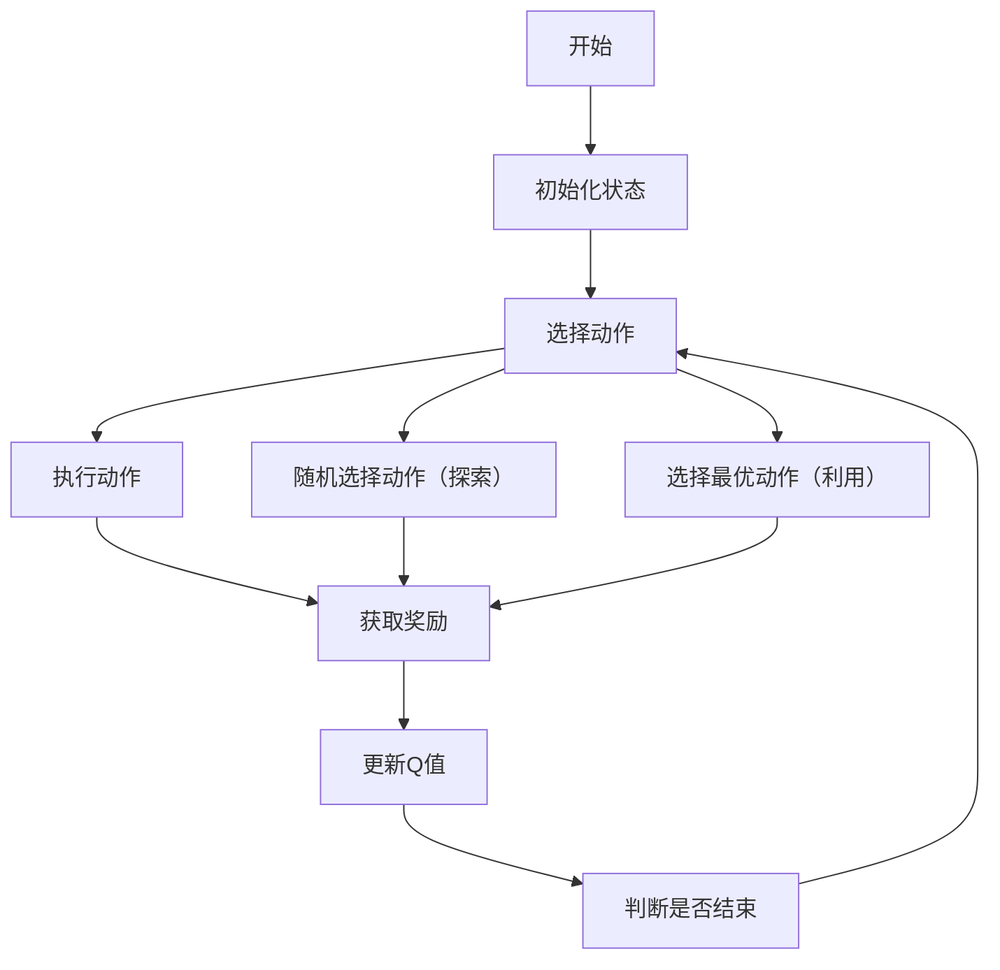

                 


# 实现基于AI Agent的智能家居控制系统

> 关键词：智能家居，AI Agent，强化学习，系统架构，物联网

> 摘要：本文详细探讨了基于AI Agent的智能家居控制系统的实现，从背景介绍到系统架构设计，从算法原理到项目实战，全面解析了AI Agent在智能家居中的应用。通过本文，读者可以深入了解AI Agent的核心概念、算法原理和系统实现，掌握智能家居控制系统的开发技能。

---

# 第一部分: 基于AI Agent的智能家居控制系统背景与概念

## 第1章: 智能家居控制系统概述

### 1.1 智能家居的发展历程

#### 1.1.1 从传统家居到智能家居的演变

智能家居的概念起源于20世纪90年代，随着物联网（IoT）技术的发展，智能家居逐步从概念走向现实。传统的家居设备通过简单的电气控制实现基本功能，而智能家居则通过网络通信和智能设备的协同工作，实现了家居设备的智能化控制。

智能家居的发展经历了以下几个阶段：
1. **单一设备智能化阶段**：单个设备（如智能灯泡）通过Wi-Fi或蓝牙连接到手机APP，实现远程控制。
2. **局部联动阶段**：多个设备通过智能家居中枢（如智能音箱、智能插座）实现联动控制，例如通过语音指令同时开启多个设备。
3. **全屋智能化阶段**：整个家居系统实现全面智能化，设备之间通过物联网平台协同工作，数据共享，智能决策。

#### 1.1.2 当前智能家居的发展现状

当前，智能家居已经进入快速发展阶段。市场上涌现出多种智能家居产品和解决方案，例如：
- **智能音箱**：如亚马逊的Alexa、谷歌的Google Home、苹果的Siri，通过语音交互实现家居设备的控制。
- **智能家电**：如智能空调、智能冰箱、智能洗衣机，通过物联网技术实现远程控制和自动化运行。
- **智能安防**：如智能门锁、智能摄像头、智能报警系统，通过AI技术实现智能监控和报警。
- **智能照明**：如智能灯泡、智能灯带，通过智能家居中枢实现情景模式控制。

#### 1.1.3 智能家居的未来趋势

未来的智能家居将朝着以下几个方向发展：
1. **更加智能化**：AI Agent将取代传统的规则引擎，实现更智能的设备控制和场景切换。
2. **更加个性化**：通过AI学习用户的习惯和偏好，提供个性化的家居体验。
3. **更加集成化**：智能家居系统将与智慧城市、智能社区无缝对接，形成完整的智能化生态系统。

### 1.2 AI Agent的基本概念

#### 1.2.1 什么是AI Agent

AI Agent（人工智能代理）是一种能够感知环境、自主决策并执行任务的智能实体。AI Agent的核心特征包括：
- **自主性**：能够在没有外部干预的情况下自主完成任务。
- **反应性**：能够实时感知环境并做出反应。
- **目标导向性**：基于目标进行决策和行动。

AI Agent在智能家居中的应用非常广泛，例如：
- **智能音箱**：通过语音交互实现设备控制。
- **智能助手**：通过AI算法优化家居设备的运行效率。
- **智能安防**：通过AI Agent实现智能监控和报警。

#### 1.2.2 AI Agent的核心特征

AI Agent的核心特征包括：
1. **感知能力**：能够感知环境中的信息，例如通过传感器获取温度、湿度等数据。
2. **决策能力**：基于感知到的信息，通过算法进行决策，例如通过强化学习算法优化设备的运行策略。
3. **执行能力**：根据决策结果执行具体的动作，例如通过智能插座开启或关闭设备。

#### 1.2.3 AI Agent与传统控制系统的区别

传统的控制系统通常基于固定的规则和逻辑，例如通过预设的程序实现设备的开启和关闭。而AI Agent能够通过学习和适应环境的变化，实现更智能的控制。

### 1.3 基于AI Agent的智能家居控制系统

#### 1.3.1 系统的核心目标

基于AI Agent的智能家居控制系统的核心目标是实现家居设备的智能化控制，通过AI算法优化设备的运行效率，提升用户的使用体验。

#### 1.3.2 系统的组成部分

基于AI Agent的智能家居控制系统通常由以下几个部分组成：
1. **感知层**：包括各种传感器和设备，用于感知环境信息。
2. **决策层**：AI Agent通过算法对感知到的信息进行分析和决策。
3. **执行层**：根据决策结果执行具体的动作，例如开启或关闭设备。

#### 1.3.3 系统的主要功能

基于AI Agent的智能家居控制系统的主要功能包括：
1. **设备控制**：通过AI Agent实现家居设备的智能化控制。
2. **情景模式**：根据用户的需求和环境的变化，自动切换不同的情景模式。
3. **智能优化**：通过AI算法优化设备的运行策略，提升能源利用效率。

### 1.4 本章小结

本章介绍了智能家居控制系统的发展历程、核心概念和系统组成。通过本章的学习，读者可以了解AI Agent在智能家居中的重要性，以及智能家居控制系统的基本结构和功能。

---

## 第2章: AI Agent的核心原理

### 2.1 AI Agent的感知与决策机制

#### 2.1.1 感知层的实现

AI Agent的感知层通过各种传感器和设备获取环境信息，例如：
- **温度传感器**：用于获取室内外温度信息。
- **湿度传感器**：用于获取空气湿度信息。
- **光照传感器**：用于获取室内光照强度信息。

#### 2.1.2 决策层的算法

AI Agent的决策层通过算法对感知到的信息进行分析和决策，常用的算法包括：
- **强化学习算法**：通过奖励机制优化决策策略。
- **监督学习算法**：通过标注数据训练模型，实现分类和回归任务。
- **无监督学习算法**：通过聚类分析等技术发现数据中的隐藏模式。

#### 2.1.3 执行层的控制逻辑

AI Agent的执行层根据决策结果执行具体的动作，例如：
- **开启或关闭设备**：通过智能插座或继电器控制设备的电源。
- **调节设备参数**：例如通过智能空调调节温度和风速。

### 2.2 基于强化学习的AI Agent

#### 2.2.1 强化学习的基本原理

强化学习是一种机器学习技术，通过智能体与环境的交互，学习最优策略。强化学习的核心要素包括：
- **状态（State）**：环境当前的状况，例如室内外温度、湿度等。
- **动作（Action）**：智能体可以执行的动作，例如开启或关闭设备。
- **奖励（Reward）**：智能体执行动作后获得的反馈，用于优化决策策略。

#### 2.2.2 在智能家居中的应用

强化学习在智能家居中的应用非常广泛，例如：
- **智能空调**：通过强化学习算法优化温度调节策略，提升能源利用效率。
- **智能照明**：通过强化学习算法优化照明模式，例如在光线不足时自动开启灯光。

#### 2.2.3 实例分析

以下是一个强化学习在智能空调中的应用实例：
- **状态空间**：室内外温度、湿度等。
- **动作空间**：开启或关闭空调、调节温度和风速。
- **奖励机制**：当室内温度接近目标温度时，智能体获得正奖励；当室内温度偏离目标温度时，智能体获得负奖励。

### 2.3 多智能体协作机制

#### 2.3.1 多智能体系统的定义

多智能体系统是指由多个智能体组成的系统，智能体之间通过协作完成共同目标。

#### 2.3.2 协作机制的实现

多智能体协作机制的实现可以通过以下几种方式：
- **分布式决策**：每个智能体独立决策，通过通信协议实现协作。
- **集中式决策**：由一个中心智能体统一决策，其他智能体执行决策结果。

#### 2.3.3 实际案例分析

以下是一个多智能体协作在智能家居中的应用实例：
- **系统组成**：智能音箱、智能空调、智能灯泡、智能插座。
- **协作机制**：当用户发出语音指令“开启空调并调至26度”，智能音箱作为中枢智能体，向空调发送开启指令，并通过智能插座关闭其他设备。

### 2.4 本章小结

本章详细讲解了AI Agent的核心原理，包括感知与决策机制、基于强化学习的AI Agent以及多智能体协作机制。通过本章的学习，读者可以理解AI Agent在智能家居中的具体实现方式。

---

## 第3章: 系统架构与设计方案

### 3.1 系统架构设计

#### 3.1.1 系统整体架构

基于AI Agent的智能家居控制系统通常采用分层架构，包括：
- **感知层**：通过传感器和设备获取环境信息。
- **决策层**：通过AI算法对感知信息进行分析和决策。
- **执行层**：根据决策结果执行具体的动作。

#### 3.1.2 系统组成部分

系统的主要组成部分包括：
1. **智能终端**：包括智能音箱、智能灯泡、智能插座等设备。
2. **AI Agent中枢**：负责接收感知信息、进行决策和下发指令。
3. **物联网平台**：用于设备间的通信和数据共享。

#### 3.1.3 系统的可扩展性

系统设计时需要考虑扩展性，例如通过模块化设计方便添加新的设备和功能。

### 3.2 功能模块设计

#### 3.2.1 用户交互模块

用户交互模块是用户与系统之间的接口，支持多种交互方式：
- **语音交互**：通过智能音箱实现语音指令的接收和执行。
- **手机APP**：通过手机APP实现设备的远程控制和状态查询。

#### 3.2.2 数据采集模块

数据采集模块负责采集环境信息，例如：
- **温度传感器**：采集室内外温度信息。
- **湿度传感器**：采集空气湿度信息。

#### 3.2.3 AI Agent控制模块

AI Agent控制模块负责对感知信息进行分析和决策，例如：
- **智能空调**：根据室内温度和用户习惯，自动调节空调运行状态。

### 3.3 系统接口设计

#### 3.3.1 标准接口定义

系统接口设计需要遵循标准协议，例如：
- **HTTP API**：用于设备间的通信和数据共享。
- **MQTT协议**：用于实时数据的传输和发布。

#### 3.3.2 接口的实现方式

系统接口的实现可以通过以下方式：
- **RESTful API**：通过HTTP协议实现设备间的通信。
- **WebSocket**：通过实时通信协议实现设备间的实时交互。

#### 3.3.3 接口的安全性考虑

系统接口设计时需要考虑安全性，例如通过加密通信和身份验证防止未经授权的访问。

### 3.4 本章小结

本章详细讲解了基于AI Agent的智能家居控制系统的架构设计和功能模块设计。通过本章的学习，读者可以了解系统设计的基本原则和实现方式。

---

## 第4章: 算法原理与数学模型

### 4.1 强化学习的基本原理

#### 4.1.1 状态值函数

状态值函数$V(s)$表示在状态$s$下，智能体能够获得的最大累积奖励。其数学表达式为：
$$ V(s) = \max_a Q(s,a) $$

其中，$a$表示可能的动作，$Q(s,a)$表示动作值函数。

#### 4.1.2 动作值函数

动作值函数$Q(s,a)$表示在状态$s$下执行动作$a$能够获得的最大累积奖励。其数学表达式为：
$$ Q(s,a) = r + \gamma \max_{a'} Q(s',a') $$

其中，$r$表示即时奖励，$\gamma$表示折扣因子，$s'$表示执行动作$a$后的新状态。

#### 4.1.3 奖励机制

奖励机制是强化学习的核心，通过设计合理的奖励函数，可以引导智能体学习最优策略。例如：
- **正向奖励**：当智能体完成目标时，给予正向奖励。
- **负向奖励**：当智能体偏离目标时，给予负向奖励。

### 4.2 算法实现的数学模型

#### 4.2.1 状态值函数的公式

状态值函数的公式为：
$$ V(s) = \max_a Q(s,a) $$

#### 4.2.2 动作值函数的公式

动作值函数的公式为：
$$ Q(s,a) = r + \gamma \max_{a'} Q(s',a') $$

### 4.3 算法实现的流程图



---

## 第5章: 项目实战

### 5.1 环境配置

#### 5.1.1 系统需求

系统需求包括：
- **硬件设备**：智能音箱、智能灯泡、智能插座、传感器等。
- **软件环境**：安装必要的开发工具和SDK，例如Python、TensorFlow、Raspberry Pi等。

#### 5.1.2 开发工具

开发工具包括：
- **Python编程语言**：用于算法实现。
- **TensorFlow框架**：用于深度学习模型的训练。
- **Raspberry Pi**：用于设备的控制和数据采集。

### 5.2 核心代码实现

#### 5.2.1 强化学习算法实现

以下是基于强化学习的AI Agent代码实现：

```python
import random
import numpy as np

class AIAgent:
    def __init__(self, state_space, action_space):
        self.state_space = state_space
        self.action_space = action_space
        self.Q = np.zeros((state_space, action_space))

    def act(self, state, epsilon=0.1):
        if random.random() < epsilon:
            return random.randint(0, self.action_space-1)
        else:
            return np.argmax(self.Q[state])

    def update(self, state, action, reward, next_state, gamma=0.99):
        self.Q[state, action] += reward + gamma * np.max(self.Q[next_state])
```

#### 5.2.2 系统交互实现

以下是系统交互的代码实现：

```python
import paho.mqtt.client as mqtt

class SystemInterface:
    def __init__(self, broker='localhost'):
        self.broker = broker
        self.client = mqtt.Client()

    def on_connect(self, mqttc, obj, flags, rc):
        print("Connected with result code "+str(rc))

    def on_message(self, mqttc, obj, msg):
        print("Received message: "+msg.payload.decode())

    def connect(self):
        self.client.on_connect = self.on_connect
        self.client.on_message = self.on_message
        self.client.connect(self.broker)
        self.client.loop_start()

    def publish(self, topic, payload):
        self.client.publish(topic, payload)
```

### 5.3 测试与优化

#### 5.3.1 系统测试

系统测试包括：
- **功能测试**：测试系统的基本功能，例如设备的开启和关闭。
- **性能测试**：测试系统的响应速度和稳定性。
- **安全性测试**：测试系统的安全性，例如防止未经授权的访问。

#### 5.3.2 系统优化

系统优化包括：
- **算法优化**：通过改进算法提升系统的运行效率。
- **硬件优化**：通过升级硬件提升系统的性能。
- **软件优化**：通过优化软件架构提升系统的可扩展性和可维护性。

### 5.4 本章小结

本章通过实际项目案例，详细讲解了基于AI Agent的智能家居控制系统的环境配置、核心代码实现和测试优化过程。通过本章的学习，读者可以掌握系统开发的基本技能。

---

## 第6章: 最佳实践与注意事项

### 6.1 最佳实践

#### 6.1.1 系统设计

- **模块化设计**：通过模块化设计提升系统的可扩展性和可维护性。
- **标准化接口**：通过标准化接口设计方便系统的扩展和集成。

#### 6.1.2 系统实现

- **代码规范**：通过遵循代码规范提升代码的可读性和可维护性。
- **测试用例**：通过编写全面的测试用例提升系统的稳定性。

### 6.2 注意事项

#### 6.2.1 系统安全性

- **数据加密**：通过数据加密技术防止数据泄露。
- **身份验证**：通过身份验证技术防止未经授权的访问。

#### 6.2.2 系统维护

- **定期更新**：定期更新系统软件和固件，防止系统漏洞。
- **日志记录**：通过日志记录系统运行状态，方便故障排查。

### 6.3 拓展阅读

- **强化学习**：深入学习强化学习的原理和应用。
- **多智能体协作**：研究多智能体协作的算法和实现方式。
- **智能家居标准**：了解智能家居相关的行业标准和规范。

---

## 第7章: 总结与展望

### 7.1 本章小结

本文详细探讨了基于AI Agent的智能家居控制系统的实现，从背景介绍到系统架构设计，从算法原理到项目实战，全面解析了AI Agent在智能家居中的应用。通过本文，读者可以深入了解AI Agent的核心概念、算法原理和系统实现，掌握智能家居控制系统的开发技能。

### 7.2 未来展望

未来，基于AI Agent的智能家居控制系统将朝着以下几个方向发展：
1. **更加智能化**：AI Agent将取代传统的规则引擎，实现更智能的设备控制和场景切换。
2. **更加个性化**：通过AI学习用户的习惯和偏好，提供个性化的家居体验。
3. **更加集成化**：智能家居系统将与智慧城市、智能社区无缝对接，形成完整的智能化生态系统。

---

## 作者信息

作者：AI天才研究院/AI Genius Institute & 禅与计算机程序设计艺术 /Zen And The Art of Computer Programming

