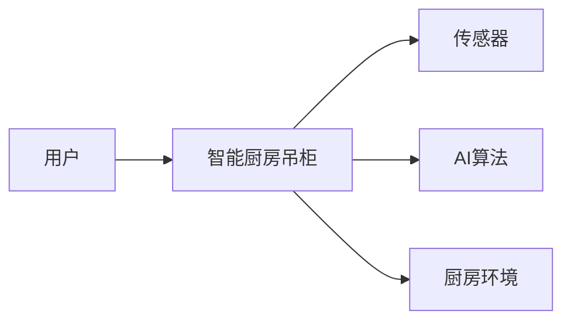
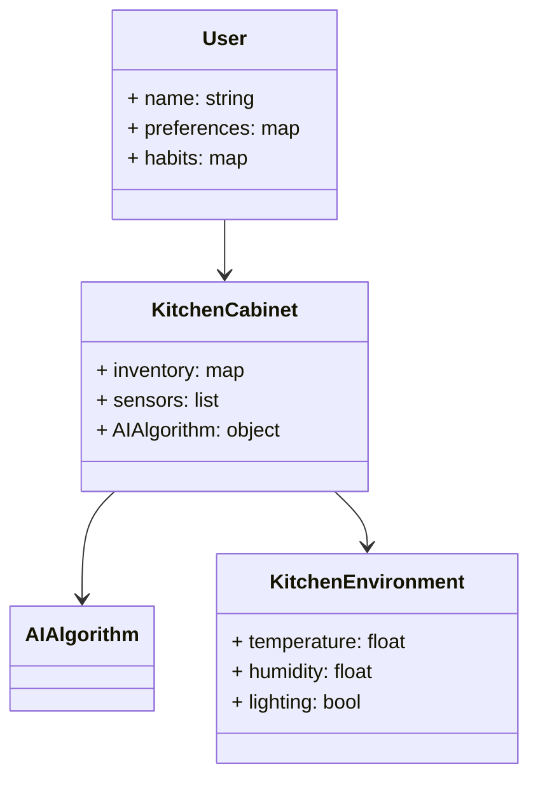
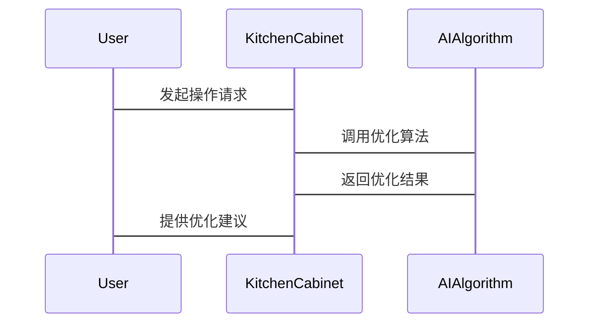
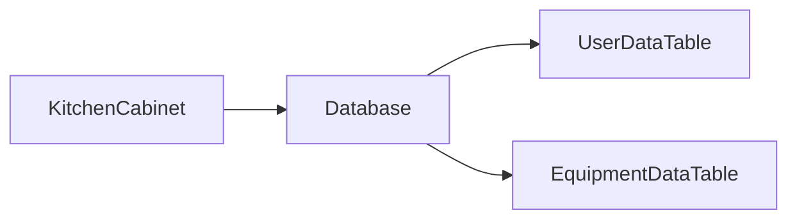

                 


# 智能厨房吊柜：AI Agent的厨房动线优化

---

## 关键词：
智能厨房吊柜, AI Agent, 厨房动线优化, 路径规划算法, 智能家居, 优化算法

---

## 摘要：
本文深入探讨了AI Agent技术在厨房场景中的应用，重点分析了智能厨房吊柜如何通过优化厨房动线提升用户体验。从背景介绍到算法原理，从系统架构到项目实战，本文全面解析了AI Agent在厨房动线优化中的技术细节和实现方案，为读者提供了一套完整的理论与实践框架。

---

# 第一部分: 智能厨房吊柜与AI Agent的背景与概念

# 第1章: 智能厨房吊柜与AI Agent概述

## 1.1 问题背景与目标

### 1.1.1 厨房动线优化的必要性
厨房动线优化是指通过合理规划厨房设备的布局和操作流程，减少无效移动，提高效率。传统厨房动线设计往往忽视用户的个性化需求和操作习惯，导致用户体验不佳。AI Agent的引入能够实时分析用户行为，动态调整厨房设备的使用顺序，从而实现真正的个性化优化。

### 1.1.2 智能厨房吊柜的定义与目标
智能厨房吊柜是一种集成AI技术的厨房设备，能够通过传感器和AI算法感知用户的操作习惯、食材库存以及厨房环境，主动提供优化的厨房动线建议。其目标是通过智能化的决策支持，帮助用户提高厨房操作效率，降低能耗，提升用户体验。

### 1.1.3 AI Agent在厨房场景中的应用价值
AI Agent在厨房场景中的应用价值体现在以下几个方面：
1. **个性化服务**：根据用户的习惯和偏好，提供定制化的厨房动线优化方案。
2. **实时反馈与调整**：通过实时感知厨房环境和用户行为，动态调整优化策略。
3. **数据驱动决策**：通过收集和分析大量数据，挖掘用户的潜在需求，提供更精准的服务。

## 1.2 核心概念与边界

### 1.2.1 AI Agent的定义与特征
AI Agent（智能体）是指能够感知环境、自主决策并采取行动以实现目标的智能系统。其核心特征包括：
- **自主性**：能够在没有外部干预的情况下自主运行。
- **反应性**：能够实时感知环境并做出响应。
- **目标导向性**：通过优化目标函数实现特定目标。

### 1.2.2 智能厨房吊柜的功能与边界
智能厨房吊柜的功能包括：
1. **食材管理**：实时监测食材库存，提醒用户补充食材。
2. **操作优化**：根据用户习惯和厨房环境，提供最优的厨房动线建议。
3. **设备协同**：与其他厨房设备（如冰箱、烤箱）联动，实现一体化操作。
其边界在于仅限于厨房场景，不涉及其他家庭场景。

### 1.2.3 问题解决的核心要素与组成
厨房动线优化的核心要素包括：
1. **用户行为数据**：用户的操作习惯、偏好等。
2. **设备状态数据**：厨房设备的实时状态，如吊柜门的开关状态。
3. **环境数据**：厨房的温度、湿度等环境参数。
4. **优化算法**：基于上述数据的路径规划和优化算法。

## 1.3 核心概念对比与联系

### 1.3.1 AI Agent与传统智能家居的对比
| 特性                | AI Agent                     | 传统智能家居               |
|---------------------|------------------------------|---------------------------|
| 自主性              | 高                           | 低                         |
| 反应性              | 强                           | 弱                         |
| 数据驱动            | 是                           | 否                         |

### 1.3.2 厨房动线优化的实体关系图


## 1.4 本章小结
通过本章的介绍，我们了解了智能厨房吊柜和AI Agent的基本概念、核心功能以及它们在厨房动线优化中的作用。接下来，我们将深入探讨AI Agent的核心算法及其在厨房场景中的实现。

---

# 第二部分: AI Agent的算法原理与技术实现

# 第2章: AI Agent的核心算法

## 2.1 AI Agent的路径规划算法

### 2.1.1 A*算法原理与流程
A*算法是一种常用的路径规划算法，其基本思想是通过评估节点的优先级，优先扩展具有较小评估值的节点。以下是A*算法的流程：

1. 初始化优先队列，将起点加入队列。
2. 取出队列中优先级最高的节点，判断是否为终点。
3. 如果是终点，返回路径；否则，扩展当前节点的所有邻居。
4. 对每个邻居节点，计算优先级，并将符合条件的节点加入队列。
5. 重复上述步骤，直到找到终点。

以下是一个简单的A*算法实现示例：

```python
import heapq

def a_star_search(grid, start, goal):
    open_set = {start}
    came_from = {}
    g_score = {start: 0}
    f_score = {start: heuristic(start, goal)}
    
    while open_set:
        current = heapq.heappop(open_set)
        if current == goal:
            return reconstruct_path(came_from, current)
        for neighbor in grid.get_neighbors(current):
            tentative_g_score = g_score.get(current) + distance(current, neighbor)
            if neighbor not in g_score or tentative_g_score < g_score[neighbor]:
                came_from[neighbor] = current
                g_score[neighbor] = tentative_g_score
                f_score[neighbor] = tentative_g_score + heuristic(neighbor, goal)
                heapq.heappush(open_set, neighbor)
    return None

def reconstruct_path(came_from, current):
    path = [current]
    while came_from.get(current) is not None:
        current = came_from[current]
        path.append(current)
    return path
```

### 2.1.2 算法实现代码示例
上述代码实现了A*算法的基本功能，包括优先队列的管理、路径的重建等。需要注意的是，`heuristic`函数需要根据具体场景进行定义，例如在厨房场景中，可以使用欧几里得距离作为启发函数。

### 2.1.3 算法的数学模型与公式
A*算法的核心在于优先级的评估，其优先级公式为：
$$f(n) = g(n) + h(n)$$
其中：
- \( g(n) \) 是从起点到当前节点 \( n \) 的实际成本。
- \( h(n) \) 是从当前节点 \( n \) 到终点的估计成本（启发函数）。

---

## 2.2 基于强化学习的优化策略

### 2.2.1 强化学习的基本原理
强化学习是一种机器学习范式，通过智能体与环境的交互，学习最优策略。其核心是通过试错的方式，逐步优化智能体的决策能力。

### 2.2.2 厨房动线优化的强化学习模型
在厨房动线优化中，强化学习模型可以将厨房设备的布局和用户的操作习惯作为输入，输出最优的操作顺序。以下是强化学习模型的基本结构：

1. **状态空间**：厨房设备的布局、用户的操作习惯等。
2. **动作空间**：设备的操作顺序。
3. **奖励函数**：根据优化效果给予奖励。

### 2.2.3 基于强化学习的优化代码示例
以下是一个简单的强化学习框架代码：

```python
class KitchenAgent:
    def __init__(self, state_space, action_space):
        self.state_space = state_space
        self.action_space = action_space
        self.model = self.build_model()
    
    def build_model(self):
        # 构建强化学习模型
        pass
    
    def act(self, state):
        # 根据当前状态选择动作
        pass
    
    def remember(self, state, action, reward, next_state):
        # 记忆经验
        pass
    
    def replay(self, batch_size):
        # 回放经验
        pass
    
    def train(self):
        # 训练模型
        pass
```

---

## 2.3 算法的优化与实现

### 2.3.1 算法的优化策略
为了提高算法的效率，可以采用以下优化策略：
1. **启发式搜索**：通过改进启发函数，减少搜索空间。
2. **并行计算**：利用多线程或分布式计算加速算法的执行。
3. **动态规划**：通过记录中间结果，避免重复计算。

### 2.3.2 算法实现中的注意事项
在实际实现中，需要注意以下几点：
1. **数据预处理**：确保输入数据的格式和维度符合算法要求。
2. **模型调参**：根据具体场景调整算法参数，如学习率、动量等。
3. **性能优化**：通过代码优化和算法改进，提高运行效率。

---

## 2.4 本章小结
通过本章的介绍，我们了解了AI Agent在厨房动线优化中的核心算法，包括A*算法和强化学习模型的实现。接下来，我们将从系统架构的角度，深入探讨智能厨房吊柜的实现方案。

---

# 第三部分: 智能厨房吊柜的系统架构与实现

# 第3章: 系统分析与架构设计

## 3.1 项目背景与需求分析

### 3.1.1 项目背景
智能厨房吊柜的开发旨在通过AI技术优化厨房动线，提高用户体验。

### 3.1.2 需求分析
根据用户需求，系统需要实现以下功能：
1. **食材管理**：实时监测食材库存，提醒用户补充食材。
2. **操作优化**：根据用户习惯和厨房环境，提供最优的厨房动线建议。
3. **设备协同**：与其他厨房设备联动，实现一体化操作。

## 3.2 系统功能设计

### 3.2.1 领域模型图
以下是智能厨房吊柜的领域模型图：



### 3.2.2 系统架构图
以下是系统的架构图：

```mermaid
graph TD
    User --> API Gateway
    API Gateway --> KitchenCabinet
    KitchenCabinet --> AIAlgorithm
    AIAlgorithm --> Database
    Database --> Report
```

### 3.2.3 接口设计
系统需要实现以下接口：
1. **用户接口**：用于接收用户的操作指令和反馈。
2. **设备接口**：用于与厨房设备进行通信。
3. **数据接口**：用于与数据库进行交互。

### 3.2.4 交互流程
以下是系统的交互流程图：



## 3.3 系统实现细节

### 3.3.1 系统功能实现
以下是系统功能实现的关键代码：

```python
class KitchenCabinet:
    def __init__(self, inventory, sensors):
        self.inventory = inventory
        self.sensors = sensors
        self.ai_algorithm = AIAlgorithm()
    
    def optimize_workflow(self, user_input):
        # 调用AI算法进行优化
        optimized_workflow = self.ai_algorithm.optimize(user_input)
        return optimized_workflow
```

### 3.3.2 数据存储与管理
系统需要实现对用户数据和设备数据的存储与管理，以下是数据库设计：



---

## 3.4 本章小结
通过本章的系统架构设计，我们了解了智能厨房吊柜的整体实现方案，包括系统功能设计、架构图、接口设计和交互流程。接下来，我们将从项目实战的角度，详细讲解如何实现智能厨房吊柜的优化功能。

---

# 第四部分: 智能厨房吊柜的项目实战

# 第4章: 项目实战与实现

## 4.1 环境搭建与工具安装

### 4.1.1 开发环境
建议使用以下开发环境：
1. **操作系统**：Windows/Mac/Linux
2. **编程语言**：Python 3.8+
3. **开发工具**：PyCharm/VS Code
4. **依赖库**：TensorFlow, NumPy, Pandas, Mermaid

### 4.1.2 工具安装
安装以下工具：
1. **Python**：从官网下载安装。
2. **Jupyter Notebook**：用于数据可视化。
3. **Mermaid CLI**：用于生成图表。

## 4.2 核心功能实现

### 4.2.1 基于A*算法的路径规划
以下是基于A*算法的路径规划代码：

```python
def heuristic(a, b):
    return abs(a.x - b.x) + abs(a.y - b.y)

def a_star_search(grid, start, goal):
    open_set = {start}
    came_from = {}
    g_score = {start: 0}
    f_score = {start: heuristic(start, goal)}
    
    while open_set:
        current = heapq.heappop(open_set)
        if current == goal:
            return reconstruct_path(came_from, current)
        for neighbor in grid.get_neighbors(current):
            tentative_g_score = g_score.get(current) + grid.cost(current, neighbor)
            if neighbor not in g_score or tentative_g_score < g_score[neighbor]:
                came_from[neighbor] = current
                g_score[neighbor] = tentative_g_score
                f_score[neighbor] = tentative_g_score + heuristic(neighbor, goal)
                heapq.heappush(open_set, neighbor)
    return None

def reconstruct_path(came_from, current):
    path = [current]
    while came_from.get(current) is not None:
        current = came_from[current]
        path.append(current)
    return path
```

### 4.2.2 基于强化学习的优化策略
以下是基于强化学习的优化策略代码：

```python
class Agent:
    def __init__(self, state_space, action_space):
        self.state_space = state_space
        self.action_space = action_space
        self.model = self.build_model()
    
    def build_model(self):
        # 构建神经网络模型
        pass
    
    def act(self, state):
        # 根据当前状态选择动作
        pass
    
    def remember(self, state, action, reward, next_state):
        # 记忆经验
        pass
    
    def replay(self, batch_size):
        # 回放经验
        pass
    
    def train(self):
        # 训练模型
        pass
```

### 4.2.3 代码实现与解读
以下是代码实现的详细解读：
1. **路径规划算法**：通过A*算法实现最优路径规划。
2. **强化学习模型**：通过强化学习算法优化厨房动线。

## 4.3 实际案例分析与实现

### 4.3.1 案例分析
以一个简单的厨房场景为例，假设厨房中有吊柜、冰箱和水槽三种设备，用户需要完成洗菜、切菜和烹饪三个步骤。

### 4.3.2 算法实现
以下是算法实现的详细步骤：
1. **数据采集**：采集用户的操作习惯和厨房设备的状态。
2. **路径规划**：通过A*算法规划最优路径。
3. **强化学习优化**：通过强化学习进一步优化路径。

## 4.4 本章小结
通过本章的项目实战，我们详细讲解了智能厨房吊柜的核心功能实现，包括路径规划算法和强化学习模型的实现。接下来，我们将从最佳实践的角度，总结经验教训。

---

# 第五部分: 智能厨房吊柜的最佳实践

# 第5章: 最佳实践与经验总结

## 5.1 小结

### 5.1.1 核心技术总结
智能厨房吊柜的核心技术包括：
1. **AI Agent技术**：实现智能决策。
2. **路径规划算法**：优化厨房动线。
3. **强化学习模型**：进一步优化操作流程。

### 5.1.2 实现难点总结
实现过程中的主要难点包括：
1. **算法优化**：如何提高算法的效率。
2. **设备协同**：如何实现设备之间的协同操作。
3. **用户体验**：如何提高用户体验。

## 5.2 注意事项

### 5.2.1 开发注意事项
1. **数据预处理**：确保数据的准确性和完整性。
2. **算法调优**：根据具体场景调整算法参数。
3. **系统测试**：进行全面的系统测试，确保系统的稳定性和可靠性。

### 5.2.2 用户使用注意事项
1. **数据隐私**：保护用户的隐私数据。
2. **系统维护**：定期更新系统和算法模型。
3. **用户培训**：对用户进行培训，提高用户的使用效率。

## 5.3 拓展阅读

### 5.3.1 相关技术
1. **强化学习**：进一步学习强化学习的相关技术。
2. **路径规划算法**：学习更多路径规划算法，如遗传算法、蚁群算法等。

### 5.3.2 应用场景
1. **智能家居**：智能厨房吊柜是智能家居的重要组成部分。
2. **工业自动化**：AI Agent技术可以应用于工业自动化领域。

---

## 作者：AI天才研究院/AI Genius Institute & 禅与计算机程序设计艺术 /Zen And The Art of Computer Programming

