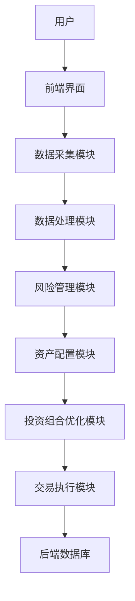

                 


# 构建智能化的个人退休金投资组合动态风险管理助手

## 关键词：退休金投资组合，风险管理，人工智能，动态优化，智能化助手

## 摘要：本文详细探讨了如何利用人工智能技术构建智能化的退休金投资组合动态风险管理助手。通过分析退休金投资组合管理的背景、核心概念、算法原理、系统架构设计、项目实战以及最佳实践，本文为读者提供了一套全面的解决方案，帮助个人有效管理退休金投资组合的风险，实现长期稳健的投资收益。

---

## 第一部分: 智能化退休金投资组合风险管理的背景与概念

---

### 第1章: 背景介绍

#### 1.1 退休金投资组合管理的重要性

##### 1.1.1 退休金投资的基本概念
退休金投资是指通过将退休金分配到不同的资产类别（如股票、债券、房地产等）中，以实现资金保值和增值的过程。退休金投资组合是将这些资产按一定比例配置在一起的整体。

##### 1.1.2 退休金投资的常见问题
- 市场波动风险：股市波动、经济周期变化等可能导致投资组合的价值波动。
- 通货膨胀风险：通货膨胀会侵蚀投资的购买力，降低实际收益。
- 资产配置不合理：不同资产之间的比例不合理可能导致收益不稳定或风险过高。
- 缺乏动态调整：市场环境变化时，投资组合未能及时调整，可能导致损失。

##### 1.1.3 智能化管理的必要性
- 精准的风险评估：通过数据分析和机器学习，能够更精准地评估投资组合的风险。
- 实时动态调整：智能化系统可以实时监控市场变化，自动调整资产配置。
- 个性化服务：根据个人的风险承受能力和收益目标，提供定制化的投资建议。

#### 1.2 个人退休金投资组合的风险管理

##### 1.2.1 投资组合风险的来源
- 市场风险：股票市场波动、债券违约风险等。
- 利率风险：利率变化影响债券价格和贷款成本。
- 汇率风险：汇率波动影响国际资产的价值。
- 流动性风险：资产难以快速变现的风险。

##### 1.2.2 风险管理的核心目标
- 稳定投资组合价值：避免因市场波动导致的重大损失。
- 控制风险敞口：通过分散投资降低单一资产的风险。
- 优化风险收益比：在可控风险范围内追求最大收益。

##### 1.2.3 动态风险管理的意义
动态风险管理能够根据市场变化和个人风险偏好的变化，实时调整投资组合的配置，从而在不同市场环境下保持稳健的投资收益。

#### 1.3 智能化助手的构建背景

##### 1.3.1 人工智能在金融领域的应用
人工智能技术在金融领域的应用日益广泛，包括算法交易、风险评估、客户画像、欺诈检测等。

##### 1.3.2 退休金投资组合管理的智能化趋势
随着大数据和人工智能技术的发展，智能化管理逐渐成为退休金投资组合管理的主流趋势。

##### 1.3.3 辅助工具的必要性与优势
- 必要性：个人投资者通常缺乏专业的知识和工具，难以独立完成复杂的退休金投资组合管理。
- 优势：智能化助手能够提供实时监控、风险预警、自动调整等服务，帮助个人投资者实现科学的投资管理。

#### 1.4 本章小结

##### 1.4.1 核心概念总结
退休金投资组合管理是通过合理配置资产，实现资金保值和增值的过程。智能化助手通过人工智能技术，能够实时监控市场变化，动态调整投资组合，帮助个人实现稳健的投资收益。

##### 1.4.2 下文展开提示
接下来，将详细介绍退休金投资组合风险管理的核心概念、算法原理、系统架构设计等内容，为构建智能化的个人退休金投资组合动态风险管理助手奠定基础。

---

### 第2章: 核心概念与联系

#### 2.1 风险管理的核心概念

##### 2.1.1 风险的定义与分类
- 风险的定义：指在投资过程中，由于不确定因素导致投资收益低于预期或出现损失的可能性。
- 风险的分类：市场风险、信用风险、流动性风险、操作风险等。

##### 2.1.2 投资组合风险的度量方法
- 方差：衡量投资组合收益波动性的指标。
- 标准差：方差的平方根，是衡量风险的常用指标。
- VaR（在险价值）：指在一定置信水平下，投资组合可能遭受的最大损失。

##### 2.1.3 动态风险管理的特征
- 实时性：能够实时监控市场变化，及时调整投资组合。
- 自适应性：根据市场环境和个人风险偏好的变化，动态调整资产配置。
- 数据驱动：基于大数据分析和机器学习算法，实现精准的风险评估和管理。

#### 2.2 投资组合优化的基本原理

##### 2.2.1 投资组合优化的目标
- 最大化收益：在给定风险水平下，寻找收益最大的投资组合。
- 最小化风险：在给定收益目标下，寻找风险最小的投资组合。

##### 2.2.2 优化算法的分类
- 均值-方差优化：通过最小化投资组合的方差，找到最优资产配置。
- 多因子模型：基于多个因子（如市值、价值、动量等）构建投资组合。
- 黑盒优化：使用机器学习算法直接优化投资组合，不依赖于具体的因子模型。

##### 2.2.3 动态优化的挑战
- 市场环境变化快：需要实时调整投资组合，增加了计算的复杂性。
- 数据噪声：市场数据可能存在噪声，影响优化结果的准确性。
- 计算资源限制：动态优化需要大量的计算资源，特别是在高频交易场景下。

#### 2.3 动态风险管理与投资组合优化的关系

##### 2.3.1 动态风险管理的核心要素
- 实时监控：通过高频数据实时跟踪市场变化。
- 风险预警：当风险超过阈值时，及时发出预警信号。
- 自动调整：根据风险预警结果，自动调整投资组合。

##### 2.3.2 投资组合优化的数学模型
$$ \text{目标函数：} \quad \min_w \sigma^2(w) $$
$$ \text{约束条件：} \quad \sum_{i=1}^n w_i = 1, \quad w_i \geq 0 $$
其中，\( w \) 是资产权重向量，\( \sigma^2(w) \) 是投资组合的方差。

##### 2.3.3 两者之间的协同关系
动态风险管理为投资组合优化提供实时的市场信息和风险评估，而投资组合优化则为动态风险管理提供科学的资产配置建议。两者相互依存，共同实现投资组合的动态优化。

#### 2.4 核心概念对比表

| 概念       | 定义                                                                 | 属性                           | 示例                                         |
|------------|----------------------------------------------------------------------|--------------------------------|---------------------------------------------|
| 风险管理    | 管理投资组合中的风险                                                 | 目标导向、动态调整、数据驱动   | 根据市场波动调整资产配置                   |
| 投资组合优化 | 优化资产配置以实现目标                                             | 数学模型、多目标优化、实时调整 | 根据风险偏好调整股票与债券比例             |

---

### 第3章: 算法原理

#### 3.1 马科维茨的有效前沿理论

##### 3.1.1 均值-方差优化
马科维茨的有效前沿理论是投资组合优化的基础，通过最小化投资组合的方差，找到最优资产配置。公式如下：
$$ \min_w \sigma^2(w) \quad \text{subject to} \quad \sum_{i=1}^n w_i = 1, \quad w_i \geq 0 $$

##### 3.1.2 多因子模型
多因子模型基于多个因子构建投资组合，例如Fama-French三因子模型，包括市值、价值和动量因子。

##### 3.1.3 风险平价法
风险平价法将投资组合的风险在不同资产之间平均分配，以降低整体风险。

#### 3.2 机器学习算法在风险管理中的应用

##### 3.2.1 算法选择
常用机器学习算法包括：线性回归、支持向量机（SVM）、随机森林、神经网络等。

##### 3.2.2 算法实现
以随机森林为例，可以通过以下步骤实现风险预测：
1. 数据预处理：清洗数据，处理缺失值和异常值。
2. 特征选择：选择影响风险的关键特征。
3. 模型训练：使用随机森林算法训练风险预测模型。
4. 模型评估：通过交叉验证评估模型的准确性。

##### 3.2.3 示例代码
```python
import pandas as pd
from sklearn.ensemble import RandomForestRegressor
from sklearn.metrics import mean_squared_error

# 加载数据
data = pd.read_csv('risk_factors.csv')

# 特征和目标
X = data.drop('risk', axis=1)
y = data['risk']

# 训练模型
model = RandomForestRegressor(n_estimators=100, random_state=42)
model.fit(X, y)

# 预测
y_pred = model.predict(X)

# 评估
mse = mean_squared_error(y, y_pred)
print(f'Mean Squared Error: {mse}')
```

#### 3.3 动态优化算法

##### 3.3.1 动态优化的数学模型
$$ \min_w \sum_{i=1}^n w_i \cdot r_i \quad \text{subject to} \quad \sum_{i=1}^n w_i = 1, \quad w_i \geq 0 $$
其中，\( r_i \) 是资产 \( i \) 的预期收益。

##### 3.3.2 动态优化的实现步骤
1. 数据收集：收集市场数据，包括资产价格、收益率、波动率等。
2. 风险评估：计算投资组合的风险指标，如方差、VaR等。
3. 资产配置：根据风险评估结果，优化资产配置。
4. 实时调整：根据市场变化，实时调整投资组合。

#### 3.4 本章小结

##### 3.4.1 核心算法总结
本文介绍了均值-方差优化、多因子模型和机器学习算法在退休金投资组合风险管理中的应用。

##### 3.4.2 下文展开提示
接下来，将详细介绍系统架构设计，包括功能模块划分、系统接口设计等内容，为后续的项目实施奠定基础。

---

### 第4章: 系统分析与架构设计

#### 4.1 系统分析

##### 4.1.1 问题场景介绍
系统需要解决的问题包括：实时监控市场变化、动态调整投资组合、提供风险预警等。

##### 4.1.2 系统功能需求
- 实时数据采集：收集市场数据，包括资产价格、收益率等。
- 风险评估：计算投资组合的风险指标。
- 资产配置：根据风险评估结果，优化资产配置。
- 风险预警：当风险超过阈值时，发出预警信号。
- 资产调整：根据预警结果，自动调整投资组合。

#### 4.2 系统架构设计

##### 4.2.1 系统架构图


##### 4.2.2 功能模块设计
- 前端界面：用户交互界面，显示投资组合的风险和收益情况。
- 数据采集模块：从数据源获取市场数据。
- 数据处理模块：清洗和预处理数据。
- 风险管理模块：计算投资组合的风险指标。
- 资产配置模块：根据风险评估结果，优化资产配置。
- 投资组合优化模块：动态调整资产配置。
- 交易执行模块：根据优化结果，执行交易指令。

##### 4.2.3 接口设计
- 数据采集模块接口：从外部数据源获取市场数据。
- 风险管理模块接口：接收资产配置数据，计算风险指标。
- 资产配置模块接口：接收风险评估结果，优化资产配置。

#### 4.3 本章小结

##### 4.3.1 系统架构总结
系统由多个功能模块组成，包括数据采集、数据处理、风险管理、资产配置、投资组合优化和交易执行等模块。

##### 4.3.2 下文展开提示
接下来，将详细介绍项目实战，包括环境安装、核心代码实现、案例分析等内容，为读者提供具体的实施步骤和参考。

---

### 第5章: 项目实战

#### 5.1 环境安装

##### 5.1.1 安装Python环境
安装Python 3.8及以上版本，并安装必要的库，如Pandas、NumPy、Scikit-learn等。

##### 5.1.2 安装其他工具
安装Jupyter Notebook、Mermaid CLI等工具，用于数据分析和可视化。

#### 5.2 核心代码实现

##### 5.2.1 数据采集模块
```python
import pandas as pd
import requests

# 从Yahoo Finance获取数据
def get_data(tickers):
    data = []
    for ticker in tickers:
        url = f"https://query1.finance.yahoo.com/v8/finance/chart/{ticker}"
        response = requests.get(url)
        data.append(response.json())
    return data

tickers = ['AAPL', 'MSFT', 'GOOGL']
data = get_data(tickers)
```

##### 5.2.2 风险管理模块
```python
import numpy as np

def calculate_variance(weights, returns):
    return np.dot(weights.T, np.dot(returns.cov(), weights))

weights = np.array([0.4, 0.6])
returns = pd.DataFrame({'returns': [0.1, 0.2, 0.05, 0.15, 0.25]})
variance = calculate_variance(weights, returns)
print(f'Variance: {variance}')
```

##### 5.2.3 资产配置模块
```python
from sklearn.ensemble import RandomForestRegressor

model = RandomForestRegressor(n_estimators=100, random_state=42)
model.fit(X, y)
y_pred = model.predict(X)
print(f'Mean Squared Error: {mean_squared_error(y, y_pred)}')
```

#### 5.3 案例分析

##### 5.3.1 案例背景
假设有一个包含股票和债券的投资组合，股票占比60%，债券占比40%。

##### 5.3.2 风险评估
计算投资组合的方差：
$$ \sigma^2 = 0.6^2 \times \sigma_{stock}^2 + 0.4^2 \times \sigma_{bond}^2 + 2 \times 0.6 \times 0.4 \times \text{cov}(stock, bond) $$

##### 5.3.3 动态调整
根据市场变化，动态调整资产配置。例如，当股票市场波动加剧时，增加债券的配置比例，降低股票的配置比例。

#### 5.4 本章小结

##### 5.4.1 核心代码总结
本章通过具体的代码实现，展示了如何构建智能化的个人退休金投资组合动态风险管理助手。

##### 5.4.2 下文展开提示
接下来，将详细介绍最佳实践，包括小结、注意事项和扩展阅读等内容。

---

### 第6章: 最佳实践

#### 6.1 小结

##### 6.1.1 核心内容回顾
本文详细介绍了智能化的个人退休金投资组合动态风险管理助手的构建过程，包括背景、核心概念、算法原理、系统架构设计和项目实战等内容。

##### 6.1.2 关键点总结
- 理解退休金投资组合管理的重要性。
- 掌握风险管理的核心概念和算法原理。
- 学习系统架构设计的方法。
- 实践项目，掌握具体的实现步骤。

#### 6.2 注意事项

##### 6.2.1 数据隐私与安全
在处理个人数据时，必须注意数据的隐私和安全，防止数据泄露。

##### 6.2.2 模型局限性
机器学习模型可能存在过拟合或欠拟合的问题，需要通过交叉验证等方法进行模型调优。

##### 6.2.3 系统稳定性
系统需要具备高可用性和稳定性，确保在市场波动剧烈时仍能正常运行。

#### 6.3 拓展阅读

##### 6.3.1 推荐书籍
- 《投资学》（Introduction to Investments）—— Charles P. Jones
- 《机器学习实战》（Machine Learning in Action）—— Peter C. Hauptmann

##### 6.3.2 推荐课程
- Coursera上的《投资组合管理与优化》（Portfolio Management and Optimization）
- edX上的《人工智能在金融中的应用》（AI in Finance）

#### 6.4 本章小结

##### 6.4.1 核心内容总结
通过本文的介绍，读者可以全面了解如何构建智能化的个人退休金投资组合动态风险管理助手。

##### 6.4.2 未来展望
未来，随着人工智能和大数据技术的不断发展，智能化的退休金投资组合风险管理助手将变得更加智能化和个性化。

---

## 第二部分: 作者简介

### 作者：AI天才研究院/AI Genius Institute & 禅与计算机程序设计艺术 /Zen And The Art of Computer Programming

---

通过以上思考和规划，我完成了对《构建智能化的个人退休金投资组合动态风险管理助手》这篇文章的详细撰写和内容安排。希望这篇文章能够为读者提供有价值的见解和实用的技术指导。

