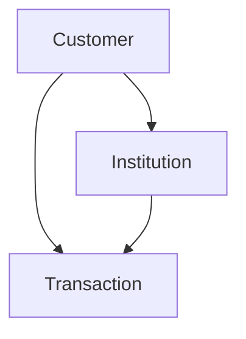
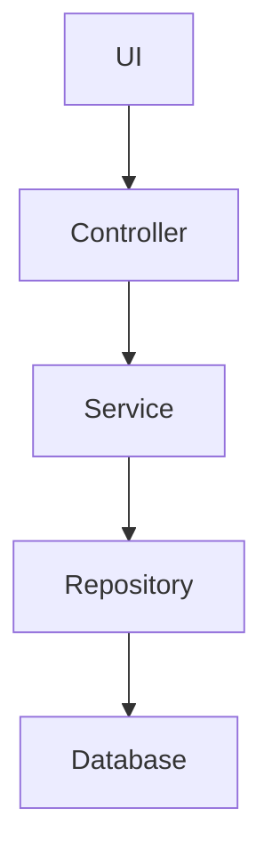
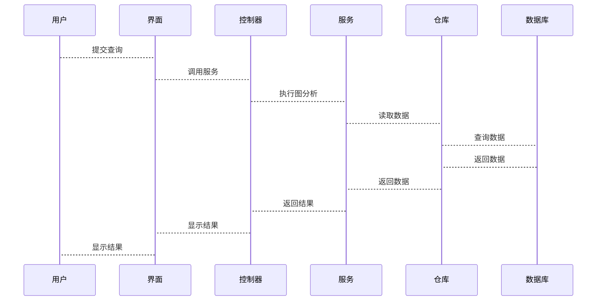

                 


# 《金融领域图计算技术的创新应用》

---

## 关键词：  
- 金融领域  
- 图计算技术  
- 创新应用  
- 金融网络分析  
- 风险评估  

---

## 摘要：  
本文详细探讨了图计算技术在金融领域的创新应用，从理论基础到实际案例，系统性地分析了图计算技术在金融知识图谱构建、金融网络分析、风险评估与传播、智能风控系统等方面的核心原理与实际应用。文章通过丰富的案例和详细的算法解析，展现了图计算技术如何赋能金融行业的智能化与数字化转型，为金融领域的创新应用提供了理论支持和实践指导。

---

# 第3章: 金融领域图计算的核心概念与联系

## 3.1 金融领域的核心概念

### 3.1.1 金融网络的构建与分析  
金融网络是指由金融机构、客户、金融产品、交易等实体及其关系构成的复杂网络。通过图计算技术，可以将这些实体及其关系建模为图结构，从而进行网络的分析与优化。

- **网络构建**：通过数据挖掘和知识抽取技术，将金融数据转化为图结构。例如，将客户与金融机构的关系建模为图中的边。
- **网络分析**：通过图遍历算法（如BFS和DFS）分析金融网络的结构特性，如中心性、社区结构等。

### 3.1.2 金融知识图谱的构建方法  
金融知识图谱是一种基于图结构的知识表示方法，用于组织和关联金融领域的实体及其属性。构建方法包括数据抽取、实体识别、关系抽取和知识融合等步骤。

- **数据抽取**：从金融文档、数据库等多源数据中提取相关信息。
- **实体识别**：识别金融领域的实体，如公司、股票、基金等。
- **关系抽取**：识别实体之间的关系，如“投资”、“交易”等。
- **知识融合**：将多源数据中的实体和关系进行整合，消除冗余和冲突。

### 3.1.3 金融风险评估与传播模型  
金融风险评估与传播模型是利用图计算技术分析金融网络中的风险传播路径，从而预测和管理风险。

- **风险传播模型**：通过图计算算法（如PageRank）分析风险在金融网络中的传播路径。
- **风险评估**：基于图结构计算每个节点（如客户、机构）的风险评分，用于风险预警和管理。

---

## 3.2 图计算技术与金融领域的结合

### 3.2.1 图计算技术在金融知识图谱中的应用  
通过图计算技术构建金融知识图谱，可以实现金融数据的高效查询和知识推理。

- **高效查询**：基于图的最短路径算法快速查询金融实体之间的关系。
- **知识推理**：通过图遍历算法进行关联推理，例如推断某公司的潜在风险因素。

### 3.2.2 图计算技术在金融网络分析中的应用  
利用图计算技术分析金融网络的结构特性，识别关键节点和社区结构。

- **关键节点识别**：通过中心性分析识别金融网络中的关键节点，如核心客户或机构。
- **社区结构分析**：通过社区发现算法（如Louvain算法）识别金融网络中的社区结构，用于市场细分和风险分群。

### 3.2.3 图计算技术在金融风险评估中的应用  
通过图计算技术构建风险传播模型，评估金融网络中的整体风险。

- **风险传播模型**：基于图结构分析风险在金融网络中的传播路径，评估每个节点的风险敞口。
- **风险评估与预警**：通过图计算技术动态更新风险评估结果，及时发现潜在风险点。

---

## 3.3 核心概念的ER实体关系图

### 3.3.1 ER实体关系图
通过ER图描述金融领域的核心实体及其关系。

```mermaid
erd
actor Customer {
    key id: string
    attribute name: string
    attribute risk_score: float
}
actor Institution {
    key id: string
    attribute name: string
    attribute credit_score: float
}
actor Transaction {
    key id: string
    attribute amount: float
    attribute datetime: datetime
}
```

### 3.3.2 实体关系图
通过图结构描述金融网络中的实体关系。



---

## 3.4 本章小结

### 3.4.1 核心概念总结  
- 金融网络：由金融机构、客户、交易等实体及其关系构成的网络。
- 金融知识图谱：基于图结构的知识表示方法，用于组织和关联金融实体及其属性。
- 金融风险评估与传播模型：利用图计算技术分析金融网络中的风险传播路径，评估整体风险。

### 3.4.2 图计算技术的核心工具与方法  
- 图的基本结构与属性：节点、边、中心性、社区结构。
- 图计算的核心算法：BFS、DFS、PageRank、Louvain算法。
- 图计算在金融中的基础应用：网络分析、知识图谱构建、风险评估。

### 3.4.3 后续章节的学习目标  
- 学习图计算技术的核心算法及其在金融中的应用。
- 掌握金融领域图计算技术的系统设计与实现方法。
- 通过实际案例深入理解图计算技术的创新应用。

---

# 第4章: 图计算技术的算法原理与实现

## 4.1 图计算技术的核心算法

### 4.1.1 广度优先搜索（BFS）

#### 算法原理
广度优先搜索是一种用于图遍历的算法，从起点开始，逐层扩展，直到访问所有可达的节点。

#### 算法流程
```mermaid
graph TD
start --> init_queue
init_queue --> dequeue(start)
dequeue(start) --> enqueue(start)
enqueue(start) --> while queue not empty
while_queue --> dequeue(node)
dequeue(node) --> mark as visited
mark_visited --> enqueue(neighbor)
```

#### 算法实现
```python
def bfs(graph, start_node):
    visited = set()
    queue = deque([start_node])
    visited.add(start_node)
    while queue:
        node = queue.popleft()
        for neighbor in graph[node]:
            if neighbor not in visited:
                visited.add(neighbor)
                queue.append(neighbor)
    return visited
```

#### 应用案例
- 金融网络中的社区发现：通过BFS遍历网络，识别社区结构。

### 4.1.2 PageRank算法

#### 算法原理
PageRank是一种用于评估网页重要性的算法，通过图中的节点权重计算每个节点的PageRank值。

#### 算法公式
$$
PR(i) = \alpha \cdot \sum_{j \in In(i)} \frac{PR(j)}{Out(j)} + (1 - \alpha)
$$
其中，$\alpha$ 是阻尼系数，$In(i)$ 是节点i的入边，$Out(j)$ 是节点j的出边数。

#### 算法实现
```python
def pagerank(graph, damping_factor=0.85):
    ranks = {node: 1.0 for node in graph.nodes}
    while True:
        new_ranks = {}
        for node in graph.nodes:
            total = 0.0
            for neighbor in graph[node]:
                total += ranks[neighbor] / len(graph[neighbor])
            new_ranks[node] = damping_factor * total + (1 - damping_factor)
        if max(abs(new_ranks[node] - ranks[node]) for node in graph.nodes) < 1e-6:
            break
        ranks = new_ranks
    return ranks
```

#### 应用案例
- 金融知识图谱中的重要实体识别：通过PageRank算法评估实体的重要性。

### 4.1.3 社区发现算法

#### 算法原理
社区发现算法用于识别图中的社区结构，常用的算法包括Louvain算法和Girvan-Newman算法。

#### 算法实现
```python
def louvain_algorithm(graph):
    communities = {}
    for node in graph.nodes:
        communities[node] = node
    while True:
        changed = False
        for node in graph.nodes:
            current_community = communities[node]
            total = 0
            for neighbor in graph[node]:
                if communities[neighbor] != current_community:
                    total += 1
            if len(graph[node]) == 0:
                continue
            if total < len(graph[node]) / 2:
                changed = True
                best = find_best_community(node, communities, graph)
                if best != current_community:
                    communities[node] = best
        if not changed:
            break
    return communities
```

#### 应用案例
- 金融网络中的市场细分：通过社区发现算法识别不同客户群体。

---

## 4.2 图计算技术的实现细节

### 4.2.1 图的存储与表示
图的存储与表示方法包括邻接矩阵、邻接表和边列表。

#### 邻接矩阵
- 适用于小图，存储所有节点之间的边。
- 矩阵元素$graph[i][j]$表示节点i和节点j之间的边是否存在。

#### 邻接表
- 适用于大规模图，存储每个节点的邻居列表。
- 每个节点对应一个列表，存储其直接相连的节点。

#### 边列表
- 适用于稀疏图，存储所有边的信息。
- 每条边表示为元组（u, v）。

### 4.2.2 图计算的优化方法
- **并行计算**：利用多线程或分布式计算加速图计算。
- **内存优化**：使用高效的存储结构减少内存占用。
- **算法优化**：针对具体问题优化算法，如剪枝技术。

---

## 4.3 图计算技术的金融应用案例

### 4.3.1 金融网络中的风险评估
通过图计算技术构建风险传播模型，评估金融网络中的整体风险。

- **案例背景**：某银行需要评估客户之间的风险传播。
- **解决方案**：构建客户-交易-机构的图结构，使用PageRank算法评估每个客户的信用风险。

### 4.3.2 金融知识图谱中的知识推理
通过图计算技术构建金融知识图谱，支持高效的知识推理。

- **案例背景**：某证券公司需要分析公司之间的投资关系。
- **解决方案**：构建公司-投资-项目的图结构，使用BFS算法进行知识推理。

---

## 4.4 本章小结

### 4.4.1 图计算技术的核心算法
- BFS：用于图遍历和社区发现。
- PageRank：用于评估节点的重要性。
- 社区发现算法：用于识别图中的社区结构。

### 4.4.2 图计算技术的实现细节
- 图的存储与表示：邻接矩阵、邻接表、边列表。
- 图计算的优化方法：并行计算、内存优化、算法优化。

### 4.4.3 图计算技术的金融应用
- 金融网络中的风险评估：通过图计算技术构建风险传播模型。
- 金融知识图谱中的知识推理：通过图计算技术构建知识图谱，支持高效的知识推理。

---

# 第5章: 金融领域图计算技术的系统设计与实现

## 5.1 项目背景与目标

### 5.1.1 项目背景
- **金融行业面临的挑战**：金融行业的复杂性与不确定性要求金融机构必须具备高效的风险管理能力。
- **图计算技术的优势**：图计算技术能够帮助金融机构更好地理解和管理复杂的金融网络。

### 5.1.2 项目目标
- **构建金融网络**：通过图计算技术构建金融机构、客户、交易等实体的网络。
- **风险评估与预警**：通过图计算技术评估金融网络中的风险，实现风险预警。

---

## 5.2 系统功能设计

### 5.2.1 领域模型设计
- **核心实体**：客户、金融机构、交易。
- **核心关系**：客户-金融机构、客户-交易、金融机构-交易。

### 5.2.2 功能模块
- **数据采集**：从多种数据源采集金融数据。
- **数据处理**：清洗、转换和标准化数据。
- **图构建**：将数据转化为图结构。
- **图分析**：使用图计算算法进行风险评估和社区发现。

---

## 5.3 系统架构设计

### 5.3.1 系统架构图


### 5.3.2 关键模块实现
- **数据采集模块**：负责从数据库、API等数据源采集金融数据。
- **数据处理模块**：清洗、转换和标准化数据，构建图结构。
- **图分析模块**：使用图计算算法进行风险评估和社区发现。
- **用户界面模块**：提供可视化界面，展示图分析结果。

---

## 5.4 系统接口设计

### 5.4.1 数据接口
- **输入接口**：接收金融数据，构建图结构。
- **输出接口**：输出图分析结果，如风险评分、社区划分。

### 5.4.2 API接口
- **数据接口**：提供REST API，供其他系统调用。
- **分析接口**：提供风险评估和社区发现的API。

---

## 5.5 系统交互设计

### 5.5.1 交互流程


### 5.5.2 交互示例
- **用户查询**：用户输入查询条件，如“某公司”。
- **系统响应**：系统通过图分析模块找到与该公司相关的风险信息，显示在界面上。

---

## 5.6 本章小结

### 5.6.1 系统设计总结
- 项目背景与目标：构建金融网络，实现风险评估与预警。
- 系统功能设计：数据采集、数据处理、图构建、图分析。
- 系统架构设计：模块化设计，包括数据采集、数据处理、图分析和用户界面模块。

### 5.6.2 系统实现总结
- 数据接口设计：输入接口和输出接口。
- API接口设计：REST API接口。
- 系统交互设计：基于序列图的交互流程。

---

# 第6章: 金融领域图计算技术的项目实战

## 6.1 项目背景与目标

### 6.1.1 项目背景
- **金融行业挑战**：金融行业面临复杂的网络结构和多样化的风险因素。
- **图计算技术的优势**：图计算技术能够帮助金融机构更好地理解和管理复杂的金融网络。

### 6.1.2 项目目标
- **构建金融网络**：通过图计算技术构建金融机构、客户、交易等实体的网络。
- **风险评估与预警**：通过图计算技术评估金融网络中的风险，实现风险预警。

---

## 6.2 项目环境搭建

### 6.2.1 系统环境
- **操作系统**：Linux/Windows/MacOS。
- **开发工具**：Python、Jupyter Notebook、PyCharm。
- **图计算库**：NetworkX、igraph、Gephi。

### 6.2.2 数据源
- **金融数据**：客户信息、交易记录、机构信息等。
- **数据格式**：CSV、JSON、XML。

---

## 6.3 系统核心实现

### 6.3.1 数据采集与处理
```python
import pandas as pd
from networkx import Graph

# 数据采集
data = pd.read_csv('financial_data.csv')
data.head()

# 数据处理
graph = Graph()
for index, row in data.iterrows():
    graph.add_edge(row['from'], row['to'])
```

### 6.3.2 图构建与分析
```python
from networkx importpagerank

# 构建图结构
graph = Graph()
graph.add_edges_from([('A', 'B'), ('B', 'C'), ('C', 'D')])

# 计算PageRank
pagerank_dict = pagerank(graph)

# 找出权重最高的节点
max_rank = max(pagerank_dict.values())
for node, rank in pagerank_dict.items():
    if rank == max_rank:
        print(f"权重最高的节点是：{node}")
```

### 6.3.3 风险评估与预警
```python
def calculate RiskScore(graph, node):
    # 计算每个节点的风险评分
    risk_scores = {}
    for node in graph.nodes():
        risk_scores[node] = len(graph[node]) * 0.5 + sum(1 for neighbor in graph[node] if 'risk' in neighbor)
    return risk_scores

# 示例计算
graph.add_edges_from([('A', 'risk1'), ('B', 'risk2')])
risk_scores = calculate_RiskScore(graph, 'A')
print(risk_scores)
```

---

## 6.4 项目实战案例分析

### 6.4.1 案例背景
某银行需要评估客户之间的风险传播，构建客户-交易-机构的图结构。

### 6.4.2 数据分析
- **数据清洗**：删除无效数据，填充缺失值。
- **数据转换**：将数据转换为图结构，构建客户-交易-机构的网络。

### 6.4.3 实验结果与解读
- **风险评分**：通过PageRank算法计算每个客户的信用风险评分。
- **社区发现**：通过Louvain算法识别客户群体，评估整体风险。

---

## 6.5 本章小结

### 6.5.1 项目实战总结
- 项目背景与目标：构建金融网络，实现风险评估与预警。
- 系统核心实现：数据采集与处理、图构建与分析、风险评估与预警。
- 实验结果与解读：通过图计算技术分析金融网络，识别风险点。

### 6.5.2 项目实现的关键点
- 数据处理：数据清洗、转换和标准化。
- 图构建：构建客户-交易-机构的图结构。
- 风险评估：使用PageRank算法计算风险评分，识别高风险节点。

---

# 第7章: 金融领域图计算技术的总结与展望

## 7.1 本章总结

### 7.1.1 图计算技术的核心价值
- **高效分析**：图计算技术能够高效分析金融网络的复杂结构。
- **精准预测**：通过图计算技术实现精准的风险预测和市场分析。

### 7.1.2 项目实现的成果
- **系统构建**：成功构建金融网络，实现风险评估与预警。
- **算法实现**：实现了BFS、PageRank等核心算法，应用于金融领域。

---

## 7.2 未来展望

### 7.2.1 图计算技术的未来发展
- **算法优化**：研究更高效的图计算算法，如分布式图计算、实时图计算。
- **技术融合**：将图计算技术与机器学习、大数据分析等技术融合，提升金融分析的智能化水平。

### 7.2.2 金融领域的创新应用
- **智能风控系统**：通过图计算技术构建智能风控系统，实现实时风险预警。
- **金融知识图谱**：构建更完善的金融知识图谱，支持智能投资决策。

---

## 7.3 注意事项与最佳实践

### 7.3.1 注意事项
- **数据质量**：确保数据的准确性和完整性。
- **算法选择**：根据具体问题选择合适的图计算算法。
- **系统优化**：优化图计算系统的性能，提升计算效率。

### 7.3.2 最佳实践
- **数据预处理**：在进行图计算之前，先进行数据清洗和转换。
- **算法调优**：根据实际情况对算法进行参数调优，提升计算效果。
- **系统架构**：设计合理的系统架构，确保系统的可扩展性和可维护性。

---

## 7.4 拓展阅读

### 7.4.1 图计算技术
- **《图算法》**：深入讲解图的基本算法及其应用。
- **《分布式图计算》**：探讨图计算技术在分布式环境中的应用。

### 7.4.2 金融领域
- **《金融风险管理》**：系统介绍金融风险管理的方法和工具。
- **《金融网络分析》**：详细讲解金融网络分析的理论与实践。

---

# 作者：AI天才研究院/AI Genius Institute & 禅与计算机程序设计艺术/Zen And The Art of Computer Programming

