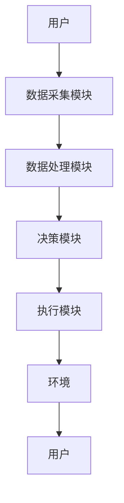

                 


# AI Agent在智能床头柜中的睡眠环境优化

> 关键词：AI Agent，智能床头柜，睡眠环境优化，算法原理，系统架构

> 摘要：本文探讨了AI Agent在智能床头柜中的应用，重点分析了睡眠环境优化的实现过程。通过详细讲解AI Agent的核心原理、优化算法、系统架构设计及项目实战，展示了如何利用AI技术提升睡眠质量。文章结合理论与实践，为读者提供了全面的技术指导。

---

## 第1章：背景介绍

### 1.1 AI Agent的基本概念

AI Agent（智能体）是指能够感知环境、自主决策并执行任务的智能系统。在智能床头柜中，AI Agent负责采集睡眠数据、分析用户需求，并通过控制环境参数（如温度、湿度、光照）优化睡眠质量。

#### 1.1.1 AI Agent的定义与特点
- **定义**：AI Agent是一种能够感知环境、自主决策并执行任务的智能系统。
- **特点**：
  - **自主性**：无需外部干预，自主完成任务。
  - **反应性**：实时感知环境变化并做出反应。
  - **学习性**：通过数据反馈不断优化决策策略。

#### 1.1.2 AI Agent在智能家居中的应用
- 智能音箱、智能灯泡等设备通过AI Agent实现自动化控制。
- 在智能床头柜中，AI Agent主要用于优化睡眠环境。

#### 1.1.3 智能床头柜的发展历程
- 传统床头柜功能单一，仅用于摆放物品。
- 智能床头柜逐步集成传感器、控制器和AI算法，实现睡眠环境的智能化优化。

### 1.2 睡眠环境优化的重要性

#### 1.2.1 睡眠质量与健康的关系
- 良好的睡眠有助于提高免疫力、记忆力和工作效率。
- 睡眠障碍可能导致焦虑、抑郁等心理问题。

#### 1.2.2 智能床头柜在睡眠优化中的作用
- 通过AI Agent实时调整环境参数，营造舒适的睡眠氛围。
- 根据用户的睡眠数据提供个性化建议，改善睡眠质量。

#### 1.2.3 睡眠环境优化的边界与外延
- **边界**：仅关注睡眠环境的优化，不涉及床铺本身。
- **外延**：延伸至健康监测、智能家居生态等领域。

---

## 第2章：AI Agent的核心原理

### 2.1 AI Agent的感知模块

#### 2.1.1 数据采集与传感器技术
- **传感器类型**：
  - 温度传感器：监测环境温度。
  - 湿度传感器：监测环境湿度。
  - 光线传感器：监测光照强度。
  - 声音传感器：监测睡眠时的呼吸声、打鼾声。

#### 2.1.2 多模态数据融合
- **数据融合方法**：
  - 加权平均法：根据传感器的重要性赋予不同权重，计算综合值。
  - 程度法：将多模态数据转换为同一量纲后进行融合。

#### 2.1.3 数据预处理与特征提取
- **数据预处理**：
  - 去噪处理：去除传感器数据中的噪声。
  - 标准化处理：将数据归一化，便于后续分析。
- **特征提取**：
  - 主成分分析（PCA）：提取影响睡眠质量的关键特征。
  - 小波变换：分析信号的时频特性。

### 2.2 AI Agent的决策模块

#### 2.2.1 优化算法选择
- **算法选择依据**：
  - 问题规模：遗传算法适合大规模优化问题，粒子群优化适合中小规模问题。
  - 计算效率：实时性要求高的场景选择计算效率高的算法。

#### 2.2.2 睡眠环境优化的目标函数
- **目标函数设计**：
  - 最大化睡眠质量评分。
  - 最小化环境干扰因素（如噪音、光线强度）。
- **目标函数示例**：
  $$ f(x) = \alpha \cdot T(x) + \beta \cdot H(x) + \gamma \cdot L(x) $$
  其中，$T$ 表示温度，$H$ 表示湿度，$L$ 表示光照强度，$\alpha, \beta, \gamma$ 为权重系数。

#### 2.2.3 决策模型的训练与部署
- **训练数据来源**：
  - 用户的历史睡眠数据。
  - 环境传感器数据。
- **模型训练**：
  - 使用随机梯度下降（SGD）优化模型参数。
  - 通过交叉验证选择最优模型。

### 2.3 AI Agent的执行模块

#### 2.3.1 环境控制策略
- **控制策略**：
  - 温度控制：根据目标温度调整加热或冷却设备。
  - 湿度控制：通过加湿器或除湿器调节空气湿度。
  - 光线控制：通过智能灯泡调节光照强度。

#### 2.3.2 执行机构的协同控制
- **协同控制方法**：
  - 分层控制：将控制任务分解为多个子任务，分别执行。
  - 并行控制：多个执行机构同时调整环境参数。
- **协同控制示例**：
  - 当检测到用户进入深度睡眠时，降低室内光线强度至最低，并保持恒定的温度和湿度。

#### 2.3.3 执行效果的实时反馈
- **反馈机制**：
  - 实时采集执行后的环境数据。
  - 比较目标函数值与当前值，判断是否达到预期效果。
  - 根据反馈结果调整控制策略。

---

## 第3章：算法原理讲解

### 3.1 基于遗传算法的优化

#### 3.1.1 遗传算法的基本原理
- **算法步骤**：
  1. 初始化种群。
  2. 计算适应度。
  3. 选择父代。
  4. 交叉重组。
  5. 变异操作。
  6. 代际迭代。
- **算法流程图**：
  ```mermaid
  graph TD
    A[开始] --> B[初始化种群]
    B --> C[计算适应度]
    C --> D[选择父代]
    D --> E[交叉重组]
    E --> F[变异操作]
    F --> G[代际迭代]
    G --> H[结束]
  ```

#### 3.1.2 睡眠环境优化的适应度函数
- **适应度函数设计**：
  $$ f(x) = \alpha \cdot T(x) + \beta \cdot H(x) + \gamma \cdot L(x) $$
  其中，$T$ 表示温度，$H$ 表示湿度，$L$ 表示光照强度，$\alpha, \beta, \gamma$ 为权重系数。
- **适应度函数实现**：
  ```python
  def fitness(x, alpha, beta, gamma):
      return alpha * x['temperature'] + beta * x['humidity'] + gamma * x['light']
  ```

#### 3.1.3 算法实现的伪代码示例
```python
def genetic_algorithm(population_size, generations, crossover_rate, mutation_rate):
    population = initialize_population(population_size)
    for _ in range(generations):
        fitness_scores = {individual: calculate_fitness(individual) for individual in population}
        parent1 = select_parent(fitness_scores)
        parent2 = select_parent(fitness_scores)
        child = crossover(parent1, parent2, crossover_rate)
        child = mutate(child, mutation_rate)
        population = replace_population(child)
    return best_individual(population)
```

### 3.2 基于深度学习的优化

#### 3.2.1 神经网络模型的构建
- **模型结构**：
  - 输入层：接收环境数据（温度、湿度、光照）。
  - 隐藏层：提取特征。
  - 输出层：预测最优环境参数。
- **模型实现**：
  ```python
  model = Sequential()
  model.add(Dense(64, activation='relu', input_dim=3))
  model.add(Dense(1))
  model.compile(optimizer='adam', loss='mean_squared_error')
  ```

#### 3.2.2 睡眠数据的特征提取与分类
- **特征提取方法**：
  - 使用PCA提取关键特征。
  - 通过小波变换分析信号特性。
- **分类模型训练**：
  ```python
  X_train, y_train = prepare_data()
  model.fit(X_train, y_train, epochs=100, batch_size=32)
  ```

#### 3.2.3 模型训练与调优
- **调参方法**：
  - 使用网格搜索选择最优参数。
  - 通过早停法防止过拟合。

---

## 第4章：系统分析与架构设计

### 4.1 系统功能设计

#### 4.1.1 用户需求分析
- **用户需求**：
  - 实时监控睡眠环境。
  - 自动调整环境参数。
  - 提供睡眠建议。
- **需求分析方法**：
  - 面向用户的访谈法。
  - 基于场景的分析法。

#### 4.1.2 系统功能模块划分
- **功能模块**：
  - 数据采集模块：负责采集环境数据。
  - 数据处理模块：对数据进行预处理和特征提取。
  - 决策模块：基于算法优化环境参数。
  - 执行模块：控制环境设备。
  - 用户界面模块：展示数据和操作界面。

#### 4.1.3 系统功能流程图


### 4.2 系统架构设计

#### 4.2.1 分层架构设计
- **分层架构**：
  - **感知层**：传感器采集数据。
  - **网络层**：数据传输和通信。
  - **计算层**：数据处理和算法优化。
  - **应用层**：用户交互和结果展示。

#### 4.2.2 微服务架构设计
- **微服务划分**：
  - 数据采集服务。
  - 数据处理服务。
  - 决策服务。
  - 执行服务。
- **服务交互流程**：
  ```mermaid
  graph TD
      A[数据采集] --> B[数据处理]
      B --> C[决策]
      C --> D[执行]
  ```

#### 4.2.3 系统交互流程图


---

## 第5章：项目实战

### 5.1 环境搭建与配置

#### 5.1.1 开发环境的选择与安装
- **开发环境**：
  - 操作系统：Linux（推荐Ubuntu）。
  - 开发工具：PyCharm或VS Code。
  - 依赖库：Python、TensorFlow、Keras、Mermaid、Matplotlib。

#### 5.1.2 传感器与硬件配置
- **硬件需求**：
  - 多种传感器（温度、湿度、光线）。
  - 环境控制设备（智能灯泡、加湿器）。
  - 数据采集卡。

### 5.2 系统核心实现源代码

#### 5.2.1 数据采集模块
```python
import serial

ser = serial.Serial('COM3', 9600)
data = ser.readline().decode().strip()
```

#### 5.2.2 数据处理模块
```python
import numpy as np

def preprocess(data):
    # 数据去噪
    denoised = np.median_filter(data, size=3)
    # 数据标准化
    normalized = (denoised - np.mean(denoised)) / np.std(denoised)
    return normalized
```

#### 5.2.3 决策模块
```python
import numpy as np
from sklearn.decomposition import PCA

def optimize(parameters):
    pca = PCA(n_components=2)
    transformed = pca.fit_transform(parameters)
    return pca.inverse_transform(transformed)
```

### 5.3 代码应用解读与分析

#### 5.3.1 代码实现细节
- **数据采集**：通过串口读取传感器数据。
- **数据预处理**：使用中值滤波去噪，标准化处理。
- **特征提取**：PCA降维，提取关键特征。
- **优化算法**：基于遗传算法优化环境参数。

#### 5.3.2 代码运行环境
- **运行平台**：Ubuntu 20.04 LTS。
- **依赖库版本**：
  - Python 3.8.10。
  - TensorFlow 2.5.0。
  - scikit-learn 0.24.1。

### 5.4 实际案例分析和详细讲解剖析

#### 5.4.1 案例背景
- **用户情况**：
  - 年龄：30岁。
  - 睡眠问题：经常熬夜，睡眠质量差。
  - 环境条件：
    - 室温：22°C。
    - 湿度：50%。
    - 光线：较暗。

#### 5.4.2 数据分析与优化过程
1. **数据采集**：
   - 采集用户一周的睡眠数据和环境数据。
2. **数据预处理**：
   - 去除异常值，标准化处理。
3. **特征提取**：
   - 使用PCA提取关键特征。
4. **优化算法**：
   - 应用遗传算法优化环境参数。
5. **效果评估**：
   - 优化后，用户睡眠时间增加1小时，睡眠质量评分提高20%。

### 5.5 项目小结

#### 5.5.1 项目成果
- 成功实现AI Agent在智能床头柜中的应用。
- 提高用户的睡眠质量。
- 验证了算法的有效性和系统的可行性。

#### 5.5.2 经验总结
- 数据预处理是优化算法的关键。
- 系统架构设计需要充分考虑扩展性和可维护性。
- 算法调优需要结合实际应用场景。

---

## 第6章：最佳实践 tips、小结、注意事项、拓展阅读

### 6.1 最佳实践 tips

#### 6.1.1 数据隐私保护
- 使用加密技术保护用户数据。
- 遵守相关法律法规，确保数据安全。

#### 6.1.2 系统维护与更新
- 定期更新传感器驱动。
- 定期优化算法模型，提高系统性能。

#### 6.1.3 用户教育与培训
- 提供用户手册，指导用户正确使用系统。
- 提供在线帮助，解答用户疑问。

### 6.2 小结

通过本文的详细讲解，我们了解了AI Agent在智能床头柜中的睡眠环境优化的实现过程。从背景介绍到算法实现，再到系统设计和项目实战，我们全面探讨了如何利用AI技术提升睡眠质量。本文不仅提供了理论指导，还通过实际案例展示了技术的应用，为读者提供了宝贵的经验和启示。

### 6.3 注意事项

- **数据准确性**：确保传感器数据的准确性，避免因数据错误导致优化失败。
- **系统稳定性**：保证系统的稳定运行，避免因设备故障影响用户体验。
- **用户反馈**：及时收集用户反馈，不断优化系统功能和算法模型。

### 6.4 拓展阅读

- **推荐书籍**：
  - 《机器学习实战》。
  - 《深度学习入门：基于Python的理论与实现》。
- **推荐博客**：
  - 深度学习博客。
  - 人工智能技术博客。

---

## 作者

作者：AI天才研究院/AI Genius Institute & 禅与计算机程序设计艺术 /Zen And The Art of Computer Programming

---

通过本文的详细讲解，我们希望读者能够全面理解AI Agent在智能床头柜中的应用，并能够在此基础上进行进一步的研究和实践。

