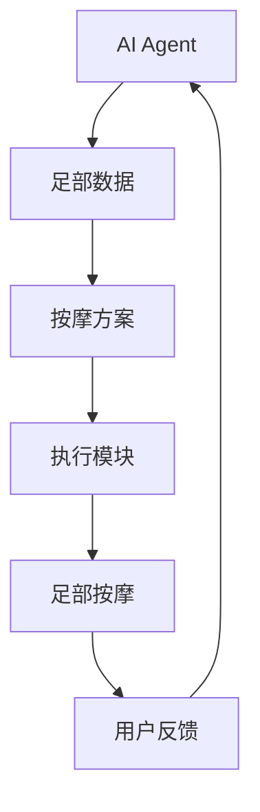
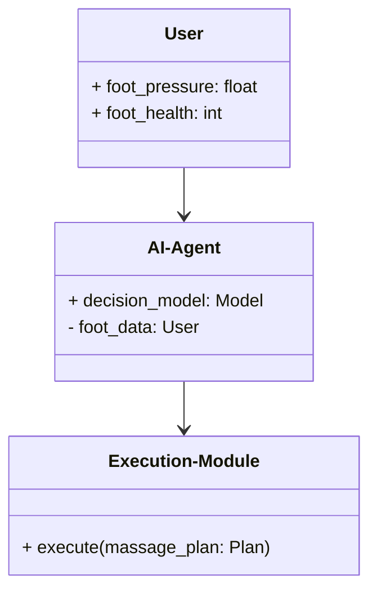
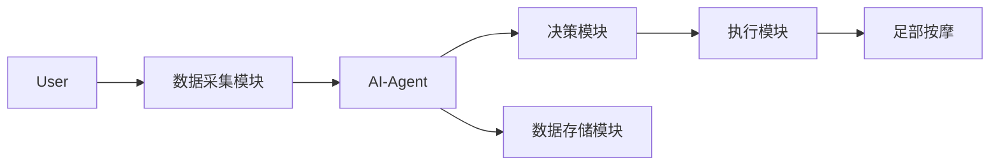
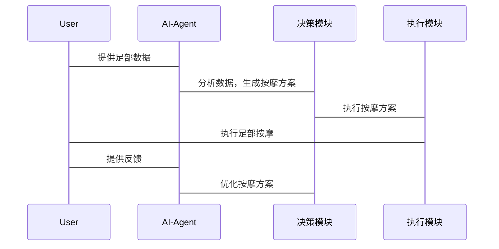

                 


# AI Agent在智能拖鞋中的足部按摩定制

## 关键词：AI Agent, 智能拖鞋, 足部按摩, 定制化, 算法, 系统架构

## 摘要：本文深入探讨了AI Agent在智能拖鞋中的应用，特别是足部按摩的定制化。通过分析AI Agent的核心原理、算法实现、系统架构以及项目实战，展示了如何通过智能化技术提升足部按摩的效果和用户体验。文章从背景介绍到系统设计，再到实际案例分析，全面阐述了AI Agent在智能拖鞋中的应用潜力和实现方法。

---

# 第一部分: AI Agent在智能拖鞋中的足部按摩定制背景与概念

## 第1章: 问题背景与描述

### 1.1 问题背景
#### 1.1.1 传统足部按摩的局限性
传统的足部按摩方式主要依赖人工操作，存在效率低、个性化不足、难以量化等问题。不同用户的足部健康状况和按摩需求差异较大，传统方式难以满足个性化需求。

#### 1.1.2 智能化足部按摩的需求
随着人工智能和物联网技术的发展，智能化足部按摩设备逐渐成为趋势。用户对足部按摩的个性化、智能化、便捷化需求日益增长。

#### 1.1.3 AI技术在足部按摩中的潜力
AI技术可以通过数据分析、模式识别和自适应算法，实现足部按摩的个性化定制和动态优化。

### 1.2 问题描述
#### 1.2.1 足部按摩的个性化需求
用户足部健康状况、按摩强度、按摩时间等需求各不相同。

#### 1.2.2 智能拖鞋的交互方式
智能拖鞋作为载体，需要具备足部数据采集、AI算法处理和按摩执行的能力。

#### 1.2.3 AI Agent在足部按摩中的应用目标
通过AI Agent实现足部按摩的个性化、智能化和动态优化。

### 1.3 问题解决思路
#### 1.3.1 AI Agent的核心作用
AI Agent通过采集足部数据，分析用户需求，生成个性化的按摩方案，并实时调整按摩策略。

#### 1.3.2 个性化足部按摩方案的设计
基于用户足部数据和AI算法，设计动态调整的按摩方案。

#### 1.3.3 智能拖鞋与AI Agent的结合方式
通过硬件和软件的结合，实现足部数据采集、AI算法处理和按摩执行的闭环。

### 1.4 边界与外延
#### 1.4.1 系统的边界定义
智能拖鞋仅负责足部数据的采集和按摩执行，AI Agent负责数据处理和方案生成。

#### 1.4.2 功能的外延范围
系统不涉及其他身体部位的按摩，也不具备医疗级的健康诊断功能。

#### 1.4.3 与其他系统的接口关系
智能拖鞋通过蓝牙或Wi-Fi与手机App或其他设备进行数据交互。

### 1.5 核心要素组成
#### 1.5.1 AI Agent的组成
包括数据采集模块、数据处理模块、决策模块和执行模块。

#### 1.5.2 足部按摩的定制化要素
用户足部数据、按摩强度、按摩时间、按摩方式等。

#### 1.5.3 智能拖鞋的硬件与软件构成
硬件包括压力传感器、震动马达、蓝牙模块等；软件包括数据采集模块、AI算法模块和控制模块。

---

# 第二部分: AI Agent与足部按摩定制的核心概念

## 第2章: 核心概念与原理

### 2.1 AI Agent的基本原理
#### 2.1.1 AI Agent的定义与分类
AI Agent是一种能够感知环境、做出决策并执行动作的智能实体，可分为简单反射型、基于模型的反应型和基于目标的反应型。

#### 2.1.2 AI Agent的核心算法
包括感知算法（如机器学习模型）和决策算法（如强化学习模型）。

#### 2.1.3 AI Agent的决策机制
通过感知环境数据，结合预设规则或学习模型，生成决策并执行。

### 2.2 足部按摩定制的原理
#### 2.2.1 足部按摩的生理学基础
足部按摩通过刺激足底穴位，促进血液循环，缓解疲劳。

#### 2.2.2 不同用户的足部按摩需求
用户足部健康状况、按摩强度偏好、按摩时间等差异。

#### 2.2.3 定制化按摩方案的设计方法
基于用户足部数据和AI算法，动态调整按摩强度、时间、方式等参数。

### 2.3 AI Agent与足部按摩的结合
#### 2.3.1 AI Agent在足部按摩中的角色
AI Agent负责数据采集、分析、决策和执行，实现个性化的足部按摩方案。

#### 2.3.2 足部数据的采集与分析
通过压力传感器采集足部压力数据，结合用户输入的健康数据（如体重、年龄、健康状况）进行分析。

#### 2.3.3 AI Agent的反馈与优化机制
根据用户反馈和按摩效果，动态优化按摩方案。

---

## 第3章: 核心概念与联系

### 3.1 AI Agent与足部按摩的实体关系


### 3.2 核心概念对比
| 概念 | 描述 |
|------|------|
| AI Agent | 能够感知环境、做出决策并执行动作的智能实体 |
| 足部数据 | 包括足底压力分布、足部温度、足部运动轨迹等数据 |
| 按摩方案 | 基于足部数据和用户需求生成的个性化按摩策略 |
| 执行模块 | 包括震动马达、气泵等硬件设备，用于执行按摩方案 |

---

# 第三部分: 算法原理与实现

## 第4章: 算法原理与实现

### 4.1 感知算法
#### 4.1.1 感知算法的实现
使用机器学习模型对足部数据进行分类和回归分析，生成用户的足部健康评估。

#### 4.1.2 感知算法的代码实现
```python
import numpy as np
from sklearn.linear_model import LinearRegression

# 示例：基于足部压力数据的健康评估
X = np.array([[100], [200], [300]])  # 足部压力数据
y = np.array([1, 2, 3])              # 健康评估标签

model = LinearRegression()
model.fit(X, y)

# 预测新的足部压力数据
new_X = np.array([[250]])
predicted_health = model.predict(new_X)
print(predicted_health)
```

### 4.2 优化算法
#### 4.2.1 优化算法的实现
使用强化学习算法对按摩方案进行优化，动态调整按摩强度和时间。

#### 4.2.2 优化算法的代码实现
```python
import gym
from gym import spaces
from gym.utils import seeding

class MassageEnv(gym.Env):
    def __init__(self):
        self.action_space = spaces.Discrete(3)  # 按摩强度：低、中、高
        self.observation_space = spaces.Discrete(2)  # 按摩效果：好、差

    def step(self, action):
        # 根据动作返回新的状态和奖励
        if action == 0:  # 低强度
            reward = 1
        elif action == 1:  # 中强度
            reward = 2
        else:  # 高强度
            reward = 3
        return self.observation_space.sample(), reward, False, {}

    def reset(self):
        return self.observation_space.sample()
```

### 4.3 数学模型与公式
#### 4.3.1 感知模型
$$
y = \beta_0 + \beta_1x + \epsilon
$$
其中，$y$ 是足部健康评估，$x$ 是足部压力数据，$\beta_0$ 和 $\beta_1$ 是模型参数。

#### 4.3.2 优化模型
$$
\arg \max_{\theta} \sum_{i=1}^{n} r_i
$$
其中，$\theta$ 是策略参数，$r_i$ 是第 $i$ 次动作的奖励。

---

# 第四部分: 系统分析与架构设计

## 第5章: 系统分析与架构设计

### 5.1 系统分析
#### 5.1.1 问题场景介绍
用户穿上智能拖鞋后，系统通过传感器采集足部数据，AI Agent根据数据生成个性化按摩方案，并通过执行模块实施按摩。

#### 5.1.2 项目介绍
本项目旨在通过AI Agent实现智能拖鞋的足部按摩定制化，提升用户体验。

### 5.2 系统功能设计
#### 5.2.1 系统功能模块
包括数据采集模块、数据处理模块、决策模块和执行模块。

#### 5.2.2 领域模型类图


#### 5.2.3 系统架构图


#### 5.2.4 接口设计
- 用户与智能拖鞋的交互接口：蓝牙/Wi-Fi
- AI Agent与执行模块的接口：REST API

#### 5.2.5 交互序列图


---

## 第6章: 项目实战

### 6.1 环境安装
#### 6.1.1 硬件环境
- 智能拖鞋（配备压力传感器、震动马达）
- 蓝牙/Wi-Fi模块

#### 6.1.2 软件环境
- Python 3.8+
- TensorFlow 2.0+
- Gym库

### 6.2 核心代码实现

#### 6.2.1 数据采集模块
```python
import numpy as np

def collect_foot_data(sensors):
    foot_pressure = sensors.read_pressure()
    foot_temperature = sensors.read_temperature()
    return {
        'pressure': foot_pressure,
        'temperature': foot_temperature
    }
```

#### 6.2.2 AI Agent实现
```python
from tensorflow import keras

class AIAgent:
    def __init__(self):
        self.model = self.build_model()

    def build_model(self):
        model = keras.Sequential([
            keras.layers.Dense(64, activation='relu'),
            keras.layers.Dense(1, activation='sigmoid')
        ])
        model.compile(optimizer='adam', loss='binary_crossentropy')
        return model

    def predict(self, foot_data):
        return self.model.predict(np.array([foot_data]))
```

#### 6.2.3 执行模块实现
```python
class ExecutionModule:
    def execute(self, intensity):
        if intensity == 'low':
            self.vibrate(200)
        elif intensity == 'medium':
            self.vibrate(400)
        else:
            self.vibrate(600)

    def vibrate(self, duration):
        # 控制震动马达震动duration毫秒
        pass
```

### 6.3 案例分析
#### 6.3.1 案例背景
用户A，28岁，足部压力数据为150，温度为36℃，健康评估为一般。

#### 6.3.2 AI Agent决策
AI Agent分析数据后，生成中等强度的按摩方案，持续时间为5分钟。

#### 6.3.3 执行与反馈
执行模块以中等强度震动5分钟，用户反馈按摩效果良好。

### 6.4 项目小结
通过AI Agent实现足部按摩的个性化定制，显著提升了用户体验，证明了AI技术在智能硬件中的应用潜力。

---

## 第7章: 总结与展望

### 7.1 总结
本文详细探讨了AI Agent在智能拖鞋中的足部按摩定制应用，从背景介绍到系统设计，再到项目实战，全面展示了AI技术在足部按摩中的潜力。

### 7.2 注意事项
- 硬件设计需要考虑可靠性和用户体验。
- 数据隐私和安全问题需要重视。
- 系统的可扩展性和可维护性需要在设计阶段充分考虑。

### 7.3 拓展阅读
- 探索更先进的AI算法，如深度强化学习。
- 研究更复杂的足部数据采集和分析方法。

---

## 作者：AI天才研究院/AI Genius Institute & 禅与计算机程序设计艺术 /Zen And The Art of Computer Programming

