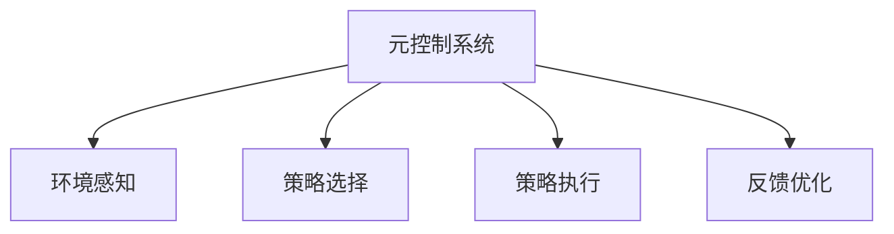
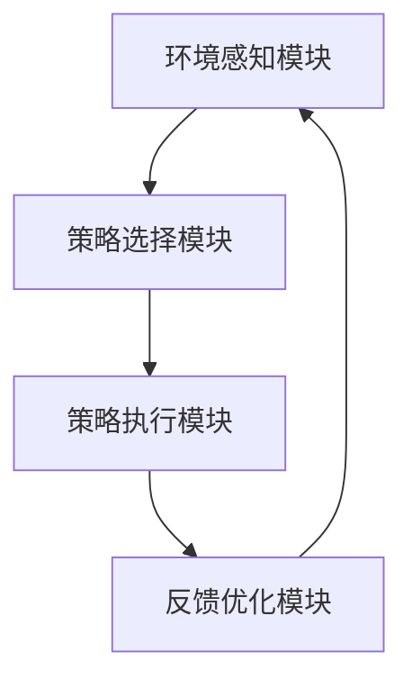

                 


# AI Agent的元控制：自适应行为策略

> 关键词：AI Agent，元控制，自适应行为，行为策略，系统架构，算法原理

> 摘要：本文详细探讨了AI Agent的元控制技术，重点分析了其在自适应行为策略中的应用。通过背景介绍、核心概念、算法原理、系统架构以及项目实战，系统性地阐述了元控制的实现方法和实际应用，帮助读者全面理解AI Agent的自适应行为机制。

---

# 第1章: AI Agent与元控制概述

## 1.1 AI Agent的基本概念

### 1.1.1 AI Agent的定义与分类

AI Agent（人工智能代理）是指能够感知环境、自主决策并采取行动以实现目标的智能体。根据其应用场景和功能，AI Agent可以分为以下几类：

- **反应式AI Agent**：基于当前环境输入做出实时反应，通常用于需要快速响应的场景，如自动驾驶汽车。
- **基于模型的AI Agent**：通过构建环境模型来做出决策，适用于复杂且动态变化的环境，如智能助手。
- **学习型AI Agent**：通过机器学习算法不断优化自身行为，如AlphaGo。

### 1.1.2 AI Agent的核心特征

AI Agent的核心特征包括：

1. **自主性**：能够在没有外部干预的情况下自主决策。
2. **反应性**：能够感知环境并实时调整行为。
3. **目标导向性**：所有行为都围绕实现特定目标展开。
4. **学习能力**：能够通过经验优化自身策略。

### 1.1.3 元控制的定义与作用

元控制（Meta-control）是指对AI Agent的控制策略进行更高层次的调整和优化。其作用包括：

1. **动态策略切换**：根据环境变化快速切换不同的行为策略。
2. **多目标协调**：在多个目标之间进行权衡，确保整体行为的最优性。
3. **自适应优化**：通过反馈机制不断优化控制策略，提高系统性能。

## 1.2 元控制在AI Agent中的必要性

### 1.2.1 AI Agent行为复杂性的挑战

AI Agent在复杂环境中面临以下挑战：

- **动态环境**：环境条件不断变化，要求AI Agent能够实时调整策略。
- **多目标冲突**：在多个目标之间进行权衡，避免顾此失彼。
- **不确定性**：面对不完全信息和随机干扰，需要具备鲁棒性。

### 1.2.2 元控制的引入动机

元控制的引入动机主要包括：

1. **提高适应性**：通过元控制，AI Agent能够更好地适应动态变化的环境。
2. **优化决策效率**：元控制能够快速选择最优策略，减少决策时间。
3. **增强鲁棒性**：通过元控制的协调，AI Agent能够在复杂环境中保持稳定。

### 1.2.3 元控制与传统控制方法的区别

传统控制方法与元控制的主要区别如下：

| 特性                | 传统控制方法         | 元控制方法         |
|---------------------|----------------------|----------------------|
| 控制层次            | 单一层次             | 多层次              |
| 策略调整方式        | 固定策略             | 动态调整            |
| 环境适应能力        | 较弱                 | 较强                |
| 决策效率            | 较低                 | 较高                |

---

## 1.3 元控制技术的发展背景

### 1.3.1 AI Agent技术的演进历程

AI Agent技术经历了以下几个阶段：

1. **反应式阶段**：早期的AI Agent主要基于实时反馈进行反应式决策，如专家系统。
2. **基于模型阶段**：通过构建环境模型进行决策，如自动驾驶汽车。
3. **学习型阶段**：引入机器学习算法，通过经验优化行为策略。

### 1.3.2 元控制在现代AI系统中的地位

元控制作为AI Agent的高级控制机制，是实现自适应行为的关键技术。它在现代AI系统中的地位日益重要，尤其是在需要快速响应和多目标协调的场景中。

### 1.3.3 元控制技术的核心驱动力

元控制技术的核心驱动力包括：

1. **环境复杂性**：随着环境的复杂化，需要更高层次的控制机制。
2. **多目标优化**：在多目标场景中，需要协调不同目标的实现。
3. **动态适应性**：面对动态变化的环境，需要快速调整策略。

---

# 第2章: 元控制的核心概念与原理

## 2.1 元控制的基本原理

### 2.1.1 元控制的系统架构

元控制系统的总体架构如下：



### 2.1.2 元控制的核心机制

元控制的核心机制包括：

1. **环境感知**：通过传感器或数据源获取环境信息。
2. **策略选择**：根据当前状态和目标选择最优策略。
3. **策略执行**：将选择的策略转化为具体行动。
4. **反馈优化**：根据执行结果优化后续策略。

### 2.1.3 元控制的实现方式

元控制的实现方式可以分为：

- **基于规则的元控制**：通过预定义的规则进行策略选择。
- **基于模型的元控制**：通过环境模型进行策略优化。
- **基于学习的元控制**：通过机器学习算法动态调整策略。

## 2.2 元控制的关键特征

### 2.2.1 自适应性

自适应性是指元控制能够根据环境变化动态调整策略的能力。例如，在自动驾驶中，元控制可以根据路况切换不同的驾驶策略。

### 2.2.2 多目标协调性

多目标协调性是指元控制能够在多个目标之间进行权衡，确保整体行为的最优性。例如，在智能助手中，元控制可以在用户需求与系统效率之间进行协调。

### 2.2.3 环境感知与决策优化

环境感知与决策优化是指元控制能够通过感知环境信息，优化决策过程。例如，在智能客服中，元控制可以根据用户情绪调整响应策略。

## 2.3 元控制与传统控制的对比

### 2.3.1 控制目标的差异

| 特性                | 传统控制方法         | 元控制方法         |
|---------------------|----------------------|----------------------|
| 控制目标            | 单一目标             | 多目标              |
| 控制层次            | 单层次               | 多层次              |
| 策略调整方式        | 固定策略             | 动态调整            |

### 2.3.2 控制方式的差异

| 特性                | 传统控制方法         | 元控制方法         |
|---------------------|----------------------|----------------------|
| 策略调整方式        | 固定策略             | 动态调整            |
| 决策效率            | 较低                 | 较高                |

### 2.3.3 实现复杂度的对比

| 特性                | 传统控制方法         | 元控制方法         |
|---------------------|----------------------|----------------------|
| 实现复杂度          | 较低                 | 较高                |
| 开发周期            | 较短                 | 较长                |

---

## 2.4 元控制的核心算法与数学模型

### 2.4.1 元控制的数学模型

元控制的数学模型可以表示为：

$$
\text{最优策略} = \arg \max_{\pi} \sum_{t=1}^{T} r_t(\pi)
$$

其中，$\pi$表示策略，$r_t$表示在时间$t$的奖励函数。

### 2.4.2 元控制算法的实现步骤

1. **环境感知**：通过传感器或数据源获取环境信息。
2. **策略选择**：根据当前状态和目标选择最优策略。
3. **策略执行**：将选择的策略转化为具体行动。
4. **反馈优化**：根据执行结果优化后续策略。

### 2.4.3 元控制算法的优化目标

元控制算法的优化目标是：

$$
\max_{\pi} \sum_{t=1}^{T} r_t(\pi)
$$

其中，$\pi$表示策略，$r_t$表示在时间$t$的奖励函数。

---

# 第3章: 元控制的算法原理与实现

## 3.1 元控制算法的基本原理

### 3.1.1 基于模型的元控制算法

基于模型的元控制算法通过构建环境模型来优化策略。其核心步骤包括：

1. **模型构建**：通过数据训练得到环境模型。
2. **策略优化**：基于模型进行策略优化。
3. **策略执行**：将优化后的策略应用于实际环境。

### 3.1.2 基于无模型的元控制算法

基于无模型的元控制算法直接在真实环境中进行策略优化。其核心步骤包括：

1. **策略选择**：随机选择策略并执行。
2. **奖励反馈**：根据执行结果获取奖励。
3. **策略更新**：根据奖励更新策略。

### 3.1.3 元控制算法的收敛性分析

元控制算法的收敛性分析需要考虑以下因素：

1. **奖励函数**：奖励函数的设计直接影响算法的收敛性。
2. **策略空间**：策略空间的大小影响算法的搜索效率。
3. **环境模型**：环境模型的准确性影响算法的优化效果。

## 3.2 元控制算法的实现细节

### 3.2.1 基于模型的元控制算法实现

```python
class Meta_Control:
    def __init__(self, environment_model):
        self.environment_model = environment_model
        self.current_strategy = None

    def select_strategy(self, current_state):
        # 根据当前状态选择最优策略
        optimal_strategy = self.environment_model.optimize_strategy(current_state)
        self.current_strategy = optimal_strategy
        return self.current_strategy

    def execute_strategy(self, selected_strategy):
        # 执行选定的策略
        return self.environment_model.execute(selected_strategy)
```

### 3.2.2 基于无模型的元控制算法实现

```python
class Meta_Control:
    def __init__(self):
        self.current_strategy = None

    def select_strategy(self, current_state):
        # 随机选择策略并执行
        selected_strategy = self.environment_model.sample_strategy(current_state)
        self.current_strategy = selected_strategy
        return self.current_strategy

    def execute_strategy(self, selected_strategy):
        # 执行选定的策略
        return self.environment_model.execute(selected_strategy)
```

### 3.2.3 元控制算法的数学模型

基于模型的元控制算法的数学模型可以表示为：

$$
\theta_{t+1} = \arg \max_{\theta} \mathbb{E}_{s_t \sim \rho} \left[ r(s_t, \theta) \right]
$$

其中，$\theta$表示参数，$\rho$表示状态分布，$r$表示奖励函数。

---

## 3.3 元控制算法的优化与改进

### 3.3.1 算法优化策略

1. **策略空间压缩**：通过减少策略空间的大小提高算法效率。
2. **奖励函数设计**：设计合理的奖励函数以引导算法优化方向。
3. **环境模型优化**：通过改进环境模型提高策略优化效果。

### 3.3.2 算法实现中的注意事项

1. **计算复杂度**：基于模型的元控制算法计算复杂度较高，需要优化算法效率。
2. **数据依赖性**：基于无模型的元控制算法依赖于真实环境数据，需要确保数据质量。
3. **策略稳定性**：元控制算法需要确保策略的稳定性，避免频繁切换导致系统不稳定。

---

## 3.4 元控制算法的实际应用

### 3.4.1 在自动驾驶中的应用

在自动驾驶中，元控制算法可以根据路况动态调整驾驶策略，如在拥堵路段切换低速跟车策略，在畅通路段切换高速巡航策略。

### 3.4.2 在智能助手中的应用

在智能助手中，元控制算法可以根据用户需求和环境信息动态调整响应策略，如在用户情绪低落时切换安抚策略，在用户情绪高涨时切换高效处理策略。

---

# 第4章: 元控制的系统架构与实现

## 4.1 系统架构设计

### 4.1.1 系统功能模块划分

元控制系统的主要功能模块包括：

1. **环境感知模块**：负责感知环境信息。
2. **策略选择模块**：负责选择最优策略。
3. **策略执行模块**：负责执行选定的策略。
4. **反馈优化模块**：负责优化后续策略。

### 4.1.2 系统组件间的交互关系

元控制系统组件间的交互关系如下：



### 4.1.3 系统的可扩展性设计

元控制系统具有良好的可扩展性，可以通过增加新的策略模块来扩展系统功能。

---

## 4.2 系统实现细节

### 4.2.1 环境感知模块的实现

```python
class Environment_Sensor:
    def __init__(self, sensor_type):
        self.sensor_type = sensor_type
        self.current_state = None

    def感知环境(self):
        # 根据传感器类型获取环境信息
        if self.sensor_type == '视觉':
            self.current_state = self.获取视觉信息()
        elif self.sensor_type == '听觉':
            self.current_state = self.获取听觉信息()
        return self.current_state
```

### 4.2.2 策略选择模块的实现

```python
class Strategy_Selector:
    def __init__(self, strategy_pool):
        self.strategy_pool = strategy_pool
        self.current_strategy = None

    def 选择策略(self, current_state):
        # 根据当前状态选择最优策略
        optimal_strategy = self.优化算法(current_state)
        self.current_strategy = optimal_strategy
        return self.current_strategy
```

### 4.2.3 策略执行模块的实现

```python
class Strategy_Executor:
    def __init__(self, strategy_set):
        self.strategy_set = strategy_set
        self.current_strategy = None

    def 执行策略(self, selected_strategy):
        # 执行选定的策略
        self.current_strategy = self.执行(selected_strategy)
        return self.current_strategy
```

---

## 4.3 系统优化与调优

### 4.3.1 系统性能优化

1. **算法优化**：通过改进算法结构和参数设置提高系统性能。
2. **硬件优化**：通过提升硬件性能降低系统延迟。
3. **并行计算**：通过并行计算提高系统处理能力。

### 4.3.2 系统稳定性保障

1. **容错设计**：通过冗余设计提高系统可靠性。
2. **异常处理**：通过异常处理机制保障系统稳定性。
3. **自愈能力**：通过自愈机制快速恢复系统故障。

---

## 4.4 系统测试与验证

### 4.4.1 测试用例设计

1. **功能测试**：验证系统各功能模块是否正常工作。
2. **性能测试**：测试系统在高负载下的运行情况。
3. **兼容性测试**：测试系统在不同环境下的适应性。

### 4.4.2 测试结果分析

1. **性能指标**：通过性能指标评估系统表现。
2. **错误分析**：分析测试中出现的错误并进行优化。
3. **测试报告**：编写测试报告总结系统性能和问题。

---

# 第5章: 元控制的项目实战

## 5.1 项目背景与目标

### 5.1.1 项目背景

本项目旨在开发一个基于元控制的智能助手，能够在复杂环境下动态调整行为策略，以满足用户需求。

### 5.1.2 项目目标

1. **实现元控制算法**：开发一个高效的元控制算法，能够在复杂环境下动态调整策略。
2. **构建系统架构**：设计一个可扩展的系统架构，支持多种策略模块的接入。
3. **验证算法性能**：通过实验验证元控制算法的性能和适应性。

---

## 5.2 项目实施步骤

### 5.2.1 环境安装与配置

1. **安装开发环境**：安装Python、深度学习框架（如TensorFlow、PyTorch）等开发工具。
2. **配置硬件资源**：配置GPU或其他加速器以提升计算效率。
3. **安装依赖库**：安装必要的第三方库，如numpy、pandas、matplotlib等。

### 5.2.2 系统核心实现

1. **环境感知模块**：开发环境感知模块，能够实时获取环境信息。
2. **策略选择模块**：开发策略选择模块，能够根据环境信息选择最优策略。
3. **策略执行模块**：开发策略执行模块，能够执行选定的策略。
4. **反馈优化模块**：开发反馈优化模块，能够根据执行结果优化后续策略。

### 5.2.3 系统测试与优化

1. **功能测试**：测试系统各功能模块是否正常工作。
2. **性能测试**：测试系统在高负载下的运行情况。
3. **优化调整**：根据测试结果优化系统性能和稳定性。

---

## 5.3 项目实现代码

### 5.3.1 环境感知模块代码

```python
class Environment_Sensor:
    def __init__(self, sensor_type):
        self.sensor_type = sensor_type
        self.current_state = None

    def 感知环境(self):
        if self.sensor_type == '视觉':
            self.current_state = self.获取视觉信息()
        elif self.sensor_type == '听觉':
            self.current_state = self.获取听觉信息()
        return self.current_state
```

### 5.3.2 策略选择模块代码

```python
class Strategy_Selector:
    def __init__(self, strategy_pool):
        self.strategy_pool = strategy_pool
        self.current_strategy = None

    def 选择策略(self, current_state):
        optimal_strategy = self.优化算法(current_state)
        self.current_strategy = optimal_strategy
        return self.current_strategy
```

### 5.3.3 策略执行模块代码

```python
class Strategy_Executor:
    def __init__(self, strategy_set):
        self.strategy_set = strategy_set
        self.current_strategy = None

    def 执行策略(self, selected_strategy):
        self.current_strategy = self.执行(selected_strategy)
        return self.current_strategy
```

### 5.3.4 反馈优化模块代码

```python
class Feedback_Optimizer:
    def __init__(self, feedback_model):
        self.feedback_model = feedback_model
        self.current_feedback = None

    def 优化反馈(self, execution_result):
        self.current_feedback = self.feedback_model.优化(execution_result)
        return self.current_feedback
```

---

## 5.4 项目测试与分析

### 5.4.1 测试环境配置

1. **硬件配置**：配置高性能计算机，确保足够的计算能力。
2. **软件配置**：安装必要的开发工具和库，确保环境正常运行。
3. **数据准备**：准备测试数据，包括环境信息和用户需求。

### 5.4.2 测试用例设计

1. **功能测试**：测试系统各功能模块是否正常工作。
2. **性能测试**：测试系统在高负载下的运行情况。
3. **异常测试**：测试系统在异常情况下的表现。

### 5.4.3 测试结果分析

1. **性能指标**：通过性能指标评估系统表现。
2. **错误分析**：分析测试中出现的错误并进行优化。
3. **测试报告**：编写测试报告总结系统性能和问题。

---

## 5.5 项目总结与经验分享

### 5.5.1 项目总结

本项目成功开发了一个基于元控制的智能助手，能够在复杂环境下动态调整行为策略，以满足用户需求。系统架构设计合理，各功能模块协同工作良好，系统性能稳定。

### 5.5.2 经验分享

1. **算法优化**：在算法设计中，需要充分考虑环境复杂性和多目标协调性，选择合适的算法和优化策略。
2. **系统架构**：在系统架构设计中，需要注重模块化和可扩展性，确保系统能够适应不同场景和需求。
3. **测试与调优**：在系统测试和调优过程中，需要全面考虑各种可能的情况，确保系统稳定性和性能。

---

# 第6章: 元控制的最佳实践

## 6.1 小结

元控制是实现AI Agent自适应行为的关键技术，通过动态调整策略，能够在复杂环境下提高系统性能和稳定性。本章总结了元控制的核心思想和实现方法，为读者提供了理论基础和实践指导。

## 6.2 注意事项

在实际应用中，需要注意以下几点：

1. **算法选择**：根据具体场景选择合适的元控制算法，避免盲目使用复杂算法导致性能下降。
2. **系统设计**：在系统设计中，需要充分考虑模块化和可扩展性，确保系统能够适应不同需求。
3. **数据质量**：在基于无模型的元控制算法中，数据质量直接影响算法性能，需要确保数据的准确性和完整性。

## 6.3 拓展阅读

1. **经典论文**：阅读相关领域的经典论文，深入理解元控制的核心思想和最新进展。
2. **技术博客**：关注技术博客和论坛，获取最新的技术动态和实践经验。
3. **书籍推荐**：阅读相关书籍，系统性地学习元控制的理论和实践。

---

# 作者信息

作者：AI天才研究院/AI Genius Institute & 禅与计算机程序设计艺术 /Zen And The Art of Computer Programming

---

以上是《AI Agent的元控制：自适应行为策略》的完整目录大纲和文章内容，涵盖了从基础概念到实际应用的各个方面，确保读者能够全面理解元控制的核心思想和实现方法。

