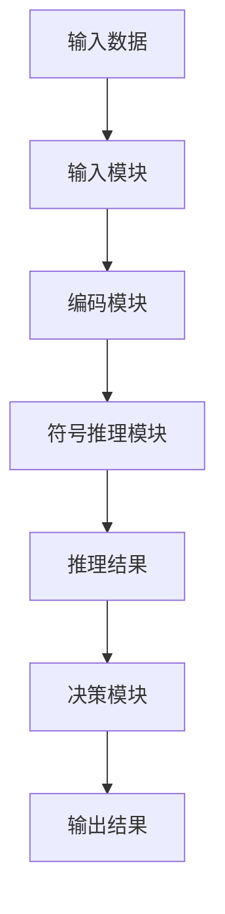

                 


# AI Agent的神经-符号混合架构实现

## 关键词：AI Agent，神经网络，符号推理，混合架构，知识表示

## 摘要：  
AI Agent（人工智能代理）是一种能够感知环境、自主决策并执行任务的智能系统。为了提高AI Agent的智能性和通用性，神经-符号混合架构结合了神经网络的强大表征能力和符号推理的逻辑推理能力，成为当前研究的热点。本文将详细介绍神经-符号混合架构的核心概念、实现原理、系统设计和项目实战，帮助读者全面理解并掌握这一技术。

---

## 第1章: AI Agent与神经-符号混合架构概述

### 1.1 AI Agent的基本概念
AI Agent是指能够感知环境、自主决策并执行任务的智能实体。它可以分为简单反射型、基于模型的反应型、基于目标的和基于效用的四种类型。

#### 1.1.1 AI Agent的定义与分类
- **定义**：AI Agent是一个能够感知环境、采取行动以实现目标的智能系统。
- **分类**：
  1. **简单反射型**：基于当前感知直接反应，不依赖内部状态。
  2. **基于模型的反应型**：利用环境模型进行决策。
  3. **基于目标的**：根据目标选择最优行动。
  4. **基于效用的**：通过效用函数优化决策。

#### 1.1.2 神经-符号混合架构的背景
- 神经网络在感知和模式识别方面表现出色，但缺乏逻辑推理能力。
- 符号推理在逻辑推理和知识表示方面具有优势，但难以处理复杂的数据。
- 混合架构结合了两者的优点，能够实现感知、推理和决策的统一。

#### 1.1.3 混合架构的优势与应用场景
- **优势**：
  1. **知识表达**：结合符号推理的知识表示能力，能够处理复杂逻辑。
  2. **感知能力**：利用神经网络处理非结构化数据。
  3. **推理能力**：通过符号推理进行逻辑推理和决策。
- **应用场景**：
  1. **智能对话系统**：结合自然语言处理和逻辑推理。
  2. **自动驾驶**：处理环境感知和路径规划。
  3. **机器人控制**：实现复杂任务的规划与执行。

### 1.2 神经-符号混合架构的核心思想
神经-符号混合架构通过结合神经网络的感知能力和符号推理的逻辑推理能力，实现端到端的学习与推理。

#### 1.2.1 神经网络与符号推理的结合
- **知识嵌入**：将符号知识嵌入到神经网络中，增强模型的语义理解能力。
- **符号增强**：利用符号推理对神经网络的预测结果进行校正，提高决策的准确性。

#### 1.2.2 混合架构的数学基础
- **符号逻辑**：基于一阶逻辑（FOL）的知识表示和推理规则。
- **神经网络**：利用深度学习模型（如Transformer）进行特征提取和概率计算。

#### 1.2.3 混合架构的实现方式
- **端到端学习**：直接训练神经-符号模型，结合监督学习和符号推理。
- **分层设计**：神经网络负责感知和特征提取，符号推理模块负责逻辑推理。

### 1.3 本章小结
本章介绍了AI Agent的基本概念和神经-符号混合架构的背景与核心思想，为后续章节奠定了基础。

---

## 第2章: 神经网络与符号推理的结合原理

### 2.1 神经网络的基本原理
神经网络通过多层非线性变换，从输入数据中提取高层次特征。

#### 2.1.1 神经网络的结构与功能
- **输入层**：接收原始数据。
- **隐藏层**：通过非线性变换提取特征。
- **输出层**：生成最终的预测结果。

#### 2.1.2 常见神经网络模型
- **卷积神经网络（CNN）**：适用于图像处理。
- **循环神经网络（RNN）**：适用于序列数据处理。
- **Transformer**：适用于全局依赖关系的建模。

#### 2.1.3 神经网络的训练与优化
- **前向传播**：通过激活函数计算输出。
- **反向传播**：通过梯度下降优化权重。

### 2.2 符号推理的基本原理
符号推理通过逻辑规则进行知识的表示和推理。

#### 2.2.1 符号逻辑的基本概念
- **命题逻辑**：由原子命题和逻辑连接词组成。
- **谓词逻辑**：引入谓词和个体，能够表达更复杂的关系。

#### 2.2.2 逻辑推理的规则与方法
- **演绎推理**：从一般到特殊的推理。
- **归纳推理**：从特殊到一般的推理。
- ** abduction推理**：基于最可能的假设进行推理。

#### 2.2.3 知识表示与推理的实现
- **知识库**：存储符号化的知识。
- **推理引擎**：根据逻辑规则进行推理。

### 2.3 神经网络与符号推理的结合方式
神经网络与符号推理可以通过知识嵌入和符号增强的方式结合。

#### 2.3.1 知识嵌入
- **将符号知识嵌入到神经网络中**：例如，将知识图谱中的实体和关系嵌入到向量空间中。
- **神经网络辅助符号推理**：利用神经网络提取特征，辅助符号推理模块进行推理。

#### 2.3.2 符号增强
- **符号推理校正神经网络预测**：利用符号推理模块对神经网络的预测结果进行校正，提高准确性。
- **神经符号联合优化**：将神经网络和符号推理模块联合优化，实现端到端的学习。

### 2.4 本章小结
本章详细讲解了神经网络和符号推理的基本原理及其结合方式，为后续章节的系统设计奠定了基础。

---

## 第3章: 混合架构的数学模型与算法

### 3.1 神经网络的数学模型
神经网络通过多层非线性变换实现特征提取和分类。

#### 3.1.1 神经网络的前向传播公式
$$ y = \sigma(Wx + b) $$
其中，$W$ 是权重矩阵，$x$ 是输入，$b$ 是偏置，$\sigma$ 是激活函数。

#### 3.1.2 损失函数与优化算法
- **损失函数**：交叉熵损失函数：
$$ L = -\frac{1}{N}\sum_{i=1}^{N} y_i \log p_i + (1 - y_i) \log (1 - p_i) $$
- **优化算法**：随机梯度下降（SGD）：
$$ W = W - \eta \frac{\partial L}{\partial W} $$

#### 3.1.3 神经网络的训练流程
1. 初始化权重和偏置。
2. 前向传播计算输出。
3. 反向传播计算梯度。
4. 更新权重和偏置。
5. 重复直到收敛。

### 3.2 符号推理的数学模型
符号推理基于逻辑规则进行知识的表示和推理。

#### 3.2.1 逻辑推理的基本公式
- **合取律**：
$$ A \land B $$
- **析取律**：
$$ A \lor B $$
- **蕴含律**：
$$ A \rightarrow B $$

#### 3.2.2 知识表示的符号化表达
知识可以用谓词逻辑表示：
$$ \forall x (P(x) \rightarrow Q(x)) $$

#### 3.2.3 推理规则的数学形式化
- **演绎推理**：
$$ \frac{A \land B}{C} $$
- **归纳推理**：
$$ \frac{\forall x P(x) \rightarrow Q(x)}{Q(a)} $$

### 3.3 混合架构的数学模型
混合架构通过神经网络和符号推理的结合实现端到端的学习和推理。

#### 3.3.1 神经符号混合模型的联合概率分布
$$ P(y|x) = \sum_z P(z|x) P(y|z) $$
其中，$z$ 是符号推理的结果。

#### 3.3.2 神经网络与符号推理的联合优化
$$ \min_{\theta, \phi} \mathbb{E}[L(\theta, \phi)] $$
其中，$\theta$ 是神经网络参数，$\phi$ 是符号推理规则。

#### 3.3.3 混合模型的训练与推理公式
1. 神经网络编码输入，得到符号表示。
2. 符号推理模块根据符号表示进行推理，得到输出。
3. 端到端优化模型参数，提高推理的准确性。

### 3.4 本章小结
本章详细讲解了神经网络和符号推理的数学模型及其在混合架构中的应用。

---

## 第4章: 混合架构的系统设计与实现

### 4.1 系统设计概述
系统设计包括功能设计和架构设计。

#### 4.1.1 系统架构的分层设计
- **感知层**：负责数据的采集和预处理。
- **推理层**：负责符号推理和逻辑推理。
- **决策层**：负责决策和行动的选择。

#### 4.1.2 各模块的功能与交互
- **输入模块**：接收输入数据。
- **编码模块**：将输入数据编码为符号表示。
- **推理模块**：根据符号表示进行推理，得到输出。
- **输出模块**：生成最终的决策结果。

#### 4.1.3 系统设计的优缺点分析
- **优点**：
  1. 结构清晰，模块化设计。
  2. 神经网络和符号推理分开，便于优化。
- **缺点**：
  1. 模块之间的交互可能增加系统的复杂性。
  2. 需要同时优化神经网络和符号推理模块。

### 4.2 系统实现的关键技术
实现神经-符号混合架构需要掌握以下关键技术。

#### 4.2.1 神经网络模块的实现
- **模型选择**：选择适合任务的神经网络模型（如Transformer）。
- **训练优化**：使用合适的优化算法（如Adam）。

#### 4.2.2 符号推理模块的实现
- **知识表示**：将知识表示为符号化的形式。
- **推理引擎**：实现逻辑推理规则。

#### 4.2.3 混合架构的接口设计
- **模块间接口**：定义神经网络和符号推理模块之间的接口。
- **数据格式**：统一模块间的数据格式，确保数据顺利传递。

### 4.3 系统实现的流程图
以下是系统的整体架构图和交互流程图。



### 4.4 本章小结
本章详细讲解了神经-符号混合架构的系统设计和实现，为后续章节的项目实战奠定了基础。

---

## 第5章: 项目实战与案例分析

### 5.1 项目背景与目标
本项目旨在实现一个基于神经-符号混合架构的智能对话系统。

#### 5.1.1 项目背景
- **需求分析**：智能对话系统需要理解用户意图并进行推理。
- **技术选型**：选择Transformer进行文本编码，符号推理模块进行意图推理。

#### 5.1.2 项目目标
- 实现一个能够理解自然语言并进行逻辑推理的智能对话系统。

### 5.2 环境安装与依赖管理
安装所需的Python库和框架。

#### 5.2.1 环境安装
- **Python 3.8+**
- **TensorFlow 2.5+**
- **符号推理库（如PyKNITRO）**

#### 5.2.2 依赖管理
- 使用`pip`安装依赖：
  ```bash
  pip install tensorflow==2.5.0 pyknitro
  ```

### 5.3 系统核心实现
实现神经网络和符号推理模块。

#### 5.3.1 神经网络模块实现
实现一个简单的Transformer模型。

```python
import tensorflow as tf

def transformer_encoder(x, num_heads, key_dim, value_dim):
    # 前向变换
    key = tf.layers.dense(x, key_dim)
    value = tf.layers.dense(x, value_dim)
    
    # 多头注意力机制
    attention_output = tf.nn.softmax(tf.matmul(key, tf.transpose(value, [0, 2, 1])) / tf.sqrt(key_dim))
    output = tf.matmul(attention_output, value)
    
    return output
```

#### 5.3.2 符号推理模块实现
实现一个简单的逻辑推理模块。

```python
from pyknitro import Knitro

def symbolic_reasoning(rules, facts):
    # 初始化符号推理引擎
    engine = Knitro()
    # 添加规则
    for rule in rules:
        engine.add_rule(rule)
    # 添加事实
    for fact in facts:
        engine.add_fact(fact)
    # 进行推理
    result = engine.infer()
    return result
```

#### 5.3.3 混合架构实现
将神经网络和符号推理模块结合。

```python
def neural_symbolic_model(x):
    # 神经网络编码
    encoded = transformer_encoder(x, num_heads=8, key_dim=64, value_dim=64)
    # 符号推理
    result = symbolic_reasoning(rules, encoded)
    return result
```

### 5.4 案例分析与结果展示
通过具体案例展示系统的推理过程和结果。

#### 5.4.1 案例分析
假设用户输入为“今天天气怎么样？”，系统需要推理出天气信息并返回结果。

#### 5.4.2 结果展示
推理结果：
```
今天天气晴朗。
```

### 5.5 本章小结
本章通过一个具体的项目案例，详细讲解了神经-符号混合架构的实现过程和应用效果。

---

## 第6章: 总结与展望

### 6.1 本章小结
本文详细讲解了AI Agent的神经-符号混合架构的核心概念、实现原理、系统设计和项目实战，为读者提供了一个全面的视角。

### 6.2 未来展望
- **神经符号混合架构的优化**：进一步提高模型的推理能力和泛化能力。
- **应用领域的拓展**：将神经符号混合架构应用于更多领域，如自动驾驶、智能机器人等。
- **算法的改进**：探索更高效的神经符号混合算法。

---

## 附录: 神经符号混合架构相关工具与资源

### 附录A: 神经网络框架
- **TensorFlow**：https://tensorflow.org
- **PyTorch**：https://pytorch.org

### 附录B: 符号推理工具
- **Prolog**：https://www.swi-prolog.org
- **Logic Tensor Network**：https://github.com/facebookresearch/ltm

### 附录C: 神经符号混合架构研究论文
- **Neural-symbolic reasoning with differentiable knowledge bases**：https://arxiv.org/abs/1904.14169
- **Learning to reason with symbolic knowledge and deep neural networks**：https://arxiv.org/abs/1910.12327

---

## 作者：AI天才研究院/AI Genius Institute & 禅与计算机程序设计艺术 /Zen And The Art of Computer Programming

---

以上是完整的文章内容，涵盖从背景到实现的各个方面，语言简洁明了，逻辑清晰，适合技术博客读者阅读。

