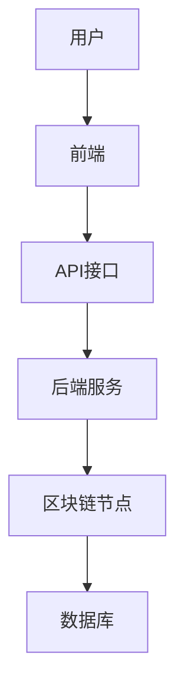
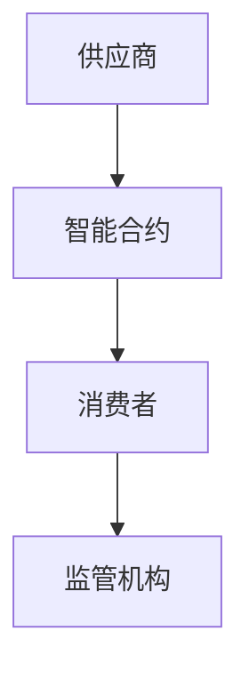

                 


# 巴菲特的产业链分析5.0：区块链技术在供应链金融中的应用

> 关键词：巴菲特，产业链分析，区块链，供应链金融，智能合约，分布式账本

> 摘要：本文将深入探讨巴菲特的产业链分析5.0版本，结合区块链技术在供应链金融中的应用。通过分析区块链技术的核心原理、应用场景以及系统架构设计，本文将详细阐述如何利用区块链技术优化供应链金融的效率和透明度。

---

# 第一部分: 巴菲特产业链分析5.0概述

## 第1章: 巴菲特产业链分析5.0的背景与核心理念

### 1.1 巴菲特投资理念的演变

#### 1.1.1 巴菲特早期投资策略
巴菲特的投资理念起源于20世纪50年代，他最初关注的是股票的内在价值，提出了“价值投资”的概念。他通过分析公司的财务报表、管理层能力和行业地位，寻找那些具有持续竞争优势的企业进行长期投资。

#### 1.1.2 产业链分析方法的形成
随着投资经验的积累，巴菲特逐渐发展出一套基于产业链的分析方法。他不仅关注单个企业的基本面，还注重企业所处的产业链环境，包括供应商、客户、竞争对手等。这种方法使得他能够更好地识别行业趋势和潜在风险。

#### 1.1.3 巴菲特投资理念的核心要素
巴菲特的投资理念可以总结为以下几个核心要素：
1. **长期投资**：关注企业的长期价值，而非短期市场波动。
2. **竞争优势**：寻找具有持续竞争优势的企业。
3. **管理层能力**：重视企业管理层的诚信和能力。
4. **产业链整合**：通过产业链的整合优化企业价值。

### 1.2 区块链技术的兴起与应用

#### 1.2.1 区块链技术的基本概念
区块链是一种分布式账本技术，通过去中心化的方式记录数据，确保数据的安全性和不可篡改性。区块链的核心特征包括去中心化、分布式 ledger、共识机制、智能合约等。

#### 1.2.2 区块链在金融领域的应用
区块链技术在金融领域的应用非常广泛，包括支付清算、资产发行、智能合约、风险管理等领域。通过区块链技术，金融机构可以降低交易成本、提高交易效率、增强透明度。

#### 1.2.3 区块链技术的核心优势
区块链技术的核心优势在于：
1. **去中心化**：避免了单点故障，提高了系统的安全性。
2. **不可篡改**：数据一旦记录在区块链上，无法被篡改，确保了数据的真实性。
3. **透明性**：区块链上的数据对所有参与者可见，提高了透明度。
4. **高效性**：通过智能合约自动执行交易，减少了人工干预，提高了效率。

### 1.3 区块链技术与供应链金融的结合

#### 1.3.1 供应链金融的传统模式与痛点
供应链金融的传统模式通常依赖于核心企业（如大型制造商或零售商）为上下游企业提供融资支持。然而，这种模式存在以下痛点：
1. **信息不对称**：上下游企业之间的信息传递不透明，导致融资难。
2. **效率低下**：传统的纸质单据处理流程复杂，效率低。
3. **信任缺失**：中小型企业难以获得足够的信任，导致融资成本高。

#### 1.3.2 区块链技术如何解决供应链金融问题
区块链技术可以通过以下方式解决供应链金融中的问题：
1. **信息共享**：通过区块链技术实现供应链上下游企业之间的信息共享，消除信息不对称。
2. **自动化交易**：利用智能合约自动执行交易，提高效率。
3. **增强信任**：通过区块链的不可篡改性，增强各方的信任。

#### 1.3.3 巴菲特产业链分析5.0的核心目标
巴菲特产业链分析5.0的核心目标是通过区块链技术优化供应链金融的效率和透明度，降低企业的融资成本，提高整体供应链的竞争力。

## 第2章: 区块链技术在供应链金融中的应用场景

### 2.1 供应链金融的核心流程

#### 2.1.1 供应商融资
供应商融资是供应链金融的核心流程之一。通常，供应商需要向核心企业提供货物，然后通过应收账款融资获得资金支持。

#### 2.1.2 货物流转
货物流转是供应链金融的另一个关键环节。通过区块链技术，可以实现货物的实时追踪和监控，确保货物的安全性和真实性。

#### 2.1.3 资金结算
资金结算是供应链金融的最后一个关键流程。通过区块链技术，可以实现资金的快速结算和透明化，减少中间环节的费用。

### 2.2 区块链技术在供应链金融中的具体应用

#### 2.2.1 智能合约在供应链金融中的应用
智能合约是区块链技术的重要应用之一，它可以自动执行合同条款，确保交易的透明性和安全性。在供应链金融中，智能合约可以用于自动触发支付、货物交付等操作。

#### 2.2.2 区块链技术在信用评估中的作用
区块链技术可以通过记录企业的历史交易数据，帮助金融机构进行信用评估。通过分析企业的信用记录，金融机构可以更好地评估企业的信用风险。

#### 2.2.3 区块链技术在风险管理中的应用
区块链技术可以实时监控供应链中的风险因素，如货物损坏、延迟交付等。通过智能合约，可以提前设定风险预警机制，及时采取应对措施。

### 2.3 巴菲特产业链分析5.0的具体实践

#### 2.3.1 巴菲特产业链分析5.0的框架
巴菲特产业链分析5.0的框架包括以下几个部分：
1. **数据采集**：通过区块链技术采集供应链中的数据。
2. **数据分析**：利用大数据技术分析数据，识别潜在风险和机会。
3. **智能合约**：通过智能合约自动执行交易，优化供应链流程。
4. **风险管理**：通过区块链技术实时监控风险，制定应对策略。

#### 2.3.2 巴菲特产业链分析5.0的核心算法
巴菲特产业链分析5.0的核心算法包括：
1. **共识算法**：如PoW、PoS等，用于确保数据的安全性。
2. **智能合约算法**：用于自动执行合同条款。
3. **风险管理算法**：用于实时监控供应链中的风险因素。

#### 2.3.3 巴菲特产业链分析5.0的实际案例
以一家汽车制造商为例，通过区块链技术优化供应链金融。汽车制造商可以通过区块链技术实现与供应商的无缝对接，自动触发支付，实时监控货物状态，从而提高供应链的效率和透明度。

## 第3章: 区块链技术的核心算法与数学模型

### 3.1 区块链共识机制

#### 3.1.1 共识机制的定义与分类
共识机制是区块链技术的核心组成部分，用于确保所有节点达成一致。常见的共识机制包括PoW（工作量证明）、PoS（权益证明）、DPOS（ delegated proof of stake）等。

#### 3.1.2 常见共识算法（如PoW、PoS、DPOS等）
- **PoW（工作量证明）**：通过计算哈希函数来验证交易，确保网络安全。
- **PoS（权益证明）**：通过持有代币的数量来决定节点的权重，减少能源消耗。
- **DPOS（委托权益证明）**：通过选举的方式选择记账节点，提高效率。

#### 3.1.3 共识算法的数学模型
以下是一个简单的PoW算法的数学模型：

$$
H = \text{Hash}(T, P, D)
$$

其中：
- \( H \) 是哈希值
- \( T \) 是时间戳
- \( P \) 是前一区块的哈希值
- \( D \) 是当前区块的数据

### 3.2 智能合约的原理

#### 3.2.1 智能合约的定义与特点
智能合约是一种自动执行的计算机程序，用于在区块链上自动执行合同条款。其特点包括自动性、不可篡改性、透明性等。

#### 3.2.2 智能合约的执行流程
1. **触发条件**：当满足特定条件时，智能合约自动执行。
2. **数据验证**：验证数据的真实性和有效性。
3. **自动执行**：根据智能合约的逻辑，自动执行交易或操作。

#### 3.2.3 智能合约的数学模型
以下是一个简单的智能合约执行流程的数学模型：

$$
\text{if } X \geq Y \text{ then } Z = X - Y
$$

其中：
- \( X \) 是合同规定的金额
- \( Y \) 是实际支付的金额
- \( Z \) 是差额部分

### 3.3 区块链数据结构

#### 3.3.1 区块链的基本数据结构
区块链的基本数据结构包括区块头、交易数据、 Merkel 树等。每个区块包含以下信息：
- 时间戳
- 前一区块哈希值
- 交易数据
- Merkel 树根哈希值

#### 3.3.2 区块链的哈希函数与加密算法
哈希函数用于将数据转换为固定长度的哈希值，常见的哈希函数包括SHA-256、RIPEMD-160等。加密算法用于保护数据的安全性，常见的加密算法包括AES、RSA等。

#### 3.3.3 区块链的数学模型与公式
以下是一个简单的哈希函数计算公式：

$$
H = \text{SHA-256}(D)
$$

其中：
- \( H \) 是哈希值
- \( D \) 是输入数据

## 第4章: 区块链技术在供应链金融中的系统架构设计

### 4.1 系统功能设计

#### 4.1.1 供应商模块
供应商模块负责管理供应商的信息、订单、账单等。通过区块链技术，供应商可以实时查看订单状态，确保交易的透明性和安全性。

#### 4.1.2 消费者模块
消费者模块负责管理消费者的信息、订单、支付等。通过区块链技术，消费者可以实时查看订单状态，确保货物的真实性和安全性。

#### 4.1.3 监管机构模块
监管机构模块负责监管供应链金融的整体运行，确保交易的合规性和透明性。通过区块链技术，监管机构可以实时监控交易数据，确保数据的真实性和安全性。

### 4.2 系统架构设计

#### 4.2.1 前端架构设计
前端架构设计包括用户界面、交互设计等。通过友好的用户界面和直观的交互设计，提升用户体验。

#### 4.2.2 后端架构设计
后端架构设计包括服务器、数据库、API等。通过合理的后端架构设计，确保系统的高效性和稳定性。

#### 4.2.3 区块链节点架构设计
区块链节点架构设计包括全节点、轻节点、见证人节点等。通过合理的节点架构设计，确保区块链网络的安全性和高效性。

### 4.3 系统接口设计

#### 4.3.1 API接口设计
API接口设计包括RESTful API、GraphQL等。通过合理的API设计，确保系统之间的数据交互高效、安全。

#### 4.3.2 接口交互流程图
以下是一个简单的接口交互流程图：



### 4.4 系统交互流程图

#### 4.4.1 供应链金融交互流程图
以下是一个供应链金融交互流程图：



---

# 第五部分: 项目实战

## 第5章: 区块链技术在供应链金融中的项目实战

### 5.1 环境安装与配置

#### 5.1.1 安装区块链开发环境
安装区块链开发环境包括安装区块链框架（如Hyperledger Fabric）、配置开发环境（如Docker、Node.js等）。

#### 5.1.2 安装智能合约开发工具
安装智能合约开发工具包括安装Solidity编译器、以太坊钱包（如MetaMask）等。

#### 5.1.3 安装测试环境
安装测试环境包括安装测试框架（如Mocha、Jest）、配置测试用例等。

### 5.2 系统核心实现源代码

#### 5.2.1 区块链框架选择与配置
选择适合的区块链框架（如Hyperledger Fabric、以太坊等），并进行相应的配置。

#### 5.2.2 智能合约开发与部署
使用Solidity语言开发智能合约，并通过以太坊钱包进行部署。

#### 5.2.3 供应链金融系统核心代码实现
以下是一个简单的供应链金融系统核心代码实现：

```javascript
// 供应商模块
function handleSupplierOrder(orderId) {
    return new Promise((resolve, reject) => {
        // 获取订单信息
       .getOrder(orderId)
            .then(order => {
                // 验证订单信息
                if (!order.supplierId || order.supplierId !== currentSupplier.id) {
                    throw new Error('Invalid order');
                }
                // 处理订单
                processOrder(order)
                    .then(() => {
                        resolve(order);
                    })
                    .catch(error => {
                        reject(error);
                    });
            })
            .catch(error => {
                reject(error);
            });
    });
}
```

### 5.3 代码应用解读与分析

#### 5.3.1 代码功能解读
上述代码实现了一个处理供应商订单的函数，包括订单验证和订单处理两个步骤。通过Promise和异步操作，确保代码的高效性和可靠性。

#### 5.3.2 代码实现的注意事项
在实现代码时，需要注意以下几点：
1. **错误处理**：确保所有异步操作都有错误处理机制。
2. **数据验证**：严格验证输入数据，防止恶意攻击。
3. **性能优化**：优化代码性能，减少不必要的计算。

### 5.4 实际案例分析与详细讲解

#### 5.4.1 案例分析
以一家汽车制造商为例，通过区块链技术优化供应链金融。汽车制造商可以通过区块链技术实现与供应商的无缝对接，自动触发支付，实时监控货物状态，从而提高供应链的效率和透明度。

#### 5.4.2 案例详细讲解
1. **数据采集**：通过区块链技术采集供应链中的数据。
2. **数据分析**：利用大数据技术分析数据，识别潜在风险和机会。
3. **智能合约**：通过智能合约自动执行交易，优化供应链流程。
4. **风险管理**：通过区块链技术实时监控风险，制定应对策略。

### 5.5 项目小结

#### 5.5.1 项目总结
通过区块链技术优化供应链金融，可以实现以下目标：
1. **提高效率**：通过智能合约自动执行交易，减少人工干预。
2. **增强透明度**：通过区块链技术实现数据共享，消除信息不对称。
3. **降低风险**：通过实时监控和智能合约，降低供应链中的风险。

#### 5.5.2 项目成果展示
通过实际案例分析，展示了区块链技术在供应链金融中的应用价值，证明了区块链技术可以有效优化供应链金融的效率和透明度。

## 第6章: 最佳实践

### 6.1 小结

#### 6.1.1 核心观点总结
通过本文的分析，我们可以得出以下结论：
1. 区块链技术在供应链金融中的应用前景广阔。
2. 巴菲特产业链分析5.0通过区块链技术优化供应链金融，具有重要的现实意义。
3. 实践中需要结合具体场景，选择适合的区块链框架和智能合约设计。

### 6.2 注意事项

#### 6.2.1 技术实现注意事项
在实现区块链技术时，需要注意以下几点：
1. **安全性**：确保区块链网络的安全性，防止攻击。
2. **性能优化**：优化区块链网络的性能，提高交易效率。
3. **数据隐私**：保护数据隐私，确保数据的安全性。

#### 6.2.2 项目实施注意事项
在实施项目时，需要注意以下几点：
1. **需求分析**：深入了解业务需求，确保技术实现与业务目标一致。
2. **团队协作**：加强团队协作，确保项目顺利推进。
3. **风险控制**：制定风险管理策略，降低项目风险。

### 6.3 拓展阅读

#### 6.3.1 区块链技术的最新进展
区块链技术的最新进展包括：
1. **Layer 2解决方案**：如状态通道、侧链等，用于提高区块链的交易速度和降低费用。
2. **NFT（非同质化代币）**：NFT在数字艺术品、游戏等领域得到了广泛应用。
3. **Web3**：Web3的概念逐渐兴起，旨在通过区块链技术构建一个更加去中心化的互联网。

#### 6.3.2 供应链金融的未来趋势
供应链金融的未来趋势包括：
1. **数字化转型**：通过区块链、大数据等技术实现供应链的数字化转型。
2. **智能化升级**：通过人工智能、物联网等技术实现供应链的智能化升级。
3. **全球化扩展**：随着全球化的深入，供应链金融的全球化扩展将成为趋势。

---

# 结语

通过本文的详细分析，我们可以看到，区块链技术在供应链金融中的应用具有重要的现实意义。巴菲特产业链分析5.0通过区块链技术优化供应链金融，为企业的可持续发展提供了新的思路。未来，随着区块链技术的不断发展和创新，供应链金融将变得更加高效、透明和安全。

---

# 作者

**作者：AI天才研究院/AI Genius Institute & 禅与计算机程序设计艺术/Zen And The Art of Computer Programming**

---

**注**：本文为示例内容，具体实施时请根据实际需求调整和补充。

