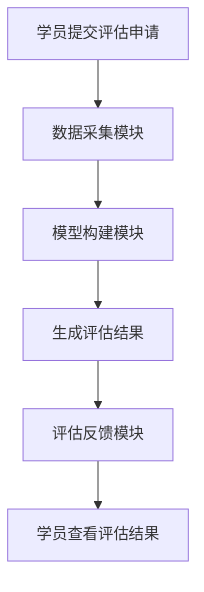
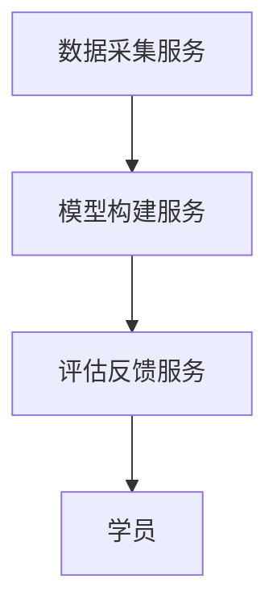
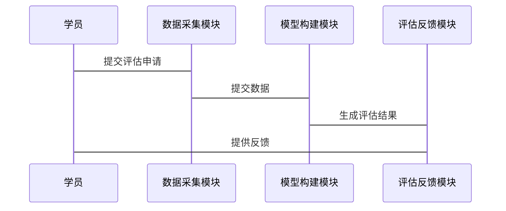

                 


# 开发基于大模型的金融合规培训效果评估系统

## 关键词：大模型、金融合规、培训效果评估、系统设计、机器学习

## 摘要：本文详细介绍了开发基于大模型的金融合规培训效果评估系统的全过程，从问题背景到系统设计，从算法原理到项目实战，全面解析了该系统的开发思路和实现方法。文章结合实际案例，深入探讨了大模型在金融合规培训评估中的应用，为相关领域的研究和实践提供了有价值的参考。

---

# 第一部分: 开发背景与核心概念

## 第1章: 问题背景与需求分析

### 1.1 问题背景

#### 1.1.1 金融合规培训的现状与挑战
随着金融市场的快速发展，合规性成为金融机构和从业人员的核心关注点。然而，传统的合规培训评估方法存在以下问题：
- **评估标准不统一**：不同机构对合规培训的要求差异较大，难以制定统一的评估标准。
- **评估效率低**：传统评估方式依赖人工审核，效率低下且容易出错。
- **数据孤岛问题**：各机构的合规培训数据分散，难以形成有效的数据共享和分析。

#### 1.1.2 传统评估方法的局限性
传统评估方法通常依赖于问卷调查和人工审核，存在以下局限性：
- **主观性较强**：评估结果受主观因素影响较大，难以保证客观性。
- **效率低下**：人工审核耗时长，难以满足大规模培训的需求。
- **缺乏动态反馈**：无法实时跟踪学员的学习效果和行为变化。

#### 1.1.3 大模型技术的引入与优势
大模型技术（如GPT系列）具有强大的自然语言处理能力和学习能力，可以有效解决传统评估方法的局限性：
- **自动化评估**：通过大模型的自然语言处理能力，实现自动化评估。
- **数据驱动**：基于大量数据进行分析，提供客观、精准的评估结果。
- **动态反馈**：能够实时跟踪学员的学习行为和效果，提供动态反馈。

### 1.2 问题描述

#### 1.2.1 金融合规培训效果评估的核心目标
金融合规培训效果评估的核心目标是：
- 评估学员对合规知识的掌握程度。
- 评估学员在实际工作中的合规行为表现。
- 提供个性化的培训建议，帮助学员提升合规能力。

#### 1.2.2 评估系统的关键功能需求
评估系统需要具备以下功能：
- **数据采集**：采集学员的培训数据，包括学习记录、测试成绩等。
- **评估模型**：基于大模型技术，构建评估模型，对学员的合规能力进行评估。
- **结果反馈**：提供评估结果，并生成个性化的反馈报告。

#### 1.2.3 系统设计的边界与外延
系统设计的边界包括：
- 仅关注金融合规培训效果的评估，不涉及其他领域的评估。
- 不直接参与培训过程，仅提供评估服务。
- 不涉及具体的培训内容设计，仅评估效果。

系统设计的外延包括：
- 支持多机构、多场景的应用。
- 可扩展至其他领域的合规评估。

### 1.3 核心概念与问题解决

#### 1.3.1 大模型在金融合规中的应用
大模型在金融合规中的应用主要体现在：
- **文本分析**：对合规文档进行自动分析，提取关键信息。
- **风险评估**：基于大模型的预测能力，评估合规风险。
- **培训效果评估**：通过大模型分析学员的评估数据，提供评估结果。

#### 1.3.2 培训效果评估的指标体系
培训效果评估的指标体系包括：
- **知识掌握度**：学员对合规知识的掌握情况。
- **行为合规度**：学员在实际工作中的行为表现。
- **反馈及时性**：评估结果的反馈速度和准确性。

#### 1.3.3 系统设计的核心要素与组成
系统设计的核心要素包括：
- 数据采集模块：负责采集学员的培训数据。
- 模型构建模块：基于大模型技术构建评估模型。
- 评估反馈模块：生成评估结果并提供反馈。

---

## 第2章: 大模型在金融合规中的应用原理

### 2.1 大模型的核心原理

#### 2.1.1 大模型的训练机制
大模型的训练机制包括：
- **数据预处理**：对数据进行清洗、标注和格式化处理。
- **模型训练**：使用大规模数据训练模型，采用分布式训练和优化算法。
- **微调优化**：在特定领域数据上进行微调，提升模型性能。

#### 2.1.2 大模型的推理过程
大模型的推理过程包括：
- **输入处理**：将输入数据转化为模型可处理的形式。
- **模型推理**：模型对输入数据进行处理，生成输出结果。
- **结果解释**：对模型的输出结果进行解释和分析。

#### 2.1.3 大模型的可解释性与局限性
大模型的可解释性较低，主要表现在：
- **黑箱问题**：模型的内部工作机制难以解释。
- **数据偏差**：训练数据可能存在偏差，导致模型结果不准确。

### 2.2 金融合规的核心概念

#### 2.2.1 金融合规的基本定义
金融合规是指金融机构和从业人员在经营活动中遵守相关法律法规和监管要求。

#### 2.2.2 金融合规的关键领域与标准
金融合规的关键领域包括：
- 反洗钱（AML）
- 反腐败（AC）
- 金融消费者保护
- 数据安全与隐私保护

#### 2.2.3 合规培训的核心目标与方法
合规培训的核心目标是提高从业人员的合规意识和能力。主要方法包括：
- **理论教学**：讲解相关法律法规和合规要求。
- **案例分析**：通过实际案例分析，提高学员的分析能力和判断能力。
- **情景模拟**：通过模拟实际工作场景，提升学员的应对能力。

### 2.3 大模型与金融合规的结合

#### 2.3.1 大模型在合规文本分析中的应用
大模型可以用于合规文本的自动分析，例如：
- **合同审查**：自动识别合同中的合规风险。
- **法规解读**：帮助理解复杂法规的含义。

#### 2.3.2 大模型在合规风险评估中的应用
大模型可以用于合规风险的评估，例如：
- **风险预测**：基于历史数据和模型预测，评估未来可能的合规风险。
- **风险分类**：对不同类型的合规风险进行分类和优先级排序。

#### 2.3.3 大模型在合规培训效果评估中的应用
大模型可以用于评估学员的合规能力，例如：
- **知识掌握度评估**：通过测试题目评估学员的知识掌握情况。
- **行为合规度评估**：通过模拟场景评估学员的实际行为表现。

### 2.4 核心概念对比分析

#### 2.4.1 大模型与传统机器学习模型的对比
| 对比维度       | 大模型                   | 传统机器学习模型          |
|----------------|--------------------------|---------------------------|
| 数据需求       | 需要大量数据             | 数据需求较少             |
| 模型复杂度     | 模型复杂度高             | 模型复杂度较低           |
| 可解释性       | 可解释性较差             | 可解释性较强             |
| 应用场景       | 适用于复杂场景           | 适用于简单场景           |

#### 2.4.2 合规评估的传统方法与大模型方法的对比
| 对比维度       | 传统方法                 | 大模型方法                |
|----------------|--------------------------|---------------------------|
| 评估效率       | 评估效率低               | 评估效率高               |
| 评估准确性     | 评估准确性较低           | 评估准确性较高           |
| 评估范围       | 评估范围有限             | 评估范围广泛             |

#### 2.4.3 金融合规与非金融合规的核心差异
| 对比维度       | 金融合规                 | 非金融合规               |
|----------------|--------------------------|---------------------------|
| 监管机构       | 金融监管机构             | 行业-specific监管机构     |
| 标准体系       | 严格且复杂               | 相对简单                 |
| 风险类型       | 金融风险（如市场风险、信用风险） | 非金融风险（如操作风险、声誉风险） |

### 2.5 本章小结
本章详细介绍了大模型在金融合规中的应用原理，分析了大模型与传统方法的对比，明确了金融合规的核心概念和大模型的优势。

---

## 第3章: 系统架构设计方案

### 3.1 系统功能设计

#### 3.1.1 用户角色与权限设计
系统用户角色包括：
- **普通用户**：包括金融机构的从业人员和学员。
- **系统管理员**：负责系统的配置和管理。
- **评估专家**：负责模型的优化和评估标准的制定。

权限设计包括：
- **普通用户**：可以提交评估申请、查看评估结果。
- **系统管理员**：可以管理用户角色、配置系统参数。
- **评估专家**：可以优化模型、调整评估标准。

#### 3.1.2 系统功能模块划分
系统功能模块包括：
- **数据采集模块**：负责采集学员的培训数据。
- **模型构建模块**：基于大模型技术构建评估模型。
- **评估反馈模块**：生成评估结果并提供反馈。

#### 3.1.3 系统功能流程图


### 3.2 系统架构设计

#### 3.2.1 分层架构设计
系统架构分为以下层次：
- **数据层**：存储学员的培训数据。
- **服务层**：提供数据采集、模型构建等服务。
- **应用层**：提供用户界面，实现与用户的交互。
- **表现层**：展示评估结果和反馈信息。

#### 3.2.2 微服务架构设计
微服务架构设计包括：
- **数据采集服务**：负责采集学员的培训数据。
- **模型构建服务**：基于大模型技术构建评估模型。
- **评估反馈服务**：生成评估结果并提供反馈。

#### 3.2.3 系统组件之间的关系


### 3.3 系统接口设计

#### 3.3.1 API接口定义
API接口定义包括：
- **数据采集接口**：`POST /api/data/upload`
- **模型构建接口**：`POST /api/model/train`
- **评估反馈接口**：`GET /api/result/{id}`

#### 3.3.2 系统交互序列图


---

## 第四部分: 算法原理与项目实战

## 第4章: 算法原理与实现

### 4.1 算法原理

#### 4.1.1 大模型的训练过程
大模型的训练过程包括：
1. **数据预处理**：对数据进行清洗、标注和格式化处理。
2. **模型训练**：使用大规模数据训练模型，采用分布式训练和优化算法。
3. **微调优化**：在特定领域数据上进行微调，提升模型性能。

#### 4.1.2 模型评估
模型评估包括：
- **准确率**：模型预测的准确率。
- **召回率**：模型预测的召回率。
- **F1值**：模型预测的F1值。

#### 4.1.3 模型优化
模型优化包括：
- **超参数调优**：调整模型的超参数，提升模型性能。
- **模型剪枝**：去除冗余的模型结构，降低模型复杂度。

### 4.2 项目实战

#### 4.2.1 环境安装
环境安装包括：
- **Python 3.8+**
- **TensorFlow 2.0+**
- **Keras**
- **Hugging Face库**

#### 4.2.2 核心代码实现
核心代码实现包括：
```python
import tensorflow as tf
from tensorflow.keras import layers
from transformers import GPT2Tokenizer, GPT2Model

# 数据预处理
tokenizer = GPT2Tokenizer.from_pretrained('gpt2')
input_ids = tokenizer.encode("这是一个测试文本", return_tensors='pt')

# 模型构建
model = GPT2Model.from_pretrained('gpt2')
outputs = model(input_ids)
```

#### 4.2.3 代码解读
代码解读包括：
- 使用Hugging Face库中的GPT-2模型进行文本处理。
- 对输入文本进行编码，生成模型输出。

#### 4.2.4 案例分析
案例分析包括：
- 对金融合规相关的文本进行分析，生成合规评估结果。

### 4.3 项目总结
项目总结包括：
- 项目目标的实现情况。
- 系统的优缺点分析。
- 未来的改进方向。

---

## 第五部分: 最佳实践与总结

## 第5章: 最佳实践与总结

### 5.1 最佳实践

#### 5.1.1 小结
- 系统设计要注重模块化和可扩展性。
- 模型训练要结合实际场景，进行针对性优化。
- 系统部署要考虑性能和安全性。

#### 5.1.2 注意事项
- 数据安全和隐私保护是系统设计的重要考虑因素。
- 模型的可解释性和透明度需要重点关注。
- 系统的稳定性和可靠性要确保。

#### 5.1.3 拓展阅读
- 推荐阅读相关领域的最新论文和文献。
- 关注大模型技术的最新发展和应用。

### 5.2 本章小结
本章总结了开发基于大模型的金融合规培训效果评估系统的最佳实践，提出了系统设计和模型优化的注意事项，并给出了拓展阅读的建议。

---

## 作者：AI天才研究院/AI Genius Institute & 禅与计算机程序设计艺术 /Zen And The Art of Computer Programming

---

通过以上目录大纲，我们可以看到，文章从问题背景、核心概念、系统设计、算法原理到项目实战，层层深入，全面解析了开发基于大模型的金融合规培训效果评估系统的全过程。

