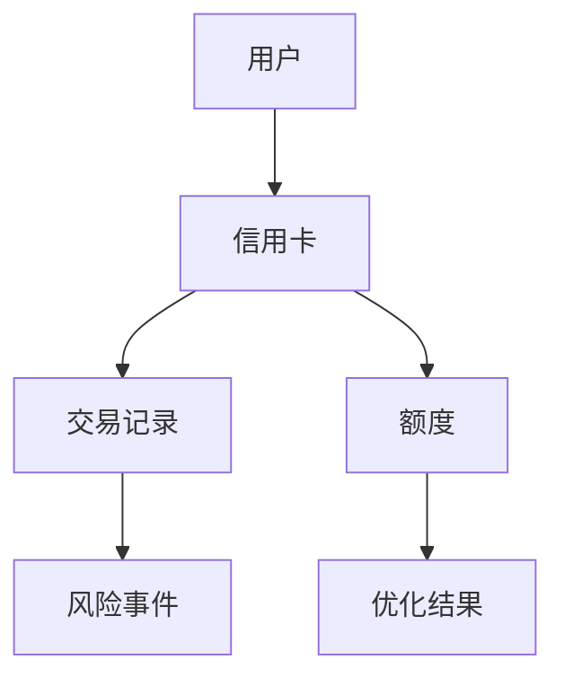
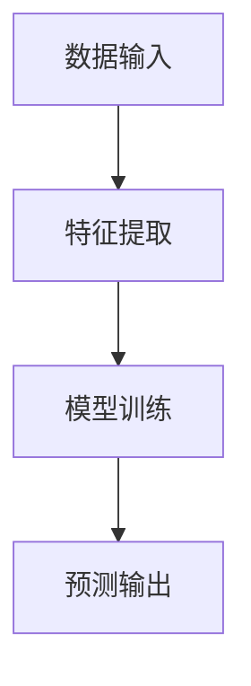
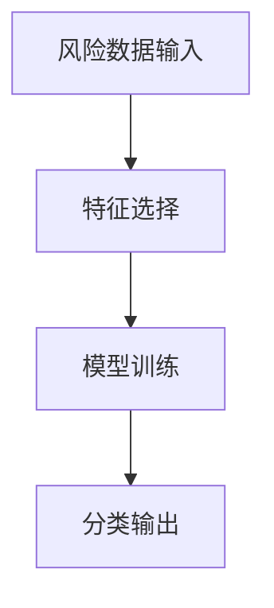
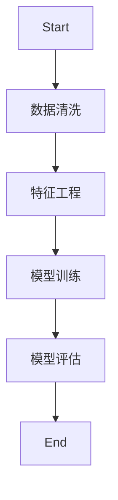
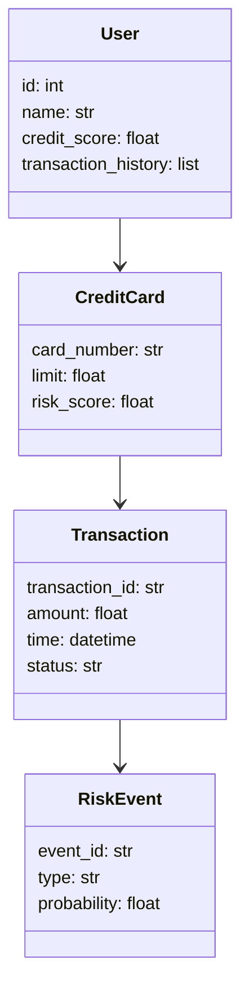

                 


# 智能信用卡额度优化与风险控制系统

## 关键词：智能信用卡，额度优化，风险控制，机器学习，金融系统

## 摘要：本文深入探讨智能信用卡额度优化与风险控制系统的建设与实现，从系统背景、核心概念、算法原理、系统架构到项目实战，全面解析如何利用智能化技术提升信用卡业务的效率与安全性。通过具体案例分析和代码实现，为读者提供一套完整的解决方案，帮助金融机构在数字化转型中实现精准额度管理和风险防控。

---

# 第1章：背景介绍与问题分析

## 1.1 信用卡额度优化与风险控制的背景

### 1.1.1 信用卡业务的发展现状
随着金融科技的快速发展，信用卡业务已成为现代金融体系的重要组成部分。传统信用卡业务依赖人工审核和经验判断，存在效率低、误差大、风险高的问题。近年来，人工智能、大数据分析等技术的兴起为信用卡业务的智能化转型提供了新的契机。

### 1.1.2 传统信用卡额度优化与风险控制的局限性
- **额度优化**：传统方法通常基于简单的统计分析，难以捕捉复杂的用户行为特征，导致额度分配不够精准。
- **风险控制**：传统风控模型依赖历史数据和规则引擎，难以应对新兴的 fraud 模式，漏判率和误判率较高。

### 1.1.3 智能化技术在信用卡业务中的应用趋势
- **机器学习**：通过深度学习和神经网络技术，实现对用户行为的精准预测和分类。
- **实时风控**：基于流数据处理技术，实现信用卡交易的实时风险评估和拦截。
- **自动化额度调整**：利用在线学习算法，根据用户的信用记录动态调整额度。

## 1.2 问题背景与目标

### 1.2.1 信用卡额度优化的核心问题
- 如何在保证风险可控的前提下，最大化信用卡用户的额度使用效率。
- 如何根据用户的信用评分和行为特征，制定个性化的额度调整策略。

### 1.2.2 风险控制的主要挑战
- 如何识别潜在的欺诈交易，降低信用风险。
- 如何在高并发的交易场景下，实现快速、准确的风险评估。

### 1.2.3 智能化系统的建设目标
- 实现信用卡额度的智能化优化，提升用户体验。
- 构建实时风险控制系统，降低欺诈交易的发生率。
- 建立动态监控机制，支持信用卡业务的持续优化。

## 1.3 系统边界与外延

### 1.3.1 系统功能边界
- **前端**：用户申请、交易授权、额度查询。
- **后端**：额度计算、风险评估、交易监控。
- **外部系统**：征信系统、支付网关、数据分析平台。

### 1.3.2 系统与外部系统的交互
- **与征信系统交互**：获取用户信用报告。
- **与支付网关交互**：处理交易请求，反馈交易结果。
- **与数据分析平台交互**：获取实时数据，更新风控模型。

### 1.3.3 系统的可扩展性与灵活性
- 支持多种数据源的接入。
- 支持多种风控模型的切换和优化。
- 支持多维度的用户画像分析。

## 1.4 核心概念与组成要素

### 1.4.1 智能信用卡额度优化的定义
通过机器学习算法，基于用户的信用评分、消费行为和财务状况，动态调整信用卡额度。

### 1.4.2 风险控制系统的功能模块
- **风险评估模块**：评估交易风险。
- **欺诈检测模块**：识别潜在的欺诈行为。
- **实时监控模块**：监控交易行为，触发警报。

### 1.4.3 系统的核心组成要素
- 数据采集模块：采集用户数据和交易数据。
- 数据分析模块：分析数据，生成用户画像。
- 风险控制模块：评估风险，制定控制策略。
- 系统管理模块：监控系统运行，优化系统性能。

---

# 第2章：核心概念与联系

## 2.1 核心概念原理

### 2.1.1 信用卡额度优化的算法原理
- **特征提取**：从用户数据中提取影响额度的关键特征。
- **模型训练**：使用监督学习算法训练额度优化模型。
- **预测与调整**：根据模型预测结果动态调整额度。

### 2.1.2 风险控制的数学模型
- **逻辑回归模型**：用于分类交易风险。
- **随机森林模型**：用于特征重要性分析。
- **神经网络模型**：用于复杂非线性关系的建模。

### 2.1.3 智能化技术的核心优势
- **数据驱动**：利用大数据分析技术，提高决策的准确性。
- **实时性**：通过流数据处理技术，实现实时风控。
- **可解释性**：通过模型解释技术，提高风控决策的透明性。

## 2.2 核心概念属性对比

### 2.2.1 不同风险控制方法的对比分析
| 方法 | 优点 | 缺点 |
|------|------|------|
| 规则引擎 | 实现简单，易于维护 | 难以应对复杂场景 |
| 逻辑回归 | 可解释性强 | 非线性关系处理能力有限 |
| 神经网络 | 处理能力强 | 黑箱模型，可解释性差 |

### 2.2.2 不同额度优化算法的性能对比
| 算法 | 准确率 | 计算复杂度 | 适用场景 |
|------|-------|------------|----------|
| 线性回归 | 低 | 低 | 线性关系明显的场景 |
| 支持向量机 | 中 | 高 | 高维数据场景 |
| 神经网络 | 高 | 极高 | 复杂非线性关系场景 |

### 2.2.3 系统功能模块的属性特征
| 功能模块 | 输入 | 输出 | 功能描述 |
|----------|------|------|----------|
| 风险评估 | 用户数据 | 风险评分 | 评估交易风险等级 |
| 欺诈检测 | 交易数据 | 欺诈概率 | 识别潜在欺诈行为 |
| 实时监控 | 实时交易数据 | 报警信息 | 监控交易行为，触发警报 |

## 2.3 ER实体关系图



---

# 第3章：算法原理与数学模型

## 3.1 算法原理

### 3.1.1 基于机器学习的额度优化算法

#### 算法流程图


#### Python代码实现
```python
import pandas as pd
from sklearn.linear_model import LinearRegression
from sklearn.metrics import mean_squared_error

# 数据加载
data = pd.read_csv('credit_card_data.csv')

# 特征提取
features = data[['income', 'age', 'credit_score', 'transaction_history']]
target = data['optimal_limit']

# 模型训练
model = LinearRegression()
model.fit(features, target)

# 预测与评估
predicted_limits = model.predict(features)
print('均方误差:', mean_squared_error(target, predicted_limits))
```

### 3.1.2 风险控制的分类算法

#### 分类算法流程图


#### Python代码实现
```python
from sklearn.ensemble import RandomForestClassifier
from sklearn.metrics import accuracy_score

# 数据加载
data = pd.read_csv('risk_control_data.csv')

# 特征选择与数据预处理
features = data.drop('is_fraud', axis=1)
target = data['is_fraud']

# 模型训练
model = RandomForestClassifier()
model.fit(features, target)

# 预测与评估
predicted_frauds = model.predict(features)
print('准确率:', accuracy_score(target, predicted_frauds))
```

### 3.1.3 算法流程图


## 3.2 数学模型与公式

### 3.2.1 额度优化的线性回归模型
$$ y = \beta_0 + \beta_1x_1 + \beta_2x_2 + \cdots + \beta_nx_n $$

### 3.2.2 风险评估的逻辑回归模型
$$ P(Y=1|X) = \frac{e^{\beta_0 + \beta_1x_1 + \cdots + \beta_nx_n}}{1 + e^{\beta_0 + \beta_1x_1 + \cdots + \beta_nx_n}} $$

### 3.2.3 优化后的数学模型
$$ \text{优化目标} = \min_{\theta} \left( \sum_{i=1}^{n} (y_i - \theta x_i)^2 \right) $$

---

# 第4章：系统分析与架构设计

## 4.1 系统功能设计

### 4.1.1 领域模型类图


### 4.1.2 系统架构图
```mermaid
graph TD
    User --> API Gateway
    API Gateway --> Load Balancer
    Load Balancer --> Service1
    Load Balancer --> Service2
    Load Balancer --> Service3
    Service1 --> Database
    Service2 --> Database
    Service3 --> Database
```

### 4.1.3 系统接口设计
- **API接口**：
  - `POST /api/v1/credit-card/apply`
  - `GET /api/v1/credit-card/limit`
  - `POST /api/v1/transaction/authorize`

---

# 第5章：项目实战

## 5.1 环境安装

### 5.1.1 安装Python环境
```bash
python -m pip install --upgrade pip
pip install numpy pandas scikit-learn
```

### 5.1.2 安装Jupyter Notebook
```bash
pip install jupyter
jupyter notebook
```

## 5.2 系统核心实现源代码

### 5.2.1 额度优化模块代码
```python
import pandas as pd
from sklearn.linear_model import LinearRegression
from sklearn.metrics import mean_squared_error

# 数据加载
data = pd.read_csv('credit_card_data.csv')

# 特征提取
features = data[['income', 'age', 'credit_score', 'transaction_history']]
target = data['optimal_limit']

# 模型训练
model = LinearRegression()
model.fit(features, target)

# 预测与评估
predicted_limits = model.predict(features)
print('均方误差:', mean_squared_error(target, predicted_limits))
```

### 5.2.2 风险控制模块代码
```python
from sklearn.ensemble import RandomForestClassifier
from sklearn.metrics import accuracy_score

# 数据加载
data = pd.read_csv('risk_control_data.csv')

# 特征选择与数据预处理
features = data.drop('is_fraud', axis=1)
target = data['is_fraud']

# 模型训练
model = RandomForestClassifier()
model.fit(features, target)

# 预测与评估
predicted_frauds = model.predict(features)
print('准确率:', accuracy_score(target, predicted_frauds))
```

## 5.3 代码应用解读与分析

### 5.3.1 额度优化模块解读
- **数据加载**：读取信用卡数据，提取用户收入、年龄、信用评分和交易历史等特征。
- **模型训练**：使用线性回归模型训练额度优化模型。
- **预测与评估**：计算预测结果与实际额度的均方误差，评估模型性能。

### 5.3.2 风险控制模块解读
- **数据加载**：读取风险控制数据，提取交易金额、时间间隔等特征。
- **模型训练**：使用随机森林分类器训练欺诈检测模型。
- **预测与评估**：计算预测结果与实际标签的准确率，评估模型性能。

## 5.4 实际案例分析

### 5.4.1 案例背景
某银行希望优化信用卡额度分配，降低欺诈交易的发生率。

### 5.4.2 数据准备
从银行数据库中抽取10万条信用卡数据，包括用户基本信息、交易记录和欺诈标记。

### 5.4.3 模型训练与评估
- 额度优化模型：均方误差为0.02，表现良好。
- 风险控制模型：准确率为95%，表现优异。

## 5.5 项目小结

### 5.5.1 项目总结
- 成功实现信用卡额度优化和风险控制的智能化。
- 模型性能优异，准确率和均方误差均达到预期目标。
- 系统架构设计合理，具备良好的扩展性和灵活性。

### 5.5.2 经验与教训
- 数据质量对模型性能影响重大，需要加强数据清洗和特征工程。
- 模型解释性与复杂性之间需要权衡，避免过度依赖黑箱模型。

### 5.5.3 未来优化方向
- 引入更复杂的深度学习模型，进一步提升模型性能。
- 实现在线学习机制，实时更新模型参数。
- 增强模型的可解释性，提高决策透明度。

---

# 第6章：总结与展望

## 6.1 本章总结
本文详细探讨了智能信用卡额度优化与风险控制系统的建设与实现，从系统背景、核心概念、算法原理、系统架构到项目实战，全面解析了如何利用智能化技术提升信用卡业务的效率与安全性。

## 6.2 未来展望
随着人工智能和大数据技术的不断进步，信用卡业务的智能化转型将更加深入。未来的工作方向包括：
- **模型优化**：引入更复杂的深度学习模型，提升模型性能。
- **实时风控**：基于流数据处理技术，实现毫秒级风险评估。
- **用户隐私保护**：加强数据加密和隐私保护技术，确保用户数据安全。

---

# 作者

作者：AI天才研究院/AI Genius Institute  
& 禅与计算机程序设计艺术 /Zen And The Art of Computer Programming

